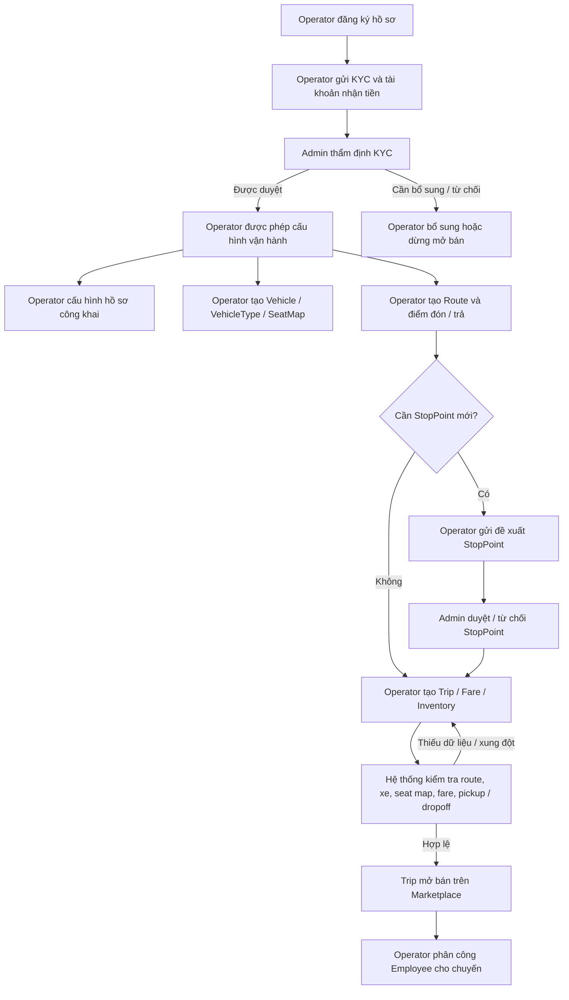
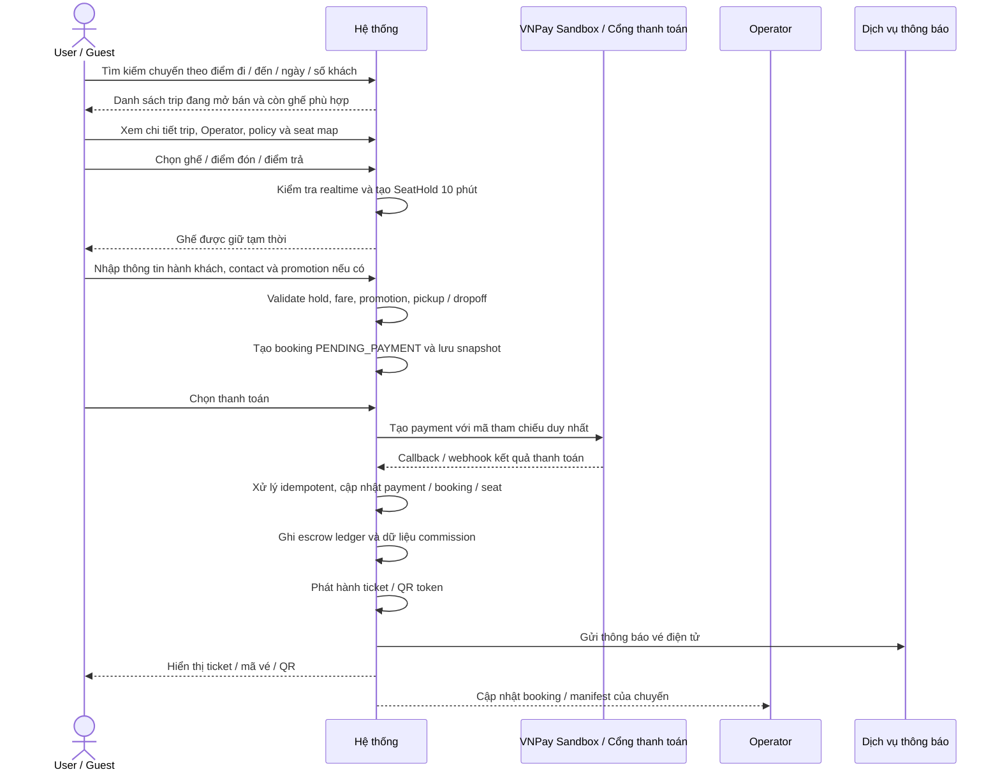
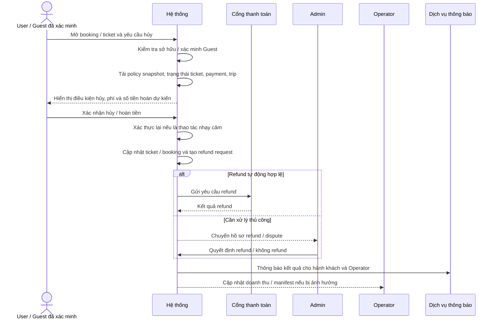
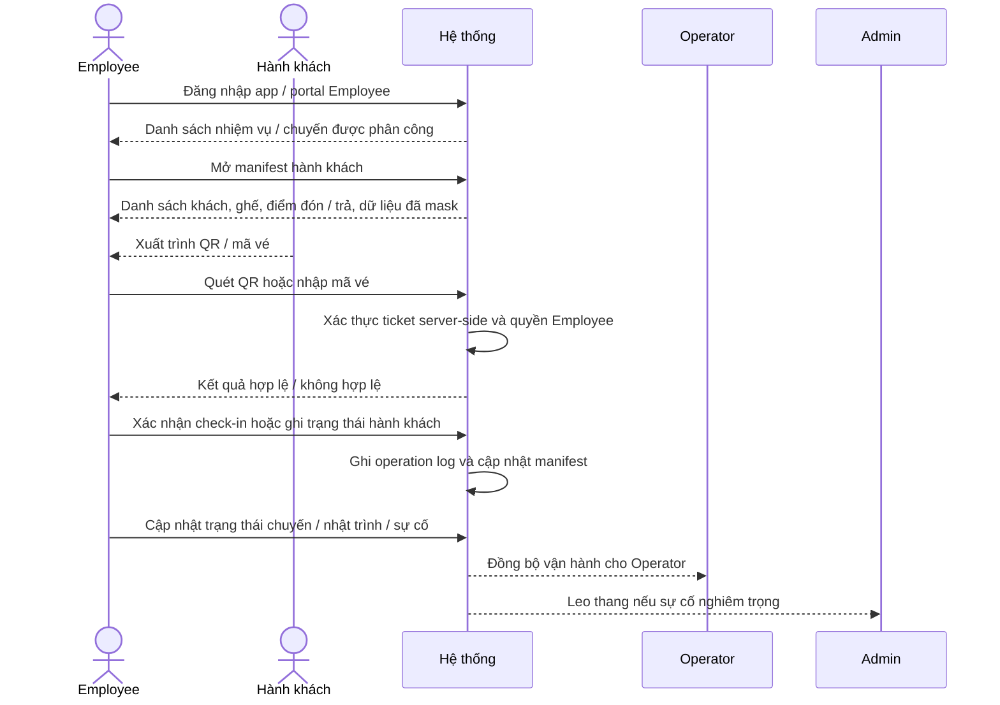
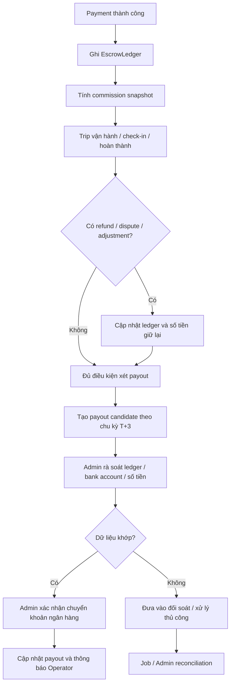

# 01. Software Requirements Specification - Hệ thống đặt vé xe khách

## 1. Thông tin tài liệu

### 1.1. Metadata

| Thuộc tính        | Giá trị                                                        |
| ----------------- | -------------------------------------------------------------- |
| Tên tài liệu      | Software Requirements Specification - Hệ thống đặt vé xe khách |
| Mã tài liệu       | 01-srs-he-thong-dat-ve-xe-khach                                |
| Dự án             | Hệ thống đặt vé xe khách                                       |
| Phiên bản         | v1.20                                                          |
| Trạng thái        | Approved                                                       |
| Người viết        | Nguyễn Hồng Khanh, Nguyễn Xuân Trường, Lê Võ Thanh Uy          |
| Người duyệt       | Nguyễn Hồng Khanh                                              |
| Ngày tạo          | 05/05/2026                                                     |
| Cập nhật gần nhất | 12/05/2026                                                     |

### 1.2. Lịch sử thay đổi

| Phiên bản | Ngày | Người cập nhật | Nội dung thay đổi |
| :--- | :--- | :--- | :--- |
| **v1.20** | 12/05/2026 | AI Agent, Nguyễn Hồng Khanh | Làm sạch SRS sau khi HLD/LLD được duyệt: đồng bộ SeatHold theo hướng DB-authoritative hybrid thay vì khóa cứng Redis, cập nhật Employee offline giới hạn, object storage S3-compatible đã chốt ở HLD/LLD, và chỉnh phụ lục trạng thái tài liệu. |
| **v1.19** | 12/05/2026 | AI Agent, Nguyễn Hồng Khanh | Viết lại §17..§20 để tiến tới hoàn thiện SRS: chuẩn hóa state model nghiệp vụ, catalog thông báo bắt buộc / không bắt buộc, tiêu chí nghiệm thu có truy vết và risk register theo managed marketplace, Guest checkout, VNPay Sandbox, escrow / payout T+3, dispute, audit và job nền; cập nhật tham chiếu §21 liên quan state model / payout. |
| **v1.18** | 12/05/2026 | AI Agent, Nguyễn Hồng Khanh | Viết mới toàn bộ §16 Luồng nghiệp vụ chính: bổ sung danh mục luồng end-to-end, luồng thiết lập nhà xe trước mở bán, đặt vé User / Guest, payment lỗi / đối soát, tra cứu vé Guest, hủy / hoàn tiền, thay đổi chuyến, check-in / vận hành chuyến, support / complaint / dispute, escrow / payout T+3 và luồng notification / audit / job nền. |
| **v1.17** | 12/05/2026 | AI Agent, Nguyễn Hồng Khanh | Xử lý các điểm rà soát 15 mục đầu: sửa tham chiếu file quy chuẩn lập trình viên, làm sạch phạm vi tài liệu, đồng bộ SeatHold 10 phút và VNPay Sandbox, cập nhật `FR-MKT-10`, `FR-NSR-06`, `FR-DSP-03..04`, sơ đồ use case và bảng UC-09 cho Guest support / complaint, sửa lỗi chính tả `UC-01`. |
| **v1.16** | 12/05/2026 | AI Agent, Nguyễn Hồng Khanh | Hoàn thiện §14 Business Rules theo 64 rule có truy vết sang FR / NFR / UC; viết lại §15 Phân quyền chức năng theo actor `User`, `Guest`, `Operator`, `Employee`, `Admin`, `System`, bổ sung nguyên tắc RBAC / tenant boundary, ma trận quyền theo nhóm chức năng, phân quyền chi tiết Employee theo role và nhóm thao tác nhạy cảm cần xác thực / audit. |
| **v1.15** | 11/05/2026 | AI Agent | Xử lý 5 điểm cosmetic sau review v1.14: bổ sung tham chiếu `00-quy-chuan-cho-ai-agent` vào §3.4.1; thêm §7.6 liệt kê external system actor (Cổng thanh toán, Dịch vụ thông báo, Dịch vụ định tuyến, Dịch vụ lưu trữ tệp, Dịch vụ ngân hàng payout); đổi tiêu đề §21 thành "Quyết định đã chốt (Decisions Log)" và mục lục tương ứng; làm gọn precondition của UC-25 và đẩy baseline value xuống dạng tham chiếu OQ; mở rộng UC-09 cho phép Guest tạo support ticket / khiếu nại sau khi đã xác minh tra cứu vé theo UC-35, đồng thời giữ rule chỉ User mới được gửi review. |
| **v1.14** | 11/05/2026 | AI Agent, Nguyễn Hồng Khanh | Hiệu chỉnh lại cấu trúc SRS sau khi loại bỏ các mục 19, 21 và 23: cập nhật mục lục, đánh số lại các mục còn lại, sửa tham chiếu nội bộ sau mục 18 và giữ trạng thái tài liệu Hiệu chỉnh lại toàn bộ mục 13 và chốt toàn bộ OP |
| **v1.13** | 11/05/2026 | AI Agent | Chốt guest checkout: Guest được giữ ghế, tạo booking và thanh toán bằng guest session; bắt buộc lưu / xác minh thông tin liên hệ cho thao tác nhạy cảm. Sửa lỗi actor `FR-MKT-08`, đồng bộ `FR-MKT-09`, sơ đồ use case, bảng traceability và `UC-05` / `UC-06` / `UC-07`. |
| **v1.12** | 11/05/2026 | Lê Võ Thanh Uy | Hiệu chỉnh mục 13 Use Case chi tiết từ `UC-13` đến `UC-24`; viết lại các use case theo mô hình managed marketplace gồm Operator OS layer, Employee app / portal và Platform admin layer; làm rõ quản lý route / stop point, trip / fare / mở bán / inventory, booking / ticket thuộc Operator, Employee và phân công nhiệm vụ, báo cáo Operator, manifest hành khách, check-in QR / mã vé, cập nhật trạng thái chuyến, nhật trình / báo cáo sự cố, duyệt KYC Operator và quản lý catalog chuẩn. Đối chiếu logic website xe khách kiểu FutaBus và hiện trạng các module backend liên quan. |
| **v1.11** | 11/05/2026 | Nguyễn Xuân Trường | Hiệu chỉnh mục 13 Use Case chi tiết từ `UC-01` đến `UC-12`; viết lại các use case theo mô hình managed marketplace gồm Marketplace layer, Operator OS layer và Platform admin layer; làm rõ đăng nhập / xác thực theo actor, tìm kiếm / so sánh chuyến, chọn ghế / giữ ghế, booking, payment, ticket, refund, review / support / complaint, KYC Operator, tài chính Operator và Vehicle / SeatMap. Hiệu chỉnh lại một vài FR và UC |
| **v1.10** | 10/05/2026 | Nguyễn Hồng Khanh | Hiệu chỉnh SRS theo tiêu chí atomic requirement: tách IAM theo actor, bổ sung Guest, Promotion, Session Management, Dispute Case workflow, Notification Preference, Operator Scorecard; đồng bộ use case, trạng thái dữ liệu, module, AC và làm rõ mobile app / Marketplace layer. |
| **v1.9** | 10/05/2026 | AI Agent, Nguyễn Hồng Khanh | Hiệu chỉnh mục 11 Non-Functional Requirements và mục 12 Use Case tổng quan để đồng bộ với managed marketplace, Operator OS, Employee role model, Vehicle model, escrow / payout, audit và các FR mới ở mục 10. |
| **v1.8** | 10/05/2026 | AI Agent, Nguyễn Hồng Khanh | Hiệu chỉnh mục 10 Functional Requirements để phù hợp managed marketplace, Operator OS, Platform admin, Employee role model, Vehicle model, escrow / payout, policy snapshot, audit và data isolation theo Operator. |
| **v1.7** | 10/05/2026 | AI Agent, Nguyễn Hồng Khanh | Hiệu chỉnh mục 9 Mô hình dữ liệu mức cao theo định vị managed marketplace, bổ sung nhóm dữ liệu escrow / payout / policy / audit và làm rõ boundary dữ liệu theo Operator. |
| **v1.6** | 10/05/2026 | Nguyễn Hồng Khanh | Hiệu chỉnh lỗi định dạng file thủ công, Điều chỉnh mục 6.2 sửa role cho Employee còn lỗi ở phiên bản trước đó |
| **v1.5** | 10/05/2026 | AI Agent, Lê Võ Thanh Uy | liệt kê các giả định, ràng buộc, phụ thuộc cần có. |
| **v1.4** | 10/05/2026 | Nguyễn Xuân Trường | Hiệu chỉnh mục 7 Actor và vai trò theo cấu trúc thống nhất; làm rõ quan hệ giữa Người dùng, Nhà xe, Admin toàn hệ thống và Nhân viên nhà xe trong mô hình marketplace; cập nhật Employee gồm 3 role `TICKET_STAFF`, `DRIVER`, `SUPPORT_STAFF` và gom nhóm quyền của nhân viên nhà xe theo chức năng vận hành. |
| **v1.3** | 10/05/2026 | AI Agent, Nguyễn Hồng Khanh | Chốt MQ-01..05 (định vị marketplace). Tái cấu trúc §4 (6 mục con: định vị, vai trò 3 bên, mô hình doanh thu, 3 lớp dịch vụ, boundary, kiến trúc triển khai), §5 (4 nhóm mục tiêu: sản phẩm, nền tảng, tin cậy / compliance, vận hành), §6 (4 nhóm phạm vi: Marketplace layer, Operator OS layer, Platform admin layer, Ngoài phạm vi). §24 ghi nhận MQ-01..05 đã chốt và bổ sung OQ-16..20 phái sinh từ marketplace model |
| **v1.2** | 10/05/2026 | AI Agent, Nguyễn Hồng Khanh | Chốt OQ-01..04 (state enum + Employee) và đồng bộ FR: §10.1 cập nhật `FR-AUTH-04`, §10.3 cập nhật `FR-OP-13..15` và thêm `FR-OP-21..23`, §10.4 đổi tên thành "Nhân viên nhà xe (Employee)" và đổi prefix `FR-DRIVER-*` → `FR-EMP-*` (18 FR có cột Role áp dụng), §10.5 thêm `FR-ADMIN-21..22`, §24 đánh dấu OQ-01..04 đã chốt |
| **v1.1** | 08/05/2026 | Nguyễn Hồng Khanh | Hiệu chỉnh 7.4 bỏ Tài xế (Drive) thay bằng Nhân viên nhà xe (Employee) và hiệu chỉnh một số điểm. |
| **v1.0** | 05/05/2026 | AI Agent, Nguyễn Hồng Khanh | Tạo bản đầu từ tài liệu ý tưởng `he-thong-dat-ve-xe-khach.md` và đối chiếu với code backend hiện có |

---

## 2. Mục lục

1. Thông tin tài liệu
2. Mục lục
3. Giới thiệu
4. Tổng quan hệ thống
5. Mục tiêu hệ thống
6. Phạm vi chức năng
7. Actor và vai trò
8. Giả định, ràng buộc, phụ thuộc
9. Mô hình dữ liệu mức cao
10. Functional Requirements
11. Non-Functional Requirements
12. Use Case tổng quan
13. Use Case chi tiết
14. Business Rules
15. Phân quyền chức năng
16. Luồng nghiệp vụ chính
17. Trạng thái dữ liệu quan trọng
18. Thông báo hệ thống
19. Tiêu chí nghiệm thu
20. Rủi ro và biện pháp giảm thiểu
21. Quyết định đã chốt
22. Phụ lục

---

## 3. Giới thiệu

### 3.1. Mục đích tài liệu

Tài liệu này mô tả yêu cầu phần mềm cho hệ thống đặt vé xe khách trực tuyến. Tài liệu là nguồn chính thức cho thiết kế, lập trình, kiểm thử và nghiệm thu hệ thống. Tài liệu được viết theo ISO/IEC/IEEE 29148:2018, tailoring nội bộ theo `00-quy-chuan-cho-lap-trinh-vien.md`.

### 3.2. Đối tượng đọc

| Đối tượng      | Mục đích đọc                                         |
| -------------- | ---------------------------------------------------- |
| Lập trình viên | Hiểu yêu cầu để triển khai backend, frontend, mobile |
| Kiến trúc sư   | Cơ sở để viết HLD, LLD, Database Design, API Spec    |
| QA / Tester    | Cơ sở để viết Test Plan và Acceptance Criteria       |
| Quản lý dự án  | Lập kế hoạch task, ưu tiên module, theo dõi tiến độ  |
| Người duyệt    | Xác nhận tài liệu phù hợp với mục tiêu nghiệp vụ     |

### 3.3. Phạm vi tài liệu

Tài liệu mô tả: phạm vi hệ thống, actor, mô hình dữ liệu mức cao, yêu cầu chức năng (FR), yêu cầu phi chức năng (NFR), use case tổng quan và chi tiết, business rule, phân quyền, luồng nghiệp vụ chính, trạng thái dữ liệu, thông báo, báo cáo, tiêu chí nghiệm thu, rủi ro và quyết định đã chốt.

Tài liệu KHÔNG mô tả: chi tiết kiến trúc kỹ thuật (xem `02-hld-...`), thiết kế chi tiết module (xem `03-lld-...`), schema database cụ thể (xem `04-database-design.md`), contract API cụ thể (xem `05-api-specification.md`).

### 3.4. Tài liệu tham chiếu

#### 3.4.1. Tham chiếu chính

Các tài liệu cung cấp quy chuẩn chung và phương pháp luận cho dự án.

| Mã                                | Tên                                     | Vai trò                                                                   |
| :-------------------------------- | :-------------------------------------- | :------------------------------------------------------------------------ |
| ISO/IEC/IEEE 15289:2019           | Content of life-cycle information items | Chuẩn nền cho cấu trúc tài liệu                                           |
| ISO/IEC/IEEE 29148:2018           | Requirements engineering                | Chuẩn nền cho viết và kiểm tra yêu cầu                                    |
| `00-quy-chuan-cho-lap-trinh-vien` | Quy chuẩn SDLC cho lập trình viên       | Quy chuẩn nội bộ cao nhất; áp dụng cho lập trình viên / QA / kiến trúc sư |
| `00-quy-chuan-cho-ai-agent`       | Quy chuẩn SDLC cho AI agent             | Quy chuẩn nội bộ áp dụng cho AI agent khi đọc / sửa / tạo tài liệu SDLC   |

#### 3.4.2. Tham chiếu phụ

Các tài liệu cụ thể liên quan đến nghiệp vụ và hiện trạng kỹ thuật của dự án.

| Mã                             | Tên                            | Vai trò                                    |
| :----------------------------- | :----------------------------- | :----------------------------------------- |
| `he-thong-dat-ve-xe-khach.md`  | Tài liệu ý tưởng nghiệp vụ     | Nguồn nghiệp vụ ban đầu                    |
| `context/PROJECT-STRUCTURE.md` | Cấu trúc thư mục code hiện tại | Đối chiếu với code backend/frontend/mobile |
| `context/TECH-STACK.md`        | Tech stack đang sử dụng        | Ràng buộc kỹ thuật                         |

### 3.5. Định nghĩa và viết tắt

| Thuật ngữ              | Định nghĩa                                                              |
| ---------------------- | ----------------------------------------------------------------------- |
| FR                     | Functional Requirement - yêu cầu chức năng                              |
| NFR                    | Non-Functional Requirement - yêu cầu phi chức năng                      |
| BR                     | Business Rule - quy tắc nghiệp vụ                                       |
| UC                     | Use Case - trường hợp sử dụng                                           |
| AC                     | Acceptance Criteria - tiêu chí nghiệm thu                               |
| RBAC                   | Role-Based Access Control - phân quyền theo vai trò                     |
| OTP                    | One-Time Password - mã xác thực một lần                                 |
| QR                     | Quick Response code - mã vạch hai chiều dùng để check-in                |
| Operator               | Nhà xe - đơn vị vận hành dịch vụ xe khách                               |
| Trip                   | Chuyến xe cụ thể theo ngày giờ                                          |
| Route                  | Tuyến đường giữa hai điểm đầu cuối                                      |
| StopPoint              | Điểm đón hoặc điểm trả khách                                            |
| Booking                | Đơn đặt vé, có thể chứa nhiều ticket                                    |
| Ticket                 | Vé điện tử cho một ghế của một hành khách trên một chuyến               |
| User                   | Hành khách có tài khoản trên nền tảng                                   |
| Guest                  | Khách vãng lai chưa đăng nhập hoặc chưa có tài khoản                    |
| Employee               | Nhân viên thuộc một Operator, dùng tài khoản do Operator cấp            |
| Platform               | Bên vận hành nền tảng marketplace                                       |
| Marketplace            | Lớp dịch vụ giúp hành khách tìm kiếm, đặt vé, thanh toán và nhận hỗ trợ |
| Operator OS            | Lớp công cụ vận hành dành cho Operator và Employee                      |
| Vehicle                | Phương tiện vận tải thuộc Operator                                      |
| VehicleType            | Loại phương tiện chuẩn hóa bởi Platform                                 |
| SeatHold               | Bản ghi giữ ghế tạm thời có thời hạn                                    |
| Escrow                 | Cơ chế Platform giữ tiền giao dịch trước khi payout cho Operator        |
| Payout                 | Khoản tiền Platform chuyển cho Operator sau đối soát                    |
| Commission             | Phí / tỷ lệ nền tảng thu trên giao dịch vé thành công                   |
| KYC                    | Quy trình xác minh hồ sơ pháp lý của Operator                           |
| Promotion              | Mã giảm giá hoặc chương trình khuyến mãi theo rule cấu hình             |
| DisputeCase            | Hồ sơ tranh chấp có trạng thái, minh chứng và quyết định xử lý          |
| OperatorScorecard      | Bộ chỉ số đánh giá chất lượng Operator theo dữ liệu hợp lệ              |
| NotificationPreference | Cấu hình nhận thông báo theo loại và kênh của actor                     |
| Session                | Phiên đăng nhập / token của actor đã xác thực                           |

---

## 4. Tổng quan hệ thống

### 4.1. Định vị nền tảng

Hệ thống là một **managed marketplace** kết nối ba bên: **hành khách**, **nhà xe (Operator)** và **nền tảng (Platform)**. Platform không sở hữu xe, không thuê tài xế, không trực tiếp vận hành chuyến đi. Platform cung cấp công nghệ, kênh phân phối, hệ thống thanh toán và cơ chế đảm bảo tin cậy giữa hành khách và nhà xe.

```text
Hành khách (User)        Nhà xe (Operator) + Nhân viên (Employee)
        |                            |
        |                            |
        +--------- Platform ---------+
                       |
             (Admin toàn hệ thống)
```

### 4.2. Vai trò ba bên trong giao dịch

| Bên            | Vai trò trong giao dịch vận tải                                                                                                                         |
| -------------- | ------------------------------------------------------------------------------------------------------------------------------------------------------- |
| Hành khách     | Bên mua dịch vụ vận tải. Trả tiền cho Platform thông qua cổng thanh toán.                                                                               |
| Nhà xe         | Bên cung cấp dịch vụ vận tải. Sở hữu xe, tuyến, chuyến và chịu trách nhiệm vận hành. Hợp đồng vận tải là giữa hành khách và nhà xe.                     |
| Platform       | Trung gian công nghệ và thanh toán. Giữ tiền của hành khách trong tài khoản escrow đến khi chuyến hoàn thành, sau đó chuyển cho nhà xe theo chu kỳ T+3. |
| Admin Platform | Người vận hành nền tảng. Phê duyệt nhà xe (KYC), cấu hình chính sách, là **arbiter cuối cùng** trong tranh chấp (xem MQ-03).                            |

### 4.3. Mô hình doanh thu

Platform thu **commission % trên mỗi giao dịch vé bán thành công** (xem MQ-04). Tỷ lệ commission cấu hình được per-Operator hoặc theo tier. Có thể bổ sung service fee phụ thu hành khách ở các phiên bản sau. Subsidy cho promotion (Platform bù tiền) chưa hỗ trợ ở v1.

### 4.4. Ba lớp dịch vụ Platform cung cấp

Platform là một **managed marketplace** (xem MQ-05) gồm 3 lớp dịch vụ:

| Lớp                  | Vai trò                                                                                                                                                                                                                                                                                                                        | Người dùng chính    |
| -------------------- | ------------------------------------------------------------------------------------------------------------------------------------------------------------------------------------------------------------------------------------------------------------------------------------------------------------------------------ | ------------------- |
| Marketplace layer    | Tìm kiếm, đặt vé, thanh toán, vé điện tử, đánh giá, khiếu nại, dispute resolution, public catalog                                                                                                                                                                                                                              | Hành khách          |
| Operator OS layer    | Bộ công cụ vận hành cho nhà xe: hồ sơ nhà xe, xe và sơ đồ ghế, tuyến và điểm đón/trả, chuyến, giá vé, đơn vé, tài chính (escrow balance, payout, đối soát), nhân viên và phân quyền nội bộ, app/portal cho nhân viên (lịch chuyến, danh sách hành khách, soát vé QR, nhật trình xe, báo cáo vận hành, sự cố), analytics nhà xe | Operator + Employee |
| Platform admin layer | Quản trị nền tảng: KYC nhà xe, cấu hình commission và payout, kiểm duyệt nội dung và đánh giá, dispute resolution, audit log, báo cáo toàn hệ thống, cấu hình danh mục chuẩn (tỉnh thành, bến xe, điểm dừng, loại xe, tiện ích)                                                                                                | Admin Platform      |

### 4.5. Boundary của Platform

Platform **CÓ trách nhiệm**: cung cấp công nghệ, xử lý thanh toán, giữ escrow, payout cho Operator, dispute resolution, kiểm duyệt nội dung, KYC nhà xe, audit log, đảm bảo an toàn dữ liệu hành khách.

Platform **KHÔNG trực tiếp** sở hữu xe, vận hành tuyến, ký hợp đồng lao động với tài xế, bảo dưỡng xe, chịu trách nhiệm chất lượng vận tải (đó là trách nhiệm của Operator).

### 4.6. Kiến trúc triển khai

Hệ thống gồm 3 ứng dụng client và 1 backend:

| Client              | Đối tượng                                                                                                                                                                                                |
| ------------------- | -------------------------------------------------------------------------------------------------------------------------------------------------------------------------------------------------------- |
| Web user portal     | Hành khách (Marketplace layer)                                                                                                                                                                           |
| Web operator portal | Operator (Operator OS layer)                                                                                                                                                                             |
| Web admin portal    | Admin Platform (Platform admin layer)                                                                                                                                                                    |
| Mobile app    | Một codebase mobile phục vụ Hành khách và Employee; giao diện, session, quyền và luồng nghiệp vụ phải tách theo actor. Hành khách dùng đặt vé / quản lý vé; Employee dùng check-in / nhật trình / sự cố. |


---

## 5. Mục tiêu hệ thống

### 5.1. Mục tiêu sản phẩm

- Số hóa quy trình đặt vé xe khách từ tìm kiếm, đặt chỗ, thanh toán đến check-in.
- Giảm tình trạng đặt trùng ghế, sai thông tin chuyến, sai thông tin hành khách.
- Cung cấp trải nghiệm đặt vé nhanh, minh bạch, an toàn cho hành khách.
- Cung cấp bộ Operator OS đầy đủ giúp nhà xe nhỏ và vừa số hóa hoàn toàn việc vận hành mà không cần phần mềm thứ ba.
- Cung cấp app / portal cho Employee để soát vé QR, ghi nhật trình, báo cáo lộ trình, sự cố theo thời gian thực.

### 5.2. Mục tiêu nền tảng (marketplace)

- Onboard nhà xe đa dạng quy mô vào nền tảng theo quy trình KYC chuẩn.
- Tăng GMV (gross merchandise value — tổng giá trị vé bán qua nền tảng) và take rate (% commission trung bình).
- Giữ chân Operator qua chất lượng Operator OS và minh bạch tài chính (escrow balance, lịch sử payout, đối soát).
- Cung cấp catalog tuyến / nhà xe / chuyến chuẩn hóa để hành khách so sánh và chọn lựa.
- Đảm bảo tin cậy giao dịch hai chiều: hành khách an tâm vì có Platform bảo đảm, nhà xe an tâm vì payout đúng hạn và data isolation chặt.

### 5.3. Mục tiêu tin cậy và compliance

- Mọi giao dịch tài chính có log đầy đủ, đối soát được theo mã giao dịch, truy vết từ booking - payment - escrow - payout / refund.
- Đảm bảo data isolation giữa các Operator (Operator A không thấy data Operator B trong bất kỳ tình huống nào).
- Audit log cho mọi thao tác nhạy cảm của Admin và Operator.
- KYC nhà xe theo chuẩn nội bộ và quy định pháp luật áp dụng cho dịch vụ vận tải hành khách.
- Platform kiểm tra giá vé vượt khung trần / sàn theo quy định pháp luật vào các dịp quan trọng; ở v1 hệ thống chỉ cảnh báo cho Operator theo `OQ-17`.

### 5.4. Mục tiêu vận hành

- Hỗ trợ hệ thống đặt vé sẵn sàng cao trong các dịp cao điểm (lễ, Tết).
- Báo cáo doanh thu, tỷ lệ lấp đầy ghế, hiệu suất tuyến, chất lượng dịch vụ và scorecard nhà xe đầy đủ ở 2 cấp độ: Operator và Platform.
- Dispute resolution rõ ràng: thời gian xử lý, các mức leo thang, trách nhiệm các bên.

---

## 6. Phạm vi chức năng

### 6.1. Trong phạm vi — Marketplace layer (cho hành khách)

- Đăng ký, đăng nhập, xác thực, quản lý hồ sơ hành khách.
- Tìm kiếm chuyến xe theo điểm đi, điểm đến, ngày đi, số lượng khách.
- Lọc / sắp xếp theo nhà xe, giờ khởi hành, giá vé, loại xe, tiện ích, điểm đón / trả, đánh giá.
- Xem chi tiết chuyến: nhà xe, loại xe, tiện ích, điểm đón / trả, sơ đồ ghế, giá vé, chính sách hủy.
- Xem profile nhà xe: thông tin, đánh giá, scorecard, tuyến tiêu biểu.
- Chọn ghế, giữ ghế tạm thời, đặt vé.
- Áp dụng mã giảm giá nếu thỏa điều kiện.
- Thanh toán qua cổng thanh toán tích hợp; tiền được giữ ở **escrow account của Platform** đến khi chuyến hoàn thành.
- Phát hành vé điện tử có mã vé / QR code.
- Quản lý lịch sử đặt vé, hủy vé, yêu cầu hoàn tiền theo chính sách.
- Đánh giá chuyến đi / nhà xe sau khi chuyến hoàn thành.
- Tạo và theo dõi khiếu nại / yêu cầu hỗ trợ.
- Nhận thông báo (email / SMS / push / in-app) cho các sự kiện quan trọng.

### 6.2. Trong phạm vi — Operator OS layer (cho nhà xe và nhân viên)

**Quản lý hồ sơ và tài chính nhà xe:**

- Đăng ký nhà xe, gửi hồ sơ KYC (giấy phép, hợp đồng, tài khoản nhận tiền) và chờ admin phê duyệt.
- Quản lý hồ sơ doanh nghiệp: tên, logo, mô tả, hotline, email, địa chỉ.
- Xem **escrow balance** (số tiền Platform đang giữ thuộc về Operator), lịch sử payout, lịch sử commission, đối soát giao dịch.
- Theo dõi payout theo chu kỳ T+3 sau khi chuyến hoàn thành; payout sớm không phải luồng mặc định của v1 nếu chưa được Platform bật và duyệt.

**Quản lý hạ tầng vận tải (Operator tự quản lý trong tenant của mình):**

- Quản lý phương tiện: danh sách xe, biển số, loại xe, sơ đồ ghế, tiện ích.
- Quản lý tuyến đường: tạo tuyến, gắn vào catalog điểm đón / trả chuẩn của Platform.
- Quản lý chuyến xe: tạo chuyến theo ngày giờ, lịch lặp lại, gán xe, gán nhân viên (Employee có role DRIVER), mở / khóa bán.
- Cấu hình giá vé: theo tuyến / chuyến / loại ghế / thời điểm / chặng. Operator tự định giá theo kê khai pháp luật; ở v1 Platform cảnh báo nếu vượt khung trần / sàn áp dụng theo `OQ-17`.
- Tạo chương trình khuyến mãi của riêng nhà xe (nếu được Platform cho phép).

**Quản lý nhân viên (Operator OS, không phải Platform admin):**

- **Tạo và quản trị tài khoản:** Tạo mới, cập nhật thông tin, khóa hoặc mở khóa tài khoản Employee thuộc phạm vi quản lý của nhà xe.
- **Gán vai trò hệ thống:** Phân định quyền hạn cho Employee theo 3 nhóm role chính:
  - `TICKET_STAFF`: Nhân viên bán vé và điều phối khách.
  - `DRIVER`: Tài xế vận hành chuyến xe.
  - `SUPPORT_STAFF`: Nhân viên hỗ trợ và phụ xe.
- **Phân quyền chi tiết:** Thiết lập quyền hạn chuyên sâu cho Employee dựa trên role đã gán và phạm vi công việc cụ thể.
- **Điều động nhân sự:** Phân công nhân viên có role `DRIVER` trực tiếp vào danh sách vận hành các chuyến xe.

**Quản lý đơn vé và vận hành:**

- Xem danh sách booking / ticket thuộc nhà xe theo chuyến / ngày / trạng thái.
- Xác nhận đơn nếu dùng phương thức thanh toán sau (nếu mở).
- Xử lý yêu cầu hủy / đổi vé trong phạm vi quyền được Platform cấu hình.
- Phản hồi đánh giá và khiếu nại của hành khách.
- Xem nhật trình xe và báo cáo vận hành mà Employee gửi về (lộ trình thực tế, sự cố, chi phí phát sinh).

**App / Portal cho Employee:**

- Đăng nhập theo phân quyền Operator cấp.
- Xem lịch chuyến / công việc được phân công.
- Xem chi tiết chuyến và danh sách hành khách (số điện thoại có thể được mask).
- Soát vé QR / nhập mã vé để check-in hành khách (nếu role DRIVER hoặc được phân quyền).
- Cập nhật trạng thái chuyến và trạng thái hành khách.
- Ghi nhật trình xe và báo cáo vận hành đầy đủ (lộ trình thực tế, thời gian, điểm dừng, chi phí, tình trạng xe / hành khách).
- Báo cáo sự cố (tai nạn, hỏng xe, kẹt xe, trễ giờ, khách không hợp tác).
- Đồng bộ realtime hoặc khi có mạng nếu offline.

**Báo cáo nhà xe:**

- Doanh thu theo ngày / tuần / tháng / tuyến / chuyến / xe.
- Tỷ lệ lấp đầy ghế, tỷ lệ hủy, tỷ lệ hoàn tiền.
- Hiệu suất Employee theo chuyến được phân công.
- Đánh giá trung bình và phản hồi khách hàng.

### 6.3. Trong phạm vi — Platform admin layer

- KYC: phê duyệt, từ chối, yêu cầu bổ sung, khóa / mở khóa nhà xe.
- Quản lý tài khoản người dùng và tài khoản admin nội bộ.
- Giám sát Employee toàn hệ thống (read-only) phục vụ kiểm duyệt và audit (`FR-ADM-02`, `FR-ADM-16`).
- Cấu hình **commission engine**: % commission mặc định, override per-Operator hoặc theo tier.
- Cấu hình **payout policy**: chu kỳ T+3 sau khi chuyến hoàn thành, không đặt ngưỡng tối thiểu ở v1, kênh chuyển khoản ngân hàng và bước Admin xác nhận thủ công.
- Cấu hình danh mục chuẩn: tỉnh / thành, bến xe, điểm đón / trả, loại xe, tiện ích.
- Cấu hình chính sách: phí nền tảng, phí hủy vé, chính sách hoàn tiền, thời gian giữ ghế, thời gian cho phép hủy vé.
- Kiểm tra khung giá trần / sàn theo quy định pháp luật vào các dịp quan trọng và cảnh báo Operator theo `OQ-17`.
- Giám sát giao dịch thanh toán, escrow, payout, refund.
- Xử lý hoàn tiền thủ công khi cần; **Platform có quyền refund đơn phương** với tư cách arbiter cuối cùng (MQ-03), thao tác này phải có audit log và thông báo Operator.
- Quản lý khiếu nại và dispute resolution: phân công, theo dõi, đóng ticket, leo thang.
- Kiểm duyệt đánh giá, nội dung vi phạm, banner, FAQ, nội dung tĩnh.
- Quản lý promotion cấp Platform và quyền cho phép Operator tự tạo promotion.
- Cấu hình trạng thái bảo trì hệ thống.
- Xem trạng thái tích hợp: cổng thanh toán, SMS, email, push notification.
- Khóa chuyến / nhà xe khi vi phạm nghiêm trọng.
- Xem báo cáo toàn hệ thống và audit log.

### 6.4. Ngoài phạm vi phiên bản đầu

- API integration cho Operator lớn đã có hệ thống vận hành riêng (mô hình hybrid C — chưa hỗ trợ ở v1).
- Subsidy promotion (Platform bù tiền cho khuyến mãi).
- Tối ưu lộ trình bằng AI theo thời gian thực.
- Bán vé liên tuyến phức tạp có trung chuyển nhiều chặng giữa nhiều nhà xe.
- Quản lý bảo dưỡng xe chuyên sâu.
- Quản lý lương, chấm công, hợp đồng lao động của Employee (Platform không thuê tài xế của Operator).
- Tích hợp thiết bị IoT trên xe ở mức phần cứng (GPS, OBD).
- Multi-currency, multi-language ở phiên bản đầu.
- Tự nghiên cứu / phát hành dịch vụ vận tải dưới brand của Platform (Platform là marketplace, không phải hãng vận tải).

---

## 7. Actor và vai trò

### 7.1. Người dùng (User)

**Mô tả actor:** Người dùng là khách hàng / hành khách sử dụng nền tảng để tìm kiếm chuyến xe, đặt vé, thanh toán, nhận vé điện tử và theo dõi các giao dịch liên quan đến hành trình của mình.

**Phạm vi trách nhiệm:** Người dùng chịu trách nhiệm cung cấp thông tin đặt vé và thông tin hành khách chính xác, thực hiện thanh toán theo phương thức được hỗ trợ, xuất trình vé hợp lệ khi lên xe và tuân thủ chính sách hủy / hoàn tiền của hệ thống, nhà xe và nền tảng.

**Quyền hạn / chức năng chính:** Người dùng có thể đăng ký, đăng nhập, cập nhật hồ sơ cá nhân, tìm kiếm / lọc / xem chi tiết chuyến xe, chọn ghế, đặt vé, thanh toán, xem vé điện tử và lịch sử đặt vé, hủy vé hoặc yêu cầu hoàn tiền theo chính sách, đánh giá chuyến đi và gửi khiếu nại / yêu cầu hỗ trợ.

**Giới hạn quyền / quan hệ với actor khác:** Người dùng chỉ được truy cập dữ liệu tài khoản, booking, ticket, đánh giá và khiếu nại của chính mình. Người dùng không có quyền quản lý dữ liệu vận hành của nhà xe, dữ liệu nhân viên nhà xe hoặc cấu hình quản trị nền tảng.

### 7.2. Nhà xe (Operator)

**Mô tả actor:** Nhà xe là đơn vị vận tải cung cấp dịch vụ xe khách trên nền tảng. Nhà xe sở hữu và vận hành xe, tuyến, chuyến, nhân sự vận hành, giá vé và chất lượng dịch vụ vận tải trong phạm vi doanh nghiệp của mình.

**Phạm vi trách nhiệm:** Nhà xe chịu trách nhiệm đăng ký / duy trì hồ sơ doanh nghiệp hợp lệ, quản lý hạ tầng vận tải, cấu hình tuyến / chuyến / giá vé, tổ chức nhân sự vận hành, thực hiện chuyến đi, xử lý nghiệp vụ đơn vé thuộc nhà xe và phối hợp giải quyết phản hồi / khiếu nại của hành khách.

**Quyền hạn / chức năng chính:** Nhà xe có thể quản lý hồ sơ nhà xe, xe, sơ đồ ghế, tiện ích, tuyến đường, điểm đón / trả, chuyến xe, giá vé, chương trình khuyến mãi nếu được cho phép, danh sách booking / ticket thuộc nhà xe, doanh thu / đối soát, báo cáo vận hành và tài khoản nhân viên nhà xe. Nhà xe có quyền tạo, cập nhật, khóa / mở khóa tài khoản Employee, gán role phù hợp và phân công nhân viên cho chuyến hoặc công việc cụ thể.

**Giới hạn quyền / quan hệ với actor khác:** Nhà xe chỉ được xem và quản lý dữ liệu thuộc phạm vi nhà xe của mình; không được truy cập dữ liệu của nhà xe khác hoặc cấu hình quản trị toàn hệ thống. Hoạt động của nhà xe chịu sự phê duyệt, giám sát và chính sách vận hành của Admin toàn hệ thống.

### 7.3. Admin toàn hệ thống (Admin)

**Mô tả actor:** Admin toàn hệ thống là vai trò quản trị nền tảng, đại diện cho Platform trong việc vận hành, kiểm soát và giám sát toàn bộ hệ thống đặt vé xe khách.

**Phạm vi trách nhiệm:** Admin chịu trách nhiệm phê duyệt và giám sát nhà xe, cấu hình chính sách nền tảng, quản lý danh mục chuẩn, giám sát giao dịch thanh toán / escrow / payout / refund, xử lý tranh chấp, kiểm duyệt nội dung, quản lý rủi ro vận hành và bảo đảm khả năng truy vết thông qua audit log.

**Quyền hạn / chức năng chính:** Admin có thể quản lý tài khoản người dùng, nhà xe và tài khoản admin nội bộ; phê duyệt, từ chối, khóa hoặc mở khóa nhà xe; cấu hình danh mục hệ thống, chính sách phí, chính sách hủy / hoàn tiền, commission và payout; giám sát giao dịch, doanh thu, hoàn tiền, khiếu nại, báo cáo vi phạm, báo cáo toàn hệ thống và nhật ký thao tác. Admin có thể xem / giám sát dữ liệu Employee toàn hệ thống phục vụ kiểm duyệt, xử lý vi phạm, khiếu nại và audit.

**Giới hạn quyền / quan hệ với actor khác:** Admin có quyền truy cập toàn hệ thống nhưng các thao tác nhạy cảm phải được phân quyền, xác thực và ghi audit log. Admin không trực tiếp sở hữu xe, vận hành chuyến đi hoặc thay thế trách nhiệm vận tải của nhà xe; việc can thiệp vào dữ liệu vận hành phải tuân theo chính sách nền tảng.

### 7.4. Nhân viên nhà xe (Employee)

**Mô tả actor:** Nhân viên nhà xe là tài khoản nhân sự thuộc một nhà xe cụ thể, do nhà xe tạo và quản lý trong Operator OS. Employee được sử dụng để thực hiện các tác vụ vận hành chuyến đi, soát vé, hỗ trợ hành khách và ghi nhận thông tin vận hành theo quyền được cấp.

Employee gồm ba role chuẩn:

- `TICKET_STAFF`: nhân viên vé / soát vé, phụ trách kiểm tra vé, xác nhận hành khách và hỗ trợ thông tin lên xe trong phạm vi được phân công.
- `DRIVER`: tài xế, phụ trách điều khiển phương tiện, cập nhật trạng thái chuyến, ghi nhận nhật trình và báo cáo tình huống phát sinh trong quá trình di chuyển.
- `SUPPORT_STAFF`: nhân viên hỗ trợ, phụ trách hỗ trợ vận hành, tiếp nhận thông tin sự cố, phối hợp với nhà xe / hành khách và theo dõi các nhiệm vụ hỗ trợ được giao.

**Phạm vi trách nhiệm:** Employee thực hiện công việc theo nhà xe, role và chuyến / nhiệm vụ được phân công. Mỗi Employee phải gắn với một Operator; dữ liệu hiển thị cho Employee được giới hạn theo tenant nhà xe, phạm vi công việc và chính sách bảo vệ dữ liệu cá nhân.

**Quyền hạn / chức năng chính:**

- **Quản lý tài khoản cá nhân:** đăng nhập vào cổng / ứng dụng dành cho nhân viên nhà xe, xem thông tin cá nhân, trạng thái tài khoản và cập nhật thông tin trong phạm vi được phép.
- **Thực hiện nhiệm vụ được phân công:** xem lịch chuyến hoặc công việc được giao, xem chi tiết xe, biển số, tuyến, giờ đi, điểm đón / trả và ghi chú vận hành liên quan.
- **Xác nhận hành khách:** xem danh sách hành khách trong phạm vi được phân quyền, tìm hành khách theo tên / số điện thoại / mã vé, quét QR hoặc nhập mã vé để xác nhận hành khách lên xe và cập nhật trạng thái hành khách. Nhóm chức năng này áp dụng chính cho `TICKET_STAFF` và `DRIVER`, hoặc `SUPPORT_STAFF` nếu được nhà xe phân quyền hỗ trợ.
- **Cập nhật trạng thái chuyến đi:** cập nhật trạng thái chuyến như chuẩn bị, đang đón khách, đang chạy, tạm dừng, hoàn thành hoặc gặp sự cố. `DRIVER` là role chịu trách nhiệm chính; các role khác chỉ thực hiện khi được nhà xe phân quyền rõ ràng.
- **Ghi nhận nhật trình và báo cáo sự cố:** ghi nhận lộ trình thực tế, thời gian di chuyển, điểm dừng, tình trạng xe, tình trạng hành khách, chi phí phát sinh nếu có; xử lý ban đầu và báo cáo các tình huống như tai nạn, hư hỏng xe, chậm chuyến, thay đổi lộ trình, sự cố kỹ thuật hoặc vấn đề phát sinh trong quá trình vận hành.

**Giới hạn quyền / quan hệ với actor khác:** Employee không được quản lý hồ sơ nhà xe, cấu hình giá vé, cấu hình chính sách, xử lý payout / refund hoặc xem dữ liệu ngoài phạm vi được phân công. Nhà xe là actor quản lý trực tiếp tài khoản, role và phân quyền của Employee. Admin toàn hệ thống có thể giám sát dữ liệu Employee để phục vụ kiểm duyệt, xử lý vi phạm, khiếu nại và audit, nhưng việc quản lý vận hành hằng ngày thuộc trách nhiệm của nhà xe.

### 7.5. Khách vãng lai (Guest)

**Mô tả actor:** Guest là khách chưa đăng nhập hoặc chưa có tài khoản nhưng vẫn tương tác với Marketplace layer để tìm kiếm chuyến, xem thông tin chuyến / Operator, giữ ghế, tạo booking, thanh toán hoặc tra cứu vé bằng thông tin được phép.

**Phạm vi trách nhiệm:** Guest chịu trách nhiệm cung cấp thông tin hành khách và thông tin liên hệ hợp lệ khi giữ ghế, tạo booking, thanh toán, tra cứu vé hoặc thực hiện luồng được hệ thống cho phép. Các thao tác có rủi ro lộ dữ liệu cá nhân, thay đổi booking, hủy vé, yêu cầu hoàn tiền hoặc gửi khiếu nại phải có bước xác minh bổ sung.

**Quyền hạn / chức năng chính:** Guest có thể xem dữ liệu công khai, tìm kiếm / lọc / so sánh chuyến, xem chi tiết chuyến, chọn ghế, giữ ghế, tạo booking, thanh toán bằng guest session và tra cứu vé bằng mã vé / mã booking kèm thông tin liên hệ được phép theo `FR-MKT-12`. Booking của Guest phải lưu thông tin liên hệ và cơ chế xác minh tương ứng.

**Giới hạn quyền / quan hệ với actor khác:** Guest không có hồ sơ tài khoản, không quản lý lịch sử booking dài hạn như User và không được truy cập dữ liệu ngoài thông tin đã xác minh. Guest có thể chuyển thành User bằng luồng đăng ký / đăng nhập nếu muốn quản lý vé và hồ sơ thường dùng.

### 7.6. Hệ thống bên ngoài (External system actor)

Phần này liệt kê các hệ thống bên ngoài tham gia vào use case nhưng không phải người dùng nội bộ của Platform. Các actor này được tham chiếu trong §13 với vai trò actor phụ.

| External actor           | Vai trò trong hệ thống                                                                                                                                                         |
| ------------------------ | ------------------------------------------------------------------------------------------------------------------------------------------------------------------------------ |
| Cổng thanh toán          | Provider thanh toán bên thứ ba (v1 dùng VNPay Sandbox theo `OQ-05`). Tham gia luồng tạo payment, callback / webhook, hoàn tiền và đối soát giao dịch.                          |
| Dịch vụ thông báo        | Provider email / SMS / push notification. Nhận yêu cầu gửi từ Notification Service và trả trạng thái gửi để hệ thống lưu lịch sử.                                              |
| Dịch vụ định tuyến       | OSRM hoặc tương đương. Cung cấp khoảng cách, thời gian di chuyển và gợi ý điểm đón / trả trong quá trình cấu hình route, trip và search chuyến.                                |
| Dịch vụ lưu trữ tệp      | Object storage cho hồ sơ KYC, ảnh sự cố, attachment minh chứng dispute / complaint và file báo cáo bất đồng bộ.                                                                |
| Dịch vụ ngân hàng payout | Kênh chuyển khoản ngân hàng phục vụ payout cho Operator theo chu kỳ T+3 (`OQ-16`); có thể là chuyển khoản trực tiếp hoặc qua bên thứ ba khi Platform mở rộng phạm vi tích hợp. |

Các external actor không có quyền truy cập tài khoản nội bộ; mọi giao tiếp phải qua adapter chuẩn của hệ thống và có cơ chế retry, idempotency, audit log phù hợp.

## 8. Giả định, ràng buộc, phụ thuộc

### 8.1. Giả định

| ID    | Giả định                                                                                                                                              | Ý nghĩa đối với hệ thống                                                                                                                     |
| ----- | ----------------------------------------------------------------------------------------------------------------------------------------------------- | -------------------------------------------------------------------------------------------------------------------------------------------- |
| AS-01 | Hệ thống v1 vận hành theo mô hình managed marketplace: Platform không sở hữu xe, không trực tiếp chạy chuyến, không thuê tài xế.                      | Nhà xe chịu trách nhiệm vận tải thực tế; Platform chịu trách nhiệm công nghệ, thanh toán, kiểm soát giao dịch, dữ liệu và hỗ trợ tranh chấp. |
| AS-02 | Mỗi nhà xe phải được KYC và được Admin phê duyệt trước khi mở bán công khai.                                                                          | Không cho nhà xe chưa xác minh tạo chuyến bán vé cho hành khách.                                                                             |
| AS-03 | Mỗi chuyến xe thuộc đúng một nhà xe, dùng một xe cụ thể hoặc một cấu hình xe tương đương đã được nhà xe khai báo.                                     | Tất cả booking, vé, doanh thu, check-in và khiếu nại phải truy vết được về Operator.                                                         |
| AS-04 | Một tuyến có điểm đầu, điểm cuối và có thể có nhiều điểm đón / trả trung gian như bến xe, văn phòng, trạm dừng, điểm dọc đường.                       | Search và booking phải cho khách chọn đúng điểm đón / trả hợp lệ theo chuyến.                                                                |
| AS-05 | Hành khách có thể đặt một hoặc nhiều ghế / giường trong cùng một booking; mỗi ghế / giường phát hành một ticket riêng hoặc một ticket item riêng.     | Booking là đơn giao dịch; Ticket là quyền lên xe của từng hành khách / từng ghế.                                                             |
| AS-06 | Chọn ghế là chức năng bắt buộc trong luồng đặt vé online, tương tự các hệ thống nhà xe lớn.                                                           | Không nên chỉ đặt theo số lượng khách nếu hệ thống muốn tránh tranh chấp vị trí ghế.                                                         |
| AS-07 | Ghế được giữ tạm thời trước khi thanh toán thành công; v1 dùng thời gian giữ ghế mặc định 10 phút ở cấp Platform và chưa cấu hình riêng per Operator. | Cần cơ chế SeatHold atomic có TTL để chống bán trùng ghế và tự giải phóng ghế khi khách bỏ dở thanh toán; lock/cache service nếu dùng chỉ là lớp phụ trợ triển khai. |
| AS-08 | V1 dùng VNPay Sandbox làm cổng thanh toán tích hợp đầu tiên và phải có callback / webhook xác nhận kết quả.                                           | Thiết kế payment vẫn phải đi qua adapter để có thể bổ sung provider khác sau này mà không khóa cứng vào một nhà cung cấp.                    |
| AS-09 | Vé điện tử được phát hành sau khi thanh toán thành công hoặc sau khi nhà xe xác nhận nếu có luồng thanh toán sau.                                     | Vé phải có mã vé / QR code, thông tin chuyến, ghế, điểm đón / trả và trạng thái hiện tại.                                                    |
| AS-10 | Hệ thống cần hỗ trợ khách không đăng nhập tra cứu vé bằng mã vé / số điện thoại / email, nhưng thao tác nhạy cảm vẫn cần xác minh.                    | Phù hợp hành vi thực tế của khách mua vé nhanh nhưng vẫn bảo vệ dữ liệu cá nhân.                                                             |
| AS-11 | Nhà xe có thể thay đổi giờ chạy, xe, tài xế, điểm đón / trả hoặc hủy chuyến khi có sự cố vận hành.                                                    | Mọi thay đổi sau khi đã bán vé phải có thông báo cho khách và có lịch sử audit.                                                              |
| AS-12 | Chính sách hủy / đổi / hoàn tiền có thể khác nhau theo nhà xe, tuyến, thời điểm trước giờ khởi hành, loại vé và chương trình khuyến mãi.              | Không hard-code một công thức hoàn tiền duy nhất; cần policy engine có thể cấu hình.                                                         |
| AS-13 | Check-in được thực hiện bằng QR code / mã vé bởi Employee được phân quyền, thường là tài xế, phụ xe hoặc nhân viên bến / văn phòng.                   | App / portal nhân viên phải hoạt động được trong điều kiện mạng yếu và đồng bộ lại khi có mạng.                                              |
| AS-14 | Hệ thống v1 chỉ phục vụ thị trường Việt Nam, tiền tệ VND, ngôn ngữ chính tiếng Việt, múi giờ mặc định Asia/Ho_Chi_Minh.                               | Giảm phạm vi xử lý đa tiền tệ, đa ngôn ngữ, thuế quốc tế ở phiên bản đầu.                                                                    |
| AS-15 | Dữ liệu tỉnh thành, bến xe, văn phòng, trạm dừng và tọa độ có thể được chuẩn hóa bởi Platform nhưng nhà xe có quyền đề xuất bổ sung.                  | Tránh trùng dữ liệu địa điểm và giúp search / routing ổn định.                                                                               |
| AS-16 | Platform cần có kênh hỗ trợ khách hàng tối thiểu: ticket hỗ trợ trong hệ thống, email, hotline hoặc thông tin liên hệ nhà xe.                         | Website có thể hoạt động thật chỉ khi khách có nơi xử lý sai vé, đổi hủy, trễ chuyến, thanh toán lỗi.                                        |
| AS-17 | Doanh thu vé online được ghi nhận qua Payment, giữ theo escrow của Platform, sau đó payout cho Operator theo chu kỳ T+3 sau khi chuyến hoàn thành.    | Cần phân biệt tiền khách đã trả, tiền còn giữ, tiền đã hoàn và tiền đã thanh toán cho nhà xe.                                                |
| AS-18 | Hóa đơn / chứng từ thanh toán có thể chưa tự động hóa đầy đủ ở v1 nhưng hệ thống phải lưu dữ liệu để tra cứu và đối soát.                             | Cần mã booking, mã payment, mã hoàn tiền, thông tin người mua và lịch sử giao dịch.                                                          |
| AS-19 | Nhà xe có thể vẫn bán vé qua nhiều kênh khác ngoài Platform như quầy vé, tổng đài, đại lý hoặc nhân viên điều phối.                                   | Nếu mở bán đa kênh, Platform phải có cơ chế nhập / khóa ghế thủ công hoặc đồng bộ tồn ghế để tránh overbooking.                              |
| AS-20 | Mỗi chuyến cần có thời điểm ngừng bán online trước giờ khởi hành, có thể cấu hình theo nhà xe / tuyến.                                                | Tránh khách đặt sát giờ khi nhà xe đã chốt danh sách hành khách hoặc xe đã rời điểm đón.                                                     |
| AS-21 | Một số hành khách có thể không lên xe dù vé hợp lệ.                                                                                                   | Cần trạng thái `NO_SHOW`, quy trình xử lý ghế trống sau giờ đón và quy định có / không hoàn tiền.                                            |
| AS-22 | Hệ thống cần lưu bằng chứng vận hành cho các tình huống tranh chấp.                                                                                   | Cần lưu lịch sử thông báo, log check-in, thay đổi chuyến, ảnh sự cố, nội dung trao đổi hỗ trợ.                                               |
| AS-23 | Mọi cấu hình chính sách quan trọng phải có hiệu lực theo thời gian, không áp dụng ngược cho vé đã bán.                                                | Cần versioning cho chính sách giá, hủy đổi, phí, commission và payout.                                                                       |
| AS-24 | Dữ liệu sản xuất cần được sao lưu, khôi phục và lưu giữ theo chính sách dữ liệu rõ ràng.                                                              | Website bán vé thật cần khả năng khôi phục sau lỗi hệ thống và truy vết giao dịch cũ.                                                        |

### 8.2. Ràng buộc

| ID    | Ràng buộc                                                                                                                               | Quy tắc áp dụng                                                                                              |
| ----- | --------------------------------------------------------------------------------------------------------------------------------------- | ------------------------------------------------------------------------------------------------------------ |
| CO-01 | Không bán trùng ghế / giường trên cùng một chuyến.                                                                                      | Seat lock phải dùng cơ chế atomic, có TTL, kiểm tra lại trước khi tạo payment và trước khi phát hành ticket. |
| CO-02 | Không cho thanh toán booking đã hết hạn, đã hủy hoặc đã thanh toán thành công.                                                          | Payment callback phải idempotent để tránh ghi nhận thanh toán trùng.                                         |
| CO-03 | Không phát hành vé nếu payment chưa thành công, trừ luồng thanh toán sau được cấu hình rõ.                                              | Mặc định v1 nên ưu tiên thanh toán online trước để giảm rủi ro giữ ghế ảo.                                   |
| CO-04 | Không cho hủy vé theo luồng thường nếu vé đã check-in, chuyến đã hoàn thành hoặc quá thời hạn hủy.                                      | Các ngoại lệ phải đi qua Admin / dispute flow và có audit log.                                               |
| CO-05 | Không cho nhà xe tự ý sửa thông tin quan trọng của chuyến đã bán vé mà không thông báo khách.                                           | Thay đổi giờ chạy, xe, sơ đồ ghế, điểm đón / trả, hủy chuyến phải tạo event thông báo.                       |
| CO-06 | Nếu đổi xe làm thay đổi sơ đồ ghế, hệ thống phải map lại ghế hoặc yêu cầu xử lý đổi ghế / hoàn tiền.                                    | Tránh trường hợp khách mua ghế A1 nhưng xe thay thế không có A1.                                             |
| CO-07 | Nhà xe chỉ xem và xử lý dữ liệu thuộc tenant của mình.                                                                                  | Mọi query backend cho Operator / Employee phải filter theo `operatorId`.                                     |
| CO-08 | Employee chỉ xem chuyến, danh sách khách và số điện thoại trong phạm vi được phân quyền.                                                | Số điện thoại nên được mask theo policy, chỉ mở đầy đủ khi có lý do vận hành.                                |
| CO-09 | Admin có quyền toàn hệ thống nhưng thao tác nhạy cảm phải có audit log.                                                                 | Áp dụng cho refund thủ công, khóa nhà xe, đổi chính sách giá, sửa booking, đổi trạng thái payment.           |
| CO-10 | Mọi giao dịch tài chính phải có mã tham chiếu duy nhất và trạng thái đối soát.                                                          | Cần mapping booking code, payment code, provider transaction id, refund id, payout id.                       |
| CO-11 | Giá vé phải là VND, không âm, có lịch sử thay đổi và không vượt khung chính sách đã cấu hình.                                           | Giá đã bán trên vé không được thay đổi ngược sau khi thanh toán.                                             |
| CO-12 | Khuyến mãi, voucher và phí dịch vụ phải được tách dòng trong booking total.                                                             | Cần minh bạch giá gốc, giảm giá, phí, số tiền khách trả, số tiền hoàn.                                       |
| CO-13 | Vé điện tử phải có mã duy nhất, QR code không đoán được và có thể xác thực server-side.                                                 | Không chỉ encode thông tin thô trong QR; cần token hoặc mã tra cứu an toàn.                                  |
| CO-14 | Tất cả thời gian lưu trong database nên dùng UTC; hiển thị cho người dùng theo Asia/Ho_Chi_Minh.                                        | Tránh sai giờ khởi hành, giờ hết hạn giữ ghế, giờ hủy vé.                                                    |
| CO-15 | Dữ liệu cá nhân phải được bảo vệ theo nguyên tắc tối thiểu hóa truy cập.                                                                | Họ tên, số điện thoại, email, lịch sử chuyến, payment không được lộ qua public API.                          |
| CO-16 | Website phải hiển thị rõ điều kiện hủy / đổi trước khi khách thanh toán.                                                                | Đây là điều kiện bắt buộc để giảm tranh chấp sau giao dịch.                                                  |
| CO-17 | Search chỉ hiển thị chuyến đang mở bán, còn ghế phù hợp và chưa hết thời gian bán.                                                      | Không hiển thị chuyến DRAFT, LOCKED, CANCELLED, COMPLETED hoặc đã hết chỗ.                                   |
| CO-18 | Chuyến đã khởi hành hoặc đã hoàn thành không được bán thêm vé online.                                                                   | Ngoại lệ bán tại quầy nếu có phải là phạm vi khác và cần chính sách riêng.                                   |
| CO-19 | Hệ thống phải hoạt động ổn định vào dịp cao điểm như lễ, Tết.                                                                           | Cần cache search, rate limit, queue callback và giám sát payment / notification.                             |
| CO-20 | Các chính sách vận tải, giá, hủy vé, hóa đơn và bảo vệ dữ liệu phải tuân thủ pháp luật Việt Nam và hợp đồng giữa Platform với Operator. | SRS không thay thế tư vấn pháp lý; cần rà soát pháp chế trước khi production.                                |
| CO-21 | Nếu nhà xe bán vé ngoài Platform, mọi ghế đã bán ngoài hệ thống phải được khóa hoặc đồng bộ trước khi mở bán online.                    | Không được coi tồn ghế trên Platform là nguồn sự thật duy nhất nếu nhà xe vẫn vận hành đa kênh.              |
| CO-22 | Không cho khách chọn điểm đón / trả không thuộc chuyến hoặc nằm ngoài thời gian phục vụ của chuyến.                                     | Điểm đón / trả phải được validate theo route stop, trip stop, pickup window và cấu hình nhà xe.              |
| CO-23 | Không được thay đổi chính sách hủy / giá / phí đã áp dụng cho booking sau khi khách thanh toán.                                         | Booking phải lưu snapshot chính sách tại thời điểm mua vé.                                                   |
| CO-24 | Không được xóa cứng booking, payment, ticket, refund, audit log trong môi trường production.                                            | Chỉ cho soft delete / archive theo quyền admin và chính sách lưu trữ.                                        |
| CO-25 | Khi chuyến bị hủy bởi nhà xe, hệ thống phải dừng bán ngay và kích hoạt luồng đổi chuyến hoặc hoàn tiền.                                 | Không để khách tiếp tục thanh toán cho chuyến đã hủy hoặc không còn khả năng vận hành.                       |
| CO-26 | Khi notification gửi thất bại, hệ thống phải retry và hiển thị trạng thái gửi cho admin / nhà xe khi cần.                               | Vé vẫn phải tra cứu được trong hệ thống dù email / SMS gửi lỗi.                                              |
| CO-27 | Các thao tác thủ công của admin hoặc nhà xe làm ảnh hưởng tiền / vé / ghế phải ghi rõ người thực hiện, lý do và thời điểm.              | Cần để audit, xử lý khiếu nại và đối soát nội bộ.                                                            |

### 8.3. Phụ thuộc (chưa chính thức)

| ID    | Phụ thuộc                                                                                                         | Mức độ ảnh hưởng                                                                              |
| ----- | ----------------------------------------------------------------------------------------------------------------- | --------------------------------------------------------------------------------------------- |
| DP-01 | Backend NestJS, MongoDB, Redis, Bull queue, Socket.IO, JWT, Helmet.                                               | Lõi API, lưu dữ liệu, khóa ghế, queue xử lý callback / notification, realtime vận hành.       |
| DP-02 | Frontend Next.js, React, Ant Design, Tailwind, React Query, Zustand.                                              | Web hành khách, operator portal, admin portal.                                                |
| DP-03 | Mobile Expo / React Native.                                                                                       | App hành khách và app / portal nhân viên cho check-in, nhật trình, báo sự cố.                 |
| DP-04 | Cơ chế atomic SeatHold, TTL và chống spam thanh toán.                                                             | Bắt buộc bảo đảm không double booking; chi tiết DB-authoritative/lock/cache thuộc HLD/LLD và Database Design. |
| DP-05 | Payment gateway.                                                                                                  | Bắt buộc cho thanh toán online, callback, tra soát giao dịch và hoàn tiền.                    |
| DP-06 | Email / SMS / push notification provider.                                                                         | Bắt buộc để gửi vé điện tử, OTP, nhắc giờ đi, thông báo đổi / hủy chuyến.                     |
| DP-07 | OSRM hoặc dịch vụ bản đồ / routing.                                                                               | Phục vụ tính khoảng cách, thời gian hành trình, gợi ý điểm đón / trả và tuyến trung chuyển.   |
| DP-08 | Dữ liệu địa lý chuẩn: tỉnh thành, bến xe, văn phòng, trạm dừng, tọa độ.                                           | Ảnh hưởng trực tiếp đến search, route, stop point và trải nghiệm đặt vé.                      |
| DP-09 | Quy trình KYC và hợp đồng với nhà xe.                                                                             | Bắt buộc để xác định nhà xe được bán vé, nhận payout và chịu trách nhiệm vận tải.             |
| DP-10 | Chính sách hủy / đổi / hoàn tiền của Platform và từng Operator.                                                   | Bắt buộc trước khi mở bán vì ảnh hưởng số tiền hoàn, dispute và chăm sóc khách hàng.          |
| DP-11 | Cơ chế đối soát, escrow và payout.                                                                                | Bắt buộc để vận hành marketplace có thu commission và trả tiền cho nhà xe.                    |
| DP-12 | Dịch vụ lưu file / object storage qua adapter.                                                                    | Cần cho giấy tờ KYC, ảnh sự cố, minh chứng khiếu nại, file báo cáo nếu có; provider cụ thể do HLD/LLD/infra chốt. |
| DP-13 | Công cụ logging, monitoring, alerting.                                                                            | Cần để phát hiện lỗi thanh toán, lỗi giữ ghế, lỗi gửi vé và sự cố vận hành.                   |
| DP-14 | Hạ tầng bảo mật: HTTPS, secret management, backup, phân quyền môi trường.                                         | Bắt buộc trước production để bảo vệ dữ liệu cá nhân và giao dịch tài chính.                   |
| DP-15 | Nội dung pháp lý và vận hành: điều khoản sử dụng, chính sách riêng tư, chính sách hủy đổi, hotline / kênh hỗ trợ. | Bắt buộc để website có thể bán vé thật và xử lý tranh chấp.                                   |
| DP-16 | Cơ chế quản lý tồn ghế đa kênh hoặc quy trình vận hành quầy / tổng đài.                                           | Bắt buộc nếu nhà xe không bán độc quyền qua Platform.                                         |
| DP-17 | Dịch vụ sinh, lưu và xác thực QR code / ticket token.                                                             | Bắt buộc để check-in an toàn và tránh vé giả / vé bị sửa.                                     |
| DP-18 | Reconciliation job cho payment, refund, payout và notification.                                                   | Cần để xử lý callback trễ, giao dịch lệch trạng thái, hoàn tiền treo, gửi thông báo thất bại. |
| DP-19 | Chính sách retention và archive dữ liệu.                                                                          | Cần để biết dữ liệu nào lưu bao lâu, ai được truy cập, khi nào được ẩn / xóa theo quy định.   |
| DP-20 | Quy trình vận hành nội bộ của Operator.                                                                           | Cần chốt ai có quyền mở bán, chốt chuyến, đổi xe, gọi khách, xác nhận no-show và xử lý sự cố. |

---

## 9. Mô hình dữ liệu mức cao

Phần này mô tả mô hình dữ liệu **mức khái niệm** để làm nền cho yêu cầu, HLD, Database Design và API Specification. Đây chưa phải schema database chính thức, chưa quyết định collection/table, index, transaction boundary hoặc cấu trúc migration. Chi tiết thiết kế dữ liệu sẽ được chốt trong `04-database-design.md`.

### 9.1. Nguyên tắc dữ liệu

| ID    | Nguyên tắc                                                                                                | Ý nghĩa thiết kế                                                                                        |
| ----- | --------------------------------------------------------------------------------------------------------- | ------------------------------------------------------------------------------------------------------- |
| DM-01 | Dữ liệu vận hành nhà xe phải có boundary theo `Operator`.                                                 | Mọi dữ liệu xe, tuyến, chuyến, nhân viên, đơn vé và báo cáo vận hành phải truy vết được về nhà xe.      |
| DM-02 | Ghế trên chuyến là tài nguyên giao dịch, không chỉ là thuộc tính hiển thị.                                | Cần quản lý trạng thái ghế theo từng `Trip`, có cơ chế giữ ghế tạm thời, chống bán trùng và audit.      |
| DM-03 | Booking, ticket, payment, refund, escrow và payout phải truy vết được theo một chuỗi giao dịch duy nhất.  | Cần đối soát được từ đặt vé đến thanh toán, phát hành vé, hoàn tiền và chuyển tiền cho Operator.        |
| DM-04 | Dữ liệu đã áp dụng cho booking phải lưu snapshot tại thời điểm mua.                                       | Giá vé, phí, khuyến mãi, chính sách hủy / hoàn tiền, điểm đón / trả và thông tin chuyến không áp ngược. |
| DM-05 | Dữ liệu cá nhân chỉ được lưu và hiển thị theo nguyên tắc tối thiểu hóa truy cập.                          | Employee, Operator và Admin chỉ xem thông tin hành khách theo quyền và mục đích vận hành hợp lệ.        |
| DM-06 | Thao tác nhạy cảm phải có audit log.                                                                      | Cần lưu người thao tác, thời điểm, lý do, dữ liệu trước / sau và kết quả thao tác.                      |
| DM-07 | Dữ liệu danh mục chuẩn do Platform quản lý, Operator có thể đề xuất hoặc cấu hình trong phạm vi được cấp. | Tránh trùng tỉnh / thành, bến xe, điểm đón / trả, loại xe, tiện ích và hỗ trợ search ổn định.           |

### 9.2. Nhóm thực thể dữ liệu

| Nhóm dữ liệu             | Thực thể khái niệm chính                                                                                        | Mục đích                                                                                                               |
| ------------------------ | --------------------------------------------------------------------------------------------------------------- | ---------------------------------------------------------------------------------------------------------------------- |
| Identity & Access        | `User`, `Admin`, `Operator`, `Employee`, `Role`, `Permission`, `Session`                                        | Quản lý danh tính, đăng nhập, phân quyền, trạng thái tài khoản và phạm vi truy cập.                                    |
| Operator Profile & KYC   | `OperatorProfile`, `KycDocument`, `BankAccount`, `OperatorStatusHistory`                                        | Quản lý hồ sơ pháp lý, thông tin nhận tiền, trạng thái phê duyệt / khóa / yêu cầu bổ sung của nhà xe.                  |
| Location & Catalog       | `Province`, `Ward`, `StopPoint`, `VehicleType`, `Amenity`, `ContentPage`                                        | Chuẩn hóa dữ liệu địa lý, điểm đón / trả, loại phương tiện, tiện ích và nội dung công khai.                            |
| Transport Resource       | `Vehicle`, `SeatMap`, `Seat`, `Route`, `RouteStop`                                                              | Quản lý hạ tầng vận tải thuộc Operator: phương tiện, sơ đồ ghế, tuyến và các điểm dừng theo thứ tự.                    |
| Trip & Inventory         | `Trip`, `TripStop`, `TripSeat`, `SeatHold`, `Fare`, `FareRule`                                                  | Quản lý chuyến cụ thể, ghế theo chuyến, giữ ghế, giá vé và điều kiện mở bán.                                           |
| Booking & Ticket         | `Booking`, `PassengerInfo`, `Ticket`, `TicketQrToken`, `BookingStatusHistory`                                   | Quản lý đơn đặt vé, thông tin hành khách, vé điện tử, QR check-in và lịch sử trạng thái.                               |
| Promotion & Campaign     | `Promotion`, `PromotionRule`, `PromotionRedemption`, `PromotionUsageLimit`                                      | Quản lý khuyến mãi cấp Platform / Operator, điều kiện áp dụng, lượt dùng và snapshot áp dụng vào booking.              |
| Payment, Escrow & Payout | `Payment`, `Refund`, `EscrowLedger`, `CommissionRule`, `Payout`, `ReconciliationRecord`                         | Quản lý thanh toán, hoàn tiền, tiền giữ hộ Platform, commission, chuyển tiền cho Operator và đối soát.                 |
| Operation & Check-in     | `CheckInEvent`, `JourneyLog`, `IncidentReport`, `EmployeeAssignment`                                            | Ghi nhận soát vé, phân công Employee, nhật trình chuyến, sự cố và dữ liệu vận hành thực tế.                            |
| Support & Trust          | `SupportTicket`, `Complaint`, `Review`, `DisputeCase`, `OperatorScorecard`, `ScorecardMetric`, `Attachment`     | Quản lý hỗ trợ, khiếu nại, đánh giá, tranh chấp, scorecard Operator và minh chứng liên quan.                           |
| Notification & Audit     | `Notification`, `NotificationDelivery`, `NotificationPreference`, `AuditLog`, `PolicyVersion`, `PolicySnapshot` | Gửi thông báo, theo dõi trạng thái gửi, cấu hình nhận thông báo, lưu audit và quản lý phiên bản chính sách đã áp dụng. |

### 9.3. Quan hệ dữ liệu chính

- Một `Operator` là tenant nghiệp vụ của nhiều `Vehicle`, `Employee`, `Route`, `Trip`, `Booking`, `Ticket`, báo cáo vận hành và dữ liệu tài chính liên quan.
- Một `Employee` thuộc đúng một `Operator`; role của Employee thuộc tập đã chốt ở §7.4 gồm `TICKET_STAFF`, `DRIVER`, `SUPPORT_STAFF`.
- Một `Vehicle` có một `SeatMap`; `SeatMap` gồm nhiều `Seat`. Trạng thái ghế bán vé phải được quản lý theo `TripSeat` hoặc cấu trúc tương đương trên từng chuyến.
- Một `Route` gồm nhiều `RouteStop`; mỗi `RouteStop` tham chiếu một `StopPoint` chuẩn hoặc điểm được Platform duyệt.
- Một `Trip` là phiên bản vận hành cụ thể của một `Route`, dùng một `Vehicle` hoặc cấu hình xe hợp lệ, có nhiều `TripStop`, nhiều `TripSeat` và có thể gán nhiều `Employee`.
- Một `Fare` hoặc `FareRule` có thể áp dụng theo tuyến, chuyến, loại ghế, chặng, thời điểm hoặc chính sách nhà xe; giá đã áp dụng cho booking phải được lưu snapshot.
- Một `Booking` thuộc một `User` hoặc khách vãng lai, chứa thông tin liên hệ, một hoặc nhiều `PassengerInfo`, một hoặc nhiều `Ticket`, tổng tiền và snapshot chính sách.
- Một `Ticket` gắn với một hành khách, một ghế / giường, một `Trip`, điểm đón, điểm trả và QR token dùng để check-in.
- Một `SeatHold` gắn với ghế trên chuyến, có TTL và phải hết hiệu lực nếu booking hết hạn hoặc thanh toán không thành công.
- Một `Promotion` có thể thuộc Platform hoặc một `Operator`, có rule áp dụng, giới hạn lượt dùng và phải tạo `PromotionRedemption` khi áp vào booking hợp lệ.
- Một `Payment` gắn với một `Booking`; khi thanh toán thành công, hệ thống phát hành ticket và ghi nhận dòng tiền vào `EscrowLedger`.
- Một `Refund` gắn với `Booking`, `Ticket` hoặc `Payment` liên quan; hoàn tiền phải cập nhật ledger, trạng thái đối soát và audit log.
- Một `Payout` gom các khoản tiền đủ điều kiện chuyển cho `Operator` sau khi trừ commission, refund, adjustment và các khoản giữ lại nếu có.
- Một `SupportTicket`, `Complaint`, `Review` hoặc `DisputeCase` có thể tham chiếu `User`, `Operator`, `Trip`, `Booking`, `Ticket`, `Payment` và attachment minh chứng.
- Một `OperatorScorecard` được tính từ review hợp lệ, dữ liệu hủy / hoàn / dispute và dữ liệu vận hành đủ tin cậy theo policy công khai.
- Một `Notification` được tạo từ sự kiện nghiệp vụ; mỗi lần gửi qua email / SMS / push / in-app được ghi bằng `NotificationDelivery`.
- Một `NotificationPreference` gắn với actor và loại thông báo; preference không được vô hiệu hóa thông báo bắt buộc về bảo mật, vé, thanh toán, đổi / hủy chuyến và dispute.
- Một `AuditLog` phải tham chiếu actor thực hiện, loại actor, hành động, đối tượng bị tác động, dữ liệu trước / sau nếu có và lý do thao tác.

### 9.4. Dữ liệu snapshot bắt buộc

| Ngữ cảnh            | Snapshot cần lưu                                                                                       | Lý do                                                                                |
| ------------------- | ------------------------------------------------------------------------------------------------------ | ------------------------------------------------------------------------------------ |
| Booking             | Thông tin chuyến, nhà xe, tuyến, giờ đi / đến, điểm đón / trả, giá vé, phí, khuyến mãi, chính sách hủy | Tránh thay đổi sau này làm sai quyền lợi của hành khách hoặc doanh thu của Operator. |
| Ticket              | Mã vé, QR token, ghế, hành khách, điểm đón / trả, trạng thái vé, thời điểm phát hành                   | Đảm bảo vé có thể kiểm tra độc lập, chống vé giả và phục vụ check-in.                |
| Payment / Refund    | Provider, mã giao dịch, số tiền, trạng thái, thời điểm callback, dữ liệu đối soát                      | Xử lý callback trễ / trùng, tra soát thanh toán và kiểm toán tài chính.              |
| Escrow / Payout     | Số tiền gốc, commission, số tiền giữ lại, số tiền hoàn, số tiền payout, kỳ payout                      | Minh bạch tài chính giữa Platform và Operator.                                       |
| Policy / Commission | Phiên bản chính sách, thời gian hiệu lực, người cấu hình, phạm vi áp dụng                              | Không áp dụng ngược chính sách mới lên giao dịch cũ.                                 |
| Audit               | Actor, quyền tại thời điểm thao tác, dữ liệu trước / sau, lý do, IP / thiết bị nếu có                  | Truy vết thao tác nhạy cảm, xử lý tranh chấp và đáp ứng yêu cầu kiểm toán.           |

### 9.5. Ghi chú cho Database Design

- `04-database-design.md` BẮT BUỘC chốt collection / table, khóa chính, khóa ngoại hoặc reference, index, unique constraint, soft delete, retention và archive policy.
- `04-database-design.md` BẮT BUỘC xác định cơ chế chống bán trùng ghế: transaction, atomic update, distributed lock, unique constraint hoặc kết hợp các cơ chế này.
- `04-database-design.md` BẮT BUỘC làm rõ mô hình ledger cho escrow, commission, refund và payout trước khi triển khai giao dịch tiền thật.
- `04-database-design.md` BẮT BUỘC định nghĩa rõ dữ liệu nào là dữ liệu chuẩn Platform quản lý và dữ liệu nào là dữ liệu riêng của từng Operator.
- Cổng thanh toán v1 đã chốt VNPay Sandbox ở mức yêu cầu; provider SMS / email / push không chốt ở SRS, còn object storage cụ thể đã được chuyển cho HLD / LLD / infra chốt theo adapter boundary vì mục 9 chỉ xác định nhu cầu dữ liệu và ràng buộc thiết kế.

---

## 10. Functional Requirements

Phần này mô tả yêu cầu chức năng ở mức SRS. Mỗi yêu cầu phải truy vết được sang thiết kế, API, database, test case và task triển khai. Các yêu cầu liên quan thanh toán, vé, ghế, phân quyền, dữ liệu cá nhân và audit là phạm vi rủi ro cao, không được giản lược khi thiết kế.

### 10.1. Identity, Authentication & Access Control

| ID         | Yêu cầu chức năng                                                                                                                                                                                                                                                           | Actor chính                          |
| ---------- | --------------------------------------------------------------------------------------------------------------------------------------------------------------------------------------------------------------------------------------------------------------------------- | ------------------------------------ |
| FR-IAM-01  | Hệ thống phải cho phép hành khách đăng ký tài khoản bằng số điện thoại hoặc email.                                                                                                                                                                                          | Người dùng                           |
| FR-IAM-02a | User phải đăng nhập bằng số điện thoại hoặc email theo cơ chế xác thực dành cho hành khách.                                                                                                                                                                                 | Người dùng                           |
| FR-IAM-02b | Admin phải đăng nhập bằng tài khoản Admin được tạo sẵn trong database; hệ thống không cho Admin tự đăng ký qua luồng public.                                                                                                                                                | Admin                                |
| FR-IAM-02c | Operator và Employee phải đăng nhập bằng username và mật khẩu được cấp; hệ thống không cho Operator / Employee đăng nhập bằng luồng số điện thoại / email dành cho User.                                                                                                    | Nhà xe, Employee                     |
| FR-IAM-03a | User được tự thực hiện quên mật khẩu / đặt lại mật khẩu bằng cơ chế xác minh dành cho hành khách.                                                                                                                                                                           | Người dùng                           |
| FR-IAM-03b | Admin không được tự đặt lại mật khẩu qua luồng public; mật khẩu Admin chỉ được cấp lại bởi Admin có thẩm quyền hoặc quy trình vận hành được duyệt và phải có audit log.                                                                                                     | Admin                                |
| FR-IAM-03c | Operator và Employee không được tự đặt lại mật khẩu qua số điện thoại / email; phải yêu cầu người có thẩm quyền cấp lại mật khẩu theo phạm vi quản lý và phải có audit log.                                                                                                 | Nhà xe, Employee                     |
| FR-IAM-04  | Hệ thống phải quản lý actor chính gồm `User`, `Operator`, `Employee`, `Admin`.                                                                                                                                                                                              | Admin                                |
| FR-IAM-05  | Hệ thống phải hỗ trợ role Employee đã chốt gồm `TICKET_STAFF`, `DRIVER`, `SUPPORT_STAFF`.                                                                                                                                                                                   | Nhà xe, Employee                     |
| FR-IAM-06  | Hệ thống phải kiểm tra RBAC và tenant boundary theo `Operator` cho mọi thao tác của Operator và Employee.                                                                                                                                                                   | Hệ thống                             |
| FR-IAM-07  | Hệ thống phải cho phép Admin cấu hình hoặc gán quyền nội bộ cho tài khoản Admin theo phạm vi trách nhiệm.                                                                                                                                                                   | Admin                                |
| FR-IAM-08  | Hệ thống phải cho phép khóa, mở khóa hoặc vô hiệu hóa tài khoản theo quyền hạn và ghi lý do thao tác.                                                                                                                                                                       | Admin, Nhà xe                        |
| FR-IAM-09  | Hệ thống phải ghi nhận lịch sử đăng nhập, thiết bị, thời điểm và trạng thái đăng nhập cho các actor đã xác thực.                                                                                                                                                            | Hệ thống                             |
| FR-IAM-10  | Hệ thống phải yêu cầu xác nhận lại danh tính trước thao tác nhạy cảm: User / Guest xác minh bằng OTP / email / số điện thoại theo cấu hình; Admin, Operator và Employee nhập lại mật khẩu phiên hiện tại hoặc MFA nếu đã bật. Thao tác thất bại phải bị từ chối và ghi log. | User, Guest, Admin, Nhà xe, Employee |
| FR-IAM-11  | Hệ thống phải cho phép User xem và cập nhật thông tin cá nhân / hồ sơ tài khoản của chính mình trong phạm vi được phép.                                                                                                                                                     | Người dùng                           |
| FR-IAM-12  | Hệ thống phải từ chối truy cập dữ liệu không thuộc quyền sở hữu hoặc phạm vi phân quyền của actor.                                                                                                                                                                          | Hệ thống                             |
| FR-IAM-13  | Hệ thống phải tạo session / token khi đăng nhập thành công, có thời hạn hiệu lực và refresh policy theo từng nhóm actor.                                                                                                                                                    | Hệ thống                             |
| FR-IAM-14  | Hệ thống phải áp dụng timeout phiên đăng nhập theo cấu hình; phiên hết hạn phải yêu cầu đăng nhập lại hoặc refresh hợp lệ.                                                                                                                                                  | Hệ thống                             |
| FR-IAM-15  | Hệ thống phải hỗ trợ quản lý đa thiết bị theo policy: giới hạn số phiên hoạt động, xem danh sách phiên và thu hồi phiên khi cần.                                                                                                                                            | User, Admin, Nhà xe, Employee        |
| FR-IAM-16  | Hệ thống phải force logout / revoke session khi tài khoản bị khóa, mật khẩu bị cấp lại, quyền bị thu hồi hoặc phát hiện rủi ro bảo mật.                                                                                                                                     | Hệ thống                             |

### 10.2. Marketplace Layer - Tìm kiếm, đặt vé và quản lý vé

| ID        | Yêu cầu chức năng                                                                                                                              | Actor chính       |
| --------- | ---------------------------------------------------------------------------------------------------------------------------------------------- | ----------------- |
| FR-MKT-01 | Hệ thống phải cho phép hành khách tìm kiếm chuyến theo điểm đi, điểm đến, ngày đi và số lượng khách.                                           | Người dùng, Guest |
| FR-MKT-02 | Hệ thống phải chỉ hiển thị chuyến còn mở bán, còn ghế phù hợp và chưa hết thời gian bán online.                                                | Hệ thống          |
| FR-MKT-03 | Hệ thống phải cho phép lọc kết quả theo Operator, giờ khởi hành, giá vé, loại phương tiện, tiện ích, điểm đón / trả, đánh giá.                 | Người dùng, Guest |
| FR-MKT-04 | Hệ thống phải cho phép sắp xếp kết quả theo giá, giờ đi, đánh giá, thời gian di chuyển hoặc tiêu chí được cấu hình.                            | Người dùng, Guest |
| FR-MKT-05 | Hệ thống phải hiển thị chi tiết chuyến gồm Operator, tuyến, điểm đón / trả, lịch trình, loại phương tiện, sơ đồ ghế, giá vé và chính sách hủy. | Người dùng, Guest |
| FR-MKT-06 | Hệ thống phải hiển thị profile Operator gồm thông tin công khai, đánh giá, scorecard, tuyến tiêu biểu và điều khoản dịch vụ.                   | Người dùng, Guest |
| FR-MKT-07 | Hệ thống phải cho phép hành khách chọn một hoặc nhiều ghế / giường khả dụng trên cùng chuyến.                                                  | Người dùng, Guest |
| FR-MKT-08 | Hệ thống phải cho phép hành khách nhập thông tin hành khách, thông tin liên hệ và ghi chú hợp lệ cho booking.                                  | Người dùng, Guest |
| FR-MKT-09 | Hệ thống phải cho phép hành khách chọn điểm đón và điểm trả hợp lệ theo cấu hình của chuyến.                                                   | Người dùng, Guest |
| FR-MKT-10 | Hệ thống phải cho phép áp dụng mã giảm giá hoặc chương trình khuyến mãi nếu thỏa điều kiện đã cấu hình theo `FR-PROM-*`.                       | Người dùng, Guest |
| FR-MKT-11 | Hệ thống phải cho phép hành khách xem lịch sử booking, ticket, trạng thái thanh toán, trạng thái hoàn tiền và thông báo liên quan.             | Người dùng        |
| FR-MKT-12 | Hệ thống phải cho phép Guest tra cứu vé bằng thông tin được phép, đồng thời yêu cầu xác minh cho thao tác nhạy cảm.                            | Guest             |
| FR-MKT-13 | Hệ thống phải cho phép hành khách lưu thông tin hành khách thường dùng để đặt vé nhanh hơn.                                                    | Người dùng        |

### 10.3. Booking, Ticket, Payment & Escrow

| ID        | Yêu cầu chức năng                                                                                                                              | Actor chính       |
| --------- | ---------------------------------------------------------------------------------------------------------------------------------------------- | ----------------- |
| FR-BTP-01 | Hệ thống phải kiểm tra trạng thái ghế theo thời gian thực trước khi cho phép chọn ghế.                                                         | Hệ thống          |
| FR-BTP-02 | Hệ thống phải giữ ghế tạm thời bằng cơ chế có TTL khi hành khách bắt đầu đặt vé.                                                               | Hệ thống          |
| FR-BTP-03 | Hệ thống phải tự động giải phóng ghế khi hết thời gian giữ ghế mà booking chưa thanh toán hoặc chưa được xác nhận hợp lệ.                      | Hệ thống          |
| FR-BTP-04 | Hệ thống phải kiểm tra lại trạng thái ghế trước khi tạo payment và trước khi phát hành ticket.                                                 | Hệ thống          |
| FR-BTP-05 | Hệ thống phải tạo booking với mã booking duy nhất, trạng thái ban đầu phù hợp và snapshot dữ liệu bắt buộc theo §9.4.                          | Hệ thống          |
| FR-BTP-06 | Hệ thống phải tính tổng tiền gồm giá vé, phí, giảm giá, phí hủy dự kiến nếu có và số tiền hành khách phải trả.                                 | Hệ thống          |
| FR-BTP-07 | Hệ thống phải tạo payment cho booking đủ điều kiện và không cho thanh toán booking đã hết hạn, đã hủy hoặc đã thanh toán thành công.           | Hệ thống          |
| FR-BTP-08 | Hệ thống phải xử lý callback / webhook thanh toán theo cơ chế idempotent.                                                                      | Hệ thống          |
| FR-BTP-09 | Hệ thống phải cập nhật trạng thái booking, payment và ghế khi thanh toán thành công, thất bại, hết hạn hoặc cần đối soát.                      | Hệ thống          |
| FR-BTP-10 | Hệ thống phải phát hành ticket điện tử sau khi thanh toán thành công hoặc sau khi booking được xác nhận theo luồng thanh toán sau đã cấu hình. | Hệ thống          |
| FR-BTP-11 | Mỗi ticket phải có mã vé duy nhất, QR token không đoán được, thông tin chuyến, ghế, điểm đón / trả, hành khách và trạng thái ticket.           | Hệ thống          |
| FR-BTP-12 | Hệ thống phải cho phép hủy vé theo chính sách đã áp dụng tại thời điểm booking và không áp chính sách mới ngược về booking cũ.                 | Người dùng, Admin |
| FR-BTP-13 | Hệ thống phải tạo refund request khi vé / booking đủ điều kiện hoàn tiền.                                                                      | Người dùng, Admin |
| FR-BTP-14 | Hệ thống phải cho phép Admin xử lý refund thủ công với lý do, audit log và thông báo bắt buộc cho Operator liên quan.                          | Admin             |
| FR-BTP-15 | Hệ thống phải ghi nhận dòng tiền thanh toán thành công vào escrow ledger của Platform.                                                         | Hệ thống          |
| FR-BTP-16 | Hệ thống phải tính commission theo rule áp dụng và lưu dữ liệu phục vụ payout cho Operator.                                                    | Hệ thống          |
| FR-BTP-17 | Hệ thống phải hỗ trợ đối soát payment, refund, escrow và payout theo mã booking, mã payment, mã provider transaction và Operator.              | Admin, Nhà xe     |
| FR-BTP-18 | Hệ thống phải ghi lịch sử thay đổi trạng thái booking, ticket, payment, refund và ghế.                                                         | Hệ thống          |

### 10.4. Operator Onboarding, Profile & Finance

| ID        | Yêu cầu chức năng                                                                                                           | Actor chính |
| --------- | --------------------------------------------------------------------------------------------------------------------------- | ----------- |
| FR-OPR-01 | Hệ thống phải cho phép Operator đăng ký hồ sơ nhà xe và gửi yêu cầu tham gia nền tảng.                                      | Nhà xe      |
| FR-OPR-02 | Hệ thống phải cho phép Operator khai báo thông tin doanh nghiệp, logo, mô tả, hotline, email, địa chỉ và thông tin liên hệ. | Nhà xe      |
| FR-OPR-03 | Hệ thống phải cho phép Operator tải lên hồ sơ KYC và tài liệu pháp lý theo danh mục Admin cấu hình.                         | Nhà xe      |
| FR-OPR-04 | Hệ thống phải cho phép Operator khai báo và cập nhật tài khoản nhận tiền theo quy trình xác minh bổ sung.                   | Nhà xe      |
| FR-OPR-05 | Hệ thống phải cho phép Operator theo dõi trạng thái KYC: chờ duyệt, được duyệt, bị từ chối, cần bổ sung, bị khóa.           | Nhà xe      |
| FR-OPR-06 | Hệ thống phải chỉ cho phép Operator đã được phê duyệt mở bán công khai.                                                     | Hệ thống    |
| FR-OPR-07 | Hệ thống phải cho phép Operator xem escrow balance, giao dịch đang giữ, giao dịch đã hoàn và giao dịch đủ điều kiện payout. | Nhà xe      |
| FR-OPR-08 | Hệ thống phải cho phép Operator xem lịch sử commission, payout, adjustment và đối soát giao dịch thuộc nhà xe.              | Nhà xe      |
| FR-OPR-09 | Hệ thống phải cho phép Operator gửi yêu cầu payout sớm nếu policy nền tảng cho phép.                                        | Nhà xe      |
| FR-OPR-10 | Hệ thống phải cho phép Operator phản hồi đánh giá, khiếu nại và dispute liên quan đến chuyến / booking thuộc nhà xe.        | Nhà xe      |
| FR-OPR-11 | Hệ thống phải bảo đảm Operator không xem hoặc thao tác dữ liệu thuộc Operator khác.                                         | Hệ thống    |

### 10.5. Operator OS - Resource, Route, Trip & Inventory

| ID        | Yêu cầu chức năng                                                                                                                                                           | Actor chính |
| --------- | --------------------------------------------------------------------------------------------------------------------------------------------------------------------------- | ----------- |
| FR-OPS-01 | Hệ thống phải cho phép Operator quản lý danh sách `Vehicle` thuộc nhà xe.                                                                                                   | Nhà xe      |
| FR-OPS-02 | Hệ thống phải cho phép Operator cấu hình `VehicleType`, tiện ích, biển số, trạng thái vận hành và thông tin mô tả phương tiện.                                              | Nhà xe      |
| FR-OPS-03 | Hệ thống phải cho phép Operator tạo và cập nhật `SeatMap` cho phương tiện hoặc loại phương tiện.                                                                            | Nhà xe      |
| FR-OPS-04 | Hệ thống phải cho phép Operator tạo tuyến, chọn điểm đầu / cuối và gắn các điểm đón / trả theo danh mục chuẩn của Platform.                                                 | Nhà xe      |
| FR-OPS-05 | Hệ thống phải cho phép Operator đề xuất StopPoint mới để Admin duyệt nếu điểm chưa có trong danh mục chuẩn.                                                                 | Nhà xe      |
| FR-OPS-06 | Hệ thống phải cho phép Operator tạo chuyến cụ thể theo tuyến, ngày giờ, phương tiện, giá vé và điểm đón / trả áp dụng.                                                      | Nhà xe      |
| FR-OPS-07 | Hệ thống phải cho phép Operator tạo lịch chuyến lặp lại theo rule được cấu hình.                                                                                            | Nhà xe      |
| FR-OPS-08 | Hệ thống phải cho phép Operator cấu hình fare theo tuyến, chuyến, loại ghế, chặng, thời điểm hoặc policy nhà xe.                                                            | Nhà xe      |
| FR-OPS-09 | Hệ thống phải kiểm tra giá vé theo policy nền tảng và khung trần / sàn nếu đã được Admin cấu hình; ở v1 hệ thống chỉ cảnh báo Operator theo quyết định đã chốt tại `OQ-17`. | Hệ thống    |
| FR-OPS-10 | Hệ thống phải cho phép Operator mở bán, khóa bán, tạm dừng bán hoặc hủy chuyến theo quyền được cấp.                                                                         | Nhà xe      |
| FR-OPS-11 | Hệ thống phải yêu cầu lý do và ghi audit log khi Operator thay đổi thông tin quan trọng của chuyến đã có vé bán.                                                            | Nhà xe      |
| FR-OPS-12 | Hệ thống phải gửi thông báo cho hành khách khi Operator thay đổi giờ chạy, phương tiện, điểm đón / trả hoặc hủy chuyến.                                                     | Hệ thống    |
| FR-OPS-13 | Hệ thống phải cho phép Operator khóa ghế thủ công hoặc đồng bộ ghế bán ngoài Platform nếu vận hành đa kênh.                                                                 | Nhà xe      |
| FR-OPS-14 | Hệ thống phải cho phép Operator xem danh sách booking / ticket theo chuyến, ngày, trạng thái và kênh bán.                                                                   | Nhà xe      |
| FR-OPS-15 | Hệ thống phải cho phép Operator xuất danh sách hành khách theo chuyến trong phạm vi quyền được cấp.                                                                         | Nhà xe      |

### 10.6. Promotion & Campaign Management

| ID         | Yêu cầu chức năng                                                                                                                                                                         | Actor chính   |
| ---------- | ----------------------------------------------------------------------------------------------------------------------------------------------------------------------------------------- | ------------- |
| FR-PROM-01 | Admin phải cấu hình loại promotion, phạm vi áp dụng và rule cơ bản: Platform / Operator, tuyến, chuyến, thời gian hiệu lực, giá trị đơn tối thiểu và giới hạn lượt dùng.                  | Admin         |
| FR-PROM-02 | Admin phải tạo, cập nhật, tạm dừng hoặc kết thúc promotion cấp Platform; subsidy promotion không thuộc phạm vi v1.                                                                        | Admin         |
| FR-PROM-03 | Admin phải cấu hình quyền cho phép Operator tự tạo promotion và guardrail như mức giảm tối đa, tuyến / chuyến được áp dụng, thời gian hiệu lực và ngân sách nếu có.                       | Admin         |
| FR-PROM-04 | Operator phải tạo, cập nhật, tạm dừng hoặc kết thúc promotion trong phạm vi Operator của mình khi được Platform cho phép.                                                                 | Nhà xe        |
| FR-PROM-05 | Hệ thống phải kiểm tra điều kiện promotion trước khi áp dụng cho booking: trạng thái, thời gian hiệu lực, phạm vi Operator / tuyến / chuyến, số lượt dùng và điều kiện người dùng nếu có. | Hệ thống      |
| FR-PROM-06 | Hệ thống phải lưu snapshot promotion và bản ghi redemption vào booking để chống dùng sai, dùng trùng hoặc thay đổi rule ngược về giao dịch cũ.                                            | Hệ thống      |
| FR-PROM-07 | Admin và Operator phải xem được hiệu quả promotion theo phạm vi dữ liệu được cấp quyền, gồm lượt áp dụng, doanh thu chịu ảnh hưởng và tổng giá trị giảm.                                  | Admin, Nhà xe |

### 10.7. Employee App / Portal & Operations

| ID        | Yêu cầu chức năng                                                                                                                       | Role áp dụng              |
| --------- | --------------------------------------------------------------------------------------------------------------------------------------- | ------------------------- |
| FR-EMP-01 | Employee phải đăng nhập vào app / portal nhân viên theo tài khoản do Operator cấp.                                                      | Mọi role                  |
| FR-EMP-02 | Employee phải chỉ xem dữ liệu thuộc Operator của mình và phạm vi công việc được phân quyền.                                             | Mọi role                  |
| FR-EMP-03 | Employee phải xem được lịch chuyến hoặc nhiệm vụ được phân công.                                                                        | Mọi role                  |
| FR-EMP-04 | Employee phải xem được chi tiết chuyến gồm phương tiện, biển số, tuyến, giờ đi, điểm đón / trả và ghi chú vận hành.                     | Mọi role                  |
| FR-EMP-05 | Employee được phân quyền phải xem được danh sách hành khách theo chuyến, trong đó số điện thoại được mask theo policy.                  | `TICKET_STAFF`, `DRIVER`  |
| FR-EMP-06 | Employee được phân quyền phải tìm được hành khách theo tên, số điện thoại được phép xem hoặc mã vé.                                     | `TICKET_STAFF`, `DRIVER`  |
| FR-EMP-07 | Employee được phân quyền phải quét QR hoặc nhập mã vé để xác thực ticket server-side.                                                   | `TICKET_STAFF`, `DRIVER`  |
| FR-EMP-08 | Employee được phân quyền phải cập nhật trạng thái hành khách: chưa lên, đã lên, vắng mặt hoặc cần xử lý.                                | `TICKET_STAFF`, `DRIVER`  |
| FR-EMP-09 | Employee có role `DRIVER` phải cập nhật trạng thái chuyến trong phạm vi chuyến được phân công.                                          | `DRIVER`                  |
| FR-EMP-10 | Employee có role `DRIVER` phải ghi nhận nhật trình chuyến gồm thời điểm thực tế, điểm dừng, tình trạng phương tiện và ghi chú vận hành. | `DRIVER`                  |
| FR-EMP-11 | Employee được phân quyền phải báo cáo sự cố gồm loại sự cố, mức độ ưu tiên, mô tả, thời điểm và attachment nếu có.                      | `DRIVER`, `SUPPORT_STAFF` |
| FR-EMP-12 | Hệ thống phải đồng bộ check-in, nhật trình và báo cáo sự cố về Operator và Admin theo thời gian thực hoặc khi có mạng lại.              | Hệ thống                  |
| FR-EMP-13 | Hệ thống phải ghi audit hoặc operation log cho thao tác check-in, đổi trạng thái chuyến và báo cáo sự cố.                               | Hệ thống                  |

### 10.8. Platform Admin, Catalog, Policy & Trust

| ID        | Yêu cầu chức năng                                                                                                                                                                                  | Actor chính |
| --------- | -------------------------------------------------------------------------------------------------------------------------------------------------------------------------------------------------- | ----------- |
| FR-ADM-01 | Admin phải xem được dashboard tổng quan toàn hệ thống theo quyền được cấp.                                                                                                                         | Admin       |
| FR-ADM-02 | Admin phải quản lý tài khoản người dùng, Operator, Employee ở mức giám sát và tài khoản Admin nội bộ.                                                                                              | Admin       |
| FR-ADM-03 | Admin phải phê duyệt, từ chối, yêu cầu bổ sung, khóa hoặc mở khóa Operator dựa trên KYC và chính sách nền tảng.                                                                                    | Admin       |
| FR-ADM-04 | Admin phải quản lý danh mục chuẩn gồm tỉnh / thành, phường / xã, điểm đón / trả, loại phương tiện và tiện ích.                                                                                     | Admin       |
| FR-ADM-05 | Admin phải duyệt hoặc từ chối đề xuất StopPoint từ Operator.                                                                                                                                       | Admin       |
| FR-ADM-06 | Admin phải cấu hình policy hủy / đổi / hoàn tiền, thời gian giữ ghế, thời gian ngừng bán online và policy dữ liệu.                                                                                 | Admin       |
| FR-ADM-07 | Admin phải cấu hình commission mặc định, commission theo Operator hoặc theo tier nếu được áp dụng.                                                                                                 | Admin       |
| FR-ADM-08 | Admin phải cấu hình payout policy gồm chu kỳ T+3 sau khi chuyến hoàn thành, kênh chuyển khoản ngân hàng, trạng thái payout và bước xác nhận thủ công; v1 không đặt ngưỡng tối thiểu để tạo payout. | Admin       |
| FR-ADM-09 | Admin phải cấu hình rule kiểm tra khung giá trần / sàn và nội dung cảnh báo cho Operator theo quyết định đã chốt tại `OQ-17`.                                                                      | Admin       |
| FR-ADM-10 | Admin phải giám sát payment, refund, escrow, commission, payout và reconciliation toàn hệ thống.                                                                                                   | Admin       |
| FR-ADM-11 | Admin phải xử lý dispute với vai trò arbiter cuối cùng theo MQ-03 và workflow `FR-DSP-*`, bao gồm quyết định refund đơn phương nếu đủ căn cứ.                                                      | Admin       |
| FR-ADM-12 | Admin phải quản trị promotion cấp Platform và quyền tạo promotion của Operator theo `FR-PROM-*`; subsidy promotion không thuộc phạm vi v1.                                                         | Admin       |
| FR-ADM-13 | Admin phải kiểm duyệt đánh giá, nội dung vi phạm, banner, FAQ và nội dung tĩnh công khai.                                                                                                          | Admin       |
| FR-ADM-14 | Admin phải cấu hình trạng thái bảo trì hệ thống và thông báo liên quan.                                                                                                                            | Admin       |
| FR-ADM-15 | Admin phải xem trạng thái tích hợp payment, notification, routing và các service phụ trợ ở mức vận hành.                                                                                           | Admin       |
| FR-ADM-16 | Admin phải truy xuất audit log cho thao tác nhạy cảm theo actor, thời gian, module, đối tượng tác động và kết quả.                                                                                 | Admin       |
| FR-ADM-17 | Admin phải xuất báo cáo theo quyền được cấp, bao gồm báo cáo doanh thu, booking, refund, payout, khiếu nại và audit.                                                                               | Admin       |

### 10.9. Notification, Support, Review & Reporting

| ID        | Yêu cầu chức năng                                                                                                                                                                                                                                                                   | Actor chính            |
| --------- | ----------------------------------------------------------------------------------------------------------------------------------------------------------------------------------------------------------------------------------------------------------------------------------- | ---------------------- |
| FR-NSR-01 | Hệ thống phải tạo thông báo cho sự kiện quan trọng: đăng ký, booking, thanh toán, phát hành vé, hủy vé, hoàn tiền, đổi chuyến.                                                                                                                                                      | Hệ thống               |
| FR-NSR-02 | Hệ thống phải gửi thông báo qua các kênh được cấu hình như email, SMS, push hoặc in-app và lưu trạng thái gửi.                                                                                                                                                                      | Hệ thống               |
| FR-NSR-03 | Hệ thống phải retry hoặc đánh dấu lỗi khi gửi thông báo thất bại.                                                                                                                                                                                                                   | Hệ thống               |
| FR-NSR-04 | Hệ thống phải thông báo cho Operator khi có booking mới, yêu cầu hỗ trợ, khiếu nại hoặc sự kiện vận hành liên quan.                                                                                                                                                                 | Hệ thống               |
| FR-NSR-05 | Hệ thống phải thông báo cho Employee khi được phân công chuyến hoặc khi chuyến được thay đổi / hủy.                                                                                                                                                                                 | Hệ thống               |
| FR-NSR-06 | Hệ thống phải cho phép User tạo và theo dõi support ticket liên quan đến vé, chuyến, thanh toán, hoàn tiền hoặc chất lượng dịch vụ; Guest đã xác minh theo `UC-35` được tạo và theo dõi support ticket / complaint gắn với booking / ticket đã xác minh.                            | Người dùng, Guest      |
| FR-NSR-07 | Operator phải phản hồi support ticket / complaint liên quan đến chuyến hoặc booking thuộc nhà xe.                                                                                                                                                                                   | Nhà xe                 |
| FR-NSR-08 | Admin phải phân loại, phân công, theo dõi, leo thang và đóng support ticket / complaint.                                                                                                                                                                                            | Admin                  |
| FR-NSR-09 | Hệ thống phải lưu toàn bộ lịch sử trao đổi, trạng thái xử lý và attachment minh chứng của support ticket / dispute.                                                                                                                                                                 | Hệ thống               |
| FR-NSR-10 | Người dùng phải đánh giá chuyến đi / Operator sau khi chuyến hoàn thành và ticket hợp lệ.                                                                                                                                                                                           | Người dùng             |
| FR-NSR-11 | Hệ thống phải tính Operator scorecard tối thiểu gồm rating trung bình từ review hợp lệ, số review hợp lệ, tỷ lệ hủy chuyến do Operator, tỷ lệ booking phát sinh refund / dispute và tỷ lệ check-in / no-show nếu có dữ liệu; chỉ số thiếu dữ liệu phải hiển thị là chưa đủ dữ liệu. | Hệ thống               |
| FR-NSR-12 | Operator phải xem báo cáo vận hành và tài chính thuộc nhà xe, bao gồm doanh thu, số vé bán, tỷ lệ lấp đầy, hủy / hoàn và hiệu suất Employee.                                                                                                                                        | Nhà xe                 |
| FR-NSR-13 | Admin phải xem báo cáo toàn hệ thống theo thời gian, Operator, tuyến, khu vực, phương thức thanh toán, khiếu nại và audit.                                                                                                                                                          | Admin                  |
| FR-NSR-14 | User, Operator và Employee phải cấu hình được notification preference cho thông báo không bắt buộc theo loại và kênh; thông báo bắt buộc về bảo mật, vé, thanh toán, đổi / hủy chuyến và dispute không được tắt hoàn toàn.                                                          | User, Nhà xe, Employee |
| FR-NSR-15 | Hệ thống phải hiển thị Operator scorecard tại profile Operator và các điểm so sánh chuyến theo policy công khai.                                                                                                                                                                    | Hệ thống               |

### 10.10. Dispute Case Workflow

| ID        | Yêu cầu chức năng                                                                                                                                                                          | Actor chính         |
| --------- | ------------------------------------------------------------------------------------------------------------------------------------------------------------------------------------------ | ------------------- |
| FR-DSP-01 | Hệ thống phải tạo DisputeCase từ support ticket, complaint, booking, ticket hoặc payment liên quan và lưu đầy đủ mã tham chiếu nghiệp vụ.                                                  | Admin, Hệ thống     |
| FR-DSP-02 | DisputeCase phải có state machine tối thiểu: `OPEN`, `WAITING_USER_EVIDENCE`, `WAITING_OPERATOR_RESPONSE`, `UNDER_REVIEW`, `ESCALATED`, `RESOLVED_REFUND`, `RESOLVED_NO_REFUND`, `CLOSED`. | Hệ thống            |
| FR-DSP-03 | Admin phải yêu cầu User, Guest đã xác minh hoặc Operator cung cấp minh chứng, đặt hạn phản hồi và ghi lý do yêu cầu.                                                                       | Admin               |
| FR-DSP-04 | User, Guest đã xác minh và Operator phải gửi được phản hồi, attachment minh chứng và ghi chú trong phạm vi DisputeCase liên quan.                                                          | User, Guest, Nhà xe |
| FR-DSP-05 | Hệ thống phải đánh dấu quá hạn hoặc leo thang DisputeCase theo policy khi một bên không phản hồi trong hạn.                                                                                | Hệ thống            |
| FR-DSP-06 | Admin phải ra quyết định xử lý gồm refund, không refund, đổi vé hoặc phương án khác theo policy, kèm lý do và audit log.                                                                   | Admin               |
| FR-DSP-07 | Hệ thống phải gửi thông báo cho các bên liên quan khi DisputeCase đổi trạng thái hoặc có quyết định cuối cùng.                                                                             | Hệ thống            |
| FR-DSP-08 | Mỗi chuyển trạng thái DisputeCase phải lưu actor, thời điểm, trạng thái trước / sau, lý do và tham chiếu minh chứng nếu có.                                                                | Hệ thống            |

---

## 11. Non-Functional Requirements

Các yêu cầu phi chức năng dưới đây áp dụng cho toàn bộ hệ thống. Khi một yêu cầu có mốc đo cụ thể chưa được chốt, giá trị trong SRS là baseline tối thiểu để thiết kế và kiểm thử; các mục cần chốt thêm sẽ được đưa vào `OPEN QUESTION`.

### 11.1. Hiệu năng

| ID          | Yêu cầu phi chức năng                                                                                                                |
| ----------- | ------------------------------------------------------------------------------------------------------------------------------------ |
| NFR-PERF-01 | Tìm kiếm chuyến phổ biến phải phản hồi trong tối đa 3 giây ở điều kiện tải bình thường.                                              |
| NFR-PERF-02 | Trang / màn hình chi tiết chuyến phải tải trong tối đa 2 giây ở điều kiện tải bình thường, không tính thời gian tải mạng bất thường. |
| NFR-PERF-03 | Luồng giữ ghế, tạo booking, tạo payment và phát hành ticket phải xử lý được thao tác đồng thời mà không bán trùng ghế.               |
| NFR-PERF-04 | Payment callback / webhook phải được xử lý bất đồng bộ hoặc có cơ chế retry để không làm nghẽn luồng đặt vé chính.                   |
| NFR-PERF-05 | Báo cáo lớn cho Operator và Admin phải chạy bất đồng bộ hoặc qua cơ chế background job khi truy vấn vượt ngưỡng cấu hình.            |
| NFR-PERF-06 | Danh sách hành khách phục vụ check-in phải tải nhanh đủ cho vận hành tại bến / trên phương tiện, kể cả khi mạng yếu.                 |

### 11.2. Tính sẵn sàng và độ tin cậy

| ID           | Yêu cầu phi chức năng                                                                                                      |
| ------------ | -------------------------------------------------------------------------------------------------------------------------- |
| NFR-AVAIL-01 | Hệ thống đặt vé nên đạt mức sẵn sàng tối thiểu 99.5% mỗi tháng ở môi trường production.                                    |
| NFR-AVAIL-02 | Khi payment gateway lỗi hoặc callback chậm, hệ thống phải hiển thị trạng thái rõ ràng và cho phép đối soát / kiểm tra lại. |
| NFR-AVAIL-03 | Notification, payment callback, refund, payout và reconciliation job phải có retry hoặc cơ chế xử lý lại có kiểm soát.     |
| NFR-AVAIL-04 | Service phụ trợ bị gián đoạn tạm thời không được làm mất dữ liệu booking, ticket, payment, refund hoặc audit log.          |
| NFR-AVAIL-05 | Hệ thống phải có trạng thái bảo trì và thông báo phù hợp cho User, Operator, Employee và Admin khi cần dừng dịch vụ.       |

### 11.3. Nhất quán giao dịch và dữ liệu

| ID          | Yêu cầu phi chức năng                                                                                                             |
| ----------- | --------------------------------------------------------------------------------------------------------------------------------- |
| NFR-DATA-01 | Ghế trên chuyến phải có cơ chế nhất quán mạnh tại các điểm quyết định: giữ ghế, tạo booking, thanh toán thành công, phát hành vé. |
| NFR-DATA-02 | Booking phải lưu snapshot dữ liệu bắt buộc theo §9.4 và không bị thay đổi ngược bởi policy / giá / lịch trình mới.                |
| NFR-DATA-03 | Payment, refund, escrow ledger, commission và payout phải có mã tham chiếu duy nhất để đối soát hai chiều.                        |
| NFR-DATA-04 | Callback / webhook thanh toán và hoàn tiền phải idempotent, không ghi nhận trùng tiền hoặc trùng trạng thái.                      |
| NFR-DATA-05 | Dữ liệu vận hành theo Operator phải được cô lập bằng `operatorId` hoặc cơ chế tenant boundary tương đương.                        |

### 11.4. Bảo mật và kiểm soát truy cập

| ID         | Yêu cầu phi chức năng                                                                                                                              |
| ---------- | -------------------------------------------------------------------------------------------------------------------------------------------------- |
| NFR-SEC-01 | Mật khẩu phải được băm bằng thuật toán an toàn, không lưu plaintext.                                                                               |
| NFR-SEC-02 | Giao tiếp giữa client và server phải sử dụng HTTPS ở môi trường staging / production.                                                              |
| NFR-SEC-03 | API nhạy cảm phải kiểm tra xác thực, RBAC và tenant boundary ở backend; không chỉ dựa vào kiểm tra UI.                                             |
| NFR-SEC-04 | Tài khoản User, Admin, Operator và Employee phải tuân theo cơ chế đăng nhập / cấp lại mật khẩu đã chốt tại `FR-IAM-02a..02c` và `FR-IAM-03a..03c`. |
| NFR-SEC-05 | Thao tác nhạy cảm như refund, payout, khóa Operator, đổi tài khoản nhận tiền, đổi policy, sửa booking phải yêu cầu quyền phù hợp và audit log.     |
| NFR-SEC-06 | Hệ thống phải giới hạn tốc độ request đối với đăng nhập, OTP, tìm kiếm, giữ ghế, tạo payment và tra cứu vé.                                        |
| NFR-SEC-07 | Hệ thống phải kiểm soát rủi ro NoSQL Injection, XSS, CSRF, IDOR và lộ token theo mức phù hợp với kiến trúc triển khai.                             |
| NFR-SEC-08 | QR token trên ticket phải không đoán được và phải xác thực server-side khi check-in.                                                               |

### 11.5. Bảo vệ dữ liệu cá nhân

| ID          | Yêu cầu phi chức năng                                                                                          |
| ----------- | -------------------------------------------------------------------------------------------------------------- |
| NFR-PRIV-01 | Chỉ thu thập dữ liệu cá nhân cần thiết cho đặt vé, thanh toán, hỗ trợ, check-in và vận hành chuyến.            |
| NFR-PRIV-02 | User phải xem và cập nhật thông tin cá nhân của chính mình trong phạm vi được phép.                            |
| NFR-PRIV-03 | Operator và Employee chỉ được xem dữ liệu hành khách cần thiết cho chuyến / nhiệm vụ thuộc phạm vi phân quyền. |
| NFR-PRIV-04 | Số điện thoại và dữ liệu cá nhân nhạy cảm phải được mask khi hiển thị không cần đầy đủ.                        |
| NFR-PRIV-05 | Log, audit, báo cáo và export không được chứa plaintext token, mật khẩu, OTP hoặc dữ liệu thanh toán nhạy cảm. |
| NFR-PRIV-06 | Hệ thống phải có chính sách retention, archive, xóa / ẩn dữ liệu theo quy định nội bộ và pháp luật áp dụng.    |

### 11.6. Khả năng mở rộng

| ID           | Yêu cầu phi chức năng                                                                                                     |
| ------------ | ------------------------------------------------------------------------------------------------------------------------- |
| NFR-SCALE-01 | Hệ thống phải hỗ trợ mở rộng số lượng User, Operator, Employee, Vehicle, Route, Trip, Booking và Ticket.                  |
| NFR-SCALE-02 | Search, booking, payment, notification, reporting và audit nên có khả năng mở rộng độc lập theo tải nghiệp vụ.            |
| NFR-SCALE-03 | Search chuyến nên dùng index, cache hoặc read model phù hợp để chịu tải cao vào dịp lễ / Tết.                             |
| NFR-SCALE-04 | Notification, reconciliation, báo cáo, payout và xử lý sự kiện vận hành nên xử lý qua queue / background job khi phù hợp. |
| NFR-SCALE-05 | Reporting không được làm chậm luồng đặt vé, thanh toán và check-in chính.                                                 |

### 11.7. Trải nghiệm người dùng và vận hành

| ID        | Yêu cầu phi chức năng                                                                                                           |
| --------- | ------------------------------------------------------------------------------------------------------------------------------- |
| NFR-UX-01 | Luồng tìm kiếm, chọn chuyến, chọn ghế, thanh toán và nhận vé phải dễ dùng trên desktop và mobile.                               |
| NFR-UX-02 | User phải thấy rõ giá vé, phí, giảm giá, điểm đón / trả, điều kiện hủy / đổi và số tiền thanh toán trước khi xác nhận.          |
| NFR-UX-03 | Lỗi nghiệp vụ phải có thông điệp rõ ràng, không làm lộ thông tin nhạy cảm và có hướng xử lý tiếp theo.                          |
| NFR-UX-04 | Vé điện tử phải dễ đọc, có mã vé / QR code, thông tin chuyến, ghế, điểm đón / trả và trạng thái vé đầy đủ.                      |
| NFR-UX-05 | Operator portal phải hỗ trợ thao tác lặp lại thường xuyên như mở bán chuyến, xem đơn vé, xuất danh sách khách và đối soát.      |
| NFR-UX-06 | Employee app / portal phải hỗ trợ check-in nhanh, đọc danh sách khách theo điểm đón và ghi nhận sự cố trong điều kiện mạng yếu. |
| NFR-UX-07 | Admin portal phải ưu tiên khả năng lọc, tra cứu, audit và xử lý ngoại lệ thay vì giao diện marketing.                           |

### 11.8. Tương thích và tích hợp

| ID          | Yêu cầu phi chức năng                                                                                                                 |
| ----------- | ------------------------------------------------------------------------------------------------------------------------------------- |
| NFR-COMP-01 | Website phải tương thích với các trình duyệt phổ biến phiên bản hiện đại.                                                             |
| NFR-COMP-02 | Mobile app phải hỗ trợ Android / iOS theo phạm vi Expo SDK đang dùng trong dự án.                                                     |
| NFR-COMP-03 | Email / SMS / push notification phải hiển thị thông tin cốt lõi đủ rõ khi provider hỗ trợ.                                            |
| NFR-COMP-04 | QR code trên vé phải quét được bằng app / portal Employee trong điều kiện ánh sáng và chất lượng màn hình phổ biến.                   |
| NFR-COMP-05 | Payment gateway, notification provider, routing service và object storage cụ thể không được hard-code vào SRS khi chưa chốt provider. |

### 11.9. Bảo trì, quan sát và vận hành

| ID           | Yêu cầu phi chức năng                                                                                                      |
| ------------ | -------------------------------------------------------------------------------------------------------------------------- |
| NFR-MAINT-01 | Mã nguồn cần được tổ chức theo module nghiệp vụ rõ ràng và truy vết được về FR / UC liên quan.                             |
| NFR-MAINT-02 | API cần có contract rõ cho frontend, mobile và service nội bộ; thay đổi breaking phải cập nhật tài liệu tương ứng.         |
| NFR-MAINT-03 | Hệ thống phải có logging, monitoring và alert cho lỗi nghiêm trọng liên quan booking, payment, refund, payout và check-in. |
| NFR-MAINT-04 | Hệ thống phải hỗ trợ cấu hình môi trường dev, staging, production và quản lý secret an toàn.                               |
| NFR-MAINT-05 | Thay đổi policy, commission, payout, catalog, quyền truy cập và cấu hình tích hợp phải có lịch sử thay đổi.                |
| NFR-MAINT-06 | Các background job quan trọng phải có trạng thái, log lỗi và khả năng chạy lại có kiểm soát.                               |

### 11.10. Sao lưu, tuân thủ và kiểm toán

| ID           | Yêu cầu phi chức năng                                                                                                                            |
| ------------ | ------------------------------------------------------------------------------------------------------------------------------------------------ |
| NFR-AUDIT-01 | Dữ liệu booking, ticket, payment, refund, escrow, payout, audit log và KYC phải được ưu tiên sao lưu và phục hồi.                                |
| NFR-AUDIT-02 | Hệ thống phải có quy trình backup, restore và kiểm tra khả năng phục hồi định kỳ trước production.                                               |
| NFR-AUDIT-03 | Audit log phải ghi actor, loại actor, thời gian, IP / thiết bị nếu có, hành động, đối tượng, dữ liệu trước / sau và kết quả.                     |
| NFR-AUDIT-04 | Báo cáo tài chính phải đối soát được theo booking, payment provider transaction, refund, escrow ledger, payout và Operator.                      |
| NFR-AUDIT-05 | Thao tác hoàn tiền, payout, khóa Operator, đổi chính sách, thay đổi chuyến đã bán vé phải truy vết được đầy đủ.                                  |
| NFR-AUDIT-06 | SRS không thay thế tư vấn pháp lý; các yêu cầu về vận tải, giá vé, dữ liệu cá nhân, hóa đơn và thuế phải được rà soát pháp chế trước production. |

---

## 12. Use Case tổng quan

### 12.1. Sơ đồ Use Case

```mermaid
flowchart LR
    User[Người dùng]
    Guest[Khách vãng lai]
    Operator[Nhà xe]
    Admin[Admin toàn hệ thống]
    Employee[Nhân viên nhà xe]
    System[Hệ thống]

    UC01((Đăng nhập / xác thực))
    UC02((Tìm kiếm và so sánh chuyến))
    UC03((Xem chi tiết chuyến / Operator))
    UC04((Chọn ghế và giữ ghế))
    UC05((Tạo booking))
    UC06((Thanh toán))
    UC07((Nhận vé điện tử))
    UC08((Hủy vé / yêu cầu hoàn tiền))
    UC09((Đánh giá / hỗ trợ / khiếu nại))

    UC10((Đăng ký Operator / KYC))
    UC11((Quản lý hồ sơ và tài chính Operator))
    UC12((Quản lý Vehicle / SeatMap))
    UC13((Quản lý route / stop point))
    UC14((Quản lý trip / fare / inventory))
    UC15((Quản lý booking / ticket))
    UC16((Quản lý Employee / phân công))
    UC17((Xem báo cáo Operator))

    UC18((Xem nhiệm vụ được phân công))
    UC19((Xem danh sách hành khách))
    UC20((Check-in ticket))
    UC21((Cập nhật trạng thái chuyến))
    UC22((Ghi nhật trình / báo cáo sự cố))

    UC23((Duyệt KYC / quản lý Operator))
    UC24((Quản lý catalog chuẩn))
    UC25((Cấu hình policy / commission / payout))
    UC26((Giám sát payment / refund / escrow / payout))
    UC27((Xử lý dispute case / refund thủ công))
    UC28((Kiểm duyệt nội dung / review))
    UC29((Báo cáo toàn hệ thống))
    UC30((Truy xuất audit log))

    UC31((Gửi notification))
    UC32((Đối soát và retry job))
    UC33((Quản lý promotion))
    UC34((Cấu hình notification preference))
    UC35((Tra cứu vé khách vãng lai))

    User --> UC01
    User --> UC02
    User --> UC03
    User --> UC04
    User --> UC05
    User --> UC06
    User --> UC07
    User --> UC08
    User --> UC09
    User --> UC34

    Guest --> UC02
    Guest --> UC03
    Guest --> UC04
    Guest --> UC05
    Guest --> UC06
    Guest --> UC07
    Guest --> UC08
    Guest --> UC09
    Guest --> UC35

    Operator --> UC01
    Operator --> UC10
    Operator --> UC11
    Operator --> UC12
    Operator --> UC13
    Operator --> UC14
    Operator --> UC15
    Operator --> UC16
    Operator --> UC17
    Operator --> UC33
    Operator --> UC34

    Employee --> UC01
    Employee --> UC18
    Employee --> UC19
    Employee --> UC20
    Employee --> UC21
    Employee --> UC22
    Employee --> UC34

    Admin --> UC01
    Admin --> UC23
    Admin --> UC24
    Admin --> UC25
    Admin --> UC26
    Admin --> UC27
    Admin --> UC28
    Admin --> UC29
    Admin --> UC30
    Admin --> UC33

    System --> UC31
    System --> UC32
```



### 12.2. Danh sách Use Case

| ID    | Use Case                                          | Actor chính                 | FR liên quan                                       | Mức ưu tiên |
| ----- | ------------------------------------------------- | --------------------------- | -------------------------------------------------- | ----------- |
| UC-01 | Xác thực theo actor / Quản lý thông tin           | Actor đã xác thực           | `FR-IAM-*`                                         | Cao         |
| UC-02 | Tìm kiếm và so sánh chuyến                        | Người dùng, Guest           | `FR-MKT-01..04`                                    | Cao         |
| UC-03 | Xem chi tiết chuyến và profile Operator           | Người dùng, Guest           | `FR-MKT-05..06`                                    | Cao         |
| UC-04 | Chọn ghế và giữ ghế                               | Người dùng, Guest, Hệ thống | `FR-MKT-07`, `FR-BTP-01..04`                       | Cao         |
| UC-05 | Tạo booking                                       | Người dùng, Guest, Hệ thống | `FR-MKT-08..10`, `FR-BTP-05..06`, `FR-PROM-05..06` | Cao         |
| UC-06 | Thanh toán booking                                | Người dùng, Guest, Hệ thống | `FR-BTP-07..09`                                    | Cao         |
| UC-07 | Nhận và xem vé điện tử                            | Người dùng, Guest, Hệ thống | `FR-BTP-10..11`                                    | Cao         |
| UC-08 | Hủy vé / yêu cầu hoàn tiền                        | Người dùng, Guest, Admin    | `FR-BTP-12..14`, `FR-MKT-12`, `FR-IAM-10`          | Cao         |
| UC-09 | Đánh giá, hỗ trợ và khiếu nại                     | Người dùng, Guest           | `FR-NSR-06`, `FR-NSR-09..11`, `FR-MKT-12`          | Trung bình  |
| UC-10 | Đăng ký Operator và gửi hồ sơ KYC                 | Nhà xe                      | `FR-OPR-01..05`                                    | Cao         |
| UC-11 | Quản lý hồ sơ và tài chính Operator               | Nhà xe                      | `FR-OPR-02..09`                                    | Cao         |
| UC-12 | Quản lý Vehicle, VehicleType và SeatMap           | Nhà xe                      | `FR-OPS-01..03`                                    | Cao         |
| UC-13 | Quản lý route, stop point và đề xuất điểm mới     | Nhà xe, Admin               | `FR-OPS-04..05`, `FR-ADM-04..05`                   | Cao         |
| UC-14 | Quản lý trip, fare, mở bán và inventory           | Nhà xe                      | `FR-OPS-06..13`                                    | Cao         |
| UC-15 | Quản lý booking / ticket thuộc Operator           | Nhà xe                      | `FR-OPS-14..15`, `FR-OPR-11`                       | Cao         |
| UC-16 | Quản lý Employee và phân công nhiệm vụ            | Nhà xe                      | `FR-IAM-05..06`, `FR-OPS-15`, `FR-EMP-*`           | Cao         |
| UC-17 | Xem báo cáo Operator                              | Nhà xe                      | `FR-NSR-12`                                        | Trung bình  |
| UC-18 | Xem nhiệm vụ được phân công                       | Employee                    | `FR-EMP-01..04`                                    | Cao         |
| UC-19 | Xem danh sách hành khách                          | Employee                    | `FR-EMP-05..06`                                    | Cao         |
| UC-20 | Check-in ticket bằng QR / mã vé                   | Employee                    | `FR-EMP-07..08`, `FR-BTP-11`                       | Cao         |
| UC-21 | Cập nhật trạng thái chuyến                        | Employee                    | `FR-EMP-09`                                        | Cao         |
| UC-22 | Ghi nhật trình và báo cáo sự cố                   | Employee                    | `FR-EMP-10..13`                                    | Cao         |
| UC-23 | Duyệt KYC và quản lý Operator                     | Admin                       | `FR-ADM-02..03`, `FR-OPR-06`                       | Cao         |
| UC-24 | Quản lý catalog chuẩn                             | Admin                       | `FR-ADM-04..05`                                    | Cao         |
| UC-25 | Cấu hình policy, commission và payout             | Admin                       | `FR-ADM-06..09`                                    | Cao         |
| UC-26 | Giám sát payment, refund, escrow, payout          | Admin                       | `FR-BTP-15..17`, `FR-ADM-10`                       | Cao         |
| UC-27 | Xử lý dispute case và refund thủ công             | Admin                       | `FR-DSP-*`, `FR-BTP-14`, `FR-ADM-11`               | Cao         |
| UC-28 | Kiểm duyệt nội dung, review và nội dung công khai | Admin                       | `FR-ADM-13`, `FR-NSR-10..11`, `FR-NSR-15`          | Trung bình  |
| UC-29 | Xem báo cáo toàn hệ thống                         | Admin                       | `FR-ADM-17`, `FR-NSR-13`                           | Trung bình  |
| UC-30 | Truy xuất audit log                               | Admin                       | `FR-ADM-16`, `NFR-AUDIT-*`                         | Cao         |
| UC-31 | Gửi notification theo sự kiện nghiệp vụ           | Hệ thống                    | `FR-NSR-01..05`                                    | Cao         |
| UC-32 | Đối soát và chạy lại job nền                      | Hệ thống, Admin             | `FR-BTP-17`, `NFR-AVAIL-03`, `NFR-MAINT-06`        | Cao         |
| UC-33 | Quản lý promotion cấp Platform / Operator         | Admin, Nhà xe               | `FR-PROM-*`, `FR-ADM-12`                           | Trung bình  |
| UC-34 | Cấu hình notification preference                  | User, Nhà xe, Employee      | `FR-NSR-14`                                        | Trung bình  |
| UC-35 | Tra cứu vé khách vãng lai                         | Guest                       | `FR-MKT-12`, `FR-IAM-10`                           | Trung bình  |

---

## 13. Use Case chi tiết

Mỗi Use Case dưới đây trình bày: actor, mục tiêu, tiền điều kiện, kích hoạt, hậu điều kiện, ưu tiên, luồng chính và luồng thay thế / ngoại lệ.

### UC-01: Xác thực theo actor và quản lý thông tin

| Thuộc tính     | Nội dung                                                                                                                                                                                                                                                                      |
| -------------- | ----------------------------------------------------------------------------------------------------------------------------------------------------------------------------------------------------------------------------------------------------------------------------- |
| Actor chính    | Người dùng (User), Nhà xe (Operator), Nhân viên nhà xe (Employee), Admin toàn hệ thống (Admin)                                                                                                                                                                                |
| Actor phụ      | Hệ thống; Guest chỉ tham gia xác minh thao tác nhạy cảm nếu có luồng tra cứu vé / guest flow                                                                                                                                                                                  |
| Mục tiêu       | Cung cấp luồng xác thực và quản lý thông tin phù hợp cho từng actor, bao gồm đăng ký / đăng nhập User, đăng nhập Operator / Employee / Admin theo đúng cổng, đặt lại mật khẩu theo policy, quản lý hồ sơ User, quản lý session / token và xác thực lại cho thao tác nhạy cảm. |
| Tiền điều kiện | User có thể chưa có tài khoản khi đăng ký; các actor nội bộ đã có tài khoản hợp lệ theo cơ chế tương ứng; tài khoản chưa bị khóa, chưa bị thu hồi quyền và chưa hết hiệu lực.                                                                                                 |
| Kích hoạt      | Actor mở luồng đăng ký, đăng nhập, quên mật khẩu / đặt lại mật khẩu, cập nhật hồ sơ, làm mới phiên, hoặc hệ thống yêu cầu xác thực lại trước thao tác nhạy cảm.                                                                                                               |
| Hậu điều kiện  | Actor có session / token hợp lệ hoặc yêu cầu được xử lý đúng policy; hồ sơ User được cập nhật nếu hợp lệ; lịch sử đăng nhập, thay đổi và revoke session được ghi nhận.                                                                                                        |
| Ưu tiên        | Cao                                                                                                                                                                                                                                                                           |

Luồng chính:

1. User có thể đăng ký tài khoản bằng số điện thoại hoặc email theo cơ chế dành cho hành khách.
2. User đăng nhập bằng số điện thoại hoặc email theo cơ chế xác thực dành cho Marketplace layer.
3. User có thể dùng luồng quên mật khẩu / đặt lại mật khẩu bằng cơ chế xác minh dành cho hành khách.
4. Admin đăng nhập bằng tài khoản Admin nội bộ đã được tạo sẵn; hệ thống không cung cấp luồng tự đăng ký public hoặc public reset password cho Admin.
5. Operator đăng nhập vào Operator OS portal bằng username/password của tài khoản nhà xe đã được cấp hoặc đã được tạo qua quy trình onboarding.
6. Employee đăng nhập vào app/portal nhân viên bằng username/password do Operator cấp; Employee không dùng chung giao diện nghiệp vụ với Operator.
7. Hệ thống xác thực loại actor, trạng thái tài khoản, quyền, role và tenant boundary.
8. Hệ thống tạo session/token, áp dụng refresh policy, timeout phiên, giới hạn phiên hoặc quản lý đa thiết bị nếu policy được bật.
9. Hệ thống chuyển actor vào đúng giao diện:
   - User vào Marketplace layer.
   - Operator vào Operator OS portal.
   - Employee vào Employee app/portal.
   - Admin vào Platform admin portal.
10. User có thể xem và cập nhật hồ sơ cá nhân của chính mình trong phạm vi được phép.
11. Với thao tác nhạy cảm, hệ thống yêu cầu xác thực lại theo `FR-IAM-10`.
12. Khi tài khoản bị khóa, mật khẩu bị cấp lại, quyền bị thu hồi hoặc phát hiện rủi ro bảo mật, hệ thống revoke session/token liên quan.

Luồng thay thế / ngoại lệ:

- A1: User đăng ký bằng email hoặc số điện thoại đã tồn tại → hệ thống từ chối đăng ký và hướng dẫn đăng nhập hoặc đặt lại mật khẩu.
- A2: User đăng nhập sai thông tin hoặc vượt số lần thử → hệ thống từ chối, ghi nhận lần thất bại và áp dụng giới hạn / khóa tạm thời theo policy.
- A3: User đặt lại mật khẩu nhưng OTP / email token không hợp lệ, hết hạn hoặc xác minh thất bại → hệ thống từ chối đặt lại mật khẩu.
- A4: Admin cố dùng luồng public registration hoặc public reset password → hệ thống từ chối và yêu cầu thực hiện theo quy trình nội bộ có thẩm quyền.
- A5: Operator hoặc Employee cố đăng nhập bằng luồng User số điện thoại / email → hệ thống từ chối và không tiết lộ thông tin tài khoản.
- A6: Actor dùng sai portal, ví dụ Employee vào Operator OS hoặc Operator vào Employee app → hệ thống từ chối hoặc chuyển hướng sang cổng phù hợp nếu policy cho phép.
- A7: Tài khoản bị khóa, bị thu hồi quyền, mật khẩu bị cấp lại hoặc phát hiện rủi ro bảo mật → hệ thống revoke session/token hiện có và yêu cầu xử lý theo quy trình.
- A8: Refresh token hết hạn, không hợp lệ hoặc không khớp phiên đã lưu → hệ thống yêu cầu đăng nhập lại.
- A9: Xác thực lại cho thao tác nhạy cảm thất bại → hệ thống từ chối thao tác, ghi log và giữ nguyên dữ liệu trước đó.
- A10: User cập nhật hồ sơ thiếu dữ liệu hợp lệ hoặc vượt phạm vi được phép → hệ thống từ chối cập nhật và hiển thị lỗi phù hợp.

### UC-02: Tìm kiếm và so sánh chuyến

| Thuộc tính     | Nội dung                                                                                                     |
| -------------- | ------------------------------------------------------------------------------------------------------------ |
| Actor chính    | Người dùng (User), Khách vãng lai (Guest)                                                                    |
| Actor phụ      | Hệ thống                                                                                                     |
| Mục tiêu       | Giúp hành khách tìm và so sánh các chuyến đang mở bán từ nhiều Operator trên Marketplace layer.              |
| Tiền điều kiện | Hệ thống có dữ liệu tuyến, điểm dừng, chuyến, giá vé, trạng thái ghế và Operator đã được phép bán công khai. |
| Kích hoạt      | User hoặc Guest nhập điểm đi, điểm đến, ngày đi và số lượng khách.                                           |
| Hậu điều kiện  | Danh sách chuyến phù hợp được hiển thị với thông tin đủ để so sánh giữa các Operator.                        |
| Ưu tiên        | Cao                                                                                                          |

Luồng chính:

1. User hoặc Guest nhập điểm đi, điểm đến, ngày đi và số lượng khách.
2. Hệ thống kiểm tra dữ liệu đầu vào, chuẩn hóa điểm đi / điểm đến theo catalog điểm dừng được phép.
3. Hệ thống tìm các chuyến có route hoặc chặng phù hợp, thuộc Operator đã được duyệt và còn mở bán công khai.
4. Hệ thống chỉ đưa vào kết quả các chuyến còn ghế phù hợp với số lượng khách và chưa hết thời gian bán online.
5. Hệ thống hiển thị danh sách chuyến gồm Operator, giờ đi / đến, giá, loại xe, tiện ích, điểm đón / trả, số ghế còn lại và chỉ số đánh giá công khai nếu có.
6. User hoặc Guest lọc kết quả theo Operator, giờ khởi hành, giá vé, loại xe, tiện ích, điểm đón / trả hoặc đánh giá.
7. User hoặc Guest sắp xếp kết quả theo giá, giờ đi, đánh giá, thời gian di chuyển hoặc tiêu chí được Platform cấu hình.
8. User hoặc Guest chọn một chuyến để xem chi tiết hoặc quay lại điều chỉnh tiêu chí tìm kiếm.

Luồng thay thế / ngoại lệ:

- A1: Không có chuyến phù hợp → hệ thống hiển thị trạng thái rỗng và có thể gợi ý ngày, điểm đón / trả hoặc tuyến gần nhất trong phạm vi cấu hình.
- A2: Điểm đi / điểm đến không hợp lệ hoặc không thuộc catalog được hỗ trợ → hệ thống yêu cầu chọn lại từ danh sách hợp lệ.
- A3: Ngày đi trong quá khứ hoặc số lượng khách vượt giới hạn bán online → hệ thống từ chối tìm kiếm và hiển thị lý do.
- A4: Dữ liệu ghế thay đổi trong lúc xem kết quả → hệ thống cập nhật lại availability trước khi cho phép tiếp tục đặt.
- A5: Operator hoặc chuyến bị khóa sau khi đã xuất hiện trong kết quả → hệ thống loại khỏi kết quả hoặc chặn bước đặt tiếp theo.

### UC-03: Xem chi tiết chuyến và profile Operator

| Thuộc tính     | Nội dung                                                                                                 |
| -------------- | -------------------------------------------------------------------------------------------------------- |
| Actor chính    | Người dùng (User), Khách vãng lai (Guest)                                                                |
| Actor phụ      | Hệ thống                                                                                                 |
| Mục tiêu       | Cung cấp thông tin đầy đủ về chuyến, Operator và điều kiện giao dịch để hành khách quyết định đặt vé.    |
| Tiền điều kiện | User hoặc Guest đã chọn một chuyến từ kết quả tìm kiếm hoặc từ liên kết chi tiết hợp lệ.                 |
| Kích hoạt      | User hoặc Guest mở trang / màn hình chi tiết chuyến.                                                     |
| Hậu điều kiện  | Chi tiết chuyến và profile Operator được hiển thị; nếu chuyến không còn hợp lệ thì luồng đặt vé bị chặn. |
| Ưu tiên        | Cao                                                                                                      |

Luồng chính:

1. User hoặc Guest chọn một chuyến từ danh sách tìm kiếm.
2. Hệ thống tải lại trạng thái mới nhất của chuyến, Operator, tuyến, giá vé, điểm đón / trả và sơ đồ ghế.
3. Hệ thống hiển thị thông tin chuyến gồm giờ đi / đến, route, lịch trình, điểm đón / trả hợp lệ, loại phương tiện, tiện ích và trạng thái mở bán.
4. Hệ thống hiển thị sơ đồ ghế / giường và trạng thái khả dụng ở mức phục vụ quyết định đặt vé.
5. Hệ thống hiển thị giá vé, phí nếu có, chính sách hủy / hoàn tiền, thời gian ngừng bán online và các điều kiện quan trọng trước khi đặt.
6. Hệ thống hiển thị profile Operator gồm thông tin công khai, logo, mô tả, hotline, email, scorecard, review hợp lệ, tuyến tiêu biểu và điều khoản dịch vụ.
7. User hoặc Guest chọn tiếp tục sang UC-04 để chọn ghế và giữ ghế nếu chuyến còn đủ điều kiện bán. Với Guest, hệ thống sử dụng phiên guest/session tạm để theo dõi quá trình chọn ghế và sẽ yêu cầu cung cấp hoặc xác minh thông tin liên hệ ở bước tạo booking / thao tác nhạy cảm nếu cần.

Luồng thay thế / ngoại lệ:

- A1: Chuyến bị khóa, hết vé, bị hủy, hết thời gian bán online hoặc Operator không còn được phép bán công khai → hệ thống thông báo và không cho tiếp tục đặt.
- A2: Giá, điểm đón / trả, phương tiện hoặc chính sách vừa thay đổi → hệ thống tải lại dữ liệu mới nhất và yêu cầu User hoặc Guest xác nhận lại trước khi chọn ghế.
- A3: Seat map hoặc dữ liệu availability tạm thời không đồng bộ → hệ thống hiển thị trạng thái cần tải lại và không cho giữ ghế cho đến khi xác minh xong.
- A4: Review hoặc scorecard có dữ liệu không hợp lệ / đang kiểm duyệt → hệ thống chỉ hiển thị phần dữ liệu được phép công khai.

### UC-04: Chọn ghế và giữ ghế

| Thuộc tính     | Nội dung                                                                                                                           |
| -------------- | ---------------------------------------------------------------------------------------------------------------------------------- |
| Actor chính    | Người dùng (User), Khách vãng lai (Guest), Hệ thống                                                                                |
| Actor phụ      | Không có                                                                                                                           |
| Mục tiêu       | Cho phép User/Guest chọn một hoặc nhiều ghế / giường khả dụng và giữ tạm thời bằng SeatHold có TTL để chống bán trùng ghế.         |
| Tiền điều kiện | Người dùng hoặc Khách vãng lai đang ở chi tiết chuyến hợp lệ; chuyến còn mở bán, còn ghế phù hợp và chưa hết thời gian bán online. |
| Kích hoạt      | User/Guest chọn ghế / giường trên seat map.                                                                                        |
| Hậu điều kiện  | Ghế được giữ tạm thời cho phiên đặt vé của User hoặc Guest được giải phóng khi giữ ghế thất bại / hết hạn.                         |
| Ưu tiên        | Cao                                                                                                                                |

Luồng chính:

1. User hoặc Guest xem seat map của chuyến và chọn một hoặc nhiều ghế / giường đang hiển thị là khả dụng.
2. Hệ thống kiểm tra realtime trạng thái ghế theo dữ liệu TripSeat, booking đã bán và SeatHold hiện có.
3. Hệ thống tạo SeatHold cho toàn bộ ghế được chọn bằng cơ chế atomic; nếu là User đã đăng nhập thì gắn SeatHold với User/session, nếu là Guest chưa đăng nhập thì gắn SeatHold với guest session tạm; SeatHold có thời gian TTL theo policy.
4. Hệ thống chuyển ghế sang trạng thái giữ tạm thời và hiển thị bộ đếm thời gian giữ ghế.
5. User hoặc Guest có thể tiếp tục nhập thông tin booking trong thời gian SeatHold còn hiệu lực.
6. Nếu User hoặc Guest thay đổi lựa chọn, hệ thống giải phóng ghế không còn được chọn và tạo / cập nhật SeatHold cho danh sách ghế mới.
7. Khi TTL hết hạn mà chưa có booking / payment hợp lệ, hệ thống tự động giải phóng ghế để người khác có thể đặt.

Luồng thay thế / ngoại lệ:

- A1: Một hoặc nhiều ghế trong danh sách đã được giữ hoặc đã bán trước khi hệ thống tạo SeatHold → hệ thống từ chối toàn bộ yêu cầu giữ ghế, không tạo SeatHold một phần và yêu cầu User hoặc Guest chọn lại danh sách ghế khả dụng.
- A2: Chuyến bị khóa, hết thời gian bán online hoặc seat map bị thay đổi trong lúc chọn ghế → hệ thống giải phóng hold liên quan và chặn bước đặt tiếp theo.
- A3: User hoặc Guest vượt số ghế tối đa hoặc chọn ghế không thuộc seat map của chuyến → hệ thống báo lỗi và không tạo SeatHold.
- A4: SeatHold hết hạn trước khi User / Guest xác nhận booking → hệ thống giải phóng ghế và yêu cầu chọn lại.
- A5: Dịch vụ giữ ghế tạm thời gặp lỗi → hệ thống không được giả định giữ ghế thành công; thao tác bị từ chối với hướng dẫn thử lại.

### UC-05: Tạo booking

| Thuộc tính     | Nội dung                                                                                                                                                                                        |
| -------------- | ----------------------------------------------------------------------------------------------------------------------------------------------------------------------------------------------- |
| Actor chính    | Người dùng (User), Khách vãng lai (Guest), Hệ thống                                                                                                                                             |
| Actor phụ      | Không có                                                                                                                                                                                        |
| Mục tiêu       | Tạo booking hợp lệ cho User hoặc Guest từ ghế đang được giữ, thông tin hành khách, điểm đón / trả, fare, policy và promotion snapshot.                                                          |
| Tiền điều kiện | User hoặc Guest có SeatHold còn hiệu lực cho các ghế đã chọn; chuyến vẫn đủ điều kiện bán.                                                                                                      |
| Kích hoạt      | User hoặc Guest nhập thông tin hành khách / liên hệ, chọn điểm đón / trả, áp dụng promotion nếu có và xác nhận tạo booking.                                                                     |
| Hậu điều kiện  | Booking được tạo ở trạng thái `PENDING_PAYMENT` trong luồng checkout mặc định v1; dữ liệu snapshot bắt buộc được lưu; booking của Guest gắn với guest session và thông tin liên hệ đã cung cấp. |
| Ưu tiên        | Cao                                                                                                                                                                                             |

Luồng chính:

1. User hoặc Guest nhập thông tin hành khách, thông tin liên hệ và ghi chú hợp lệ cho booking.
2. User hoặc Guest chọn điểm đón và điểm trả trong danh sách được cấu hình cho chuyến.
3. User hoặc Guest nhập mã giảm giá hoặc chọn chương trình khuyến mãi nếu có; hệ thống chỉ áp dụng promotion nếu chương trình cho phép actor / kênh đặt vé tương ứng.
4. Hệ thống kiểm tra SeatHold còn hiệu lực, thuộc đúng User / guest session / phiên đặt vé và bao phủ đúng danh sách ghế được đặt.
5. Hệ thống validate điểm đón / trả hợp lệ theo chuyến, số lượng hành khách khớp số ghế và thông tin hành khách đáp ứng yêu cầu tối thiểu.
6. Hệ thống kiểm tra điều kiện promotion, giới hạn lượt dùng, phạm vi Operator / tuyến / chuyến và thời gian hiệu lực.
7. Hệ thống tính tổng tiền gồm giá vé, phí, giảm giá, phí hủy dự kiến nếu có và số tiền hành khách phải trả.
8. Hệ thống lưu snapshot bắt buộc: chuyến, Operator, route, điểm đón / trả, fare, policy hủy / hoàn tiền, promotion và số tiền đã tính.
9. Hệ thống tạo booking với mã duy nhất ở trạng thái `PENDING_PAYMENT`; trạng thái chờ xác nhận thủ công chỉ dùng khi một luồng thanh toán sau / vận hành ngoại lệ được bật rõ ràng.
10. Hệ thống ghi lịch sử trạng thái booking và chuyển User hoặc Guest sang bước thanh toán hoặc chờ xác nhận.

Luồng thay thế / ngoại lệ:

- A1: SeatHold không tồn tại, hết hạn, không thuộc User / guest session hoặc không khớp ghế đang đặt → hệ thống không tạo booking và yêu cầu chọn ghế lại.
- A2: Điểm đón / trả không hợp lệ hoặc không còn áp dụng cho chuyến → hệ thống từ chối booking và yêu cầu chọn lại.
- A3: Promotion không hợp lệ, hết lượt, sai phạm vi, hết hạn hoặc không áp dụng cho Guest → hệ thống hiển thị lý do và cho phép tiếp tục không áp dụng promotion.
- A4: Fare, policy hoặc thông tin chuyến thay đổi trước khi xác nhận → hệ thống tính lại, hiển thị snapshot mới và yêu cầu User hoặc Guest xác nhận lại.
- A5: Ghế không còn khả dụng khi kiểm tra cuối → hệ thống không tạo booking, giải phóng hold liên quan nếu cần và yêu cầu chọn ghế khác.
- A6: Guest không cung cấp thông tin liên hệ hợp lệ → hệ thống không tạo booking và yêu cầu nhập lại thông tin liên hệ có thể dùng để nhận vé / xác minh tra cứu.

### UC-06: Thanh toán booking

| Thuộc tính     | Nội dung                                                                                                                                               |
| -------------- | ------------------------------------------------------------------------------------------------------------------------------------------------------ |
| Actor chính    | Người dùng (User), Khách vãng lai (Guest), Hệ thống                                                                                                    |
| Actor phụ      | Cổng thanh toán, Admin toàn hệ thống (Admin)                                                                                                           |
| Mục tiêu       | Thu tiền booking hợp lệ, cập nhật trạng thái booking / payment / seat, ghi escrow ledger và chuẩn bị phát hành ticket.                                 |
| Tiền điều kiện | Booking tồn tại, thuộc User hoặc guest session / thông tin liên hệ đã cung cấp, còn hạn thanh toán và chưa bị hủy, hết hạn hoặc thanh toán thành công. |
| Kích hoạt      | User hoặc Guest chọn phương thức thanh toán hoặc hệ thống nhận callback / webhook từ cổng thanh toán.                                                  |
| Hậu điều kiện  | Booking được thanh toán thành công, thất bại, hết hạn hoặc chuyển đối soát; dòng tiền thành công được ghi vào escrow của Platform.                     |
| Ưu tiên        | Cao                                                                                                                                                    |

Luồng chính:

1. User hoặc Guest mở booking đang chờ thanh toán và chọn phương thức thanh toán được hỗ trợ.
2. Hệ thống kiểm tra booking đủ điều kiện thanh toán: chưa hết hạn, chưa hủy, chưa paid và còn SeatHold / seat availability hợp lệ.
3. Hệ thống tạo payment với mã tham chiếu duy nhất, số tiền khớp booking snapshot và trạng thái ban đầu theo payment policy.
4. Hệ thống chuyển User hoặc Guest sang cổng thanh toán hoặc hiển thị hướng dẫn thanh toán.
5. User hoặc Guest hoàn tất thanh toán trên kênh được chọn.
6. Payment gateway gửi callback / webhook về hệ thống.
7. Hệ thống xác minh chữ ký, mã giao dịch, số tiền, trạng thái và xử lý callback theo cơ chế chống xử lý trùng (idempotent).
8. Khi thanh toán thành công, hệ thống cập nhật payment, booking và trạng thái ghế; ghi dòng tiền vào escrow ledger của Platform, tính dữ liệu commission và chuẩn bị phát hành ticket.
9. Hệ thống gửi thông báo kết quả thanh toán cho User hoặc Guest; với Guest, thông báo phải gửi qua thông tin liên hệ đã lưu trong booking và phục vụ tra cứu vé theo UC-35.

Luồng thay thế / ngoại lệ:

- A1: Booking đã hết hạn, đã hủy hoặc đã thanh toán thành công → hệ thống không tạo payment mới và hiển thị trạng thái hiện tại.
- A2: Thanh toán thất bại hoặc User / Guest bỏ dở ở cổng thanh toán → hệ thống giữ booking trong thời hạn còn lại hoặc chuyển hết hạn theo policy.
- A3: Callback / webhook trùng lặp → hệ thống nhận diện idempotency key / mã provider transaction và không ghi nhận trùng tiền hoặc trùng trạng thái.
- A4: Callback trễ, thiếu dữ liệu, lệch số tiền hoặc lệch trạng thái booking → hệ thống đưa giao dịch vào trạng thái cần đối soát và không phát hành ticket nếu chưa đủ căn cứ.
- A5: Thanh toán thành công nhưng booking đã hết hạn hoặc ghế không còn hợp lệ do sự cố đối soát → hệ thống chuyển sang xử lý ngoại lệ, ưu tiên bảo toàn dữ liệu tài chính và có thể tạo refund / dispute theo policy.
- A6: Guest mất guest session trước khi thanh toán lại → hệ thống chỉ cho truy cập booking sau khi đối chiếu mã booking và thông tin liên hệ được phép; nếu chưa đủ căn cứ thì yêu cầu tạo booking mới.

### UC-07: Nhận và xem vé điện tử

| Thuộc tính     | Nội dung                                                                                                                         |
| -------------- | -------------------------------------------------------------------------------------------------------------------------------- |
| Actor chính    | Người dùng (User), Khách vãng lai (Guest), Hệ thống                                                                              |
| Actor phụ      | Dịch vụ thông báo, Nhân viên nhà xe (Employee)                                                                                   |
| Mục tiêu       | Phát hành và hiển thị ticket điện tử hợp lệ để User / Guest sử dụng khi lên xe và Employee có thể xác thực server-side.          |
| Tiền điều kiện | Booking đã thanh toán thành công hoặc đã được xác nhận hợp lệ theo luồng thanh toán sau.                                         |
| Kích hoạt      | Hệ thống phát hành ticket sau sự kiện đủ điều kiện, User mở mục vé / lịch sử booking hoặc Guest tra cứu vé hợp lệ.               |
| Hậu điều kiện  | User / Guest xem được ticket điện tử có mã vé, QR token, thông tin chuyến, ghế, hành khách, điểm đón / trả và trạng thái ticket. |
| Ưu tiên        | Cao                                                                                                                              |

Luồng chính:

1. Hệ thống nhận sự kiện thanh toán thành công hoặc xác nhận booking hợp lệ.
2. Hệ thống kiểm tra booking, payment, seat và dữ liệu snapshot trước khi phát hành ticket.
3. Hệ thống phát hành ticket cho từng hành khách / ghế với mã vé duy nhất.
4. Hệ thống tạo QR token không đoán được và chỉ có giá trị khi xác thực server-side.
5. Hệ thống lưu thông tin ticket gồm chuyến, Operator, route, ghế, điểm đón / trả, hành khách, trạng thái ticket và thời điểm phát hành.
6. User xem ticket trong tài khoản, lịch sử vé hoặc màn hình chi tiết booking; Guest xem ticket bằng mã vé / mã booking và thông tin liên hệ đã xác minh theo UC-35.
7. Hệ thống gửi thông báo vé điện tử qua kênh đã cấu hình như email, SMS, push hoặc in-app và lưu trạng thái gửi; với Guest, hệ thống chỉ dùng kênh liên hệ đã lưu trong booking.
8. Khi User hoặc Guest xuất trình vé, Employee có thể quét QR / nhập mã vé ở luồng check-in được phân quyền.

Luồng thay thế / ngoại lệ:

- A1: Notification gửi thất bại hoặc provider tạm lỗi → hệ thống ghi trạng thái lỗi / retry, nhưng ticket vẫn phải xem được trong hệ thống.
- A2: Sự kiện phát hành ticket bị gọi lại nhiều lần → hệ thống xử lý idempotent và không tạo trùng ticket cho cùng booking item.
- A3: User hoặc Guest mất kết nối hoặc không nhận được email / SMS → User vẫn có thể đăng nhập và xem lại ticket trong lịch sử vé; Guest có thể tra cứu lại bằng mã vé / mã booking và thông tin liên hệ hợp lệ.
- A4: QR token bị nghi ngờ lộ hoặc không hợp lệ → hệ thống có thể vô hiệu hóa / cấp lại token theo policy và ghi log.
- A5: Booking hoặc payment bị đưa vào đối soát sau khi phát hành → hệ thống cập nhật trạng thái ticket theo quyết định xử lý và thông báo User hoặc Guest nếu cần.

### UC-08: Hủy vé / yêu cầu hoàn tiền

| Thuộc tính     | Nội dung                                                                                                                                                                                                                     |
| -------------- | ---------------------------------------------------------------------------------------------------------------------------------------------------------------------------------------------------------------------------- |
| Actor chính    | Người dùng (User), Khách vãng lai (Guest), Admin toàn hệ thống (Admin)                                                                                                                                                       |
| Actor phụ      | Hệ thống, Nhà xe (Operator), Cổng thanh toán                                                                                                                                                                                 |
| Mục tiêu       | Cho phép User hoặc Guest đã xác minh hủy vé / yêu cầu hoàn tiền theo policy snapshot tại thời điểm booking; cho phép Admin xử lý refund thủ công hoặc refund đơn phương khi có đủ căn cứ và quyền.                           |
| Tiền điều kiện | Booking / ticket tồn tại; User sở hữu booking hoặc Guest xác minh được mã vé / mã booking và thông tin liên hệ; Admin có quyền xử lý ngoại lệ; dữ liệu payment và policy snapshot của booking có sẵn.                        |
| Kích hoạt      | User mở booking trong tài khoản, Guest tra cứu vé và yêu cầu thao tác nhạy cảm, hoặc Admin mở hồ sơ refund / dispute cần xử lý.                                                                                              |
| Hậu điều kiện  | Ticket / booking / refund được cập nhật theo quyết định hợp lệ; ghế được giải phóng nếu nghiệp vụ cho phép; payment/refund được chuyển đúng trạng thái; Operator và hành khách liên quan được thông báo; audit log được lưu. |
| Ưu tiên        | Cao                                                                                                                                                                                                                          |

Luồng chính:

1. User mở ticket / booking của mình; hoặc Guest nhập mã vé / mã booking và thông tin liên hệ để xác minh trước khi thao tác.
2. Hệ thống xác minh quyền thao tác: User phải sở hữu booking; Guest phải khớp thông tin liên hệ đã lưu và vượt qua bước xác minh bổ sung nếu policy yêu cầu.
3. User hoặc Guest chọn hủy vé / yêu cầu hoàn tiền và xem lại thông tin chuyến, ghế, hành khách, payment và điều kiện hủy.
4. Hệ thống tải policy snapshot đã áp dụng tại thời điểm tạo booking; không áp dụng policy mới ngược về booking cũ.
5. Hệ thống kiểm tra trạng thái ticket, booking, payment, thời điểm khởi hành, trạng thái check-in và trạng thái chuyến.
6. Hệ thống tính số tiền dự kiến được hoàn, phí hủy, phần tiền không hoàn nếu có và lý do đủ / không đủ điều kiện.
7. User hoặc Guest xác nhận thao tác sau khi xem điều kiện hủy / hoàn tiền; hệ thống yêu cầu xác thực lại nếu thao tác thuộc nhóm nhạy cảm.
8. Hệ thống cập nhật trạng thái ticket / booking, giải phóng ghế nếu nghiệp vụ còn cho phép bán lại và tạo refund request khi có số tiền cần hoàn.
9. Nếu refund có thể xử lý tự động, hệ thống gửi yêu cầu hoàn tiền tới cổng thanh toán và theo dõi kết quả; nếu cần xử lý thủ công, hồ sơ được chuyển cho Admin.
10. Admin kiểm tra booking, payment, policy snapshot, bằng chứng và lịch sử liên quan trước khi phê duyệt, từ chối hoặc refund đơn phương theo quyền.
11. Hệ thống cập nhật trạng thái refund / payment liên quan, ghi audit log, thông báo cho User hoặc Guest qua kênh liên hệ hợp lệ và thông báo Operator khi có ảnh hưởng đến doanh thu / vận hành.

Luồng thay thế / ngoại lệ:

- A1: Guest nhập sai mã vé / mã booking, sai thông tin liên hệ hoặc không vượt qua xác minh bổ sung -> hệ thống từ chối hiển thị dữ liệu nhạy cảm và không cho hủy / yêu cầu hoàn tiền.
- A2: Vé đã check-in, chuyến đã hoàn thành hoặc đã quá hạn hủy thông thường -> hệ thống từ chối hủy tự động và có thể hướng hành khách sang hỗ trợ / khiếu nại.
- A3: Booking nhiều vé nhưng chỉ hủy một phần -> hệ thống chỉ cập nhật các ticket được chọn, tính lại số tiền hoàn và giữ nguyên các ticket còn hiệu lực.
- A4: Booking thuộc policy không hoàn tiền hoặc số tiền hoàn bằng 0 -> hệ thống vẫn có thể hủy vé nếu policy cho phép nhưng không tạo giao dịch refund thanh toán.
- A5: Payment gateway từ chối hoàn tiền, callback refund trễ hoặc lệch trạng thái -> hệ thống chuyển refund sang trạng thái cần đối soát / xử lý thủ công.
- A6: Admin refund thủ công hoặc refund đơn phương với vai trò arbiter -> hệ thống yêu cầu lý do, xác thực lại nếu cần, audit log bắt buộc và thông báo Operator.
- A7: User / Guest và Operator không đồng thuận về điều kiện hoàn tiền -> hệ thống có thể tạo hoặc liên kết DisputeCase để xử lý theo workflow tranh chấp.

### UC-09: Đánh giá, hỗ trợ và khiếu nại

| Thuộc tính     | Nội dung                                                                                                                                                                                                                                                                                                               |
| -------------- | ---------------------------------------------------------------------------------------------------------------------------------------------------------------------------------------------------------------------------------------------------------------------------------------------------------------------- |
| Actor chính    | Người dùng (User), Khách vãng lai (Guest) cho luồng hỗ trợ / khiếu nại                                                                                                                                                                                                                                                 |
| Actor phụ      | Hệ thống, Nhà xe (Operator), Admin toàn hệ thống (Admin)                                                                                                                                                                                                                                                               |
| Mục tiêu       | Cho phép User đánh giá dịch vụ hợp lệ, đồng thời cho phép User và Guest tạo support ticket / complaint và theo dõi quá trình xử lý trong Marketplace layer.                                                                                                                                                            |
| Tiền điều kiện | Với đánh giá: chỉ User đã đăng nhập, có ticket hợp lệ và chuyến đã hoàn thành mới được gửi review (Guest không tham gia luồng đánh giá ở v1). Với hỗ trợ / khiếu nại: User đã đăng nhập, hoặc Guest đã xác minh mã vé / mã booking và thông tin liên hệ theo `UC-35` để gắn ticket hỗ trợ với booking / ticket cụ thể. |
| Kích hoạt      | User chọn đánh giá chuyến / Operator, hoặc User / Guest tạo yêu cầu hỗ trợ / khiếu nại.                                                                                                                                                                                                                                |
| Hậu điều kiện  | Review, support ticket hoặc complaint được lưu; trao đổi, attachment và trạng thái xử lý được theo dõi; scorecard Operator được cập nhật theo policy nếu dữ liệu hợp lệ. Ticket của Guest được gắn với mã booking / mã vé đã xác minh và kênh liên hệ đã lưu để Operator / Admin phản hồi.                             |
| Ưu tiên        | Trung bình                                                                                                                                                                                                                                                                                                             |

Luồng chính:

1. User mở ticket / chuyến đã hoàn thành hoặc trung tâm hỗ trợ; Guest mở luồng hỗ trợ sau khi đã xác minh mã vé / mã booking và thông tin liên hệ theo `UC-35`.
2. Nếu User đánh giá, hệ thống kiểm tra ticket hợp lệ, chuyến đã hoàn thành và quyền đánh giá của User.
3. User nhập rating, nội dung nhận xét và thông tin phản hồi về chuyến / Operator.
4. Hệ thống kiểm tra nội dung, lưu review và đưa vào hiển thị / kiểm duyệt theo policy.
5. Nếu User hoặc Guest cần hỗ trợ hoặc khiếu nại, actor chọn loại vấn đề liên quan đến booking, ticket, payment, trip hoặc chất lượng dịch vụ.
6. Actor nhập mô tả, thông tin liên hệ nếu cần và attachment minh chứng hợp lệ; với Guest, hệ thống bắt buộc gắn support ticket với mã booking / mã vé đã xác minh.
7. Hệ thống tạo support ticket / complaint, lưu toàn bộ trao đổi, attachment, trạng thái xử lý và phân tuyến cho Operator hoặc Admin theo policy.
8. User và Guest theo dõi trạng thái xử lý; Operator hoặc Admin phản hồi trong phạm vi được phân quyền. Phản hồi cho Guest gửi qua kênh liên hệ đã lưu trong booking và tra cứu lại theo `UC-35`.
9. Nếu vụ việc cần phân xử, hệ thống tạo hoặc liên kết DisputeCase theo `UC-27` và cập nhật scorecard Operator chỉ từ dữ liệu hợp lệ.

Luồng thay thế / ngoại lệ:

- A1: User không có ticket hợp lệ, ticket đã hủy hoặc chuyến chưa hoàn thành → hệ thống không cho gửi review.
- A2: User đã đánh giá cùng ticket trước đó → hệ thống cho sửa trong thời hạn cấu hình hoặc từ chối gửi trùng.
- A3: Nội dung review / complaint vi phạm policy hoặc nghi ngờ spam → hệ thống ẩn, chuyển kiểm duyệt hoặc từ chối theo cấu hình.
- A4: Attachment không hợp lệ, quá dung lượng hoặc thiếu thông tin bắt buộc → hệ thống yêu cầu bổ sung.
- A5: Khiếu nại nghiêm trọng liên quan refund, an toàn, sai chuyến hoặc tranh chấp tiền → hệ thống đánh dấu ưu tiên và có thể chuyển thành DisputeCase.
- A6: Guest chưa xác minh đủ mã vé / mã booking hoặc thông tin liên hệ → hệ thống không cho tạo support ticket gắn với booking; chỉ cho phép kênh hỗ trợ chung không truy cập dữ liệu nhạy cảm.
- A7: Guest cố gửi review hoặc thao tác cần tài khoản → hệ thống từ chối và gợi ý đăng ký / đăng nhập để chuyển thành User.

### UC-10: Đăng ký Operator và gửi hồ sơ KYC

| Thuộc tính     | Nội dung                                                                                                                                  |
| -------------- | ----------------------------------------------------------------------------------------------------------------------------------------- |
| Actor chính    | Nhà xe (Operator)                                                                                                                         |
| Actor phụ      | Hệ thống, Admin toàn hệ thống (Admin)                                                                                                     |
| Mục tiêu       | Onboard nhà xe vào marketplace bằng hồ sơ doanh nghiệp, giấy tờ KYC và thông tin nhận tiền để Platform kiểm soát quyền tham gia nền tảng. |
| Tiền điều kiện | Operator chưa có hồ sơ được duyệt hoặc cần bổ sung hồ sơ theo yêu cầu của Platform.                                                       |
| Kích hoạt      | Operator mở luồng đăng ký nhà xe / onboarding KYC.                                                                                        |
| Hậu điều kiện  | Hồ sơ Operator được tạo hoặc cập nhật ở trạng thái chờ duyệt, cần bổ sung, được duyệt, bị từ chối hoặc bị khóa.                           |
| Ưu tiên        | Cao                                                                                                                                       |

Luồng chính:

1. Operator mở luồng đăng ký tham gia nền tảng.
2. Operator nhập thông tin doanh nghiệp, người liên hệ, hotline, email, địa chỉ và thông tin công khai ban đầu.
3. Operator thiết lập thông tin tài khoản đăng nhập theo cơ chế username / password do hệ thống hoặc quy trình vận hành cấp.
4. Operator tải lên giấy tờ KYC, giấy phép, tài liệu pháp lý và thông tin tài khoản nhận tiền theo danh mục Platform yêu cầu.
5. Hệ thống kiểm tra định dạng, trường bắt buộc, trùng lặp thông tin định danh và tính đầy đủ của hồ sơ.
6. Hệ thống tạo hồ sơ Operator ở trạng thái chờ duyệt và ghi lịch sử trạng thái.
7. Hệ thống thông báo Admin có hồ sơ cần duyệt và cho Operator theo dõi trạng thái KYC.
8. Nếu Admin yêu cầu bổ sung, Operator nhận phản hồi, cập nhật hồ sơ và gửi lại để duyệt.
9. Chỉ khi Operator được duyệt, hệ thống mới cho phép Operator mở bán chuyến công khai trên Marketplace layer.

Luồng thay thế / ngoại lệ:

- A1: Hồ sơ thiếu giấy tờ bắt buộc, sai định dạng hoặc thông tin liên hệ không hợp lệ → hệ thống không cho gửi duyệt và yêu cầu bổ sung.
- A2: Thông tin doanh nghiệp, giấy phép, mã số thuế hoặc tài khoản nhận tiền bị trùng / nghi ngờ rủi ro → hệ thống đưa vào trạng thái cần kiểm tra hoặc từ chối theo policy.
- A3: Admin từ chối hồ sơ → hệ thống lưu lý do, thông báo Operator và không cho mở bán công khai.
- A4: Admin yêu cầu bổ sung → hệ thống chuyển trạng thái cần bổ sung, lưu nội dung yêu cầu và cho Operator nộp lại.
- A5: Operator bị khóa sau khi đã đăng ký → hệ thống revoke quyền mở bán, chặn truy cập nghiệp vụ cần thiết và ghi audit log.

### UC-11: Quản lý hồ sơ và tài chính Operator

| Thuộc tính     | Nội dung                                                                                                                              |
| -------------- | ------------------------------------------------------------------------------------------------------------------------------------- |
| Actor chính    | Nhà xe (Operator)                                                                                                                     |
| Actor phụ      | Hệ thống, Admin toàn hệ thống (Admin)                                                                                                 |
| Mục tiêu       | Cho phép Operator quản lý hồ sơ công khai, tài khoản nhận tiền và theo dõi tài chính marketplace trong phạm vi tenant của mình.       |
| Tiền điều kiện | Operator đã có tài khoản hợp lệ và có quyền truy cập Operator OS; các chức năng tài chính có thể phụ thuộc trạng thái KYC / approval. |
| Kích hoạt      | Operator mở mục hồ sơ, tài khoản nhận tiền, escrow, payout, commission hoặc đối soát.                                                 |
| Hậu điều kiện  | Hồ sơ / tài chính được xem hoặc cập nhật theo quyền; thao tác nhạy cảm được xác thực lại và ghi audit log.                            |
| Ưu tiên        | Cao                                                                                                                                   |

Luồng chính:

1. Operator đăng nhập Operator OS và mở mục hồ sơ nhà xe.
2. Operator xem hoặc cập nhật thông tin công khai gồm tên, logo, mô tả, hotline, email và địa chỉ.
3. Operator mở mục tài khoản nhận tiền và gửi thay đổi theo quy trình xác minh bổ sung.
4. Với thay đổi nhạy cảm như tài khoản nhận tiền, hệ thống yêu cầu xác thực lại theo `FR-IAM-10`, ghi audit log và có thể chuyển sang trạng thái chờ xác minh.
5. Operator mở dashboard tài chính để xem escrow balance, giao dịch đang giữ, giao dịch đã hoàn và giao dịch đủ điều kiện payout.
6. Hệ thống hiển thị commission, payout, adjustment và reconciliation theo booking, payment, refund và kỳ đối soát thuộc Operator.
7. Operator lọc / tra cứu giao dịch theo thời gian, tuyến, chuyến, trạng thái hoặc mã tham chiếu trong phạm vi tenant của mình.
8. Operator theo dõi payout theo chu kỳ T+3 sau khi chuyến hoàn thành; payout sớm chỉ xuất hiện nếu Platform bật riêng và Admin duyệt theo policy.

Luồng thay thế / ngoại lệ:

- A1: Operator cố xem hoặc thao tác dữ liệu của Operator khác → hệ thống từ chối theo tenant boundary và ghi log bảo mật nếu cần.
- A2: Operator chưa được duyệt KYC hoặc đang bị khóa → hệ thống giới hạn chức năng tài chính / mở bán theo policy.
- A3: Thay đổi tài khoản nhận tiền không vượt qua xác thực lại hoặc xác minh bổ sung → hệ thống từ chối và giữ thông tin cũ.
- A4: Có giao dịch lệch trạng thái giữa payment, refund, escrow hoặc payout → hệ thống đánh dấu cần đối soát và hiển thị trạng thái rõ ràng.
- A5: Báo cáo / đối soát có dữ liệu lớn → hệ thống có thể tạo file bất đồng bộ và thông báo khi hoàn tất.

### UC-12: Quản lý Vehicle, VehicleType và SeatMap

| Thuộc tính     | Nội dung                                                                                                                  |
| -------------- | ------------------------------------------------------------------------------------------------------------------------- |
| Actor chính    | Nhà xe (Operator)                                                                                                         |
| Actor phụ      | Hệ thống, Admin toàn hệ thống (Admin)                                                                                     |
| Mục tiêu       | Cho phép Operator quản lý phương tiện, loại phương tiện, tiện ích và sơ đồ ghế làm nền cho TripSeat, SeatHold và Booking. |
| Tiền điều kiện | Operator có quyền quản lý tài nguyên vận tải trong tenant của mình; trạng thái KYC / approval đáp ứng policy nền tảng.    |
| Kích hoạt      | Operator mở mục quản lý Vehicle, VehicleType hoặc SeatMap trong Operator OS.                                              |
| Hậu điều kiện  | Vehicle, VehicleType và SeatMap được tạo / cập nhật hợp lệ, sẵn sàng dùng cho trip và inventory sau này.                  |
| Ưu tiên        | Cao                                                                                                                       |

Luồng chính:

1. Operator mở danh sách Vehicle thuộc nhà xe của mình.
2. Operator tạo hoặc cập nhật Vehicle với biển số, loại xe, tiện ích, trạng thái vận hành, mô tả và thông tin liên quan.
3. Operator chọn VehicleType từ catalog Platform hoặc cấu hình VehicleType trong phạm vi được Platform cho phép.
4. Operator tạo hoặc cập nhật SeatMap cho phương tiện / loại phương tiện, gồm mã ghế, tầng, vị trí, loại ghế / giường và tổng số ghế.
5. Hệ thống kiểm tra Vehicle thuộc đúng Operator, biển số không trùng trong phạm vi áp dụng, SeatMap không trùng mã ghế và tổng số ghế khớp bố cục.
6. Hệ thống lưu Vehicle, VehicleType và SeatMap; dữ liệu này trở thành cơ sở tạo TripSeat, SeatHold, Booking và ticket về sau.
7. Nếu thay đổi ảnh hưởng vận hành hoặc inventory, hệ thống ghi lịch sử thay đổi và yêu cầu lý do / xác thực lại theo policy.

Luồng thay thế / ngoại lệ:

- A1: Biển số đã tồn tại trong phạm vi không cho phép trùng → hệ thống từ chối và yêu cầu nhập biển số khác.
- A2: SeatMap thiếu mã ghế, trùng mã ghế, sai tầng / vị trí hoặc tổng số ghế không khớp → hệ thống không cho lưu.
- A3: Vehicle hoặc SeatMap đã gắn với chuyến tương lai, đã có SeatHold, booking hoặc vé đã bán → hệ thống không cho sửa tùy tiện; Operator phải dùng quy trình đổi xe / đổi map ghế theo policy.
- A4: Operator chưa được duyệt hoặc bị khóa → hệ thống cho xem dữ liệu theo quyền nhưng không cho mở bán / dùng Vehicle cho chuyến công khai.
- A5: Operator cố truy cập Vehicle / SeatMap của Operator khác → hệ thống từ chối theo tenant boundary và ghi log nếu có dấu hiệu vi phạm.

### UC-13: Quản lý route, stop point và đề xuất điểm mới

| Thuộc tính     | Nội dung                                                                                                                                       |
| -------------- | ---------------------------------------------------------------------------------------------------------------------------------------------- |
| Actor chính    | Nhà xe (Operator), Admin toàn hệ thống (Admin)                                                                                                 |
| Actor phụ      | Hệ thống                                                                                                                                       |
| Mục tiêu       | Tạo và duy trì tuyến hoạt động thực tế, cấu hình các điểm đón / trả hợp lệ cho từng tuyến và đề xuất điểm mới khi danh mục chuẩn chưa đáp ứng. |
| Tiền điều kiện | Operator đã được phê duyệt; danh mục tỉnh / thành, phường / xã và stop point chuẩn khả dụng ở mức tối thiểu.                                   |
| Kích hoạt      | Operator mở quản lý tuyến hoặc cần thêm điểm đón / trả mới.                                                                                    |
| Hậu điều kiện  | Route được tạo / cập nhật hợp lệ; stop point mới được tạo đúng phạm vi quyền hoặc đi vào luồng đề xuất chờ Admin xử lý.                        |
| Ưu tiên        | Cao                                                                                                                                            |

Luồng chính:

1. Operator mở danh sách route thuộc nhà xe và chọn tạo mới hoặc chỉnh sửa route.
2. Hệ thống hiển thị các stop point chuẩn và các stop point riêng thuộc nhà xe trong phạm vi được phép dùng.
3. Operator chọn điểm đầu, điểm cuối và các điểm đón / trả trung gian theo đúng thứ tự hành trình.
4. Operator khai báo vai trò từng điểm, thời gian dự kiến giữa các điểm, ghi chú vận hành và trạng thái hoạt động.
5. Hệ thống kiểm tra tuyến có tối thiểu điểm đầu và điểm cuối, thứ tự điểm dừng hợp lệ, không có vòng lặp bất hợp lý và các điểm đều còn hiệu lực.
6. Operator lưu route để dùng cho khâu tạo trip, tìm kiếm chuyến, hiển thị lịch trình và cấu hình pickup / dropoff theo chuyến.
7. Nếu điểm cần dùng chưa có trong danh mục, Operator tạo đề xuất stop point mới với tên, địa chỉ, tọa độ, loại điểm, tỉnh / thành, phường / xã và mô tả nhận diện.
8. Hệ thống lưu đề xuất điểm mới ở trạng thái chờ xử lý và đưa vào hàng đợi để Admin rà soát.
9. Sau khi stop point được duyệt hoặc được tạo hợp lệ, Operator gắn điểm đó vào route và route trở thành dữ liệu đầu vào cho `search`, `trip`, `booking`.

Luồng thay thế / ngoại lệ:

- A1: Stop point đã ngừng hoạt động, bị ẩn hoặc không thuộc phạm vi được phép dùng, hệ thống từ chối lưu.
- A2: Route bị trùng hoàn toàn với route đã có của cùng Operator, hệ thống cảnh báo để tránh tạo dữ liệu dư thừa.
- A3: Tọa độ, tỉnh / thành hoặc phường / xã của stop point mới không hợp lệ, hệ thống yêu cầu bổ sung trước khi gửi đề xuất.
- A4: Admin từ chối stop point đề xuất, hệ thống lưu lý do để Operator sửa và gửi lại.
- A5: Route đang được dùng bởi trip tương lai, hệ thống cho cập nhật có kiểm soát và phải đánh giá ảnh hưởng đến các chuyến đã mở bán.

### UC-14: Quản lý trip, fare, mở bán và inventory

| Thuộc tính     | Nội dung                                                                                                                                             |
| -------------- | ---------------------------------------------------------------------------------------------------------------------------------------------------- |
| Actor chính    | Nhà xe (Operator)                                                                                                                                    |
| Actor phụ      | Hệ thống, Admin toàn hệ thống (Admin)                                                                                                                |
| Mục tiêu       | Tạo chuyến bán vé cụ thể từ route, gắn xe, cấu hình giá vé, mở bán và kiểm soát inventory ghế để hỗ trợ luồng bán vé giống website xe khách thực tế. |
| Tiền điều kiện | Operator đã có route hợp lệ; xe và seat map khả dụng; tài khoản Operator chưa bị khóa bán.                                                           |
| Kích hoạt      | Operator tạo trip mới, cập nhật trip hiện có hoặc thay đổi trạng thái mở bán / tồn ghế.                                                              |
| Hậu điều kiện  | Trip được lưu ở trạng thái phù hợp; fare và ghế bán được xác lập; inventory phản ánh đúng ghế còn trống, ghế hold, ghế khóa.                         |
| Ưu tiên        | Cao                                                                                                                                                  |

Luồng chính:

1. Operator chọn route, ngày giờ khởi hành, ngày giờ đến và tạo trip mới.
2. Hệ thống kiểm tra thời gian đến phải sau thời gian đi và kiểm soát xung đột xe nếu trip được gắn xe ngay từ đầu.
3. Operator chọn xe áp dụng cho chuyến; hệ thống nạp seat map, số ghế và loại xe từ phương tiện đã gắn.
4. Operator khai báo fare áp dụng cho trip, gồm giá cơ bản, quy tắc theo loại ghế hoặc theo thời điểm nếu có; giá theo chặng chưa thuộc baseline v1 nếu chưa có quyết định thiết kế riêng.
5. Hệ thống tính giá cuối cùng và cảnh báo nếu giá vượt khung kiểm tra của Platform; ở v1 chỉ cảnh báo theo quyết định tại `OQ-17`.
6. Operator cấu hình điểm đón / trả thực tế của chuyến, cửa sổ thời gian đón khách, thời gian ngừng bán online, ghi chú như trung chuyển, đón dọc đường, hành lý hoặc phụ thu.
7. Nếu khai thác tuyến lặp lại, Operator có thể tạo lịch chuyến lặp theo rule ngày chạy, giờ chạy và thời gian áp dụng.
8. Operator chọn trạng thái lưu nháp, lên lịch bán hoặc mở bán ngay.
9. Hệ thống kiểm tra trip có đủ route, xe, seat map, fare và dữ liệu tối thiểu trước khi cho phép chuyển sang trạng thái mở bán.
10. Khi mở bán, hệ thống công bố trip cho Marketplace layer để search có thể hiển thị lịch trình, loại xe, thời gian hành trình, giá vé, điểm đón / trả và số ghế khả dụng.
11. Trong quá trình bán, hệ thống cập nhật inventory dựa trên ghế đã bán, ghế đang hold, ghế bị khóa thủ công và ghế bán ngoài nền tảng nếu Operator đồng bộ đa kênh.
12. Operator có thể tạm khóa bán, mở bán lại, khóa từng ghế hoặc hủy chuyến theo phạm vi quyền được cấp.

Luồng thay thế / ngoại lệ:

- A1: Xe đã được gắn cho trip khác trùng thời gian, hệ thống từ chối tạo hoặc gắn xe.
- A2: Xe chưa có seat map hợp lệ, hệ thống không cho mở bán.
- A3: Trip chưa có fare hoặc thiếu dữ liệu pickup / dropoff bắt buộc, hệ thống chỉ cho lưu nháp.
- A4: Trip đã có vé bán, các thay đổi quan trọng như đổi xe, đổi giờ, đổi điểm đón / trả phải ghi lý do và kích hoạt thông báo cho hành khách.
- A5: Operator bỏ gắn xe khỏi trip đã có booking, hệ thống từ chối thao tác.
- A6: Operator khóa ghế để xử lý bán đa kênh hoặc ghế kỹ thuật, inventory phải cập nhật ngay và không cho khách online chọn các ghế đó.
- A7: Đã qua thời gian ngừng bán online, hệ thống không còn hiển thị trip cho luồng đặt vé web / app dù chuyến chưa khởi hành.

### UC-15: Quản lý booking / ticket thuộc Operator

| Thuộc tính     | Nội dung                                                                                                                  |
| -------------- | ------------------------------------------------------------------------------------------------------------------------- |
| Actor chính    | Nhà xe (Operator)                                                                                                         |
| Actor phụ      | Hệ thống                                                                                                                  |
| Mục tiêu       | Theo dõi booking, ticket và manifest hành khách thuộc phạm vi nhà xe để phục vụ vận hành, hỗ trợ khách và đối soát.       |
| Tiền điều kiện | Nhà xe có trip đã phát sinh booking hoặc ticket.                                                                          |
| Kích hoạt      | Operator mở màn hình danh sách booking / ticket hoặc manifest theo chuyến.                                                |
| Hậu điều kiện  | Operator xem đúng dữ liệu thuộc nhà xe mình, có thể lọc, tra cứu, xuất danh sách và thực hiện các thao tác được cho phép. |
| Ưu tiên        | Cao                                                                                                                       |

Luồng chính:

1. Operator vào danh sách booking / ticket và lọc theo ngày đi, trip, trạng thái, mã booking, mã vé, kênh bán hoặc số điện thoại.
2. Hệ thống chỉ trả về booking có ticket thuộc Operator hiện tại theo đúng ranh giới tenant.
3. Operator mở chi tiết booking để xem người liên hệ, hành khách, ghế, điểm đón / trả, trạng thái thanh toán, trạng thái vé và ghi chú.
4. Hệ thống hiển thị dữ liệu snapshot tại thời điểm mua vé để phục vụ hỗ trợ khách và xử lý tranh chấp.
5. Operator có thể tra cứu nhanh booking / ticket khi khách liên hệ qua hotline hoặc cung cấp mã vé như luồng tra cứu vé thực tế.
6. Operator mở danh sách hành khách theo chuyến để dùng như manifest trước giờ chạy.
7. Operator xuất danh sách hành khách hoặc danh sách booking theo phạm vi quyền được cấp.
8. Nếu được cấu hình, Operator ghi chú nội bộ, đánh dấu hành khách đặc biệt hoặc khóa ghế bổ sung phục vụ vận hành đa kênh.

Luồng thay thế / ngoại lệ:

- A1: Operator cố truy cập booking của nhà xe khác, hệ thống từ chối.
- A2: Booking đã hủy, hoàn tiền hoặc chuyến đã kết thúc, hệ thống hạn chế các thao tác chỉnh sửa nhưng vẫn cho tra cứu lịch sử.
- A3: Dữ liệu manifest quá lớn, hệ thống cho xuất file hoặc phân trang thay vì tải toàn bộ một lần.
- A4: Số điện thoại hoặc dữ liệu cá nhân nằm trong nhóm phải mask, hệ thống chỉ hiển thị theo policy bảo mật áp dụng.

### UC-16: Quản lý Employee và phân công nhiệm vụ

| Thuộc tính     | Nội dung                                                                                                                               |
| -------------- | -------------------------------------------------------------------------------------------------------------------------------------- |
| Actor chính    | Nhà xe (Operator)                                                                                                                      |
| Actor phụ      | Nhân viên nhà xe (Employee), Hệ thống                                                                                                  |
| Mục tiêu       | Tạo tài khoản nhân viên, quản lý trạng thái làm việc và phân công đúng người cho đúng chuyến / nhiệm vụ vận hành.                      |
| Tiền điều kiện | Operator đã được duyệt; có nhu cầu tổ chức nhân sự vận hành; trip hoặc công việc đã tồn tại.                                           |
| Kích hoạt      | Operator mở màn hình quản lý nhân viên hoặc phân công crew cho trip.                                                                   |
| Hậu điều kiện  | Employee được tạo / cập nhật / ngừng hoạt động đúng phạm vi nhà xe; phân công nhiệm vụ được lưu và đồng bộ tới app / portal nhân viên. |
| Ưu tiên        | Cao                                                                                                                                    |

Luồng chính:

1. Operator tạo hồ sơ Employee với thông tin nhận diện, liên hệ, role, trạng thái kích hoạt và dữ liệu nội bộ cần thiết.
2. Hệ thống sinh mã nhân viên duy nhất theo prefix của Operator và lưu Employee thuộc đúng tenant.
3. Operator cập nhật role, số điện thoại, trạng thái hoạt động hoặc đánh dấu nghỉ việc khi cần.
4. Operator mở chi tiết trip và chọn crew thực hiện chuyến, ví dụ tài xế, nhân viên điều hành, nhân viên soát vé hoặc hỗ trợ.
5. Hệ thống kiểm tra Employee thuộc đúng Operator, còn hiệu lực và phù hợp với loại nhiệm vụ được giao.
6. Operator xác nhận phân công; hệ thống lưu crew cho trip và đồng bộ lịch nhiệm vụ cho Employee.
7. Hệ thống gửi thông báo đến Employee về lịch chạy, tuyến, xe, giờ đón khách và ghi chú vận hành.

Luồng thay thế / ngoại lệ:

- A1: Employee không thuộc nhà xe hiện tại, hệ thống từ chối phân công.
- A2: Employee đã bị ngừng hoạt động hoặc nghỉ việc, hệ thống không cho gán nhiệm vụ mới.
- A3: Employee bị trùng lịch hoặc trùng chuyến, hệ thống cảnh báo; tùy policy có thể chặn hoặc cho xác nhận có kiểm soát.
- A4: Trip đã quá gần giờ khởi hành hoặc đang vận hành, việc thay đổi crew phải ghi lý do và lưu audit.

### UC-17: Xem báo cáo Operator

| Thuộc tính     | Nội dung                                                                                                      |
| -------------- | ------------------------------------------------------------------------------------------------------------- |
| Actor chính    | Nhà xe (Operator)                                                                                             |
| Actor phụ      | Hệ thống                                                                                                      |
| Mục tiêu       | Theo dõi hiệu quả bán vé, vận hành chuyến và dữ liệu tài chính thuộc phạm vi nhà xe để điều chỉnh kinh doanh. |
| Tiền điều kiện | Nhà xe đã có dữ liệu trip, booking, ticket hoặc giao dịch tài chính.                                          |
| Kích hoạt      | Operator mở dashboard hoặc màn hình báo cáo.                                                                  |
| Hậu điều kiện  | Chỉ số vận hành và doanh thu được hiển thị hoặc xuất ra trong phạm vi dữ liệu của nhà xe.                     |
| Ưu tiên        | Trung bình                                                                                                    |

Luồng chính:

1. Operator chọn khoảng thời gian, tuyến, xe, điểm đi / đến hoặc trạng thái chuyến để xem báo cáo.
2. Hệ thống tổng hợp các KPI như số chuyến mở bán, số booking, số vé đã bán, tỷ lệ lấp đầy, tỷ lệ hủy, doanh thu gộp và các chỉ số hoàn tiền liên quan.
3. Hệ thống cho phép drill-down từ chỉ số tổng quan xuống trip, booking hoặc chuyến có hiệu suất bất thường.
4. Operator xem báo cáo theo bảng, biểu đồ hoặc xuất file nếu quyền cho phép.

Luồng thay thế / ngoại lệ:

- A1: Dải thời gian quá lớn, hệ thống chuyển sang xuất báo cáo bất đồng bộ.
- A2: Không có dữ liệu phù hợp bộ lọc, hệ thống hiển thị trạng thái rỗng thay vì lỗi.
- A3: Chỉ số tài chính nhạy cảm có thể bị giới hạn theo vai trò nội bộ của Operator nếu sau này bật phân quyền chi tiết hơn.

### UC-18: Xem nhiệm vụ được phân công

| Thuộc tính     | Nội dung                                                                                                 |
| -------------- | -------------------------------------------------------------------------------------------------------- |
| Actor chính    | Nhân viên nhà xe (Employee)                                                                              |
| Actor phụ      | Hệ thống                                                                                                 |
| Mục tiêu       | Cho Employee biết lịch chuyến, nhiệm vụ và thông tin vận hành cần thực hiện trong ngày.                  |
| Tiền điều kiện | Employee có tài khoản hợp lệ và đã được phân công ít nhất một nhiệm vụ.                                  |
| Kích hoạt      | Employee đăng nhập app / portal nhân viên và mở màn hình lịch công việc.                                 |
| Hậu điều kiện  | Employee xem được danh sách nhiệm vụ thuộc phạm vi được phân công, kèm chi tiết cần thiết để tác nghiệp. |
| Ưu tiên        | Cao                                                                                                      |

Luồng chính:

1. Employee đăng nhập bằng tài khoản do Operator cấp.
2. Hệ thống xác thực actor là `EMPLOYEE`, nạp đúng tenant và chỉ trả dữ liệu theo role, chuyến và công việc được giao.
3. Employee xem danh sách nhiệm vụ theo ngày, gồm tuyến, giờ chạy, xe, biển số, điểm đón / trả và ghi chú vận hành.
4. Employee mở chi tiết một nhiệm vụ để xem dữ liệu cần tác nghiệp như danh sách khách, hướng dẫn check-in hoặc trạng thái chuyến.

Luồng thay thế / ngoại lệ:

- A1: Employee chưa được phân công nhiệm vụ nào, hệ thống hiển thị trạng thái chưa có lịch.
- A2: Nhiệm vụ vừa bị đổi hoặc hủy, hệ thống hiển thị trạng thái mới nhất và ghi nhận thay đổi.
- A3: Employee cố truy cập nhiệm vụ ngoài phạm vi phân công, hệ thống từ chối.

### UC-19: Xem danh sách hành khách

| Thuộc tính     | Nội dung                                                                                            |
| -------------- | --------------------------------------------------------------------------------------------------- |
| Actor chính    | Nhân viên nhà xe (Employee)                                                                         |
| Actor phụ      | Hệ thống                                                                                            |
| Mục tiêu       | Cung cấp manifest hành khách theo chuyến để nhân viên đón khách, kiểm ghế và xử lý lên xe.          |
| Tiền điều kiện | Employee được phân công cho trip và có quyền xem hành khách.                                        |
| Kích hoạt      | Employee mở chi tiết chuyến hoặc màn hình manifest trước giờ chạy.                                  |
| Hậu điều kiện  | Danh sách hành khách được hiển thị theo chuyến với dữ liệu đã mask phù hợp và có thể tra cứu nhanh. |
| Ưu tiên        | Cao                                                                                                 |

Luồng chính:

1. Employee chọn chuyến được giao.
2. Hệ thống tải manifest gồm tên hành khách, ghế, điểm đón, điểm trả, trạng thái vé và thông tin liên hệ theo policy hiển thị.
3. Hệ thống nhóm khách theo điểm đón hoặc thứ tự đón để hỗ trợ thao tác thực địa.
4. Employee tìm nhanh hành khách bằng tên, số điện thoại được phép xem hoặc mã vé.

Luồng thay thế / ngoại lệ:

- A1: Employee không có quyền hoặc không được phân công chuyến đó, hệ thống từ chối truy cập.
- A2: Dữ liệu đồng bộ chậm, hệ thống cho phép tải lại manifest và hiển thị thời điểm cập nhật cuối.
- A3: Thông tin cá nhân nhạy cảm phải mask, hệ thống chỉ lộ phần tối thiểu cần cho tác nghiệp.

### UC-20: Check-in ticket bằng QR / mã vé

| Thuộc tính     | Nội dung                                                                                                |
| -------------- | ------------------------------------------------------------------------------------------------------- |
| Actor chính    | Nhân viên nhà xe (Employee)                                                                             |
| Actor phụ      | Người dùng (User), Hệ thống                                                                             |
| Mục tiêu       | Xác thực vé server-side và ghi nhận hành khách đã lên xe, tránh check-in trùng hoặc dùng vé sai chuyến. |
| Tiền điều kiện | Employee được giao chuyến và có quyền check-in; hành khách có ticket hợp lệ.                            |
| Kích hoạt      | Employee quét QR, nhập mã vé hoặc tìm hành khách rồi chọn check-in.                                     |
| Hậu điều kiện  | Ticket được cập nhật trạng thái check-in hợp lệ, manifest và trạng thái ghế được đồng bộ cho chuyến.    |
| Ưu tiên        | Cao                                                                                                     |

Luồng chính:

1. Hành khách xuất trình QR ticket hoặc mã vé.
2. Employee quét QR hoặc nhập mã vé trên app / portal.
3. Hệ thống xác thực mã vé, ticket status, trip liên quan, quyền của Employee và tính hợp lệ của QR token trên server.
4. Hệ thống hiển thị thông tin đối chiếu như tên khách, ghế, điểm đón / trả và trạng thái hiện tại.
5. Employee xác nhận cho hành khách lên xe.
6. Hệ thống cập nhật ticket sang trạng thái check-in, ghi log thao tác và đồng bộ manifest theo thời gian gần thực.

Luồng thay thế / ngoại lệ:

- A1: Vé không tồn tại, QR sai chữ ký hoặc token hết hiệu lực, hệ thống từ chối check-in.
- A2: Vé thuộc chuyến khác, hệ thống cảnh báo sai chuyến.
- A3: Vé đã hủy, đã hoàn tiền hoặc đã check-in trước đó, hệ thống không cho check-in lần nữa.
- A4: Thiết bị tạm mất mạng, ứng dụng có thể hỗ trợ ghi nhớ cục bộ nếu sau này bật offline mode; khi chưa có cơ chế đó, thao tác phải chờ có mạng.

### UC-21: Cập nhật trạng thái chuyến

| Thuộc tính     | Nội dung                                                                                              |
| -------------- | ----------------------------------------------------------------------------------------------------- |
| Actor chính    | Nhân viên nhà xe (Employee)                                                                           |
| Actor phụ      | Nhà xe (Operator), Hệ thống                                                                           |
| Mục tiêu       | Phản ánh tiến độ vận hành thực tế của chuyến để nhà xe và hệ thống theo dõi được trạng thái hiện tại. |
| Tiền điều kiện | Employee được phân công cho chuyến; role của Employee cho phép thao tác trạng thái chuyến.            |
| Kích hoạt      | Employee chọn hành động cập nhật trạng thái trên chi tiết chuyến.                                     |
| Hậu điều kiện  | Trạng thái chuyến được cập nhật đúng thứ tự chuyển trạng thái và lưu lịch sử thao tác.                |
| Ưu tiên        | Cao                                                                                                   |

Luồng chính:

1. Employee mở chi tiết chuyến mình phụ trách.
2. Hệ thống hiển thị trạng thái hiện tại và các trạng thái kế tiếp hợp lệ theo workflow vận hành.
3. Employee chọn trạng thái mới như bắt đầu đón khách, đã khởi hành, đang chạy hoặc hoàn thành.
4. Hệ thống kiểm tra quyền, thứ tự chuyển trạng thái và thời điểm cập nhật.
5. Hệ thống lưu trạng thái mới, lịch sử cập nhật và đồng bộ cho Operator để theo dõi vận hành.

Luồng thay thế / ngoại lệ:

- A1: Chuyển trạng thái không đúng thứ tự hoặc không phù hợp với trạng thái hiện tại, hệ thống từ chối.
- A2: Chuyến đã hủy hoặc đã hoàn thành, hệ thống không cho cập nhật theo luồng vận hành thông thường.
- A3: Thay đổi trạng thái quan trọng sau giờ dự kiến có thể kéo theo cảnh báo nội bộ hoặc thông báo cho bộ phận liên quan.

### UC-22: Ghi nhật trình và báo cáo sự cố

| Thuộc tính     | Nội dung                                                                                                        |
| -------------- | --------------------------------------------------------------------------------------------------------------- |
| Actor chính    | Nhân viên nhà xe (Employee)                                                                                     |
| Actor phụ      | Nhà xe (Operator), Admin toàn hệ thống (Admin), Hệ thống                                                        |
| Mục tiêu       | Ghi nhận diễn biến thực tế của chuyến và các sự cố phát sinh để phục vụ điều hành, hậu kiểm và xử lý khiếu nại. |
| Tiền điều kiện | Employee có chuyến hoặc nhiệm vụ đang hoạt động; quyền ghi nhật trình / báo cáo sự cố đã được cấp.              |
| Kích hoạt      | Employee cập nhật nhật trình theo chặng hoặc tạo báo cáo sự cố khi có vấn đề phát sinh.                         |
| Hậu điều kiện  | Nhật trình và báo cáo sự cố được lưu với thời gian, bối cảnh, mức độ ưu tiên và bằng chứng liên quan.           |
| Ưu tiên        | Cao                                                                                                             |

Luồng chính:

1. Employee mở chuyến đang vận hành và chọn ghi nhật trình hoặc báo cáo sự cố.
2. Với nhật trình, Employee ghi nhận mốc thời gian thực tế, điểm dừng, trạng thái xe, ghi chú vận hành hoặc độ trễ.
3. Với sự cố, Employee chọn loại sự cố, mức độ ảnh hưởng, mô tả, vị trí và đính kèm minh chứng nếu có.
4. Hệ thống lưu dữ liệu kèm actor, thời gian, chuyến liên quan và phát cảnh báo tới Operator.
5. Nếu sự cố đạt ngưỡng nghiêm trọng theo policy, hệ thống leo thang cho Admin hoặc bộ phận kiểm soát nền tảng.

Luồng thay thế / ngoại lệ:

- A1: Attachment không hợp lệ hoặc quá dung lượng, hệ thống yêu cầu bổ sung lại.
- A2: Employee cố gửi báo cáo cho chuyến ngoài phạm vi phụ trách, hệ thống từ chối.
- A3: Mạng gián đoạn, hệ thống cần retry đồng bộ hoặc lưu nháp cục bộ nếu có hỗ trợ.

### UC-23: Duyệt KYC và quản lý Operator

| Thuộc tính     | Nội dung                                                                                                                                      |
| -------------- | --------------------------------------------------------------------------------------------------------------------------------------------- |
| Actor chính    | Admin toàn hệ thống (Admin)                                                                                                                   |
| Actor phụ      | Nhà xe (Operator), Hệ thống                                                                                                                   |
| Mục tiêu       | Kiểm soát việc tham gia marketplace của nhà xe thông qua quy trình KYC, phê duyệt, từ chối, tạm ngưng và mở lại hoạt động.                    |
| Tiền điều kiện | Có hồ sơ Operator đã đăng ký hoặc Operator đang hoạt động cần được quản trị.                                                                  |
| Kích hoạt      | Admin mở hàng đợi KYC hoặc danh sách Operator toàn hệ thống.                                                                                  |
| Hậu điều kiện  | Operator được cập nhật trạng thái phù hợp như chờ duyệt, được duyệt, bị từ chối hoặc bị tạm ngưng; quyền mở bán công khai thay đổi tương ứng. |
| Ưu tiên        | Cao                                                                                                                                           |

Luồng chính:

1. Admin xem danh sách Operator theo trạng thái hồ sơ, mức độ hoàn thiện và chỉ dấu rủi ro.
2. Admin mở chi tiết hồ sơ để kiểm tra thông tin doanh nghiệp, người liên hệ, giấy tờ KYC, tài khoản nhận tiền, lịch sử chỉnh sửa và trạng thái vận hành hiện tại.
3. Admin chọn một trong các hành động: yêu cầu bổ sung, phê duyệt, từ chối, tạm ngưng hoặc mở lại Operator đang hoạt động.
4. Hệ thống bắt buộc lưu lý do đối với các quyết định nhạy cảm như từ chối, tạm ngưng hoặc yêu cầu bổ sung.
5. Khi phê duyệt, hệ thống chuyển Operator sang trạng thái được phép mở bán và ghi nhận người duyệt, thời điểm duyệt.
6. Khi từ chối hoặc tạm ngưng, hệ thống cập nhật trạng thái, chặn hoặc hạn chế hoạt động theo policy và gửi thông báo cho Operator.

Luồng thay thế / ngoại lệ:

- A1: Admin cố duyệt hồ sơ không còn ở trạng thái chờ duyệt, hệ thống từ chối.
- A2: Admin cố mở lại Operator không ở trạng thái tạm ngưng, hệ thống từ chối.
- A3: Hồ sơ thiếu tài liệu quan trọng, Admin không thể phê duyệt nếu policy yêu cầu bắt buộc.

### UC-24: Quản lý catalog chuẩn

| Thuộc tính     | Nội dung                                                                                                                                                             |
| -------------- | -------------------------------------------------------------------------------------------------------------------------------------------------------------------- |
| Actor chính    | Admin toàn hệ thống (Admin)                                                                                                                                          |
| Actor phụ      | Nhà xe (Operator), Hệ thống                                                                                                                                          |
| Mục tiêu       | Duy trì danh mục chuẩn dùng chung cho marketplace như tỉnh / thành, phường / xã, stop point, loại điểm, vehicle type và tiện ích để dữ liệu toàn hệ thống nhất quán. |
| Tiền điều kiện | Admin có quyền quản trị catalog.                                                                                                                                     |
| Kích hoạt      | Admin mở module catalog để thêm, sửa, vô hiệu hóa hoặc duyệt đề xuất từ Operator.                                                                                    |
| Hậu điều kiện  | Danh mục chuẩn được cập nhật nhất quán và trở thành nguồn dữ liệu chính cho route, search, trip, vehicle presentation và booking.                                    |
| Ưu tiên        | Cao                                                                                                                                                                  |

Luồng chính:

1. Admin quản lý danh mục tỉnh / thành, phường / xã, stop point chuẩn, vehicle type và tiện ích chuẩn của toàn hệ thống.
2. Admin tạo mới, cập nhật hoặc vô hiệu hóa catalog item theo chuẩn đặt tên, địa giới, loại hình điểm và chuẩn hiển thị công khai.
3. Admin rà soát stop point do Operator đề xuất, đối chiếu tọa độ, mô tả và phạm vi sử dụng trước khi quyết định.
4. Khi duyệt, hệ thống đưa item vào danh mục chuẩn để các Operator khác có thể dùng theo policy công khai.
5. Vehicle type và amenity chuẩn được dùng thống nhất cho màn hình tìm chuyến, chi tiết chuyến và so sánh loại xe.
6. Khi vô hiệu hóa catalog item, hệ thống phải kiểm soát ảnh hưởng đến route, trip, search và dữ liệu hiển thị công khai đang sử dụng item đó.

Luồng thay thế / ngoại lệ:

- A1: Catalog item đang được nhiều route hoặc trip dùng, hệ thống không cho xóa cứng mà chỉ cho vô hiệu hóa có kiểm soát.
- A2: Dữ liệu địa giới không hợp lệ hoặc ward không thuộc province tương ứng, hệ thống từ chối lưu.
- A3: Hai item bị trùng tên, trùng tọa độ và cùng vai trò nghiệp vụ, hệ thống cảnh báo hợp nhất để tránh phân mảnh dữ liệu.

### UC-25: Cấu hình policy, commission và payout

| Thuộc tính     | Nội dung                                                                                                                                                                                                                                                                                            |
| -------------- | --------------------------------------------------------------------------------------------------------------------------------------------------------------------------------------------------------------------------------------------------------------------------------------------------- |
| Actor chính    | Admin toàn hệ thống (Admin)                                                                                                                                                                                                                                                                         |
| Actor phụ      | Hệ thống, Nhà xe (Operator)                                                                                                                                                                                                                                                                         |
| Mục tiêu       | Cho phép Admin cấu hình các policy nền tảng ảnh hưởng trực tiếp đến seat hold, hủy / hoàn tiền, commission và payout; bảo đảm mọi policy có phạm vi, thời gian hiệu lực, version và audit log rõ ràng.                                                                                              |
| Tiền điều kiện | Admin đã đăng nhập và có quyền cấu hình nhóm policy tương ứng. Các giá trị baseline cấp Platform (10 phút giữ ghế theo `OQ-06`, commission 5% theo `OQ-18`, payout T+3 theo `OQ-16`) là điểm khởi đầu của cấu hình; mọi thay đổi phải tạo phiên bản policy mới và không áp ngược về booking đã tạo. |
| Kích hoạt      | Admin cần tạo mới, cập nhật, vô hiệu hóa hoặc thay đổi hiệu lực policy nền tảng / override per-Operator.                                                                                                                                                                                            |
| Hậu điều kiện  | Policy được lưu thành phiên bản mới, chỉ áp dụng theo phạm vi và thời gian hiệu lực đã cấu hình; booking đã tạo trước đó tiếp tục dùng snapshot cũ; thao tác nhạy cảm được audit và thông báo cho bên bị ảnh hưởng nếu cần.                                                                         |
| Ưu tiên        | Cao                                                                                                                                                                                                                                                                                                 |

Luồng chính:

1. Admin chọn nhóm policy cần cấu hình: seat hold / thời gian ngừng bán, hủy / đổi / hoàn tiền, commission hoặc payout.
2. Admin nhập tên policy, phạm vi áp dụng, thời gian hiệu lực, trạng thái và mô tả mục đích thay đổi.
3. Với seat hold, Admin cấu hình giá trị cấp Platform cho v1; baseline mặc định là 10 phút và không cấu hình riêng per-Operator ở phiên bản đầu.
4. Với hủy / hoàn tiền, Admin cấu hình policy mặc định của Platform và có thể tạo override theo Operator nếu được duyệt; mỗi booking phải lưu snapshot policy tại thời điểm tạo.
5. Với commission, Admin cấu hình tỷ lệ mặc định 5% trên giá vé bán thành công và có thể tạo override theo Operator bằng rule có ngày hiệu lực.
6. Với payout, Admin cấu hình chu kỳ T+3 sau khi chuyến hoàn thành, kênh chuyển khoản ngân hàng và bước Admin xác nhận thủ công trước khi đánh dấu payout thành công.
7. Hệ thống kiểm tra kiểu dữ liệu, biên hợp lệ, xung đột thời gian hiệu lực, phạm vi áp dụng và quyền của Admin.
8. Hệ thống hiển thị tóm tắt ảnh hưởng dự kiến như Operator bị áp dụng, booking phát sinh sau thời điểm hiệu lực và các cấu hình bị thay thế.
9. Admin xác nhận lưu policy; với thay đổi nhạy cảm, hệ thống yêu cầu xác thực lại nếu policy bảo mật yêu cầu.
10. Hệ thống lưu phiên bản policy mới, ghi audit log đầy đủ và dùng policy mới cho các giao dịch phát sinh sau thời điểm hiệu lực.

Luồng thay thế / ngoại lệ:

- A1: Giá trị cấu hình không hợp lệ, thiếu phạm vi hoặc thiếu thời gian hiệu lực -> hệ thống từ chối lưu và yêu cầu chỉnh sửa.
- A2: Policy mới chồng lấn với policy đang có hiệu lực cùng phạm vi -> hệ thống cảnh báo xung đột và chỉ cho lưu khi Admin chọn cách xử lý rõ ràng.
- A3: Admin không đủ quyền cấu hình nhóm policy hoặc override per-Operator -> hệ thống từ chối thao tác và ghi log bảo mật nếu cần.
- A4: Thay đổi policy có thể ảnh hưởng quyền lợi hành khách hoặc dòng tiền Operator -> hệ thống yêu cầu lý do thay đổi và audit log bắt buộc.
- A5: Admin cố áp dụng policy mới ngược về booking đã tạo -> hệ thống từ chối; booking cũ tiếp tục dùng snapshot đã lưu.
- A6: Cấu hình payout thiếu kênh chuyển khoản ngân hàng hoặc thiếu bước xác nhận thủ công của Admin -> hệ thống không cho kích hoạt policy payout.

### UC-26: Giám sát payment, refund, escrow, payout

| Thuộc tính     | Nội dung                                                                                                                                                      |
| -------------- | ------------------------------------------------------------------------------------------------------------------------------------------------------------- |
| Actor chính    | Admin toàn hệ thống (Admin)                                                                                                                                   |
| Actor phụ      | Hệ thống, Nhà xe (Operator), cổng thanh toán                                                                                                                  |
| Mục tiêu       | Giúp Admin giám sát toàn bộ chuỗi tài chính từ payment, refund, escrow ledger, commission đến payout để phát hiện lệch trạng thái và xử lý ngoại lệ kịp thời. |
| Tiền điều kiện | Có giao dịch payment, refund, escrow ledger, commission hoặc payout phát sinh; Admin có quyền xem / thao tác theo phạm vi được cấp.                           |
| Kích hoạt      | Admin cần tra cứu giao dịch, kiểm tra callback, xử lý refund treo, rà soát payout hoặc đối soát theo mã tham chiếu.                                           |
| Hậu điều kiện  | Giao dịch được hiển thị, đánh dấu, chuyển hàng đợi xử lý, cập nhật trạng thái theo quyền hoặc giữ nguyên nếu chưa đủ căn cứ; mọi thao tác nhạy cảm có audit.  |
| Ưu tiên        | Cao                                                                                                                                                           |

Luồng chính:

1. Admin nhập điều kiện tra cứu theo mã booking, mã vé, mã payment, mã refund, Operator, khoảng thời gian hoặc mã giao dịch của provider.
2. Hệ thống kiểm tra quyền truy cập dữ liệu tài chính của Admin và áp dụng mask dữ liệu nhạy cảm nếu cần.
3. Hệ thống hiển thị danh sách giao dịch phù hợp cùng trạng thái payment, refund, escrow, commission, payout và đối soát liên quan.
4. Admin mở chi tiết một giao dịch để xem dòng thời gian nghiệp vụ từ booking đến payment, ticket, refund, escrow ledger và payout nếu có.
5. Hệ thống hiển thị số tiền, mã tham chiếu, trạng thái hiện tại, lần callback gần nhất, trạng thái gửi provider và các lỗi đã ghi nhận.
6. Admin đánh dấu giao dịch cần đối soát, refund treo, callback trễ, payout bất thường hoặc cần chuyển sang xử lý thủ công.
7. Với thao tác cập nhật trạng thái hoặc xác nhận payout, hệ thống yêu cầu quyền phù hợp, lý do thao tác và xác thực lại nếu thuộc nhóm nhạy cảm.
8. Hệ thống lưu lịch sử xử lý, audit log và thông báo cho Operator / hành khách khi trạng thái tài chính ảnh hưởng đến quyền lợi hoặc doanh thu.

Luồng thay thế / ngoại lệ:

- A1: Không tìm thấy giao dịch phù hợp -> hệ thống hiển thị trạng thái rỗng và gợi ý kiểm tra mã tham chiếu khác nếu có.
- A2: Callback từ provider đến trễ hoặc bị gửi trùng -> hệ thống đối chiếu trạng thái hiện tại trước khi cập nhật và không ghi nhận trùng tiền.
- A3: Số tiền payment / refund lệch với snapshot booking -> hệ thống khóa thao tác tự động và chuyển sang đối soát thủ công.
- A4: Refund treo hoặc payout bất thường -> hệ thống chuyển sang hàng đợi xử lý thủ công và không tự đánh dấu thành công.
- A5: Admin không đủ quyền thao tác tài chính -> hệ thống chỉ cho xem dữ liệu được phân quyền hoặc từ chối hoàn toàn.
- A6: Dữ liệu tài chính chứa thông tin nhạy cảm -> hệ thống che bớt dữ liệu theo quyền và ghi nhận thao tác xem chi tiết nếu cần.

### UC-27: Xử lý dispute case và refund thủ công

| Thuộc tính     | Nội dung                                                                                                                                                           |
| -------------- | ------------------------------------------------------------------------------------------------------------------------------------------------------------------ |
| Actor chính    | Admin toàn hệ thống (Admin)                                                                                                                                        |
| Actor phụ      | Người dùng (User), Khách vãng lai (Guest), Nhà xe (Operator), Hệ thống, cổng thanh toán                                                                            |
| Mục tiêu       | Cho phép Admin phân xử tranh chấp, yêu cầu bổ sung minh chứng, ra quyết định cuối cùng và thực hiện refund thủ công khi policy hoặc dữ liệu vận hành cho phép.     |
| Tiền điều kiện | Có dispute case, complaint, support ticket, booking, ticket, payment hoặc refund liên quan; các bên tham gia được xác định và dữ liệu tham chiếu có thể truy xuất. |
| Kích hoạt      | Dispute được tạo từ khiếu nại, refund thất bại, sai lệch booking / payment, phản ánh chất lượng dịch vụ hoặc Admin chủ động mở hồ sơ xử lý ngoại lệ.               |
| Hậu điều kiện  | Dispute đổi sang trạng thái phù hợp, quyết định xử lý được lưu cùng lý do và bằng chứng; các bên được thông báo; tác vụ refund / adjustment nếu có được ghi audit. |
| Ưu tiên        | Cao                                                                                                                                                                |

Luồng chính:

1. Admin mở danh sách dispute / hồ sơ xử lý thủ công theo trạng thái, mức ưu tiên, Operator, booking hoặc thời hạn phản hồi.
2. Hệ thống hiển thị hồ sơ gồm booking, ticket, payment, refund, trạng thái check-in, notification đã gửi, lịch sử trao đổi và attachment minh chứng.
3. Admin kiểm tra quyền xem dữ liệu nhạy cảm và xác định các bên liên quan: User hoặc Guest đã xác minh, Operator và bộ phận vận hành nếu có.
4. Admin có thể yêu cầu User / Guest hoặc Operator bổ sung minh chứng, đặt hạn phản hồi và ghi rõ nội dung cần bổ sung.
5. Hệ thống cập nhật trạng thái dispute như chờ minh chứng, chờ phản hồi Operator, đang xem xét, leo thang hoặc đang chờ quyết định.
6. Admin đối chiếu minh chứng với policy snapshot, trạng thái vận hành, log check-in, lịch sử thông báo và dữ liệu payment / refund.
7. Admin chọn quyết định xử lý: refund, không refund, đổi vé, ghi nhận adjustment hoặc phương án khác theo policy.
8. Nếu có refund thủ công hoặc refund đơn phương, hệ thống yêu cầu lý do, xác thực lại nếu cần và tạo tác vụ tài chính liên quan.
9. Hệ thống cập nhật trạng thái dispute, lưu quyết định cuối cùng, ghi audit log và thông báo kết quả cho hành khách, Operator và các bên liên quan.

Luồng thay thế / ngoại lệ:

- A1: Minh chứng chưa đủ -> hệ thống chuyển hồ sơ sang trạng thái chờ bổ sung và gửi yêu cầu cho bên liên quan.
- A2: Một bên không phản hồi trong hạn -> hệ thống đánh dấu quá hạn, cho phép Admin leo thang hoặc ra quyết định dựa trên dữ liệu hiện có.
- A3: Booking hoặc payment không đủ điều kiện refund -> hệ thống yêu cầu Admin nhập lý do từ chối và thông báo kết quả cho hành khách.
- A4: Refund thủ công thất bại -> hệ thống ghi lỗi, giữ hồ sơ ở trạng thái cần xử lý và chuyển sang đối soát / chạy lại theo quyền.
- A5: Guest tham gia dispute nhưng chưa xác minh đủ thông tin liên hệ -> hệ thống chỉ hiển thị dữ liệu tối thiểu và yêu cầu xác minh bổ sung.
- A6: Có dấu hiệu gian lận, vi phạm nghiêm trọng hoặc rủi ro pháp lý -> Admin leo thang hồ sơ, khóa thao tác tự động nếu cần và ghi audit log.

### UC-28: Kiểm duyệt nội dung, review và nội dung công khai

| Thuộc tính     | Nội dung                                                                                                                                                    |
| -------------- | ----------------------------------------------------------------------------------------------------------------------------------------------------------- |
| Actor chính    | Admin toàn hệ thống (Admin)                                                                                                                                 |
| Actor phụ      | Hệ thống, Người dùng (User), Nhà xe (Operator)                                                                                                              |
| Mục tiêu       | Kiểm soát review, báo cáo vi phạm và nội dung công khai để dữ liệu hiển thị trên marketplace đáng tin cậy, không vi phạm policy và không làm sai scorecard. |
| Tiền điều kiện | Có review, báo cáo vi phạm, profile Operator, banner, FAQ, content page hoặc nội dung công khai cần kiểm duyệt.                                             |
| Kích hoạt      | Nội dung mới được tạo, nội dung bị báo cáo vi phạm, review bị nghi ngờ spam hoặc Admin chủ động rà soát nội dung công khai.                                 |
| Hậu điều kiện  | Nội dung được duyệt, ẩn, từ chối, yêu cầu chỉnh sửa hoặc giữ ở trạng thái chờ; lịch sử kiểm duyệt được lưu và scorecard chỉ dùng dữ liệu hợp lệ.            |
| Ưu tiên        | Trung bình                                                                                                                                                  |

Luồng chính:

1. Admin lọc danh sách review, báo cáo vi phạm, profile Operator, banner, FAQ hoặc content page theo trạng thái và mức độ ưu tiên.
2. Hệ thống hiển thị nội dung, nguồn tạo, đối tượng liên quan, lịch sử chỉnh sửa và các dấu hiệu cần kiểm tra.
3. Admin mở chi tiết nội dung cần kiểm duyệt và đối chiếu với policy hiển thị công khai của Platform.
4. Với review, hệ thống hiển thị ticket / booking liên quan ở mức đủ để xác định review có hợp lệ hay không.
5. Admin chọn hành động: duyệt, ẩn, từ chối, yêu cầu cập nhật, đánh dấu spam hoặc giữ chờ kiểm tra thêm.
6. Hệ thống cập nhật trạng thái nội dung, ghi lý do xử lý và chỉ cho review hợp lệ ảnh hưởng đến Operator scorecard.
7. Hệ thống lưu lịch sử kiểm duyệt và thông báo cho bên tạo nội dung nếu policy yêu cầu.

Luồng thay thế / ngoại lệ:

- A1: Nội dung có dấu hiệu vi phạm nghiêm trọng -> hệ thống cho phép ẩn ngay, yêu cầu lý do và ghi lịch sử thao tác.
- A2: Review không liên quan đến ticket hợp lệ hoặc chuyến chưa hoàn thành -> hệ thống không cho ảnh hưởng Operator scorecard.
- A3: Nội dung đang nằm trong dispute hoặc khiếu nại chưa đóng -> hệ thống có thể giữ ở trạng thái chờ để tránh làm sai kết luận.
- A4: Admin không đủ quyền kiểm duyệt loại nội dung -> hệ thống từ chối thao tác.
- A5: Nội dung cần chỉnh sửa bởi Operator hoặc bộ phận nội dung -> hệ thống chuyển trạng thái chờ cập nhật và ghi yêu cầu cụ thể.

### UC-29: Xem báo cáo toàn hệ thống

| Thuộc tính     | Nội dung                                                                                                                                              |
| -------------- | ----------------------------------------------------------------------------------------------------------------------------------------------------- |
| Actor chính    | Admin toàn hệ thống (Admin)                                                                                                                           |
| Actor phụ      | Hệ thống                                                                                                                                              |
| Mục tiêu       | Cung cấp dashboard và báo cáo toàn nền tảng để Admin theo dõi doanh thu, booking, refund, payout, vận hành, chất lượng dịch vụ và rủi ro marketplace. |
| Tiền điều kiện | Admin có quyền xem báo cáo; hệ thống có dữ liệu booking, ticket, payment, refund, payout, Operator hoặc support/dispute để tổng hợp.                  |
| Kích hoạt      | Admin mở dashboard, lọc báo cáo, yêu cầu export hoặc tạo báo cáo bất đồng bộ.                                                                         |
| Hậu điều kiện  | Báo cáo được hiển thị, drill-down hoặc tạo file theo quyền; thao tác export dữ liệu nhạy cảm được ghi nhận nếu policy yêu cầu.                        |
| Ưu tiên        | Trung bình                                                                                                                                            |

Luồng chính:

1. Admin chọn khoảng thời gian và phạm vi báo cáo toàn hệ thống.
2. Admin bổ sung bộ lọc theo Operator, tuyến, khu vực, loại xe, phương thức thanh toán, trạng thái booking / refund / payout, khiếu nại hoặc dispute.
3. Hệ thống kiểm tra quyền xem dữ liệu tài chính và dữ liệu cá nhân trước khi tổng hợp.
4. Hệ thống tổng hợp KPI như GMV, doanh thu sau hoàn, số booking, số vé, tỷ lệ lấp đầy, refund, payout, dispute, hủy chuyến và chất lượng Operator.
5. Hệ thống hiển thị báo cáo dạng KPI, bảng, biểu đồ hoặc danh sách cảnh báo vận hành.
6. Admin drill-down từ chỉ số tổng quan xuống Operator, tuyến, chuyến, booking hoặc nhóm giao dịch nếu có quyền.
7. Admin xuất báo cáo hoặc tạo báo cáo bất đồng bộ nếu dữ liệu lớn.
8. Hệ thống ghi nhận lịch sử tạo / xuất báo cáo theo quyền và che dữ liệu nhạy cảm khi cần.

Luồng thay thế / ngoại lệ:

- A1: Báo cáo quá lớn -> hệ thống tạo job nền và thông báo khi hoàn tất.
- A2: Admin không đủ quyền xem dữ liệu tài chính -> hệ thống ẩn hoặc giới hạn chỉ số nhạy cảm.
- A3: Không có dữ liệu trong khoảng thời gian chọn -> hệ thống hiển thị trạng thái rỗng.
- A4: Job tạo báo cáo lỗi -> hệ thống ghi lỗi và cho phép chạy lại theo quyền.
- A5: Dữ liệu đang trong quá trình đối soát -> hệ thống hiển thị nhãn dữ liệu tạm thời / chưa chốt để tránh diễn giải sai.

### UC-30: Truy xuất audit log

| Thuộc tính     | Nội dung                                                                                                                                         |
| -------------- | ------------------------------------------------------------------------------------------------------------------------------------------------ |
| Actor chính    | Admin toàn hệ thống (Admin)                                                                                                                      |
| Actor phụ      | Hệ thống                                                                                                                                         |
| Mục tiêu       | Cho phép Admin tra cứu lịch sử thao tác nhạy cảm để phục vụ kiểm toán, điều tra sự cố, xử lý tranh chấp và truy vết thay đổi dữ liệu quan trọng. |
| Tiền điều kiện | Admin đã đăng nhập, có quyền truy xuất audit log; hệ thống đã ghi log cho các thao tác cần truy vết.                                             |
| Kích hoạt      | Admin cần kiểm tra thao tác của actor, thay đổi dữ liệu, truy cập dữ liệu nhạy cảm hoặc chuỗi sự kiện liên quan đến một dispute / incident.      |
| Hậu điều kiện  | Audit log được lọc, xem chi tiết hoặc export theo quyền; thao tác xem / export log nhạy cảm được ghi nhận nếu policy yêu cầu.                    |
| Ưu tiên        | Cao                                                                                                                                              |

Luồng chính:

1. Admin nhập điều kiện lọc theo actor, loại actor, thời gian, module, hành động, đối tượng tác động hoặc kết quả.
2. Hệ thống kiểm tra quyền truy xuất audit log theo phạm vi của Admin.
3. Hệ thống hiển thị danh sách audit log phù hợp.
4. Admin mở chi tiết một log để xem thời điểm, actor, IP / thiết bị nếu có, hành động, đối tượng, kết quả, lý do thao tác và dữ liệu trước / sau nếu được phân quyền.
5. Hệ thống che dữ liệu nhạy cảm theo quyền và chỉ hiển thị phần cần thiết cho mục đích kiểm tra.
6. Admin có thể mở chuỗi log liên quan đến cùng booking, ticket, payment, refund, Operator, Employee hoặc policy.
7. Admin xuất audit log theo phạm vi được phép.
8. Hệ thống ghi nhận thao tác xem / xuất audit log nếu thuộc nhóm nhạy cảm.

Luồng thay thế / ngoại lệ:

- A1: Không có dữ liệu phù hợp -> hệ thống hiển thị trạng thái rỗng.
- A2: Log chứa dữ liệu nhạy cảm -> hệ thống che một phần hoặc ẩn trường theo quyền.
- A3: Admin không đủ quyền xem hoặc xuất audit log -> hệ thống từ chối thao tác.
- A4: Phạm vi xuất quá lớn -> hệ thống yêu cầu thu hẹp bộ lọc hoặc tạo job xuất file.
- A5: Log liên quan đã được archive theo policy lưu trữ -> hệ thống hiển thị trạng thái archive và hướng dẫn quy trình truy xuất phù hợp.

### UC-31: Gửi notification theo sự kiện nghiệp vụ

| Thuộc tính     | Nội dung                                                                                                                                                       |
| -------------- | -------------------------------------------------------------------------------------------------------------------------------------------------------------- |
| Actor chính    | Hệ thống                                                                                                                                                       |
| Actor phụ      | User, Guest, Nhà xe (Operator), Employee, Admin nếu liên quan                                                                                                  |
| Mục tiêu       | Tạo và gửi notification đúng người, đúng kênh, đúng thời điểm cho các sự kiện nghiệp vụ quan trọng mà không làm lộ dữ liệu nhạy cảm hoặc gửi trùng.            |
| Tiền điều kiện | Có sự kiện nghiệp vụ phát sinh; template, kênh gửi và dữ liệu người nhận đã được cấu hình ở mức cần thiết.                                                     |
| Kích hoạt      | Hệ thống ghi nhận sự kiện như đăng ký, đăng nhập nhạy cảm, booking, payment, phát hành vé, hủy / hoàn tiền, đổi / hủy chuyến, phân công Employee hoặc dispute. |
| Hậu điều kiện  | Notification được tạo, gửi, bỏ qua theo preference hợp lệ hoặc ghi nhận trạng thái lỗi / chờ retry; trạng thái gửi được lưu để tra cứu và đối soát.            |
| Ưu tiên        | Cao                                                                                                                                                            |

Luồng chính:

1. Hệ thống ghi nhận sự kiện nghiệp vụ cần thông báo.
2. Hệ thống xác định actor nhận thông báo, loại notification, mức độ bắt buộc và mã tham chiếu nghiệp vụ liên quan.
3. Hệ thống kiểm tra notification preference của actor, nhưng không cho tắt hoàn toàn các thông báo bắt buộc về bảo mật, vé, thanh toán, đổi / hủy chuyến và dispute.
4. Hệ thống xác định kênh gửi phù hợp như email, push, in-app hoặc SMS nếu provider được bật; với Guest, hệ thống chỉ dùng thông tin liên hệ đã lưu trong booking.
5. Hệ thống tạo nội dung notification từ template, chỉ đưa dữ liệu cần thiết và không chứa token, OTP, thông tin thanh toán nhạy cảm hoặc dữ liệu ngoài quyền người nhận.
6. Hệ thống gửi notification qua các kênh phù hợp và gắn mã idempotency để tránh gửi trùng cho cùng sự kiện.
7. Hệ thống lưu trạng thái gửi, thời điểm gửi, kênh gửi, lỗi provider nếu có và lịch sử retry.
8. Hệ thống retry theo policy đối với notification lỗi hoặc chờ gửi; trường hợp thất bại vẫn phải cho actor tra cứu dữ liệu nghiệp vụ trong hệ thống nếu có quyền.

Luồng thay thế / ngoại lệ:

- A1: Không có kênh gửi khả dụng -> hệ thống lưu notification ở trạng thái chờ xử lý.
- A2: Gửi notification thất bại -> hệ thống ghi lỗi và retry theo policy.
- A3: Actor đã tắt loại thông báo không bắt buộc -> hệ thống không gửi qua kênh đã tắt.
- A4: Notification thuộc nhóm bắt buộc -> hệ thống vẫn gửi theo kênh tối thiểu được cấu hình.
- A5: Template thiếu dữ liệu bắt buộc hoặc có nguy cơ lộ dữ liệu nhạy cảm -> hệ thống không gửi, ghi lỗi và chuyển sang xử lý cấu hình.
- A6: Sự kiện bị phát lại nhiều lần -> hệ thống dùng idempotency để không gửi trùng notification bắt buộc.

### UC-32: Đối soát và chạy lại job nền

| Thuộc tính     | Nội dung                                                                                                                                     |
| -------------- | -------------------------------------------------------------------------------------------------------------------------------------------- |
| Actor chính    | Hệ thống, Admin toàn hệ thống (Admin)                                                                                                        |
| Actor phụ      | Cổng thanh toán, dịch vụ notification, Nhà xe (Operator) nếu có giao dịch liên quan                                                          |
| Mục tiêu       | Phát hiện lệch trạng thái và chạy lại job nền quan trọng một cách có kiểm soát, idempotent và có khả năng truy vết.                          |
| Tiền điều kiện | Có job nền hoặc giao dịch cần đối soát như payment callback, refund, payout, notification, reconciliation hoặc báo cáo bất đồng bộ.          |
| Kích hoạt      | Job đối soát tự động chạy theo lịch, hệ thống phát hiện lỗi, hoặc Admin kích hoạt chạy lại trong phạm vi được cấp quyền.                     |
| Hậu điều kiện  | Trạng thái được đồng bộ, lỗi được ghi nhận, job được chạy lại thành công hoặc chuyển xử lý thủ công; không tạo trùng tiền / trùng thông báo. |
| Ưu tiên        | Cao                                                                                                                                          |

Luồng chính:

1. Hệ thống chạy job đối soát theo lịch hoặc Admin chọn chạy lại một job nền cụ thể.
2. Hệ thống xác định phạm vi xử lý gồm booking, payment, refund, escrow, payout, provider, notification hoặc báo cáo bất đồng bộ.
3. Hệ thống kiểm tra job lock / trạng thái đang chạy để tránh chạy trùng cùng phạm vi.
4. Hệ thống so sánh trạng thái nội bộ với trạng thái provider, ledger, lịch sử notification hoặc dữ liệu job trước đó.
5. Hệ thống phát hiện giao dịch lệch trạng thái, callback thiếu, refund / payout treo hoặc notification gửi lỗi.
6. Hệ thống retry có kiểm soát, dùng idempotency key / mã tham chiếu nghiệp vụ để tránh xử lý trùng tiền hoặc gửi trùng thông báo.
7. Hệ thống cập nhật trạng thái, ghi log kết quả, thống kê số bản ghi đã xử lý / lỗi và lưu lý do nếu bỏ qua bản ghi.
8. Trường hợp không xử lý được tự động, hệ thống chuyển sang hàng đợi thủ công để Admin xem xét.

Luồng thay thế / ngoại lệ:

- A1: Job đang chạy -> hệ thống từ chối chạy trùng hoặc đưa yêu cầu vào hàng đợi.
- A2: Provider không phản hồi -> hệ thống ghi lỗi tạm thời và retry theo policy.
- A3: Phát hiện nguy cơ xử lý trùng tiền -> hệ thống dừng tác vụ và yêu cầu Admin kiểm tra.
- A4: Admin không đủ quyền chạy lại job -> hệ thống từ chối thao tác.
- A5: Job chạy một phần rồi lỗi -> hệ thống lưu checkpoint hoặc log đủ để chạy lại an toàn theo phạm vi chưa hoàn tất.
- A6: Dữ liệu lệch vượt ngưỡng an toàn -> hệ thống dừng tự động và chuyển sang xử lý thủ công có audit.

### UC-33: Quản lý promotion cấp Platform / Operator

| Thuộc tính     | Nội dung                                                                                                                                            |
| -------------- | --------------------------------------------------------------------------------------------------------------------------------------------------- |
| Actor chính    | Admin toàn hệ thống (Admin), Nhà xe (Operator)                                                                                                      |
| Actor phụ      | Hệ thống                                                                                                                                            |
| Mục tiêu       | Cho phép Admin và Operator quản lý promotion theo phạm vi được cấp, kiểm soát điều kiện áp dụng, giới hạn lượt dùng và snapshot khi áp vào booking. |
| Tiền điều kiện | Actor đã đăng nhập, có quyền quản lý promotion theo phạm vi Platform hoặc Operator; chương trình không vượt phạm vi v1 đã chốt.                     |
| Kích hoạt      | Admin hoặc Operator cần tạo, sửa, tạm dừng, kết thúc, kiểm tra hiệu quả hoặc thay đổi quyền tự tạo promotion của Operator.                          |
| Hậu điều kiện  | Promotion được lưu, kích hoạt, tạm dừng hoặc kết thúc đúng phạm vi; redemption record và snapshot được tạo khi promotion áp dụng vào booking.       |
| Ưu tiên        | Trung bình                                                                                                                                          |

Luồng chính:

1. Admin hoặc Operator mở màn hình promotion và chọn phạm vi quản lý: Platform-wide hoặc chỉ thuộc Operator của mình.
2. Hệ thống xác định quyền actor, phạm vi promotion được phép tạo và trạng thái cho phép Operator tự tạo promotion.
3. Actor nhập mã / tên promotion, thời gian hiệu lực, phạm vi áp dụng, điều kiện booking, loại giảm giá, mức giảm, giới hạn lượt dùng và trạng thái.
4. Hệ thống kiểm tra rule promotion gồm thời gian, tuyến, Operator, giá trị đơn, số lượt dùng, kênh đặt vé, actor được áp dụng và xung đột với promotion khác.
5. Actor lưu nháp, kích hoạt, tạm dừng hoặc kết thúc promotion.
6. Khi User hoặc Guest áp dụng promotion trong luồng booking, hệ thống kiểm tra lại điều kiện tại thời điểm tạo booking.
7. Hệ thống lưu snapshot promotion vào booking và tạo redemption record khi promotion được sử dụng hợp lệ.
8. Actor có quyền xem hiệu quả promotion theo số lượt dùng, doanh thu liên quan và số tiền giảm trong phạm vi được cấp.

Luồng thay thế / ngoại lệ:

- A1: Nhà xe chưa được cấp quyền tự tạo promotion -> hệ thống từ chối thao tác.
- A2: Promotion hết hạn, vượt lượt dùng hoặc không thỏa điều kiện booking -> hệ thống không cho áp dụng.
- A3: Rule promotion không hợp lệ -> hệ thống yêu cầu chỉnh sửa.
- A4: Admin thay đổi quyền promotion của Operator -> hệ thống áp dụng cho các promotion phát sinh sau thời điểm hiệu lực.
- A5: Operator cố tạo promotion ảnh hưởng ngoài phạm vi nhà xe của mình -> hệ thống từ chối theo tenant boundary.
- A6: Promotion đã được dùng trong booking -> hệ thống không cho sửa ngược snapshot đã áp dụng; actor phải tạo phiên bản / chương trình mới nếu cần thay đổi.

### UC-34: Cấu hình notification preference

| Thuộc tính     | Nội dung                                                                                                                                   |
| -------------- | ------------------------------------------------------------------------------------------------------------------------------------------ |
| Actor chính    | Người dùng (User), Nhà xe (Operator), Nhân viên nhà xe (Employee)                                                                          |
| Actor phụ      | Hệ thống                                                                                                                                   |
| Mục tiêu       | Cho phép actor đã xác thực cấu hình kênh nhận thông báo không bắt buộc, đồng thời bảo toàn các thông báo bắt buộc về bảo mật và giao dịch. |
| Tiền điều kiện | Actor đã đăng nhập, có thông tin liên hệ / thiết bị phù hợp và có loại notification được phép cấu hình.                                    |
| Kích hoạt      | Actor mở phần cài đặt notification preference để bật / tắt kênh hoặc điều chỉnh loại thông báo nhận.                                       |
| Hậu điều kiện  | Preference được lưu theo actor, loại notification và kênh gửi; hệ thống áp dụng preference cho các notification không bắt buộc.            |
| Ưu tiên        | Trung bình                                                                                                                                 |

Luồng chính:

1. Actor mở màn hình notification preference trong giao diện phù hợp với vai trò.
2. Hệ thống hiển thị danh sách loại notification và kênh gửi được phép theo actor.
3. Actor bật hoặc tắt kênh gửi cho từng loại thông báo không bắt buộc.
4. Hệ thống đánh dấu rõ nhóm thông báo bắt buộc như bảo mật, vé, thanh toán, đổi / hủy chuyến và dispute.
5. Actor xác nhận lưu cấu hình.
6. Hệ thống kiểm tra kênh gửi đã được xác minh hoặc đã cấu hình trước khi cho bật.
7. Hệ thống lưu preference theo actor, loại notification và kênh gửi.
8. Hệ thống áp dụng preference ở UC-31 khi gửi notification phù hợp.

Luồng thay thế / ngoại lệ:

- A1: Actor cố tắt hoàn toàn thông báo bắt buộc -> hệ thống từ chối và giữ kênh tối thiểu.
- A2: Kênh gửi chưa được xác minh hoặc chưa cấu hình -> hệ thống không cho bật kênh đó.
- A3: Preference lưu thất bại -> hệ thống báo lỗi và giữ cấu hình cũ.
- A4: Actor không có quyền cấu hình loại thông báo -> hệ thống ẩn hoặc khóa tùy chọn tương ứng.
- A5: Actor bị khóa tài khoản hoặc phiên hết hạn -> hệ thống yêu cầu đăng nhập lại trước khi thay đổi preference.

### UC-35: Tra cứu vé khách vãng lai

| Thuộc tính     | Nội dung                                                                                                                                      |
| -------------- | --------------------------------------------------------------------------------------------------------------------------------------------- |
| Actor chính    | Khách vãng lai (Guest)                                                                                                                        |
| Actor phụ      | Hệ thống                                                                                                                                      |
| Mục tiêu       | Cho phép Guest tra cứu booking / ticket đã mua bằng mã tham chiếu và thông tin liên hệ, đồng thời kiểm soát xác minh trước thao tác nhạy cảm. |
| Tiền điều kiện | Guest có mã vé / mã booking hoặc liên kết tra cứu hợp lệ; booking đã lưu thông tin liên hệ phục vụ xác minh.                                  |
| Kích hoạt      | Guest mở trang tra cứu vé, bấm liên kết trong thông báo vé hoặc cần truy cập lại booking sau khi mất guest session.                           |
| Hậu điều kiện  | Guest xem được thông tin vé / chuyến trong phạm vi đã xác minh; thao tác nhạy cảm được chặn hoặc yêu cầu xác minh bổ sung trước khi tiếp tục. |
| Ưu tiên        | Trung bình                                                                                                                                    |

Luồng chính:

1. Guest nhập mã vé / mã booking hoặc mở liên kết tra cứu được gửi qua kênh liên hệ đã lưu.
2. Guest nhập thông tin liên hệ như email hoặc số điện thoại theo dữ liệu đã dùng khi tạo booking.
3. Hệ thống kiểm tra định dạng mã tra cứu và thông tin liên hệ.
4. Hệ thống đối chiếu mã tra cứu với booking / ticket và kiểm tra thông tin liên hệ có khớp dữ liệu đã lưu hay không.
5. Hệ thống xác định mức dữ liệu được phép hiển thị cho Guest: thông tin chuyến, ghế, điểm đón / trả, trạng thái vé, trạng thái thanh toán và hướng dẫn lên xe.
6. Nếu Guest yêu cầu thao tác nhạy cảm như hủy vé, yêu cầu hoàn tiền, gửi khiếu nại hoặc xem dữ liệu cá nhân chi tiết hơn, hệ thống yêu cầu xác minh bổ sung theo policy.
7. Sau khi xác minh đủ, hệ thống cho Guest tiếp tục sang luồng phù hợp như xem vé điện tử, hủy / hoàn tiền hoặc liên hệ hỗ trợ trong phạm vi vé đã xác minh.
8. Hệ thống gợi ý đăng ký / đăng nhập nếu Guest muốn quản lý lịch sử booking dài hạn hoặc lưu hồ sơ hành khách cho lần sau.

Luồng thay thế / ngoại lệ:

- A1: Mã vé / mã booking hoặc thông tin liên hệ không khớp -> hệ thống từ chối hiển thị dữ liệu.
- A2: Thao tác nhạy cảm chưa đủ xác minh -> hệ thống yêu cầu xác minh bổ sung.
- A3: Guest cố xem lịch sử booking dài hạn -> hệ thống chỉ hiển thị dữ liệu thuộc vé đã xác minh.
- A4: Vé không còn hợp lệ hoặc đã bị hủy -> hệ thống hiển thị trạng thái hiện tại và hướng dẫn liên hệ hỗ trợ nếu cần.
- A5: Guest nhập sai nhiều lần hoặc có dấu hiệu dò mã vé -> hệ thống áp dụng rate limit / khóa tạm thời theo policy bảo mật.
- A6: Booking có nhiều ticket -> hệ thống chỉ hiển thị ticket thuộc booking đã xác minh và áp dụng quyền thao tác theo từng ticket.

---

## 14. Business Rules

Mục này chốt các quy tắc nghiệp vụ áp dụng cho v1, được rút từ phạm vi, ràng buộc, FR, NFR và `UC-01..UC-35` ở các mục trước. Các rule dưới đây là đầu vào bắt buộc cho HLD, LLD, Database Design, API Specification, Test Plan và task triển khai.

### 14.1. Nguyên tắc áp dụng Business Rules

- Business Rule là quy tắc nghiệp vụ có thể kiểm tra được bằng dữ liệu, API, UI hoặc test case.
- Khi policy có phiên bản / thời gian hiệu lực, booking / ticket đã tạo trước đó phải tiếp tục dùng snapshot đã lưu, trừ khi Admin xử lý ngoại lệ qua dispute / refund thủ công có audit log.
- Khi một thao tác ảnh hưởng đến tiền, vé, ghế, quyền truy cập, dữ liệu cá nhân hoặc trạng thái vận hành, hệ thống phải kiểm tra quyền, yêu cầu lý do nếu cần và ghi lịch sử thao tác.
- Nếu BR mâu thuẫn với FR / UC cùng phiên bản, phải dừng để review tài liệu trước khi thiết kế hoặc triển khai.

### 14.2. Danh sách Business Rules

| ID    | Nhóm                     | Quy tắc nghiệp vụ                                                                                                                                                                                        | Truy vết chính                                                    |
| ----- | ------------------------ | -------------------------------------------------------------------------------------------------------------------------------------------------------------------------------------------------------- | ----------------------------------------------------------------- |
| BR-01 | Seat / Inventory         | Một ghế / giường trên một chuyến chỉ được bán cho một ticket hợp lệ tại một thời điểm; hệ thống phải chống bán trùng ở các điểm giữ ghế, tạo booking, thanh toán và phát hành vé.                        | `FR-BTP-01..04`, `NFR-DATA-01`, `UC-04..07`                       |
| BR-02 | Seat / Inventory         | Thời gian giữ ghế mặc định của v1 là 10 phút ở cấp Platform; v1 chưa cấu hình thời gian giữ ghế riêng per-Operator.                                                                                      | `FR-BTP-02`, `FR-ADM-06`, `UC-04`, `UC-25`                        |
| BR-03 | Seat / Inventory         | Khi SeatHold hết hạn mà booking chưa thanh toán thành công hoặc chưa được xác nhận hợp lệ, ghế phải được giải phóng và booking không được tiếp tục thanh toán bằng hold cũ.                              | `FR-BTP-03`, `FR-BTP-07`, `UC-04..06`                             |
| BR-04 | Ticket                   | Ticket chỉ được phát hành sau khi booking thanh toán thành công hoặc sau khi booking được xác nhận theo luồng thanh toán sau đã cấu hình rõ.                                                             | `FR-BTP-10`, `UC-06`, `UC-07`                                     |
| BR-05 | Ticket / Check-in        | Ticket đã hủy, đã hoàn toàn bộ hoặc không còn hiệu lực không được dùng để check-in.                                                                                                                      | `FR-BTP-11..12`, `FR-EMP-07..08`, `UC-08`, `UC-20`                |
| BR-06 | Cancel / Refund          | Ticket đã check-in, chuyến đã hoàn thành hoặc đã quá thời hạn hủy không được hủy theo luồng thường; ngoại lệ phải đi qua Admin / dispute flow và có audit log.                                           | `CO-04`, `FR-BTP-12..14`, `UC-08`, `UC-27`                        |
| BR-07 | Cancel / Refund          | Số tiền hoàn và điều kiện hủy phải tính theo policy snapshot tại thời điểm tạo booking; policy mới không được áp ngược về booking cũ.                                                                    | `AS-12`, `AS-23`, `FR-BTP-12..13`, `UC-08`, `UC-25`               |
| BR-08 | Tenant Boundary          | Operator không được xem, xuất hoặc thao tác booking, ticket, payment, refund, hành khách, Employee, báo cáo hoặc payout thuộc Operator khác.                                                             | `FR-IAM-06`, `FR-OPR-11`, `NFR-DATA-05`, `UC-11`, `UC-15`         |
| BR-09 | Employee Scope           | Employee chỉ được xem chuyến, nhiệm vụ, danh sách khách và thao tác vận hành trong phạm vi Operator và phân công / role được cấp.                                                                        | `FR-EMP-02..06`, `UC-18`, `UC-19`                                 |
| BR-10 | Trip Change              | Thay đổi giờ chạy, xe, điểm đón / trả hoặc hủy chuyến sau khi đã có vé bán phải có lý do, audit / operation log và notification bắt buộc cho hành khách bị ảnh hưởng.                                    | `FR-OPS-11..12`, `UC-14`, `UC-21`, `UC-31`                        |
| BR-11 | Trip Sale                | Chuyến đã khởi hành, đã hoàn thành, đã bị khóa bán, đã hủy hoặc đã qua thời gian ngừng bán online không được hiển thị để đặt vé online.                                                                  | `FR-MKT-02`, `FR-OPS-10`, `UC-02`, `UC-14`                        |
| BR-12 | Trip Cancel              | Khi chuyến bị hủy, hệ thống phải dừng bán ngay, chặn thanh toán mới và kích hoạt luồng đổi chuyến / hoàn tiền / thông báo theo policy.                                                                   | `CO-25`, `FR-OPS-10..12`, `FR-BTP-12..14`, `UC-08`, `UC-14`       |
| BR-13 | Employee Assignment      | Employee role `DRIVER` không được phân công vào hai chuyến trùng thời gian vận hành hoặc không đủ khoảng đệm quay đầu theo policy.                                                                       | `FR-IAM-05`, `FR-EMP-03..04`, `UC-16`, `UC-18`                    |
| BR-14 | Vehicle Assignment       | Một xe không được gán vào hai chuyến trùng thời gian hoặc không đủ thời gian quay đầu; xung đột xe phải bị chặn trước khi mở bán.                                                                        | `FR-OPS-01..03`, `FR-OPS-06`, `UC-12`, `UC-14`                    |
| BR-15 | Promotion Apply          | Promotion chỉ được áp dụng khi còn hiệu lực và thỏa điều kiện về phạm vi Platform / Operator, tuyến / chuyến, thời gian, giá trị đơn, lượt dùng, kênh đặt và actor được áp dụng.                         | `FR-PROM-01..06`, `UC-05`, `UC-33`                                |
| BR-16 | Operator Risk            | Admin có thể khóa / mở khóa Operator khi KYC không đạt, phát hiện gian lận, vi phạm chất lượng, rủi ro pháp lý hoặc vi phạm policy; thao tác phải có lý do và audit log.                                 | `FR-ADM-03`, `FR-IAM-08`, `UC-23`                                 |
| BR-17 | Finance Traceability     | Mọi giao dịch liên quan đến tiền phải có mã tham chiếu duy nhất và log đối soát: booking code, payment code, provider transaction id, refund id, escrow ledger id và payout id nếu có.                   | `FR-BTP-15..18`, `NFR-DATA-03`, `NFR-AUDIT-04`, `UC-26`, `UC-32`  |
| BR-18 | Review Eligibility       | Chỉ User có ticket hợp lệ trên chuyến đã hoàn thành mới được gửi review; Guest có thể tạo support / complaint sau xác minh nhưng không được gửi review trong v1.                                         | `FR-NSR-10..11`, `UC-09`, `UC-28`, `UC-35`                        |
| BR-19 | Privacy                  | Số điện thoại và dữ liệu cá nhân hành khách hiển thị cho Employee phải được mask theo policy; chỉ actor có quyền và lý do vận hành hợp lệ mới được xem đầy đủ.                                           | `FR-EMP-05..06`, `NFR-PRIV-03..04`, `UC-19`, `UC-30`              |
| BR-20 | Vehicle Change           | Khi đổi xe cho chuyến đã bán vé, seat map mới phải map được với vé đã bán; nếu không map được, hệ thống phải yêu cầu xử lý đổi ghế, đổi chuyến hoặc hoàn tiền.                                           | `CO-06`, `FR-OPS-11..12`, `UC-14`, `UC-27`                        |
| BR-21 | Guest Checkout           | Guest được giữ ghế, tạo booking và thanh toán bằng guest session; booking Guest phải lưu thông tin liên hệ phục vụ nhận vé, tra cứu và xác minh thao tác nhạy cảm.                                       | `§7.5`, `FR-MKT-08`, `FR-MKT-12`, `UC-04..08`, `UC-35`            |
| BR-22 | Search Visibility        | Marketplace chỉ hiển thị chuyến thuộc Operator đủ điều kiện bán, đang mở bán, còn ghế phù hợp, chưa hết thời gian bán online và có điểm đón / trả hợp lệ cho truy vấn.                                   | `FR-MKT-01..05`, `FR-OPR-06`, `UC-02`, `UC-03`                    |
| BR-23 | Pickup / Dropoff         | Hành khách chỉ được chọn điểm đón / trả thuộc route / trip stop của chuyến, còn hiệu lực và nằm trong cửa sổ phục vụ đã cấu hình.                                                                        | `FR-MKT-09`, `FR-OPS-04..06`, `UC-03`, `UC-05`, `UC-13`, `UC-14`  |
| BR-24 | Booking Snapshot         | Booking phải lưu snapshot tối thiểu về chuyến, Operator, route, stop point, seat, fare, promotion, chính sách hủy / hoàn, thông tin hành khách, contact và tổng tiền tại thời điểm tạo.                  | `§9.4`, `FR-BTP-05..06`, `FR-PROM-06`, `UC-05`                    |
| BR-25 | Booking / Ticket         | Một booking có thể chứa nhiều ticket; mỗi ticket đại diện cho một ghế / giường và một hành khách trên cùng chuyến, có mã vé và trạng thái riêng.                                                         | `AS-05`, `FR-BTP-05`, `FR-BTP-11`, `UC-05`, `UC-07`               |
| BR-26 | Price Transparency       | Tổng tiền booking phải thể hiện rõ giá gốc, phí nếu có, giảm giá, số tiền hành khách phải trả và dữ liệu phục vụ tính hoàn tiền; tiền tệ v1 là VND.                                                      | `CO-11..12`, `FR-BTP-06`, `NFR-UX-02`, `UC-05`                    |
| BR-27 | Payment Guard            | Hệ thống không được tạo payment mới cho booking đã hết hạn, đã hủy, đã thanh toán thành công hoặc không còn giữ ghế hợp lệ; callback / webhook payment phải idempotent.                                  | `FR-BTP-07..09`, `NFR-DATA-04`, `UC-06`, `UC-32`                  |
| BR-28 | Payment Result           | Khi payment thành công, hệ thống phải cập nhật booking, payment, seat, ticket và escrow ledger nhất quán; khi payment thất bại / hết hạn, hệ thống phải giải phóng ghế theo policy.                      | `FR-BTP-08..10`, `FR-BTP-15`, `UC-06`, `UC-07`                    |
| BR-29 | Ticket QR                | Mã vé / QR token phải duy nhất, không đoán được và luôn xác thực server-side khi check-in; không được chỉ encode thông tin thô trong QR.                                                                 | `FR-BTP-11`, `FR-EMP-07`, `NFR-SEC-08`, `UC-07`, `UC-20`          |
| BR-30 | Escrow                   | Tiền thanh toán online thành công được ghi nhận vào escrow ledger của Platform cho đến khi đủ điều kiện refund, adjustment hoặc payout cho Operator.                                                     | `AS-17`, `FR-BTP-15`, `UC-06`, `UC-26`                            |
| BR-31 | Commission               | Commission mặc định cho Operator mới là 5% trên giá vé bán thành công; override theo Operator / tier chỉ có hiệu lực khi Admin cấu hình rule hợp lệ có ngày hiệu lực.                                    | `FR-BTP-16`, `FR-ADM-07`, `UC-25`, `UC-26`                        |
| BR-32 | Payout Eligibility       | Payout v1 được xét theo chu kỳ T+3 sau khi chuyến hoàn thành, dùng kênh chuyển khoản ngân hàng, không đặt ngưỡng tối thiểu và cần Admin xác nhận thủ công trước khi đánh dấu thành công.                 | `§6.3`, `FR-ADM-08`, `UC-25`, `UC-26`                             |
| BR-33 | Payout Amount            | Số tiền payout phải trừ commission, refund, adjustment và khoản giữ lại nếu có; giao dịch lệch số tiền hoặc trạng thái không được tự động đánh dấu thành công.                                           | `FR-BTP-16..17`, `FR-ADM-10`, `UC-26`, `UC-32`                    |
| BR-34 | Early Payout             | Payout sớm không phải luồng mặc định của v1; chỉ được xử lý nếu policy nền tảng cho phép, Operator đủ điều kiện và Admin phê duyệt theo quyền.                                                           | `FR-OPR-09`, `UC-11`, `UC-25`                                     |
| BR-35 | Manual Refund            | Refund thủ công hoặc refund đơn phương bởi Platform phải có căn cứ, lý do, quyền phù hợp, xác thực lại nếu thuộc nhóm nhạy cảm, audit log và notification bắt buộc cho bên liên quan.                    | `FR-IAM-10`, `FR-BTP-14`, `FR-ADM-11`, `UC-08`, `UC-27`           |
| BR-36 | Operator KYC             | Operator phải được KYC và Admin phê duyệt trước khi mở bán công khai; Operator bị khóa hoặc KYC không đạt không được tạo / mở bán trip mới.                                                              | `AS-02`, `FR-OPR-01..06`, `FR-ADM-03`, `UC-10`, `UC-23`           |
| BR-37 | Operator Payout Account  | Thông tin tài khoản nhận tiền của Operator là dữ liệu nhạy cảm; tạo / đổi tài khoản nhận tiền phải qua quy trình xác minh bổ sung và có audit log.                                                       | `FR-OPR-04`, `FR-IAM-10`, `UC-11`, `UC-25`                        |
| BR-38 | Catalog / StopPoint      | Operator chỉ được dùng stop point chuẩn hoặc stop point riêng còn hiệu lực; stop point mới đi qua luồng đề xuất và Admin duyệt trước khi dùng công khai nếu thuộc catalog chuẩn.                         | `FR-OPS-04..05`, `FR-ADM-04..05`, `UC-13`, `UC-24`                |
| BR-39 | Route / Trip Integrity   | Trip mở bán phải có route hợp lệ, xe / seat map hợp lệ, fare hợp lệ, điểm đón / trả tối thiểu và thời gian khởi hành / đến hợp lệ.                                                                       | `FR-OPS-06..10`, `UC-12`, `UC-13`, `UC-14`                        |
| BR-40 | Fare                     | Fare phải dùng VND, không âm và có lịch sử thay đổi; giá đã áp dụng vào booking / ticket không được thay đổi ngược sau khi booking được tạo.                                                             | `CO-11`, `FR-OPS-08..09`, `FR-BTP-05..06`, `UC-14`                |
| BR-41 | Segment Fare             | Giá theo chặng chưa thuộc baseline v1 nếu chưa có quyết định thiết kế riêng; v1 ưu tiên fare theo chuyến, loại ghế và thời điểm.                                                                         | `UC-14`, `FR-OPS-08`                                              |
| BR-42 | Multi-channel Inventory  | Nếu Operator bán vé ngoài Platform, ghế bán ngoài hệ thống phải được khóa hoặc đồng bộ trước / trong thời gian mở bán online để tránh overbooking.                                                       | `AS-19`, `CO-21`, `FR-OPS-13`, `UC-14`                            |
| BR-43 | Employee Role Model      | Employee v1 chỉ dùng các role đã chốt `TICKET_STAFF`, `DRIVER`, `SUPPORT_STAFF`; quyền chi tiết phải bám theo role và phạm vi phân công của Operator.                                                    | `FR-IAM-05..06`, `FR-EMP-*`, `UC-16`, `UC-18..22`                 |
| BR-44 | Check-in                 | Check-in chỉ được thực hiện bởi Employee được phân quyền trên chuyến / nhiệm vụ liên quan; thao tác check-in, no-show và cập nhật trạng thái hành khách phải có operation log.                           | `FR-EMP-07..13`, `UC-19`, `UC-20`, `UC-22`                        |
| BR-45 | Operation Incident       | Nhật trình, báo cáo sự cố và attachment vận hành phải gắn với trip / Employee / Operator liên quan và đồng bộ về Operator / Admin khi có mạng.                                                           | `FR-EMP-10..13`, `UC-21`, `UC-22`                                 |
| BR-46 | Promotion Scope          | Promotion cấp Operator chỉ được ảnh hưởng dữ liệu của chính Operator đó và chỉ được tạo khi Platform cấp quyền; Operator không được tạo promotion vượt guardrail.                                        | `FR-PROM-03..04`, `FR-ADM-12`, `UC-33`                            |
| BR-47 | Promotion Snapshot       | Khi promotion được áp dụng, hệ thống phải lưu snapshot và redemption record vào booking; promotion đã dùng không được sửa ngược rule làm thay đổi giao dịch cũ.                                          | `FR-PROM-05..06`, `UC-05`, `UC-33`                                |
| BR-48 | Promotion Subsidy        | Subsidy promotion do Platform bù tiền chưa thuộc phạm vi v1; nếu phát sinh phải được review scope trước khi thiết kế.                                                                                    | `§6.4`, `FR-PROM-02`, `FR-ADM-12`, `UC-33`                        |
| BR-49 | Support / Complaint      | Support ticket, complaint và dispute phải gắn được với booking, ticket, payment, Operator hoặc chuyến liên quan; lịch sử trao đổi và attachment minh chứng phải được lưu.                                | `FR-NSR-06..09`, `FR-DSP-01`, `UC-09`, `UC-27`                    |
| BR-50 | Dispute                  | Dispute phải đi theo state machine đã định nghĩa, mỗi lần đổi trạng thái phải lưu actor, thời điểm, trạng thái trước / sau, lý do và minh chứng nếu có.                                                  | `FR-DSP-02..08`, `UC-27`                                          |
| BR-51 | Platform Arbiter         | Platform là arbiter cuối cùng trong dispute; Admin có thể quyết định refund, không refund, đổi vé hoặc phương án khác theo policy và bằng chứng, kèm audit log.                                          | `FR-ADM-11`, `FR-DSP-06`, `UC-27`                                 |
| BR-52 | Notification Mandatory   | Notification bắt buộc về bảo mật, vé, thanh toán, đổi / hủy chuyến và dispute không được tắt hoàn toàn; preference chỉ áp dụng cho notification không bắt buộc.                                          | `FR-NSR-01..05`, `FR-NSR-14`, `UC-31`, `UC-34`                    |
| BR-53 | Notification Safety      | Notification không được chứa token, OTP, mật khẩu, dữ liệu thanh toán nhạy cảm hoặc dữ liệu ngoài quyền người nhận; với Guest chỉ dùng contact đã lưu trong booking.                                     | `FR-NSR-01..05`, `NFR-PRIV-05`, `UC-31`, `UC-35`                  |
| BR-54 | Notification Idempotency | Cùng một sự kiện nghiệp vụ không được gửi trùng notification bắt buộc; hệ thống phải dùng idempotency key / mã tham chiếu để retry an toàn.                                                              | `FR-NSR-02..03`, `NFR-AVAIL-03`, `UC-31`, `UC-32`                 |
| BR-55 | Scorecard / Review       | Chỉ review hợp lệ mới ảnh hưởng Operator scorecard; nội dung đang bị dispute, nghi ngờ spam hoặc vi phạm policy có thể bị giữ / ẩn khỏi tính toán công khai.                                             | `FR-NSR-10..11`, `FR-NSR-15`, `UC-09`, `UC-28`                    |
| BR-56 | Reporting                | Báo cáo Operator và Admin chỉ hiển thị dữ liệu theo quyền; export dữ liệu nhạy cảm phải được kiểm soát phạm vi, mask dữ liệu khi cần và ghi log nếu thuộc nhóm nhạy cảm.                                 | `FR-NSR-12..13`, `FR-ADM-17`, `UC-17`, `UC-29`, `UC-30`           |
| BR-57 | Sensitive Action         | Thao tác nhạy cảm như refund, payout, khóa Operator, đổi tài khoản nhận tiền, đổi policy, sửa booking hoặc truy xuất dữ liệu nhạy cảm phải kiểm tra quyền và yêu cầu xác nhận lại danh tính theo policy. | `FR-IAM-10`, `NFR-SEC-05`, `UC-01`, `UC-08`, `UC-25..27`, `UC-30` |
| BR-58 | Audit Log                | Audit log phải ghi actor, loại actor, thời điểm, IP / thiết bị nếu có, hành động, đối tượng tác động, dữ liệu trước / sau nếu được phép và kết quả xử lý.                                                | `NFR-AUDIT-03..05`, `FR-ADM-16`, `UC-30`                          |
| BR-59 | Data Retention           | Booking, ticket, payment, refund, escrow ledger, payout, KYC, dispute và audit log không được xóa cứng trong production; chỉ được soft delete / archive theo policy và quyền Admin.                      | `CO-24`, `NFR-PRIV-06`, `NFR-AUDIT-01`, `UC-30`                   |
| BR-60 | Personal Data            | Hệ thống chỉ thu thập và hiển thị dữ liệu cá nhân cần thiết cho đặt vé, thanh toán, hỗ trợ, check-in và vận hành chuyến; public API không được lộ dữ liệu cá nhân ngoài quyền.                           | `NFR-PRIV-01..05`, `UC-01`, `UC-19`, `UC-30`, `UC-35`             |
| BR-61 | Rate Limit               | Hệ thống phải giới hạn tốc độ request đối với đăng nhập, OTP, tìm kiếm, giữ ghế, tạo payment và tra cứu vé khách vãng lai.                                                                               | `NFR-SEC-06`, `UC-01`, `UC-02`, `UC-04`, `UC-06`, `UC-35`         |
| BR-62 | Background Job           | Payment callback, refund, payout, notification, reconciliation và báo cáo bất đồng bộ phải có job lock / checkpoint / retry để không xử lý trùng tiền, trùng trạng thái hoặc trùng thông báo.            | `NFR-AVAIL-03`, `NFR-MAINT-06`, `UC-31`, `UC-32`                  |
| BR-63 | External Provider        | Tích hợp cổng thanh toán, notification, routing, object storage và ngân hàng payout phải đi qua adapter hệ thống; external system không được truy cập trực tiếp dữ liệu nội bộ ngoài contract tích hợp.  | `§7.6`, `NFR-COMP-05`, `UC-06`, `UC-31`, `UC-32`                  |
| BR-64 | Time / Locale            | Dữ liệu thời gian lưu trong database nên dùng UTC; giao diện v1 hiển thị theo Asia/Ho_Chi_Minh, tiền tệ VND và ngôn ngữ chính tiếng Việt.                                                                | `AS-14`, `CO-14`, `UC-02`, `UC-05`, `UC-14`                       |

---

## 15. Phân quyền chức năng

Mục này mô tả phân quyền nghiệp vụ ở mức SRS. Thiết kế API, UI và database phải triển khai kiểm soát quyền ở backend theo `FR-IAM-*`, tenant boundary, phạm vi phân công và các Business Rules ở §14.

### 15.1. Nguyên tắc phân quyền

- Backend là nơi quyết định quyền cuối cùng; kiểm tra UI chỉ là hỗ trợ trải nghiệm, không thay thế RBAC / ownership / tenant boundary.
- `User` chỉ được thao tác dữ liệu tài khoản, booking, ticket, review, support ticket và notification preference của chính mình.
- `Guest` không có tài khoản dài hạn; quyền của Guest chỉ phát sinh từ guest session hoặc sau khi xác minh booking / ticket theo `UC-35`.
- `Operator` chỉ được quản lý dữ liệu thuộc `operatorId` của mình, trừ các dữ liệu catalog chuẩn do Platform quản lý.
- `Employee` chỉ được thao tác theo `operatorId`, role, quyền chi tiết và chuyến / nhiệm vụ được phân công.
- `Admin` có phạm vi toàn hệ thống nhưng thao tác nhạy cảm vẫn phải kiểm tra quyền, yêu cầu lý do / xác thực lại khi cần và ghi audit log.
- `System` chỉ thực hiện tác vụ tự động đã được kích hoạt bởi sự kiện hợp lệ, job nền hoặc callback provider; job phải idempotent và có log vận hành.
- External system actor ở §7.6 không có quyền người dùng nội bộ; mọi truy cập phải đi qua adapter / contract tích hợp.

### 15.2. Ký hiệu phân quyền

| Ký hiệu      | Ý nghĩa                                                                             |
| ------------ | ----------------------------------------------------------------------------------- |
| Có           | Được phép thực hiện trực tiếp khi đáp ứng tiền điều kiện của use case.              |
| Theo phạm vi | Được phép trong phạm vi sở hữu, tenant, phân công, policy hoặc dữ liệu đã xác minh. |
| Xem          | Chỉ được xem dữ liệu, không được sửa hoặc ra quyết định nghiệp vụ.                  |
| Hỗ trợ       | Được tham gia xử lý hoặc phản hồi, nhưng không có quyền quyết định cuối cùng.       |
| Hệ thống     | Tác vụ do hệ thống thực hiện tự động theo sự kiện, job hoặc policy.                 |
| Không        | Không thuộc quyền của actor trong v1.                                               |

### 15.3. Ma trận phân quyền theo nhóm chức năng

| Nhóm chức năng                              | User                                                   | Guest                                                          | Operator                                                           | Employee                                                            | Admin                                                | System                                           | Quy tắc chính                                  |
| ------------------------------------------- | ------------------------------------------------------ | -------------------------------------------------------------- | ------------------------------------------------------------------ | ------------------------------------------------------------------- | ---------------------------------------------------- | ------------------------------------------------ | ---------------------------------------------- |
| Đăng ký / đăng nhập / phiên                 | Có                                                     | Không đăng nhập; dùng guest session                            | Có theo luồng Operator                                             | Có theo tài khoản Operator cấp                                      | Có theo tài khoản Admin                              | Hệ thống tạo / thu hồi token                     | `FR-IAM-*`, `BR-57`, `BR-61`                   |
| Hồ sơ cá nhân / thông tin liên hệ           | Theo phạm vi tài khoản của mình                        | Theo booking đã tạo / xác minh                                 | Hồ sơ doanh nghiệp của mình                                        | Hồ sơ cá nhân trong phạm vi được phép                               | Xem / quản lý theo quyền                             | Hệ thống lưu lịch sử thay đổi                    | `FR-IAM-11`, `FR-OPR-02..05`, `BR-21`, `BR-37` |
| Tìm kiếm / so sánh chuyến                   | Có                                                     | Có                                                             | Xem dữ liệu public và dữ liệu của mình                             | Xem chuyến được phân công                                           | Xem toàn hệ thống                                    | Hệ thống lọc chuyến hợp lệ                       | `UC-02`, `BR-22`                               |
| Xem chi tiết chuyến / profile Operator      | Có                                                     | Có                                                             | Quản lý profile và dữ liệu chuyến của mình                         | Xem chuyến được phân công                                           | Xem / giám sát toàn hệ thống                         | Hệ thống hiển thị scorecard hợp lệ               | `UC-03`, `BR-55`                               |
| Chọn ghế / giữ ghế                          | Có                                                     | Có bằng guest session                                          | Xem / khóa ghế thuộc chuyến của mình nếu được phép                 | Không                                                               | Giám sát / xử lý ngoại lệ                            | Hệ thống lock / TTL / release                    | `UC-04`, `BR-01..03`, `BR-42`                  |
| Tạo booking                                 | Có                                                     | Có bằng guest session và contact hợp lệ                        | Xem / hỗ trợ booking thuộc nhà xe nếu được cấp quyền               | Không                                                               | Hỗ trợ xử lý ngoại lệ                                | Hệ thống tạo booking và snapshot                 | `UC-05`, `BR-21`, `BR-24..26`                  |
| Thanh toán booking                          | Có cho booking của mình                                | Có cho booking trong guest session                             | Xem giao dịch thuộc nhà xe                                         | Không                                                               | Giám sát / đối soát                                  | Hệ thống tạo payment, xử lý callback, ghi escrow | `UC-06`, `BR-27..30`                           |
| Xem vé điện tử / QR                         | Vé của mình                                            | Vé đã xác minh                                                 | Vé thuộc nhà xe                                                    | Vé thuộc chuyến được phân công                                      | Xem toàn hệ thống theo quyền                         | Hệ thống phát hành mã vé / QR                    | `UC-07`, `UC-20`, `BR-25`, `BR-29`             |
| Hủy vé / yêu cầu hoàn tiền                  | Vé của mình theo policy                                | Vé đã xác minh theo policy                                     | Hỗ trợ / phản hồi theo phạm vi nhà xe                              | Không                                                               | Quyết định refund thủ công / đơn phương              | Hệ thống tính điều kiện, tạo refund request      | `UC-08`, `UC-27`, `BR-06..07`, `BR-35`         |
| Support ticket / complaint                  | Tạo và theo dõi của mình                               | Tạo sau xác minh booking / ticket                              | Phản hồi phần liên quan đến nhà xe                                 | Gửi sự cố vận hành, không xử lý complaint khách hàng ở mức Platform | Phân loại, phân công, leo thang, đóng                | Hệ thống lưu lịch sử / attachment                | `UC-09`, `UC-27`, `BR-49..51`                  |
| Review / rating                             | Gửi review nếu có ticket hợp lệ trên chuyến hoàn thành | Không trong v1                                                 | Phản hồi review thuộc nhà xe nếu policy cho phép                   | Không                                                               | Kiểm duyệt / ẩn / xử lý vi phạm                      | Hệ thống tính scorecard từ review hợp lệ         | `UC-09`, `UC-28`, `BR-18`, `BR-55`             |
| Operator onboarding / KYC                   | Không                                                  | Không                                                          | Tạo / cập nhật hồ sơ và gửi KYC của mình                           | Không                                                               | Duyệt / từ chối / yêu cầu bổ sung / khóa             | Hệ thống kiểm tra trạng thái mở bán              | `UC-10`, `UC-23`, `BR-16`, `BR-36`             |
| Hồ sơ tài chính Operator                    | Không                                                  | Không                                                          | Xem escrow, commission, payout, đối soát của mình                  | Không                                                               | Giám sát toàn hệ thống                               | Hệ thống tính ledger / payout eligibility        | `UC-11`, `UC-26`, `BR-30..34`                  |
| Tài khoản nhận tiền Operator                | Không                                                  | Không                                                          | Tạo / đổi theo quy trình xác minh                                  | Không                                                               | Giám sát / xử lý ngoại lệ                            | Hệ thống ghi audit và kiểm tra policy            | `UC-11`, `BR-37`, `BR-57`                      |
| Vehicle / VehicleType / SeatMap             | Không                                                  | Không                                                          | Quản lý thuộc nhà xe                                               | Xem xe được phân công                                               | Xem / giám sát khi cần                               | Hệ thống kiểm tra xung đột / seat map            | `UC-12`, `BR-14`, `BR-20`, `BR-39`             |
| Route / stop point                          | Không                                                  | Không                                                          | Quản lý route của mình, đề xuất stop point                         | Xem theo chuyến được phân công                                      | Quản lý catalog chuẩn, duyệt stop point              | Hệ thống validate route / stop point             | `UC-13`, `UC-24`, `BR-23`, `BR-38`             |
| Trip / fare / inventory                     | Không                                                  | Không                                                          | Tạo, cập nhật, mở bán, khóa bán, hủy chuyến của mình               | Xem / cập nhật trạng thái nếu được phân công                        | Giám sát, khóa khi vi phạm, quản lý policy liên quan | Hệ thống kiểm tra điều kiện mở bán / search      | `UC-14`, `UC-21`, `BR-10..12`, `BR-39..42`     |
| Booking / ticket thuộc Operator             | Vé của mình                                            | Vé đã xác minh                                                 | Xem / xử lý booking thuộc nhà xe theo quyền                        | Xem danh sách khách theo chuyến được phân công                      | Xem / xử lý ngoại lệ toàn hệ thống                   | Hệ thống enforce tenant boundary                 | `UC-15`, `UC-19`, `BR-08..09`, `BR-19`         |
| Quản lý Employee / phân công                | Không                                                  | Không                                                          | Tạo, khóa, phân role, phân công Employee thuộc nhà xe              | Xem nhiệm vụ của mình                                               | Xem / giám sát phục vụ audit                         | Hệ thống kiểm tra role / assignment              | `UC-16`, `UC-18`, `BR-13`, `BR-43`             |
| Check-in / trạng thái hành khách            | Không                                                  | Không                                                          | Xem kết quả thuộc chuyến của mình                                  | Thực hiện theo role và phân công                                    | Giám sát / truy vết                                  | Hệ thống xác thực QR server-side                 | `UC-19`, `UC-20`, `BR-29`, `BR-44`             |
| Nhật trình / báo cáo sự cố                  | Không                                                  | Không                                                          | Xem và xử lý báo cáo thuộc nhà xe                                  | Ghi nhận theo chuyến / nhiệm vụ được phân công                      | Giám sát / xử lý vi phạm                             | Hệ thống đồng bộ realtime / khi có mạng          | `UC-21`, `UC-22`, `BR-45`                      |
| Báo cáo Operator                            | Không                                                  | Không                                                          | Xem báo cáo thuộc nhà xe                                           | Không trong v1                                                      | Xem toàn hệ thống theo quyền                         | Hệ thống tổng hợp / export theo job              | `UC-17`, `UC-29`, `BR-56`                      |
| Catalog chuẩn Platform                      | Không                                                  | Không                                                          | Đề xuất dữ liệu mới                                                | Không                                                               | Quản lý / duyệt / khóa dữ liệu chuẩn                 | Hệ thống dùng catalog cho search / route / trip  | `UC-24`, `BR-38`                               |
| Policy, commission, payout policy           | Không                                                  | Không                                                          | Xem chính sách áp dụng; gửi yêu cầu payout sớm nếu policy cho phép | Không                                                               | Tạo / cập nhật / vô hiệu hóa policy                  | Hệ thống áp dụng theo phiên bản / hiệu lực       | `UC-25`, `BR-31..34`, `BR-57`                  |
| Giám sát payment / refund / escrow / payout | Xem giao dịch của mình                                 | Xem giao dịch của booking đã xác minh                          | Xem giao dịch thuộc nhà xe                                         | Không                                                               | Giám sát / đối soát / xác nhận thủ công              | Hệ thống reconciliation / ledger                 | `UC-26`, `UC-32`, `BR-17`, `BR-30..33`         |
| Dispute case / refund thủ công              | Theo dõi case của mình                                 | Theo dõi case sau xác minh                                     | Phản hồi case liên quan                                            | Không, trừ cung cấp sự cố vận hành nếu được yêu cầu                 | Phân xử cuối cùng                                    | Hệ thống state machine / notification            | `UC-27`, `BR-49..51`                           |
| Promotion                                   | Áp dụng nếu thỏa điều kiện                             | Áp dụng nếu promotion cho phép Guest / booking không đăng nhập | Tạo / quản lý promotion trong phạm vi được cấp                     | Không                                                               | Quản lý Platform promotion và guardrail Operator     | Hệ thống kiểm tra rule / snapshot / redemption   | `UC-05`, `UC-33`, `BR-15`, `BR-46..48`         |
| Notification preference                     | Cấu hình thông báo không bắt buộc                      | Không; nhận theo contact booking                               | Cấu hình thông báo không bắt buộc                                  | Cấu hình thông báo không bắt buộc                                   | Cấu hình vận hành / template nếu có quyền            | Hệ thống gửi notification bắt buộc / retry       | `UC-31`, `UC-34`, `BR-52..54`                  |
| Audit log                                   | Không                                                  | Không                                                          | Xem log của nhà xe nếu được cấp quyền                              | Không                                                               | Truy xuất theo quyền Admin                           | Hệ thống ghi audit log                           | `UC-30`, `BR-58..59`                           |
| Dữ liệu cá nhân / export                    | Dữ liệu của mình                                       | Dữ liệu booking đã xác minh                                    | Theo tenant và mục đích vận hành                                   | Theo phân công, mặc định mask số điện thoại                         | Theo quyền, có kiểm soát export                      | Hệ thống mask / log truy cập nhạy cảm            | `BR-19`, `BR-56`, `BR-60`                      |
| Job nền / external integration              | Không                                                  | Không                                                          | Không                                                              | Không                                                               | Kích hoạt lại job theo quyền                         | Hệ thống xử lý callback, retry, adapter provider | `UC-31`, `UC-32`, `BR-62..63`                  |

### 15.4. Phân quyền Employee theo role

| Chức năng Employee                              | `TICKET_STAFF`  | `DRIVER` | `SUPPORT_STAFF` | Điều kiện áp dụng                                                     |
| ----------------------------------------------- | --------------- | -------- | --------------- | --------------------------------------------------------------------- |
| Đăng nhập app / portal Employee                 | Có              | Có       | Có              | Tài khoản còn hiệu lực, thuộc đúng Operator.                          |
| Xem nhiệm vụ / lịch chuyến được phân công       | Có              | Có       | Có              | Chỉ trong phạm vi chuyến / nhiệm vụ được gán.                         |
| Xem chi tiết chuyến, xe, điểm đón / trả         | Có              | Có       | Có              | Dữ liệu phải thuộc Operator của Employee.                             |
| Xem danh sách hành khách                        | Có              | Có       | Theo phân quyền | Số điện thoại mặc định bị mask theo `BR-19`.                          |
| Tìm hành khách bằng mã vé / thông tin được phép | Có              | Có       | Theo phân quyền | Không được dò dữ liệu ngoài chuyến được phân công.                    |
| Quét QR / nhập mã vé để check-in                | Có              | Có       | Theo phân quyền | Ticket phải xác thực server-side và thuộc chuyến liên quan.           |
| Cập nhật trạng thái hành khách                  | Có              | Có       | Theo phân quyền | Ghi operation log theo `BR-44`.                                       |
| Cập nhật trạng thái chuyến                      | Theo phân quyền | Có       | Theo phân quyền | `DRIVER` là role chịu trách nhiệm chính.                              |
| Ghi nhật trình chuyến                           | Theo phân quyền | Có       | Theo phân quyền | Nhật trình phải gắn với trip và Employee thực hiện.                   |
| Báo cáo sự cố / attachment vận hành             | Theo phân quyền | Có       | Có              | Sự cố phải gắn với trip / Operator và đồng bộ khi có mạng.            |
| Quản lý booking / refund / payout / policy      | Không           | Không    | Không           | Các chức năng này thuộc Operator hoặc Admin, không thuộc Employee v1. |

### 15.5. Thao tác nhạy cảm bắt buộc kiểm soát bổ sung

| Thao tác nhạy cảm                                     | Actor được phép                           | Kiểm soát bổ sung                                                                        | Log / thông báo                                                                        |
| ----------------------------------------------------- | ----------------------------------------- | ---------------------------------------------------------------------------------------- | -------------------------------------------------------------------------------------- |
| Hủy vé / yêu cầu hoàn tiền của hành khách             | User, Guest đã xác minh, Admin            | Kiểm tra policy snapshot, trạng thái ticket / trip và xác minh lại khi cần               | Ghi lịch sử ticket / refund; thông báo hành khách và Operator nếu ảnh hưởng doanh thu. |
| Refund thủ công / refund đơn phương                   | Admin                                     | Quyền phù hợp, lý do, căn cứ dispute / payment / policy, xác thực lại nếu policy yêu cầu | Audit log bắt buộc; notification bắt buộc cho bên liên quan.                           |
| Xác nhận payout thành công                            | Admin                                     | Kiểm tra payout eligibility, ledger, kênh chuyển khoản ngân hàng và lý do xác nhận       | Audit log và cập nhật lịch sử payout cho Operator.                                     |
| Đổi tài khoản nhận tiền Operator                      | Operator, Admin theo quyền                | Xác minh bổ sung, kiểm tra quyền và lưu phiên bản thông tin nhận tiền                    | Audit log bắt buộc; cảnh báo nếu thay đổi gần kỳ payout.                               |
| Đổi policy, commission, payout policy                 | Admin                                     | Tạo phiên bản policy mới, thời gian hiệu lực, lý do thay đổi; không áp ngược booking cũ  | Audit log; thông báo Operator nếu policy ảnh hưởng trực tiếp.                          |
| Khóa / mở khóa Operator hoặc tài khoản                | Admin; Operator chỉ với Employee của mình | Lý do thao tác, kiểm tra quyền, không khóa ngoài phạm vi                                 | Audit log; force logout / revoke session nếu cần.                                      |
| Sửa chuyến đã có vé bán                               | Operator, Admin theo quyền                | Yêu cầu lý do, đánh giá ảnh hưởng tới seat / ticket / pickup / refund                    | Operation log / audit log; notification bắt buộc cho hành khách bị ảnh hưởng.          |
| Xem số điện thoại đầy đủ / export dữ liệu cá nhân     | Actor được cấp quyền rõ ràng              | Mục đích vận hành hợp lệ, phạm vi dữ liệu tối thiểu, mask nếu không cần đầy đủ           | Log truy cập / export nếu thuộc nhóm nhạy cảm.                                         |
| Chạy lại job payment / refund / payout / notification | Admin, System                             | Job lock, checkpoint, idempotency key và ngưỡng an toàn                                  | Job log, reconciliation record và cảnh báo nếu lệch trạng thái.                        |

---

## 16. Luồng nghiệp vụ chính

Mục này mô tả các luồng nghiệp vụ end-to-end ở mức SRS, nối các UC chi tiết, Business Rules và phân quyền đã chốt ở §13, §14 và §15. Mục này không chốt API, transaction boundary, schema database, enum kỹ thuật hoặc chi tiết triển khai provider; các nội dung đó thuộc HLD, Database Design và API Specification.

Nguyên tắc chung:

- Mọi luồng phải kiểm tra quyền, trạng thái actor và tenant boundary trước khi đọc / ghi dữ liệu nghiệp vụ.
- Mọi thao tác ảnh hưởng đến ghế, booking, ticket, payment, refund, escrow, payout, policy hoặc dữ liệu cá nhân phải có log phù hợp.
- Booking / ticket / payment phải dùng snapshot dữ liệu tại thời điểm giao dịch; policy mới không áp ngược về giao dịch cũ.
- Guest được đặt vé bằng guest session, nhưng chỉ được xem / thao tác lại booking sau khi đối chiếu mã booking / mã vé và thông tin liên hệ theo `UC-35`.
- Notification, audit và job nền là luồng cắt ngang, không được coi là phần phụ có thể bỏ qua trong thiết kế.

### 16.1. Danh mục luồng nghiệp vụ chính

| ID    | Luồng nghiệp vụ                               | Actor chính                                | UC / BR liên quan                                   | Kết quả nghiệp vụ chính                                                   |
| ----- | --------------------------------------------- | ------------------------------------------ | --------------------------------------------------- | ------------------------------------------------------------------------- |
| BF-01 | Thiết lập Operator và mở bán chuyến           | Operator, Admin, Hệ thống                  | `UC-10..14`, `UC-16`, `UC-23..25`, `BR-36..43`      | Operator đủ điều kiện bán; trip hợp lệ được đưa lên Marketplace.          |
| BF-02 | Đặt vé thành công                             | User, Guest, Hệ thống, Cổng thanh toán     | `UC-02..07`, `UC-31`, `BR-01..05`, `BR-21..30`      | Booking được thanh toán, ticket được phát hành, tiền vào escrow.          |
| BF-03 | Thanh toán lỗi, hết hạn hoặc cần đối soát     | User, Guest, Hệ thống, Admin               | `UC-04..06`, `UC-26`, `UC-32`, `BR-03`, `BR-27..30` | Ghế được giải phóng hoặc giao dịch được đưa vào hàng đợi đối soát.        |
| BF-04 | Guest tra cứu vé và thao tác sau mua          | Guest, Hệ thống                            | `UC-35`, `UC-07..09`, `BR-21`, `BR-53`, `BR-60..61` | Guest xem được vé đã xác minh và chỉ thao tác nhạy cảm sau xác minh thêm. |
| BF-05 | Hủy vé / yêu cầu hoàn tiền do hành khách      | User, Guest, Hệ thống, Admin               | `UC-08`, `UC-26..27`, `BR-06..07`, `BR-35`          | Ticket / refund được xử lý theo policy snapshot và audit bắt buộc.        |
| BF-06 | Thay đổi hoặc hủy chuyến do Operator          | Operator, Employee, Admin, Hệ thống        | `UC-14`, `UC-21..22`, `UC-27`, `UC-31`, `BR-10..12` | Khách bị ảnh hưởng được thông báo; đổi vé / hoàn tiền / dispute nếu cần.  |
| BF-07 | Check-in và vận hành chuyến                   | Employee, Operator, Hệ thống               | `UC-18..22`, `BR-43..45`                            | Manifest được dùng để soát vé; trạng thái chuyến và sự cố được ghi nhận.  |
| BF-08 | Hỗ trợ, khiếu nại, dispute và refund thủ công | User, Guest, Operator, Admin, Hệ thống     | `UC-09`, `UC-27`, `BR-49..51`                       | Vụ việc có hồ sơ, minh chứng, quyết định xử lý và notification.           |
| BF-09 | Escrow, commission, payout và reconciliation  | Hệ thống, Admin, Operator, Cổng thanh toán | `UC-11`, `UC-25..26`, `UC-32`, `BR-17`, `BR-30..34` | Doanh thu được giữ, tính commission, payout T+3 và đối soát được.         |
| BF-10 | Notification, audit và job nền                | Hệ thống, Admin                            | `UC-30..32`, `UC-34`, `BR-52..54`, `BR-57..63`      | Sự kiện được thông báo, log và retry an toàn theo idempotency.            |

### 16.2. BF-01 - Thiết lập Operator và mở bán chuyến



Luồng nghiệp vụ:

1. Operator đăng ký hồ sơ nhà xe, khai báo thông tin doanh nghiệp, thông tin liên hệ, giấy tờ KYC và tài khoản nhận tiền.
2. Admin thẩm định KYC, yêu cầu bổ sung, từ chối, khóa hoặc phê duyệt Operator theo policy nền tảng.
3. Chỉ Operator được phê duyệt mới được cấu hình dữ liệu vận hành để mở bán công khai.
4. Operator cấu hình Vehicle, VehicleType, SeatMap, Route, điểm đón / trả, fare và inventory theo tenant của mình.
5. Nếu cần điểm đón / trả chưa có trong catalog, Operator gửi đề xuất StopPoint để Admin duyệt trước khi dùng công khai theo phạm vi catalog chuẩn.
6. Operator tạo trip, gắn xe / seat map, giá vé, thời gian chạy, thời gian ngừng bán online, điểm đón / trả và trạng thái mở bán.
7. Hệ thống kiểm tra xung đột xe, seat map, route, fare, pickup / dropoff, khung cảnh báo giá và trạng thái Operator trước khi cho mở bán.
8. Sau khi trip mở bán, hệ thống đưa trip vào Marketplace search và Operator phân công Employee cho check-in / vận hành chuyến.

Điểm kiểm soát bắt buộc:

- Operator chưa KYC đạt hoặc bị khóa không được mở bán công khai.
- Trip thiếu route, xe / seat map, fare hoặc điểm đón / trả tối thiểu chỉ được lưu nháp, không được đưa vào search.
- Thay đổi trip đã có vé bán phải ghi lý do, đánh giá ảnh hưởng đến ghế / vé / điểm đón và kích hoạt notification nếu ảnh hưởng hành khách.
- Employee chỉ thấy chuyến / nhiệm vụ thuộc Operator và phạm vi được phân công.

### 16.3. BF-02 - Đặt vé thành công



Luồng nghiệp vụ:

1. User hoặc Guest tìm kiếm chuyến; hệ thống chỉ hiển thị trip đang mở bán, còn ghế phù hợp và chưa hết thời gian bán online.
2. User hoặc Guest xem chi tiết chuyến, Operator, scorecard, seat map, giá, điểm đón / trả và chính sách hủy / hoàn trước khi đặt.
3. User hoặc Guest chọn ghế; hệ thống kiểm tra realtime và tạo SeatHold TTL 10 phút ở cấp Platform. Với Guest, SeatHold gắn với guest session tạm.
4. User hoặc Guest nhập thông tin hành khách, contact nhận vé / xác minh, điểm đón / trả và promotion nếu có.
5. Hệ thống kiểm tra SeatHold, số lượng ghế, điểm đón / trả, fare, promotion, policy và tổng tiền.
6. Hệ thống tạo booking ở trạng thái `PENDING_PAYMENT`, lưu snapshot bắt buộc và chuyển actor sang thanh toán.
7. Hệ thống tạo payment qua cổng thanh toán v1 là VNPay Sandbox; payment phải có mã tham chiếu duy nhất và số tiền khớp booking snapshot.
8. Khi nhận callback / webhook, hệ thống xác minh chữ ký, số tiền, mã giao dịch và xử lý idempotent.
9. Nếu thanh toán thành công, hệ thống cập nhật booking / payment / ghế, ghi escrow ledger, tính dữ liệu commission và phát hành ticket điện tử.
10. Hệ thống gửi notification vé điện tử cho User / Guest, đồng thời cập nhật danh sách booking / manifest cho Operator.

Điểm kiểm soát bắt buộc:

- Không được tạo payment nếu booking đã hết hạn, đã hủy, đã paid hoặc không còn SeatHold hợp lệ.
- Không được phát hành ticket nếu payment chưa thành công hoặc chưa có xác nhận hợp lệ theo luồng được cấu hình.
- Promotion đã áp dụng phải lưu snapshot và redemption record; promotion không hợp lệ phải bị loại khỏi booking.
- Guest booking phải lưu contact để nhận vé, tra cứu và xác minh thao tác nhạy cảm sau mua.

### 16.4. BF-03 - Thanh toán lỗi, hết hạn hoặc cần đối soát

Luồng nghiệp vụ:

1. User hoặc Guest bỏ dở thanh toán, thanh toán thất bại, callback đến trễ hoặc provider trả về dữ liệu không đủ tin cậy.
2. Hệ thống kiểm tra thời hạn SeatHold / booking, trạng thái payment hiện tại và dữ liệu callback đã nhận.
3. Nếu payment thất bại trong thời gian booking còn hiệu lực, hệ thống cho phép thanh toán lại theo policy nhưng không tạo trùng giao dịch tiền.
4. Nếu SeatHold / booking hết hạn mà chưa có payment thành công hợp lệ, hệ thống giải phóng ghế và chặn thanh toán bằng booking cũ.
5. Nếu callback trễ, trùng, lệch số tiền, lệch trạng thái hoặc booking đã hết hạn nhưng provider báo thành công, hệ thống đưa giao dịch vào hàng đợi đối soát.
6. Job đối soát hoặc Admin kiểm tra mã booking, payment, provider transaction, ledger và trạng thái ghế trước khi quyết định cập nhật, refund hoặc xử lý thủ công.
7. Hệ thống ghi job log / reconciliation record và thông báo cho User / Guest / Operator khi kết quả ảnh hưởng đến vé hoặc tiền.

Điểm kiểm soát bắt buộc:

- Callback / webhook phải idempotent, không ghi nhận trùng tiền hoặc phát hành trùng ticket.
- Khi chưa đủ căn cứ thanh toán thành công, hệ thống không phát hành ticket.
- Khi có nguy cơ double booking hoặc lệch tiền, hệ thống ưu tiên khóa xử lý tự động và chuyển sang đối soát thủ công.
- Notification gửi lỗi không làm mất quyền tra cứu booking / ticket nếu dữ liệu nghiệp vụ đã được lưu hợp lệ.

### 16.5. BF-04 - Guest tra cứu vé và thao tác sau mua

Luồng nghiệp vụ:

1. Guest mở trang tra cứu vé, nhập mã booking / mã vé hoặc mở liên kết tra cứu được gửi qua contact đã lưu.
2. Guest cung cấp email hoặc số điện thoại đã dùng khi tạo booking.
3. Hệ thống đối chiếu mã tra cứu, contact và trạng thái booking / ticket.
4. Nếu dữ liệu khớp, hệ thống hiển thị phần thông tin tối thiểu được phép: chuyến, ghế, điểm đón / trả, trạng thái vé, trạng thái thanh toán và hướng dẫn lên xe.
5. Nếu Guest muốn hủy vé, yêu cầu hoàn tiền, tạo complaint, gửi minh chứng dispute hoặc xem dữ liệu cá nhân chi tiết hơn, hệ thống yêu cầu xác minh bổ sung theo policy.
6. Sau khi xác minh đủ, Guest được chuyển sang luồng tương ứng: xem vé điện tử, hủy / hoàn tiền, tạo support ticket / complaint hoặc theo dõi dispute.
7. Hệ thống giới hạn tốc độ tra cứu và không cho Guest xem lịch sử booking ngoài mã đã xác minh.

Điểm kiểm soát bắt buộc:

- Guest không có quyền review trong v1; review chỉ dành cho User có ticket hợp lệ trên chuyến đã hoàn thành.
- Guest support / complaint phải gắn với booking / ticket đã xác minh.
- Notification cho Guest chỉ dùng contact đã lưu trong booking và không được chứa dữ liệu nhạy cảm ngoài quyền.
- Sai mã vé / contact nhiều lần phải bị rate limit hoặc khóa tạm theo policy bảo mật.

### 16.6. BF-05 - Hủy vé / yêu cầu hoàn tiền do hành khách



Luồng nghiệp vụ:

1. User mở booking của mình hoặc Guest tra cứu / xác minh booking theo `UC-35`.
2. Hệ thống kiểm tra quyền sở hữu / xác minh, trạng thái booking, ticket, payment, check-in và trip.
3. Hệ thống tải policy snapshot đã lưu tại thời điểm tạo booking và tính phí hủy, số tiền hoàn, phần không hoàn nếu có.
4. User hoặc Guest xem điều kiện hủy / hoàn và xác nhận. Nếu thuộc thao tác nhạy cảm, hệ thống yêu cầu xác thực lại.
5. Nếu đủ điều kiện hủy thường, hệ thống cập nhật ticket / booking, giải phóng ghế nếu còn bán lại được và tạo refund request nếu có tiền hoàn.
6. Nếu refund tự động đủ điều kiện, hệ thống gửi yêu cầu tới payment provider và theo dõi callback.
7. Nếu refund tự động không đủ căn cứ, thất bại, lệch trạng thái hoặc cần quyết định nghiệp vụ, hệ thống chuyển hồ sơ cho Admin.
8. Hệ thống cập nhật trạng thái refund / payment / escrow, ghi audit log và gửi notification bắt buộc cho hành khách và Operator khi ảnh hưởng doanh thu.

Điểm kiểm soát bắt buộc:

- Vé đã check-in, chuyến đã hoàn thành hoặc quá hạn hủy không được hủy theo luồng thường; ngoại lệ đi qua Admin / dispute.
- Booking nhiều vé có thể hủy một phần nếu policy cho phép; hệ thống phải tính lại refund theo ticket được chọn.
- Refund thủ công hoặc refund đơn phương phải có lý do, quyền phù hợp, xác thực lại nếu policy yêu cầu và audit log.
- Không áp dụng policy hủy / hoàn mới ngược về booking cũ.

### 16.7. BF-06 - Thay đổi hoặc hủy chuyến do Operator

Luồng nghiệp vụ:

1. Operator hoặc Employee được phân quyền phát hiện cần đổi giờ chạy, đổi xe, đổi điểm đón / trả, khóa bán hoặc hủy chuyến.
2. Hệ thống kiểm tra quyền, tenant boundary, trạng thái trip, số vé đã bán, SeatHold đang có, seat map và ảnh hưởng đến hành khách.
3. Actor nhập lý do thay đổi; hệ thống ghi operation log / audit log trước khi cập nhật dữ liệu quan trọng.
4. Nếu đổi xe, hệ thống kiểm tra khả năng map seat map mới với vé đã bán. Nếu không map được, hệ thống yêu cầu xử lý đổi ghế, đổi chuyến hoặc hoàn tiền.
5. Nếu đổi giờ / điểm đón / điểm trả, hệ thống cập nhật snapshot vận hành cho trip và xác định danh sách hành khách bị ảnh hưởng.
6. Nếu hủy chuyến, hệ thống dừng bán ngay, chặn thanh toán mới và kích hoạt luồng đổi chuyến / hoàn tiền / hỗ trợ theo policy.
7. Hệ thống gửi notification bắt buộc cho hành khách, Operator và Employee liên quan.
8. Nếu hành khách hoặc Operator không đồng thuận về phương án xử lý, hệ thống tạo support ticket / complaint hoặc DisputeCase để Admin phân xử.

Điểm kiểm soát bắt buộc:

- Chuyến đã có vé bán không được sửa thông tin quan trọng âm thầm.
- Thay đổi ảnh hưởng seat / pickup / refund phải có lý do và log.
- Chuyến bị hủy không được tiếp tục hiển thị trên search hoặc cho thanh toán booking đang chờ.
- Tất cả hành khách bị ảnh hưởng phải còn cách tra cứu thông tin mới trong hệ thống dù notification provider gửi lỗi.

### 16.8. BF-07 - Check-in và vận hành chuyến



Luồng nghiệp vụ:

1. Employee đăng nhập app / portal bằng tài khoản do Operator cấp và chỉ thấy nhiệm vụ thuộc Operator / phạm vi phân công.
2. Employee mở chuyến được giao, xem manifest hành khách, ghế, điểm đón / trả, trạng thái vé và dữ liệu liên hệ đã mask theo policy.
3. Hành khách xuất trình QR hoặc mã vé; Employee quét QR, nhập mã vé hoặc tìm hành khách trong manifest.
4. Hệ thống xác thực QR token / mã vé server-side, kiểm tra ticket status, trip liên quan và quyền của Employee.
5. Employee xác nhận check-in, cập nhật trạng thái hành khách, hoặc ghi nhận trường hợp vắng mặt / cần xử lý theo policy.
6. Trong quá trình chạy, Employee cập nhật trạng thái chuyến, nhật trình thực tế, điểm dừng, độ trễ hoặc báo cáo sự cố kèm attachment nếu có.
7. Hệ thống đồng bộ check-in, trạng thái chuyến, nhật trình và sự cố về Operator; sự cố nghiêm trọng được leo thang cho Admin.

Điểm kiểm soát bắt buộc:

- Ticket đã hủy, đã hoàn toàn bộ, sai chuyến hoặc đã check-in trước đó không được check-in lại.
- QR không được chỉ encode thông tin thô; hệ thống phải xác thực server-side.
- Số điện thoại hành khách mặc định bị mask, chỉ mở đầy đủ khi có quyền và lý do vận hành hợp lệ.
- Offline mode chưa phải quyết định bắt buộc của SRS; nếu mất mạng và chưa có cơ chế offline, thao tác check-in phải chờ đồng bộ an toàn.

### 16.9. BF-08 - Hỗ trợ, khiếu nại, dispute và refund thủ công

Luồng nghiệp vụ:

1. User tạo support ticket / complaint từ booking, ticket, payment hoặc chuyến liên quan; Guest chỉ tạo sau khi xác minh booking / ticket theo `UC-35`.
2. Hệ thống lưu loại vấn đề, mô tả, attachment, mã tham chiếu nghiệp vụ, trạng thái xử lý và lịch sử trao đổi.
3. Hệ thống phân tuyến hồ sơ cho Operator hoặc Admin theo loại vấn đề, mức độ ưu tiên và chính sách hỗ trợ.
4. Operator phản hồi phần liên quan đến chuyến / booking thuộc nhà xe; Operator không được xem dữ liệu ngoài tenant.
5. Admin theo dõi, phân công, yêu cầu bổ sung minh chứng, đặt hạn phản hồi hoặc leo thang hồ sơ.
6. Nếu vụ việc liên quan tranh chấp tiền, sai chuyến, chất lượng nghiêm trọng, check-in, hủy / hoàn hoặc bằng chứng mâu thuẫn, hệ thống tạo hoặc liên kết DisputeCase.
7. Admin đối chiếu policy snapshot, payment / refund, ticket, check-in log, notification log, nhật trình và minh chứng hai bên.
8. Admin ra quyết định cuối cùng: refund, không refund, đổi vé, adjustment hoặc phương án khác theo policy.
9. Hệ thống cập nhật dispute / refund / payment / ledger nếu có, ghi audit log và thông báo kết quả cho các bên liên quan.

Điểm kiểm soát bắt buộc:

- Guest tham gia support / complaint / dispute chỉ được xem dữ liệu thuộc booking / ticket đã xác minh.
- Mỗi lần đổi trạng thái dispute phải lưu actor, thời điểm, trạng thái trước / sau, lý do và minh chứng nếu có.
- Platform là arbiter cuối cùng trong dispute; quyết định Admin phải có căn cứ và audit log.
- Review của User chỉ ảnh hưởng scorecard khi hợp lệ; complaint / dispute không tự động trở thành review công khai.

### 16.10. BF-09 - Escrow, commission, payout và reconciliation



Luồng nghiệp vụ:

1. Khi payment thành công, hệ thống ghi dòng tiền vào escrow ledger của Platform và lưu dữ liệu commission áp dụng cho booking.
2. Commission mặc định cho Operator mới là 5% trên vé bán thành công, trừ khi có override hợp lệ theo policy hiệu lực.
3. Trong thời gian trước / sau chuyến, hệ thống cập nhật ledger theo refund, dispute, adjustment hoặc khoản giữ lại nếu có.
4. Sau khi chuyến hoàn thành, hệ thống xác định phần tiền đủ điều kiện payout theo policy.
5. V1 dùng payout T+3 sau khi chuyến hoàn thành, kênh chuyển khoản ngân hàng, không đặt ngưỡng tối thiểu và cần Admin xác nhận thủ công trước khi đánh dấu thành công.
6. Admin rà soát payout candidate, đối chiếu booking, payment, refund, escrow, commission, tài khoản nhận tiền và trạng thái tranh chấp.
7. Nếu dữ liệu khớp, Admin xác nhận đã chuyển khoản ngân hàng và hệ thống cập nhật payout history cho Operator.
8. Nếu lệch số tiền, thiếu dữ liệu, refund treo hoặc dispute chưa đóng, hệ thống không tự đánh dấu thành công và chuyển sang đối soát / xử lý thủ công.

Điểm kiểm soát bắt buộc:

- Mọi dòng tiền phải có mã tham chiếu duy nhất và truy vết được về booking, payment, refund, escrow ledger và payout.
- Payout phải trừ commission, refund, adjustment và khoản giữ lại nếu có.
- Đổi tài khoản nhận tiền Operator là thao tác nhạy cảm, phải xác minh bổ sung và audit.
- Payout sớm không phải luồng mặc định v1; chỉ xử lý nếu policy bật và Admin phê duyệt.

### 16.11. BF-10 - Notification, audit và job nền

Luồng cắt ngang này áp dụng cho tất cả BF-01..BF-09.

| Nhóm sự kiện                            | Người nhận chính                                 | Xử lý bắt buộc                                                                   | Truy vết                                        |
| --------------------------------------- | ------------------------------------------------ | -------------------------------------------------------------------------------- | ----------------------------------------------- |
| Đăng nhập / bảo mật / thao tác nhạy cảm | Actor liên quan, Admin nếu cần                   | Kiểm tra quyền, xác thực lại nếu policy yêu cầu, audit log, force logout nếu cần | `UC-01`, `UC-30`, `BR-57..58`                   |
| Booking / payment / ticket              | User hoặc Guest, Operator                        | Notification bắt buộc, idempotency, ticket vẫn tra cứu được nếu gửi lỗi          | `UC-05..07`, `UC-31`, `BR-52..54`               |
| Hủy vé / refund / dispute               | User hoặc Guest, Operator, Admin                 | Gửi trạng thái xử lý, lưu minh chứng, audit log cho quyết định nhạy cảm          | `UC-08`, `UC-27`, `UC-31`, `BR-35`, `BR-49..51` |
| Đổi / hủy chuyến                        | Hành khách bị ảnh hưởng, Operator, Employee      | Notification bắt buộc, cập nhật manifest, chuyển hỗ trợ / refund nếu cần         | `UC-14`, `UC-21`, `UC-31`, `BR-10..12`          |
| Phân công Employee / vận hành chuyến    | Employee, Operator, Admin nếu sự cố nghiêm trọng | Đồng bộ nhiệm vụ, operation log, retry khi gửi notification lỗi                  | `UC-18..22`, `UC-31`, `BR-43..45`               |
| Payment / refund / payout / provider    | Admin, Operator nếu ảnh hưởng tài chính          | Job lock, checkpoint, retry idempotent, reconciliation record                    | `UC-26`, `UC-32`, `BR-17`, `BR-62..63`          |

Điểm kiểm soát bắt buộc:

- Notification bắt buộc về bảo mật, vé, thanh toán, đổi / hủy chuyến và dispute không được tắt hoàn toàn.
- Notification không được chứa OTP, token, mật khẩu, dữ liệu thanh toán nhạy cảm hoặc dữ liệu ngoài quyền người nhận.
- Job nền phải có lock / checkpoint / idempotency key để retry an toàn, đặc biệt với payment, refund, payout và notification.
- Audit log phải ghi actor, loại actor, hành động, đối tượng tác động, thời điểm, lý do nếu có, kết quả và dữ liệu trước / sau trong phạm vi được phép.

---

## 17. Trạng thái dữ liệu quan trọng

Mục này mô tả state model nghiệp vụ tối thiểu dùng để truy vết giữa SRS, HLD, Database Design, API Specification và Test Plan. Tên trạng thái bên dưới là tên logic của SRS; tài liệu thiết kế có thể bổ sung mapping kỹ thuật nhưng không được làm thay đổi ý nghĩa nghiệp vụ nếu chưa review lại SRS.

### 17.1. Nguyên tắc quản lý trạng thái

- Trạng thái chỉ được thay đổi bởi backend sau khi kiểm tra quyền, tenant boundary, điều kiện nghiệp vụ và dữ liệu liên quan.
- Mọi trạng thái liên quan đến ghế, booking, ticket, payment, refund, payout, dispute, policy hoặc dữ liệu cá nhân phải có lịch sử thay đổi hoặc audit / operation log phù hợp.
- Payment callback, refund callback, notification retry và job đối soát phải xử lý idempotent; cùng một sự kiện không được tạo trùng tiền, trùng ticket hoặc trùng notification bắt buộc.
- Các trạng thái terminal như `COMPLETED`, `CANCELLED`, `REFUNDED`, `PAID`, `CLOSED` chỉ được đảo ngược bằng luồng ngoại lệ có quyền, lý do và audit log nếu nghiệp vụ cho phép.
- Booking, ticket, payment, refund, escrow, payout và audit log không được xóa cứng trong production; nếu cần ẩn / archive phải theo policy lưu trữ.

### 17.2. Tổng quan nhóm trạng thái

| Nhóm trạng thái          | Thực thể chính                                         | Luồng nghiệp vụ liên quan                  | Ghi chú kiểm soát                                   |
| ------------------------ | ------------------------------------------------------ | ------------------------------------------ | --------------------------------------------------- |
| Bán vé và giữ ghế        | `Trip`, `TripSeat`, `SeatHold`                         | `UC-02..06`, `BF-01..03`                   | Chống bán trùng ghế, TTL 10 phút, khóa ghế đa kênh. |
| Booking và ticket        | `Booking`, `Ticket`                                    | `UC-05..08`, `UC-20`, `BF-02..07`          | Snapshot bắt buộc, QR server-side, hủy / no-show.   |
| Thanh toán và tài chính  | `Payment`, `Refund`, `Payout`                          | `UC-06`, `UC-08`, `UC-25..26`, `BF-03..09` | Idempotency, escrow, commission, payout T+3.        |
| Hỗ trợ và tranh chấp     | `SupportTicket`, `Complaint`, `DisputeCase`            | `UC-09`, `UC-27`, `BF-08`                  | Lưu minh chứng, hạn phản hồi, quyết định Admin.     |
| Vận hành và thông báo    | `NotificationDelivery`, `BackgroundJob`                | `UC-21..22`, `UC-30..32`, `BF-06..10`      | Retry, job lock, operation log, audit log.          |
| Onboarding và phân quyền | `OperatorProfile`, `KycDocument`, `EmployeeAssignment` | `UC-10`, `UC-16`, `UC-18`, `UC-23`         | Chỉ Operator đã duyệt mới được mở bán công khai.    |

### 17.3. Trạng thái chuyến xe (`Trip`)

| Trạng thái    | Ý nghĩa nghiệp vụ                                   | Điều kiện vào trạng thái                                          | Ghi chú chuyển trạng thái                                           |
| ------------- | --------------------------------------------------- | ----------------------------------------------------------------- | ------------------------------------------------------------------- |
| DRAFT         | Chuyến mới tạo, chưa đủ điều kiện hoặc chưa mở bán. | Operator tạo trip mới hoặc lưu nháp.                              | Không hiển thị trong Marketplace search.                            |
| OPEN_FOR_SALE | Chuyến đang mở bán công khai.                       | Trip có route, xe / seat map, fare, điểm đón / trả hợp lệ.        | Cho phép tìm kiếm, giữ ghế, tạo booking.                            |
| SOLD_OUT      | Chuyến đã hết ghế bán online.                       | Tất cả ghế bán được đã `BOOKED`, `HOLDING` hoặc `BLOCKED`.        | Có thể quay lại `OPEN_FOR_SALE` nếu ghế được giải phóng hợp lệ.     |
| LOCKED        | Chuyến bị khóa bán tạm thời.                        | Operator hoặc Admin khóa bán do vận hành, kiểm tra hoặc rủi ro.   | Không cho tạo booking / payment mới.                                |
| BOARDING      | Chuyến đang đón khách.                              | Employee bắt đầu quy trình đón khách theo phân công.              | Manifest và check-in được ưu tiên.                                  |
| DEPARTED      | Chuyến đã rời điểm đón / bến xuất phát.             | Employee cập nhật trạng thái khởi hành.                           | Không bán thêm vé online.                                           |
| IN_PROGRESS   | Chuyến đang chạy.                                   | Chuyến đã khởi hành và chưa hoàn thành.                           | Có thể ghi nhật trình / sự cố.                                      |
| COMPLETED     | Chuyến đã hoàn thành.                               | Employee / Operator cập nhật hoàn thành hoặc job xác nhận hợp lệ. | Dùng làm mốc xét review, no-show và payout T+3.                     |
| CANCELLED     | Chuyến đã hủy.                                      | Operator / Admin hủy chuyến có lý do.                             | Dừng bán, chặn payment mới, kích hoạt thông báo / refund / dispute. |
| INCIDENT      | Chuyến có sự cố cần theo dõi.                       | Employee / Operator / Admin ghi nhận sự cố ảnh hưởng vận hành.    | Không nhất thiết là terminal; có thể xử lý tiếp theo policy.        |

### 17.4. Trạng thái ghế trên chuyến (`TripSeat`)

| Trạng thái | Ý nghĩa nghiệp vụ                                     | Điều kiện vào trạng thái                                          | Ghi chú kiểm soát                                 |
| ---------- | ----------------------------------------------------- | ----------------------------------------------------------------- | ------------------------------------------------- |
| AVAILABLE  | Ghế còn trống và có thể chọn.                         | Chuyến đang mở bán, ghế không bị khóa, chưa hold / booking.       | Chỉ hiển thị khi còn trong thời gian bán online.  |
| HOLDING    | Ghế đang được giữ tạm thời bởi User / Guest session.  | SeatHold được tạo thành công bằng thao tác atomic.                | TTL mặc định 10 phút ở cấp Platform.              |
| BOOKED     | Ghế đã gắn với booking / ticket hợp lệ.               | Payment thành công hoặc booking được xác nhận hợp lệ.             | Không được giữ / bán lại nếu ticket còn hiệu lực. |
| CHECKED_IN | Hành khách của ghế đã được check-in.                  | Employee xác thực QR / mã vé server-side và xác nhận lên xe.      | Chặn hủy thường theo `BR-06`.                     |
| BLOCKED    | Ghế bị khóa bởi Operator / Admin hoặc bán ngoài kênh. | Operator khóa ghế thủ công, đồng bộ đa kênh hoặc Admin can thiệp. | Không cho User / Guest chọn trong Marketplace.    |

### 17.5. Kết quả SeatHold

| Kết quả SeatHold | Ý nghĩa nghiệp vụ                                               | Tác động đến ghế / booking                                  | Truy vết             |
| ---------------- | --------------------------------------------------------------- | ----------------------------------------------------------- | -------------------- |
| ACTIVE           | SeatHold còn hiệu lực trong TTL.                                | Ghế hiển thị là `HOLDING` với session tương ứng.            | `UC-04`, `BR-02`     |
| CONSUMED         | SeatHold đã được dùng để tạo booking hợp lệ.                    | Booking chuyển sang `PENDING_PAYMENT`.                      | `UC-05`, `BR-24`     |
| RELEASED         | User / Guest đổi ghế, hủy chọn hoặc hệ thống giải phóng hợp lệ. | Ghế quay về `AVAILABLE` nếu không bị khóa / bán.            | `UC-04`, `BR-03`     |
| EXPIRED          | TTL hết hạn trước khi booking / payment hợp lệ.                 | Ghế được giải phóng, booking cũ không được thanh toán tiếp. | `UC-04..06`, `BR-03` |

### 17.6. Trạng thái booking (`Booking`)

| Trạng thái           | Ý nghĩa nghiệp vụ                                | Điều kiện vào trạng thái                                       | Ghi chú kiểm soát                                   |
| -------------------- | ------------------------------------------------ | -------------------------------------------------------------- | --------------------------------------------------- |
| PENDING_PAYMENT      | Booking đã tạo và đang chờ thanh toán.           | User / Guest tạo booking từ SeatHold hợp lệ.                   | Trạng thái mặc định của checkout v1.                |
| PENDING_CONFIRMATION | Booking chờ xác nhận thủ công / thanh toán sau.  | Chỉ dùng khi luồng vận hành ngoại lệ được bật rõ ràng.         | Không mở mặc định cho passenger checkout v1.        |
| PAID                 | Payment đã thành công, đang hoàn tất hậu xử lý.  | Callback / webhook payment hợp lệ và idempotent.               | Phải ghi escrow ledger.                             |
| CONFIRMED            | Booking đã được xác nhận và ticket đã phát hành. | Hệ thống phát hành ticket hợp lệ cho booking.                  | User / Guest có thể xem vé điện tử.                 |
| PARTIALLY_CANCELLED  | Một phần ticket trong booking đã bị hủy.         | Hủy một hoặc một số ticket theo policy.                        | Ticket còn lại vẫn hiệu lực nếu không bị ảnh hưởng. |
| CANCELLED            | Booking đã hủy toàn bộ.                          | Tất cả ticket bị hủy hoặc booking bị hủy trước khi thanh toán. | Chặn payment mới.                                   |
| EXPIRED              | Booking hết hạn thanh toán / giữ ghế.            | TTL hoặc deadline thanh toán hết hiệu lực.                     | Ghế phải được giải phóng nếu chưa bán.              |
| REFUND_PENDING       | Booking có refund request đang chờ xử lý.        | Hủy hợp lệ hoặc Admin / dispute tạo yêu cầu refund.            | Có thể cần đối soát provider.                       |
| REFUNDED             | Booking đã hoàn tiền đầy đủ theo phần cần hoàn.  | Refund thành công và ledger cập nhật.                          | Không tự mở lại booking.                            |
| REFUND_FAILED        | Hoàn tiền thất bại hoặc cần xử lý thủ công.      | Provider lỗi, callback lệch hoặc Admin đánh dấu thất bại.      | Chuyển UC-26 / UC-32 để đối soát.                   |

### 17.7. Trạng thái ticket (`Ticket`)

| Trạng thái | Ý nghĩa nghiệp vụ                               | Điều kiện vào trạng thái                                  | Ghi chú kiểm soát                                     |
| ---------- | ----------------------------------------------- | --------------------------------------------------------- | ----------------------------------------------------- |
| VALID      | Vé hợp lệ và có thể dùng để lên xe.             | Booking `CONFIRMED`, ticket phát hành thành công.         | Có mã vé / QR token không đoán được.                  |
| CANCELLED  | Vé đã hủy trước khi dùng.                       | User / Guest / Admin hủy theo policy hoặc ngoại lệ.       | Có thể tạo refund nếu đủ điều kiện.                   |
| CHECKED_IN | Vé đã được check-in.                            | Employee xác thực server-side và xác nhận khách lên xe.   | Không được check-in lần nữa.                          |
| NO_SHOW    | Hành khách không lên xe.                        | Employee / Operator ghi nhận sau cửa sổ đón khách.        | Ảnh hưởng báo cáo, no-show và chính sách hoàn nếu có. |
| USED       | Vé đã hoàn tất hành trình.                      | Chuyến hoàn thành và vé đã check-in / được xác nhận dùng. | Dùng cho lịch sử vé và review hợp lệ.                 |
| REFUNDED   | Vé đã hoàn tiền theo policy / quyết định Admin. | Refund thành công cho ticket tương ứng.                   | Không còn hiệu lực để check-in.                       |

### 17.8. Trạng thái payment (`Payment`)

| Trạng thái  | Ý nghĩa nghiệp vụ                                      | Điều kiện vào trạng thái                                        | Ghi chú kiểm soát                               |
| ----------- | ------------------------------------------------------ | --------------------------------------------------------------- | ----------------------------------------------- |
| INITIATED   | Hệ thống đã tạo payment nội bộ.                        | Booking đủ điều kiện thanh toán.                                | Phải có mã payment duy nhất.                    |
| PROCESSING  | User / Guest đang ở kênh thanh toán hoặc chờ callback. | Đã gửi yêu cầu sang provider.                                   | Chưa phát hành ticket.                          |
| SUCCESS     | Payment thành công.                                    | Callback / webhook hợp lệ, số tiền khớp snapshot.               | Ghi escrow và phát hành ticket.                 |
| FAILED      | Payment thất bại.                                      | Provider trả lỗi hoặc User / Guest thanh toán không thành công. | Có thể thanh toán lại nếu booking còn hiệu lực. |
| EXPIRED     | Payment hết hạn.                                       | Deadline thanh toán kết thúc.                                   | Không được dùng payment cũ để xác nhận vé.      |
| CANCELLED   | Payment bị hủy.                                        | User / Guest hủy hoặc hệ thống hủy do booking không hợp lệ.     | Không ghi nhận tiền.                            |
| RECONCILING | Payment cần đối soát.                                  | Callback trễ, trùng, lệch số tiền hoặc lệch trạng thái.         | Chỉ Admin / job đối soát được xử lý tiếp.       |

### 17.9. Trạng thái refund (`Refund`)

| Trạng thái | Ý nghĩa nghiệp vụ             | Điều kiện vào trạng thái                               | Ghi chú kiểm soát                                   |
| ---------- | ----------------------------- | ------------------------------------------------------ | --------------------------------------------------- |
| REQUESTED  | Đã tạo yêu cầu hoàn tiền.     | User / Guest hủy hợp lệ hoặc Admin tạo refund request. | Cần gắn booking / ticket / payment liên quan.       |
| APPROVED   | Refund đã được duyệt.         | Policy / Admin / dispute đủ căn cứ hoàn tiền.          | Có thể chuyển sang provider hoặc xử lý thủ công.    |
| PROCESSING | Đang hoàn tiền.               | Đã gửi yêu cầu refund hoặc đang chờ xác nhận thủ công. | Cần theo dõi callback / reconciliation.             |
| SUCCESS    | Hoàn tiền thành công.         | Provider hoặc Admin xác nhận hoàn tiền thành công.     | Ledger và booking / ticket phải cập nhật tương ứng. |
| FAILED     | Hoàn tiền thất bại.           | Provider lỗi, chuyển khoản lỗi hoặc dữ liệu lệch.      | Chuyển xử lý thủ công / đối soát.                   |
| REJECTED   | Yêu cầu hoàn tiền bị từ chối. | Không đủ điều kiện theo policy hoặc quyết định Admin.  | Phải ghi lý do và thông báo hành khách.             |

### 17.10. Trạng thái payout (`Payout`)

| Trạng thái        | Ý nghĩa nghiệp vụ                                    | Điều kiện vào trạng thái                                               | Ghi chú kiểm soát                    |
| ----------------- | ---------------------------------------------------- | ---------------------------------------------------------------------- | ------------------------------------ |
| PENDING_REVIEW    | Khoản payout đang chờ Admin rà soát.                 | Hệ thống tạo payout candidate sau T+3 từ lúc chuyến hoàn thành.        | V1 không đặt ngưỡng tối thiểu.       |
| ON_HOLD           | Payout bị giữ lại.                                   | Có refund, dispute, ledger lệch hoặc tài khoản nhận tiền cần xác minh. | Không được đánh dấu đã trả.          |
| READY_TO_TRANSFER | Payout đủ điều kiện chuyển khoản.                    | Admin rà soát ledger, commission, refund và tài khoản nhận tiền.       | Chờ thao tác chuyển khoản ngân hàng. |
| TRANSFERRING      | Đang thực hiện chuyển khoản / xác nhận chuyển khoản. | Admin bắt đầu xử lý chi trả.                                           | Cần lưu người thao tác và thời điểm. |
| PAID              | Payout đã được xác nhận thành công.                  | Admin xác nhận thủ công đã chuyển khoản thành công.                    | Cập nhật lịch sử tài chính Operator. |
| FAILED            | Payout thất bại.                                     | Chuyển khoản lỗi hoặc dữ liệu đối soát không khớp.                     | Chuyển đối soát / xử lý thủ công.    |
| CANCELLED         | Payout bị hủy trước khi chi trả.                     | Admin hủy do sai dữ liệu, duplicate hoặc policy thay đổi hợp lệ.       | Phải ghi lý do và audit log.         |

### 17.11. Trạng thái support ticket / complaint

| Trạng thái           | Ý nghĩa nghiệp vụ                         | Điều kiện vào trạng thái                                                   | Ghi chú kiểm soát                                      |
| -------------------- | ----------------------------------------- | -------------------------------------------------------------------------- | ------------------------------------------------------ |
| OPEN                 | Ticket / complaint mới được tạo.          | User tạo hoặc Guest đã xác minh tạo yêu cầu hỗ trợ.                        | Phải gắn mã tham chiếu nếu liên quan booking / ticket. |
| TRIAGED              | Đã phân loại và xác định bên xử lý chính. | Admin / hệ thống phân loại theo loại vấn đề.                               | Có thể giao Operator hoặc Admin xử lý.                 |
| WAITING_USER         | Đang chờ User / Guest bổ sung thông tin.  | Cần minh chứng, contact hoặc xác minh bổ sung.                             | Guest chỉ thấy dữ liệu thuộc booking đã xác minh.      |
| WAITING_OPERATOR     | Đang chờ Operator phản hồi.               | Vấn đề liên quan chuyến / booking thuộc Operator.                          | Enforce tenant boundary.                               |
| IN_PROGRESS          | Đang xử lý.                               | Có bên phụ trách và đủ thông tin tối thiểu.                                | Lưu lịch sử trao đổi / attachment.                     |
| ESCALATED_TO_DISPUTE | Đã leo thang thành DisputeCase.           | Có tranh chấp tiền, sai chuyến, bằng chứng mâu thuẫn hoặc rủi ro cao.      | Theo `UC-27`.                                          |
| RESOLVED             | Đã có phương án xử lý.                    | Bên xử lý đưa kết quả hỗ trợ / complaint.                                  | Gửi notification cho bên liên quan.                    |
| CLOSED               | Hồ sơ đã đóng.                            | Kết quả đã thông báo và hết thời hạn phản hồi / khiếu nại lại theo policy. | Không xóa lịch sử.                                     |

### 17.12. Trạng thái dispute case (`DisputeCase`)

| Trạng thái                | Ý nghĩa nghiệp vụ                                        | Điều kiện vào trạng thái                                                  | Ghi chú kiểm soát                           |
| ------------------------- | -------------------------------------------------------- | ------------------------------------------------------------------------- | ------------------------------------------- |
| OPEN                      | DisputeCase mới được tạo và chờ phân loại.               | Admin / hệ thống tạo từ support, complaint, booking, ticket hoặc payment. | Có mã tham chiếu nghiệp vụ.                 |
| WAITING_USER_EVIDENCE     | Đang chờ User / Guest bổ sung minh chứng.                | Admin yêu cầu hành khách cung cấp thông tin / attachment.                 | Guest phải xác minh theo `UC-35`.           |
| WAITING_OPERATOR_RESPONSE | Đang chờ Operator phản hồi hoặc bổ sung minh chứng.      | Admin yêu cầu Operator cung cấp dữ liệu vận hành.                         | Operator chỉ thấy case thuộc tenant.        |
| UNDER_REVIEW              | Admin đang xem xét dữ liệu và minh chứng.                | Đã có dữ liệu đủ để đánh giá hoặc hết hạn phản hồi.                       | Có thể ra quyết định refund / không refund. |
| ESCALATED                 | DisputeCase bị leo thang do quá hạn hoặc rủi ro cao.     | Một bên không phản hồi, có gian lận, an toàn hoặc rủi ro pháp lý.         | Cần ưu tiên xử lý.                          |
| RESOLVED_REFUND           | Đã xử lý với quyết định hoàn tiền.                       | Admin quyết định refund theo policy / bằng chứng.                         | Cần cập nhật refund / ledger.               |
| RESOLVED_NO_REFUND        | Đã xử lý với quyết định không hoàn tiền.                 | Admin từ chối refund và ghi rõ căn cứ.                                    | Thông báo hành khách và Operator.           |
| CLOSED                    | Đã đóng sau khi thông báo kết quả cho các bên liên quan. | Kết quả đã gửi và không còn hành động mở.                                 | Không xóa lịch sử / attachment.             |

### 17.13. Trạng thái notification delivery

| Trạng thái | Ý nghĩa nghiệp vụ                                      | Điều kiện vào trạng thái                                            | Ghi chú kiểm soát                         |
| ---------- | ------------------------------------------------------ | ------------------------------------------------------------------- | ----------------------------------------- |
| PENDING    | Notification đã tạo và chờ gửi.                        | Sự kiện nghiệp vụ phát sinh.                                        | Chưa được coi là đã thông báo thành công. |
| SENT       | Đã gửi thành công qua kênh tương ứng.                  | Provider hoặc kênh nội bộ xác nhận gửi.                             | Lưu thời điểm và kênh gửi.                |
| FAILED     | Gửi thất bại.                                          | Provider lỗi, dữ liệu thiếu hoặc template lỗi.                      | Có thể retry hoặc chuyển xử lý cấu hình.  |
| RETRYING   | Đang chờ retry.                                        | Gửi lỗi nhưng còn trong policy retry.                               | Phải dùng idempotency để không gửi trùng. |
| SKIPPED    | Bỏ qua gửi vì preference hoặc điều kiện không phù hợp. | Notification không bắt buộc bị actor tắt hoặc không có kênh hợp lệ. | Không áp dụng cho thông báo bắt buộc.     |

### 17.14. Trạng thái job nền / đối soát

| Trạng thái    | Ý nghĩa nghiệp vụ                    | Điều kiện vào trạng thái                                         | Ghi chú kiểm soát                                   |
| ------------- | ------------------------------------ | ---------------------------------------------------------------- | --------------------------------------------------- |
| PENDING       | Job đã được tạo và chờ chạy.         | Sự kiện hoặc lịch chạy job phát sinh.                            | Có phạm vi xử lý rõ ràng.                           |
| RUNNING       | Job đang chạy.                       | Worker nhận job và tạo job lock.                                 | Không chạy trùng cùng phạm vi.                      |
| SUCCEEDED     | Job hoàn tất thành công.             | Tất cả bản ghi trong phạm vi được xử lý hợp lệ.                  | Lưu thống kê kết quả.                               |
| PARTIAL       | Job chạy một phần.                   | Một số bản ghi thành công, một số lỗi / cần retry.               | Phải có checkpoint.                                 |
| FAILED        | Job thất bại.                        | Lỗi hệ thống, provider không phản hồi hoặc dữ liệu không hợp lệ. | Lưu lỗi đủ để chạy lại.                             |
| RETRYING      | Job đang chờ chạy lại.               | Lỗi tạm thời còn trong giới hạn retry.                           | Idempotent bắt buộc.                                |
| MANUAL_REVIEW | Job dừng để Admin kiểm tra thủ công. | Lệch tiền, nguy cơ xử lý trùng, vượt ngưỡng an toàn.             | Không tự cập nhật tiền / vé khi chưa có quyết định. |

---

## 18. Thông báo hệ thống

Mục này xác định catalog thông báo nghiệp vụ ở mức SRS. Provider cụ thể cho email / push / SMS chưa chốt ở SRS, ngoại trừ quyết định v1 dùng email OTP cho xác minh User tại `OQ-09`. Kênh gửi chi tiết, template, retry policy và localization sẽ được đặc tả trong UI/UX Flow, API Specification và thiết kế Notification Service.

### 18.1. Nguyên tắc thông báo

- Thông báo bắt buộc về bảo mật, booking, ticket, payment, refund, đổi / hủy chuyến và dispute không được tắt hoàn toàn.
- Notification preference chỉ áp dụng cho thông báo không bắt buộc; nếu actor tắt kênh không bắt buộc, hệ thống phải lưu trạng thái `SKIPPED`.
- Với Guest, hệ thống chỉ gửi qua contact đã lưu trong booking và không được gửi dữ liệu ngoài booking / ticket đã xác minh.
- Nội dung notification không được chứa mật khẩu, OTP sau khi đã dùng, token, QR raw secret, dữ liệu thanh toán nhạy cảm hoặc dữ liệu ngoài quyền người nhận.
- Notification phải có mã idempotency theo sự kiện nghiệp vụ để retry an toàn và tránh gửi trùng thông báo bắt buộc.
- Nếu notification gửi lỗi, dữ liệu nghiệp vụ như booking, ticket, refund hoặc dispute vẫn phải tra cứu được trong hệ thống theo quyền.

### 18.2. Catalog thông báo nghiệp vụ

| ID     | Sự kiện / ngữ cảnh                                | Người nhận chính                                  | Bắt buộc | Kênh baseline v1              | Nội dung tối thiểu / truy vết                                             |
| ------ | ------------------------------------------------- | ------------------------------------------------- | -------- | ----------------------------- | ------------------------------------------------------------------------- |
| NTF-01 | Đăng ký / đăng nhập / xác minh User               | User                                              | Có       | Email                         | Mã OTP hoặc liên kết xác minh theo `FR-IAM-*`, `OQ-09`.                   |
| NTF-02 | Thao tác bảo mật / thay đổi phiên                 | Actor liên quan                                   | Có       | Email / In-app                | Đăng nhập rủi ro, revoke session, đổi mật khẩu, khóa tài khoản.           |
| NTF-03 | Booking được tạo và chờ thanh toán                | User hoặc Guest                                   | Có       | In-app / Email                | Mã booking, thời hạn thanh toán, tổng tiền, trạng thái `PENDING_PAYMENT`. |
| NTF-04 | SeatHold / booking gần hết hạn                    | User hoặc Guest                                   | Không    | In-app                        | Nhắc hoàn tất thanh toán trước khi ghế được giải phóng.                   |
| NTF-05 | Thanh toán thành công và phát hành vé             | User hoặc Guest                                   | Có       | Email / In-app                | Mã vé, thông tin chuyến, ghế, điểm đón / trả, cách xem QR.                |
| NTF-06 | Thanh toán thất bại / hết hạn                     | User hoặc Guest                                   | Có       | In-app / Email                | Trạng thái payment, hướng dẫn thanh toán lại nếu booking còn hiệu lực.    |
| NTF-07 | Payment / refund / payout cần đối soát            | Admin                                             | Có       | In-app / Email                | Mã booking / payment / refund / payout, lý do cần xử lý.                  |
| NTF-08 | Hủy vé / yêu cầu hoàn tiền được ghi nhận          | User hoặc Guest, Operator nếu ảnh hưởng doanh thu | Có       | In-app / Email                | Vé bị hủy, số tiền hoàn dự kiến, trạng thái refund.                       |
| NTF-09 | Refund thành công / thất bại / bị từ chối         | User hoặc Guest, Operator nếu liên quan           | Có       | Email / In-app                | Số tiền, mã refund, trạng thái, lý do nếu bị từ chối.                     |
| NTF-10 | Chuyến đổi giờ / xe / điểm đón / trả              | Hành khách bị ảnh hưởng, Employee liên quan       | Có       | Email / In-app / Push nếu bật | Thông tin thay đổi, hướng dẫn xác nhận / hỗ trợ.                          |
| NTF-11 | Chuyến bị hủy                                     | Hành khách bị ảnh hưởng, Operator, Employee       | Có       | Email / In-app / Push nếu bật | Lý do, phương án đổi chuyến / hoàn tiền / hỗ trợ.                         |
| NTF-12 | Nhắc giờ khởi hành                                | User hoặc Guest                                   | Không    | In-app / Push / Email         | Giờ đi, điểm đón, mã vé, lưu ý lên xe.                                    |
| NTF-13 | Booking / ticket mới thuộc Operator               | Operator                                          | Có       | In-app / Email                | Chuyến, số vé, ghế, doanh thu ghi nhận theo tenant.                       |
| NTF-14 | Employee được phân công hoặc chuyến thay đổi      | Employee                                          | Có       | In-app / Push nếu bật         | Chuyến, giờ chạy, xe, nhiệm vụ, thay đổi liên quan.                       |
| NTF-15 | KYC Operator đổi trạng thái                       | Operator                                          | Có       | Email / In-app                | Được duyệt, bị từ chối, cần bổ sung hoặc bị khóa.                         |
| NTF-16 | Payout đổi trạng thái                             | Operator, Admin                                   | Có       | In-app / Email                | Kỳ payout, số tiền, trạng thái, lý do hold / failed nếu có.               |
| NTF-17 | Support ticket / complaint được tạo hoặc phản hồi | User, Guest, Operator, Admin theo case            | Có       | In-app / Email                | Mã hồ sơ, trạng thái xử lý, yêu cầu bổ sung nếu có.                       |
| NTF-18 | DisputeCase đổi trạng thái / có quyết định        | User hoặc Guest, Operator, Admin                  | Có       | Email / In-app                | Trạng thái dispute, hạn phản hồi, quyết định refund / không refund.       |
| NTF-19 | Review được gửi / bị kiểm duyệt                   | User, Operator, Admin nếu cần                     | Không    | In-app                        | Trạng thái review, lý do ẩn / giữ nếu có.                                 |
| NTF-20 | Promotion khả dụng hoặc sắp hết hạn               | User, Operator theo phạm vi                       | Không    | In-app / Email nếu bật        | Mã promotion, điều kiện chính, thời gian hiệu lực.                        |
| NTF-21 | Bảo trì hệ thống                                  | User, Guest, Operator, Employee, Admin            | Có       | In-app / Email                | Thời gian dự kiến, phạm vi ảnh hưởng, hướng dẫn thao tác.                 |
| NTF-22 | Job nền thất bại vượt ngưỡng an toàn              | Admin                                             | Có       | In-app / Email                | Tên job, phạm vi, lỗi, yêu cầu kiểm tra thủ công.                         |

### 18.3. Yêu cầu tối thiểu cho thiết kế thông báo

| Nhóm yêu cầu        | Nội dung bắt buộc                                                                                          | Truy vết                      |
| ------------------- | ---------------------------------------------------------------------------------------------------------- | ----------------------------- |
| Template            | Mỗi notification type phải có template, biến dữ liệu được phép dùng và quy tắc che dữ liệu nhạy cảm.       | `FR-NSR-01..03`, `BR-53`      |
| Preference          | User, Operator và Employee cấu hình được thông báo không bắt buộc; thông báo bắt buộc không tắt hoàn toàn. | `FR-NSR-14`, `UC-34`, `BR-52` |
| Guest delivery      | Guest chỉ nhận notification qua contact booking và chỉ xem lại dữ liệu sau xác minh.                       | `UC-35`, `BR-21`, `BR-53`     |
| Retry / idempotency | Gửi lỗi phải được retry có kiểm soát; retry không gửi trùng cùng sự kiện bắt buộc.                         | `UC-31..32`, `BR-54`, `BR-62` |
| Observability       | Admin xem được lỗi gửi, trạng thái retry và notification quan trọng liên quan payment / refund / trip.     | `FR-ADM-15`, `UC-26`, `UC-32` |

---

## 19. Tiêu chí nghiệm thu

Mục này xác định tiêu chí nghiệm thu cấp SRS cho v1. Test Plan chi tiết sẽ tách test case, test data, mức ưu tiên, môi trường kiểm thử và kết quả mong đợi trong `08-test-plan-acceptance-criteria.md`.

### 19.1. Nguyên tắc nghiệm thu

- Mỗi tiêu chí nghiệm thu phải truy vết được ít nhất một FR / UC / BR / BF tương ứng.
- Tiêu chí liên quan tiền, vé, ghế, dữ liệu cá nhân, quyền truy cập, audit và payout là nhóm bắt buộc kiểm thử trước production.
- Một luồng chỉ được nghiệm thu khi kiểm thử cả happy path và tối thiểu các ngoại lệ chính đã mô tả trong UC.
- Test môi trường tích hợp payment v1 dùng VNPay Sandbox; không kiểm thử tiền thật ở phạm vi SRS.
- Guest flow phải được kiểm thử riêng, không được suy diễn từ User flow.

### 19.2. Tiêu chí nghiệm thu theo nhóm nghiệp vụ

| ID    | Nhóm                     | Tiêu chí nghiệm thu                                                                                                                                    | Truy vết                                                        |
| ----- | ------------------------ | ------------------------------------------------------------------------------------------------------------------------------------------------------ | --------------------------------------------------------------- |
| AC-01 | Identity                 | User đăng ký / đăng nhập / đặt lại mật khẩu bằng cơ chế dành cho hành khách; Admin, Operator, Employee dùng đúng cổng đăng nhập riêng.                 | `FR-IAM-01..04`, `UC-01`                                        |
| AC-02 | Identity                 | Hệ thống revoke session khi tài khoản bị khóa, quyền bị thu hồi hoặc mật khẩu bị cấp lại.                                                              | `FR-IAM-13..16`, `BR-57`                                        |
| AC-03 | Marketplace search       | User và Guest tìm được chuyến theo điểm đi, điểm đến, ngày đi, số khách; kết quả chỉ gồm chuyến mở bán, còn ghế và chưa hết thời gian bán online.      | `FR-MKT-01..04`, `UC-02`, `BR-22`                               |
| AC-04 | Trip detail              | User và Guest xem được chi tiết chuyến, profile Operator, giá, seat map, điểm đón / trả và điều kiện hủy trước khi đặt.                                | `FR-MKT-05..06`, `UC-03`, `BR-23`                               |
| AC-05 | Seat hold                | User và Guest chọn ghế thành công khi ghế khả dụng; hệ thống giữ ghế 10 phút và không cho người khác giữ / mua cùng ghế trong thời gian hold.          | `FR-MKT-07`, `FR-BTP-01..03`, `UC-04`, `BR-01..03`              |
| AC-06 | Seat hold expiry         | Khi SeatHold hết hạn mà chưa có booking / payment hợp lệ, ghế được giải phóng và booking cũ không thanh toán tiếp được.                                | `UC-04..06`, `BR-03`                                            |
| AC-07 | Booking                  | User và Guest tạo được booking `PENDING_PAYMENT` từ SeatHold hợp lệ; booking lưu snapshot chuyến, fare, policy, promotion, contact và tổng tiền.       | `FR-MKT-08..10`, `FR-BTP-05..06`, `UC-05`, `BR-21`, `BR-24..26` |
| AC-08 | Promotion                | Promotion chỉ áp dụng khi đúng phạm vi, thời gian, lượt dùng, actor và điều kiện booking; snapshot / redemption được lưu.                              | `FR-PROM-05..06`, `UC-05`, `UC-33`, `BR-15`, `BR-47`            |
| AC-09 | Payment                  | Booking đủ điều kiện tạo payment qua VNPay Sandbox; callback thành công cập nhật booking / payment / ghế, ghi escrow và phát hành ticket.              | `FR-BTP-07..10`, `UC-06..07`, `BF-02`, `BR-27..30`              |
| AC-10 | Payment exception        | Callback trễ / trùng / lệch số tiền không tạo trùng ticket hoặc trùng tiền; giao dịch được đưa vào đối soát.                                           | `FR-BTP-08..09`, `UC-06`, `UC-32`, `BF-03`, `BR-54`, `BR-62`    |
| AC-11 | Ticket                   | Ticket điện tử có mã vé, QR token không đoán được, thông tin chuyến, ghế, hành khách, điểm đón / trả và trạng thái ticket.                             | `FR-BTP-11`, `UC-07`, `BR-29`                                   |
| AC-12 | Guest lookup             | Guest tra cứu được booking / ticket bằng mã và contact hợp lệ; thao tác nhạy cảm yêu cầu xác minh bổ sung.                                             | `FR-MKT-12`, `UC-35`, `BR-21`, `BR-60..61`                      |
| AC-13 | Cancel / refund          | User hoặc Guest đã xác minh hủy vé theo policy snapshot; hệ thống tính số tiền hoàn, cập nhật ticket / booking và tạo refund request khi đủ điều kiện. | `FR-BTP-12..13`, `UC-08`, `BF-05`, `BR-06..07`                  |
| AC-14 | Manual refund            | Admin xử lý refund thủ công / refund đơn phương với quyền phù hợp, lý do, xác thực lại nếu cần, audit log và notification bắt buộc.                    | `FR-BTP-14`, `FR-ADM-11`, `UC-27`, `BR-35`, `BR-51`             |
| AC-15 | Support / complaint      | User tạo và theo dõi support ticket; Guest đã xác minh tạo và theo dõi support / complaint gắn với booking / ticket đã xác minh.                       | `FR-NSR-06..09`, `UC-09`, `UC-35`, `BR-49`                      |
| AC-16 | Review                   | Chỉ User có ticket hợp lệ trên chuyến đã hoàn thành được gửi review; Guest không gửi review trong v1.                                                  | `FR-NSR-10..11`, `UC-09`, `BR-18`, `BR-55`                      |
| AC-17 | Operator onboarding      | Operator gửi KYC đầy đủ; Admin duyệt, từ chối, yêu cầu bổ sung hoặc khóa Operator; Operator chưa duyệt không mở bán công khai.                         | `FR-OPR-01..06`, `FR-ADM-03`, `UC-10`, `UC-23`, `BR-36`         |
| AC-18 | Operator resources       | Operator quản lý được Vehicle, VehicleType, SeatMap, Route, StopPoint đề xuất, Trip, Fare và Inventory trong tenant của mình.                          | `FR-OPS-01..13`, `UC-12..14`, `BR-38..42`                       |
| AC-19 | Trip change              | Operator sửa thông tin quan trọng của chuyến đã bán vé phải nhập lý do, ghi log và gửi notification cho hành khách bị ảnh hưởng.                       | `FR-OPS-11..12`, `UC-14`, `BF-06`, `BR-10..12`                  |
| AC-20 | Operator booking         | Operator xem / lọc / xuất booking và ticket thuộc nhà xe; không truy cập dữ liệu Operator khác.                                                        | `FR-OPS-14..15`, `FR-OPR-11`, `UC-15`, `BR-08`                  |
| AC-21 | Employee assignment      | Operator tạo, khóa, phân role và phân công Employee; Employee chỉ thấy nhiệm vụ thuộc phạm vi được giao.                                               | `FR-IAM-05..06`, `FR-EMP-01..04`, `UC-16`, `UC-18`, `BR-43`     |
| AC-22 | Manifest                 | Employee xem manifest theo chuyến được phân công; số điện thoại và dữ liệu cá nhân được mask theo policy.                                              | `FR-EMP-05..06`, `UC-19`, `BR-19`                               |
| AC-23 | Check-in                 | Employee check-in bằng QR / mã vé server-side; vé sai chuyến, đã hủy, đã hoàn hoặc đã check-in bị từ chối.                                             | `FR-EMP-07..08`, `UC-20`, `BR-29`, `BR-44`                      |
| AC-24 | Operation log            | Employee cập nhật trạng thái chuyến, nhật trình, báo cáo sự cố; hệ thống đồng bộ cho Operator / Admin và ghi operation log.                            | `FR-EMP-09..13`, `UC-21..22`, `BF-07`, `BR-45`                  |
| AC-25 | Catalog / policy         | Admin quản lý catalog chuẩn, policy hủy / hoàn, seat hold, commission, payout policy và cảnh báo khung giá.                                            | `FR-ADM-04..09`, `UC-24..25`, `BR-31..34`, `BR-38`              |
| AC-26 | Finance monitoring       | Admin giám sát payment, refund, escrow, commission, payout; Operator xem tài chính thuộc nhà xe.                                                       | `FR-BTP-15..17`, `FR-OPR-07..09`, `FR-ADM-10`, `UC-11`, `UC-26` |
| AC-27 | Payout                   | Hệ thống tạo payout candidate T+3 sau khi chuyến hoàn thành; Admin xác nhận thủ công trước khi đánh dấu payout `PAID`.                                 | `FR-ADM-08`, `BF-09`, `BR-32..33`                               |
| AC-28 | Dispute                  | Dispute đi theo state machine, lưu minh chứng, hạn phản hồi, quyết định Admin và notification cho các bên.                                             | `FR-DSP-*`, `UC-27`, `BR-50..51`                                |
| AC-29 | Content moderation       | Admin kiểm duyệt review, nội dung công khai và dữ liệu ảnh hưởng scorecard; nội dung vi phạm bị ẩn / giữ theo policy.                                  | `FR-ADM-13`, `UC-28`, `BR-55`                                   |
| AC-30 | Reporting                | Operator và Admin xem / xuất báo cáo theo quyền; báo cáo lớn chạy bất đồng bộ và không làm chậm booking / payment / check-in.                          | `FR-NSR-12..13`, `FR-ADM-17`, `UC-17`, `UC-29`, `NFR-PERF-05`   |
| AC-31 | Audit                    | Admin truy xuất audit log theo actor, module, thời gian, đối tượng, kết quả; log dữ liệu nhạy cảm được che theo quyền.                                 | `FR-ADM-16`, `UC-30`, `BR-58..59`                               |
| AC-32 | Notification             | Notification bắt buộc được tạo, gửi / retry, lưu trạng thái; preference chỉ áp dụng cho notification không bắt buộc.                                   | `FR-NSR-01..05`, `FR-NSR-14`, `UC-31`, `UC-34`, `BR-52..54`     |
| AC-33 | Job nền                  | Payment, refund, payout, notification và reconciliation job có lock, checkpoint, retry và trạng thái xử lý.                                            | `UC-32`, `NFR-AVAIL-03`, `NFR-MAINT-06`, `BR-62`                |
| AC-34 | Privacy / security       | Backend enforce RBAC, tenant boundary, rate limit, mask dữ liệu cá nhân và không lộ token / OTP / dữ liệu thanh toán nhạy cảm.                         | `NFR-SEC-*`, `NFR-PRIV-*`, `BR-57`, `BR-60..61`                 |
| AC-35 | Backup / audit readiness | Booking, ticket, payment, refund, escrow, payout, KYC, dispute và audit log được ưu tiên backup / restore trước production.                            | `NFR-AUDIT-01..06`, `BR-59`                                     |

### 19.3. Điều kiện đủ để chuyển sang tài liệu thiết kế tiếp theo

| Điều kiện      | Tiêu chí hoàn tất                                                                                                                              | Ghi chú                                                            |
| -------------- | ---------------------------------------------------------------------------------------------------------------------------------------------- | ------------------------------------------------------------------ |
| SRS scope      | Các mục 1..20 không còn nội dung cũ mâu thuẫn với Guest checkout, VNPay Sandbox, SeatHold 10 phút, escrow / payout T+3 và managed marketplace. | §21 Decisions Log vẫn là nguồn chốt quyết định.                    |
| Traceability   | FR, UC, BR, BF và AC có thể truy vết lẫn nhau ở mức đủ để viết HLD, DB Design, API Spec và Test Plan.                                          | Không yêu cầu tạo traceability matrix riêng trong SRS.             |
| Open decision  | Không còn Open Question chưa chốt trong phạm vi SRS v1; quyết định mới nếu phát sinh ở HLD / LLD phải ghi nhận riêng.                          | §21 hiện là Decisions Log, không phải backlog câu hỏi mở.          |
| Risk readiness | Các rủi ro mức cao / rất cao đã có biện pháp giảm thiểu tối thiểu trước khi vào thiết kế.                                                      | Xem §20.                                                           |
| Versioning     | Metadata và lịch sử thay đổi phản ánh các chỉnh sửa lớn.                                                                                       | Tài liệu hiện ở trạng thái `Approved`; chỉnh sửa sau phê duyệt phải tăng phiên bản và ghi lịch sử thay đổi. |

---

## 20. Rủi ro và biện pháp giảm thiểu

Mục này ghi nhận các rủi ro cấp SRS cần được theo dõi khi chuyển sang HLD, LLD, Database Design, API Specification, Security Design và Test Plan. Đây không phải bug list; mỗi rủi ro cần được biến thành thiết kế kiểm soát hoặc test case ở tài liệu sau.

### 20.1. Thang đánh giá

| Mức        | Ý nghĩa                                                                                                       |
| ---------- | ------------------------------------------------------------------------------------------------------------- |
| Rất cao    | Có thể gây mất tiền, bán trùng vé, lộ dữ liệu cá nhân, sai quyền truy cập hoặc không thể vận hành production. |
| Cao        | Có thể làm hỏng luồng chính, gây gián đoạn dịch vụ, tăng khiếu nại hoặc cần xử lý thủ công nhiều.             |
| Trung bình | Có thể ảnh hưởng trải nghiệm, hiệu suất hoặc vận hành nhưng có thể kiểm soát bằng quy trình / retry.          |
| Thấp       | Ảnh hưởng nhỏ, có thể xử lý sau nếu không đụng luồng tiền / vé / quyền / dữ liệu cá nhân.                     |

### 20.2. Risk register

| ID     | Rủi ro                                                                         | Mức        | Tác động chính                                                         | Biện pháp giảm thiểu / kiểm soát                                                                   | Truy vết                                     |
| ------ | ------------------------------------------------------------------------------ | ---------- | ---------------------------------------------------------------------- | -------------------------------------------------------------------------------------------------- | -------------------------------------------- |
| RSK-01 | Bán trùng ghế khi nhiều người giữ ghế / thanh toán cùng lúc.                   | Rất cao    | Mất niềm tin, phải refund / xử lý thủ công, tranh chấp với Operator.   | Atomic seat lock, SeatHold TTL, kiểm tra lại trước payment / ticket, test tải đồng thời.           | `CO-01`, `BR-01..03`, `AC-05..06`            |
| RSK-02 | Callback payment trễ, trùng hoặc lệch số tiền.                                 | Rất cao    | Ghi nhận sai tiền, phát hành sai vé, lệch escrow.                      | Idempotency key, signature verification, reconciliation job, trạng thái `RECONCILING`.             | `BR-27..30`, `AC-09..10`                     |
| RSK-03 | Guest checkout làm lộ dữ liệu booking / ticket nếu tra cứu yếu.                | Rất cao    | Lộ dữ liệu cá nhân, vé bị xem trái phép, thao tác hủy sai.             | Đối chiếu mã booking / mã vé với contact, xác minh bổ sung cho thao tác nhạy cảm, rate limit.      | `BR-21`, `BR-60..61`, `AC-12`                |
| RSK-04 | Operator chưa KYC đạt vẫn mở bán công khai.                                    | Rất cao    | Rủi ro pháp lý, gian lận, không đủ căn cứ payout.                      | Enforce trạng thái KYC ở backend trước mở bán; Admin audit khi duyệt / khóa.                       | `AS-02`, `BR-36`, `AC-17`                    |
| RSK-05 | Operator nhập sai giờ chạy, xe, seat map, điểm đón / trả hoặc giá vé.          | Cao        | Sai thông tin vé, khách lỡ chuyến, refund / dispute tăng.              | Validate dữ liệu trip, cảnh báo thay đổi chuyến đã bán vé, yêu cầu lý do và notification bắt buộc. | `BR-10..12`, `BR-39..40`, `AC-18..19`        |
| RSK-06 | Đổi xe sau khi bán vé không map được ghế cũ sang seat map mới.                 | Cao        | Khách mất ghế đã mua, cần đổi ghế / hoàn tiền.                         | Chặn đổi xe nếu không map được; bắt buộc quy trình đổi ghế / refund / dispute.                     | `BR-20`, `BF-06`, `AC-19`                    |
| RSK-07 | Inventory đa kênh không đồng bộ với ghế bán ngoài Platform.                    | Cao        | Overbooking, tranh chấp giữa vé online và vé quầy.                     | Cho Operator khóa ghế thủ công / đồng bộ ghế bán ngoài; audit thay đổi inventory.                  | `AS-19`, `BR-42`, `AC-18`                    |
| RSK-08 | Refund thủ công / refund đơn phương bị lạm dụng hoặc thiếu căn cứ.             | Rất cao    | Mất tiền, tranh chấp với Operator, khó kiểm toán.                      | Quyền Admin, xác thực lại, lý do bắt buộc, audit log, notification cho bên liên quan.              | `BR-35`, `BR-51`, `AC-14`, `AC-28`           |
| RSK-09 | Escrow, commission hoặc payout tính sai.                                       | Rất cao    | Sai doanh thu Platform / Operator, sai nghĩa vụ thanh toán.            | Ledger có mã tham chiếu, commission snapshot, payout T+3, Admin xác nhận thủ công, reconciliation. | `BR-17`, `BR-30..34`, `AC-26..27`            |
| RSK-10 | Thay đổi tài khoản nhận tiền Operator không được kiểm soát.                    | Rất cao    | Chuyển tiền nhầm / gian lận payout.                                    | Xác minh bổ sung, audit log, cảnh báo thay đổi gần kỳ payout, Admin rà soát payout.                | `BR-37`, `BR-57`, `AC-26..27`                |
| RSK-11 | Employee xem quá nhiều dữ liệu cá nhân hành khách.                             | Cao        | Vi phạm quyền riêng tư, lộ số điện thoại / lịch sử chuyến.             | Mask số điện thoại mặc định, chỉ mở đầy đủ theo quyền và lý do vận hành, log truy cập / export.    | `BR-19`, `BR-60`, `AC-22`, `AC-34`           |
| RSK-12 | QR ticket bị đoán, sao chép hoặc check-in nhiều lần.                           | Cao        | Vé giả, check-in sai người, tranh chấp tại bến.                        | QR token không đoán được, xác thực server-side, chặn vé đã hủy / hoàn / check-in.                  | `BR-29`, `AC-11`, `AC-23`                    |
| RSK-13 | Employee mất mạng khi check-in / cập nhật chuyến.                              | Trung bình | Check-in chậm, manifest không cập nhật, khó xử lý tại hiện trường.     | Thiết kế read cache manifest, queue giới hạn cho check-in / no-show / journey log / incident và server reconcile khi có mạng. | `NFR-UX-06`, `BF-07`, `AC-23..24`            |
| RSK-14 | Notification gửi lỗi hoặc gửi trùng.                                           | Cao        | Khách không nhận vé / thông báo hủy chuyến, khiếu nại tăng.            | NotificationDelivery state, retry idempotent, dữ liệu vẫn tra cứu được trong hệ thống.             | `BR-52..54`, `AC-32`                         |
| RSK-15 | Job nền chạy trùng hoặc retry không an toàn.                                   | Cao        | Gửi trùng thông báo, xử lý trùng refund / payout, lệch báo cáo.        | Job lock, checkpoint, idempotency, trạng thái `MANUAL_REVIEW` khi vượt ngưỡng.                     | `BR-62`, `AC-33`                             |
| RSK-16 | Hệ thống quá tải dịp lễ / Tết.                                                 | Cao        | Search chậm, giữ ghế lỗi, payment timeout, UX kém.                     | Cache / index search, queue cho callback / notification, rate limit, test tải peak.                | `CO-19`, `NFR-PERF-*`, `NFR-SCALE-*`         |
| RSK-17 | Báo cáo lớn làm chậm luồng đặt vé / thanh toán.                                | Trung bình | Ảnh hưởng giao dịch chính và vận hành Admin / Operator.                | Reporting job bất đồng bộ, MongoDB aggregation có kiểm soát, export theo job.                      | `OQ-15`, `NFR-PERF-05`, `AC-30`              |
| RSK-18 | Dữ liệu audit / backup không đủ để điều tra tranh chấp.                        | Rất cao    | Không chứng minh được thao tác tiền / vé / policy / KYC.               | Append-only audit log, backup / restore định kỳ, không xóa cứng dữ liệu tài chính / KYC / dispute. | `BR-58..59`, `NFR-AUDIT-*`, `AC-31`, `AC-35` |
| RSK-19 | Chính sách hủy / hoàn / commission thay đổi nhưng áp nhầm vào booking cũ.      | Cao        | Sai quyền lợi khách hàng, sai payout Operator.                         | Policy versioning, snapshot vào booking, chặn áp ngược, test regression policy.                    | `BR-07`, `BR-24`, `BR-31`, `AC-07`, `AC-13`  |
| RSK-20 | Provider SMS / push chưa chốt có thể làm chậm thiết kế notification đa kênh.   | Trung bình | Chậm API notification, template, consent/preference và mobile token.   | Dùng adapter contract ở thiết kế; object storage đã chốt ở HLD/LLD theo S3-compatible adapter.     | `DP-06`, `DP-12`, `BR-63`                    |
| RSK-21 | Rủi ro pháp lý về vận tải, dữ liệu cá nhân, hóa đơn / thuế.                    | Cao        | Không đủ điều kiện production hoặc phải sửa policy sau triển khai.     | Rà soát pháp chế trước production; SRS chỉ là yêu cầu phần mềm, không thay thế tư vấn pháp lý.     | `CO-20`, `NFR-AUDIT-06`                      |

### 20.3. Điều kiện kiểm soát trước production

| Nhóm kiểm soát          | Điều kiện tối thiểu                                                                                                  |
| ----------------------- | -------------------------------------------------------------------------------------------------------------------- |
| Ghế / booking / payment | Có test đồng thời cho giữ ghế, tạo booking, payment success / failed / duplicate callback và phát hành ticket.       |
| Bảo mật / phân quyền    | Có test backend cho RBAC, tenant boundary, Guest lookup, rate limit và thao tác nhạy cảm.                            |
| Tài chính               | Có reconciliation test cho payment, refund, escrow, commission và payout T+3 với xác nhận thủ công.                  |
| Vận hành                | Có test thay đổi chuyến đã bán vé, hủy chuyến, check-in, no-show, nhật trình và báo cáo sự cố.                       |
| Thông báo               | Có test retry / idempotency cho notification bắt buộc và kiểm tra preference cho notification không bắt buộc.        |
| Dữ liệu / audit         | Có backup / restore rehearsal và test audit log cho refund, payout, khóa Operator, đổi policy, sửa chuyến đã bán vé. |

---

## 21. Quyết định đã chốt (Decisions Log)

Toàn bộ Open Questions (`OQ-*`) và Marketplace Questions (`MQ-*`) phát sinh trong quá trình viết SRS đã được chốt và liệt kê dưới đây làm nguồn chính thức. Các tài liệu HLD / LLD / DB / API / UI / Security / Test Plan cần đồng bộ theo các quyết định này ở lượt hiệu chỉnh riêng. Open Question mới phát sinh trong các phase thiết kế sẽ được ghi nhận tại `context/PROJECT-STATE.md` và được đồng bộ ngược về SRS khi ảnh hưởng yêu cầu.

| ID        | Quyết định / nội dung chốt                                                                                                                                                                                                                                                                                                      | Ghi chú / hệ quả                                                                           |
| --------- | ------------------------------------------------------------------------------------------------------------------------------------------------------------------------------------------------------------------------------------------------------------------------------------------------------------------------------- | ------------------------------------------------------------------------------------------ |
| ~~OQ-01~~ | **CHỐT (05/05/2026):** dùng tập 10 trạng thái Trip của SRS. Code phải mở rộng từ 5 → 10 trạng thái theo §17.3.                                                                                                                                                                                                                  | Đã chốt                                                                                    |
| ~~OQ-02~~ | **CHỐT (05/05/2026):** dùng tập 10 trạng thái Booking của SRS. Code phải bổ sung `PAID`, `PARTIALLY_CANCELLED`, `REFUND_FAILED`, `PENDING_PAYMENT`, `PENDING_CONFIRMATION` theo §17.6.                                                                                                                                          | Đã chốt                                                                                    |
| ~~OQ-03~~ | **CHỐT (05/05/2026):** Payment status chuẩn hóa tên `SUCCESS`. Code phải đổi `COMPLETED` → `SUCCESS` và bổ sung `INITIATED`, `EXPIRED`, `CANCELLED`, `RECONCILING` theo §17.8.                                                                                                                                                  | Đã chốt                                                                                    |
| ~~OQ-04~~ | **CHỐT (05/05/2026):** dùng `Employee` với hệ role `TICKET_STAFF`, `DRIVER`, `SUPPORT_STAFF`. SRS đã được cập nhật ở §7.4, §10.1 (`FR-IAM-05..06`) và §10.7 (`FR-EMP-*`).                                                                                                                                                       | Đã chốt                                                                                    |
| ~~OQ-05~~ | **CHỐT (11/05/2026):** cổng thanh toán tích hợp đầu tiên là **VNPay Sandbox**. Thiết kế vẫn phải dùng adapter để có thể bổ sung provider khác sau này.                                                                                                                                                                          | Ảnh hưởng `05-API Specification`, schema Payment, callback flow                            |
| ~~OQ-06~~ | **CHỐT (11/05/2026):** thời gian giữ ghế mặc định là **10 phút**, cấu hình ở cấp Platform cho v1. Không cấu hình riêng per Operator trong v1.                                                                                                                                                                                   | Ảnh hưởng Booking flow, UI timer, SeatHold TTL, cơ chế atomic chống bán trùng ghế           |
| ~~OQ-07~~ | **CHỐT (11/05/2026):** v1 ưu tiên luồng **thanh toán trước** cho Marketplace. `PENDING_CONFIRMATION` vẫn giữ trong enum để hỗ trợ vận hành / thanh toán sau ở phase sau, nhưng không mở mặc định cho passenger checkout v1.                                                                                                     | Ảnh hưởng `06-UI/UX Flow`, `FR-BTP-07..10`, `FR-OPS-14`                                    |
| ~~OQ-08~~ | **CHỐT (11/05/2026):** `Fare` / `FareRule` là bảng / collection riêng. `Trip` tham chiếu rule đang hiệu lực và booking phải lưu fare snapshot. Giá theo chặng (`segment-based fare`) chưa hỗ trợ trong v1.                                                                                                                      | Ảnh hưởng `04-Database Design`, Pricing service, Booking snapshot                          |
| ~~OQ-09~~ | **CHỐT (11/05/2026):** v1 dùng **email OTP** cho đăng ký / đăng nhập / xác minh thao tác nhạy cảm. SMS OTP chưa thuộc phạm vi v1; hệ thống giữ notification adapter để bổ sung SMS provider sau.                                                                                                                                | Ảnh hưởng `FR-IAM-01`, `FR-IAM-02a`, `FR-IAM-03a`, Notification Service                    |
| ~~OQ-10~~ | **CHỐT (10/05/2026):** Mobile app dùng chung một codebase Expo cho User và Employee; app phải tách giao diện, session, quyền và luồng nghiệp vụ theo actor. User dùng đặt / quản lý vé, Employee dùng check-in / nhật trình / sự cố.                                                                                            | Đã chốt                                                                                    |
| ~~OQ-11~~ | **CHỐT (11/05/2026):** số điện thoại hành khách hiển thị cho Employee theo mặc định phải mask dạng giữ 1 số đầu và 3 số cuối, ví dụ `0*** *** 789`. Chỉ actor có quyền hỗ trợ / xử lý sự cố được xem số đầy đủ và thao tác này phải ghi audit log.                                                                              | Ảnh hưởng `BR-19`, `NFR-PRIV-04`, UI manifest hành khách                                   |
| ~~OQ-12~~ | **CHỐT (11/05/2026):** v1 chỉ hỗ trợ **VND** và **tiếng Việt**. Multi-currency / multi-language không thuộc phạm vi v1.                                                                                                                                                                                                         | Ảnh hưởng Payment, Fare, UI                                                                |
| ~~OQ-13~~ | **CHỐT (11/05/2026):** chính sách hủy vé / hoàn tiền dùng **Platform default policy** làm nền; Admin có thể duyệt override theo Operator nếu được cấu hình. Booking luôn lưu policy snapshot tại thời điểm tạo booking.                                                                                                         | Ảnh hưởng `BR-07`, `FR-ADM-06`, `FR-BTP-12..13`, dispute / refund workflow                 |
| ~~OQ-14~~ | **CHỐT (11/05/2026):** audit log lưu trong MongoDB cùng cluster ở v1, theo collection append-only và không xóa cứng. Tách storage / archive riêng là hướng mở rộng khi cần retention dài hoặc chi phí lưu trữ tăng.                                                                                                             | Ảnh hưởng NFR-AUDIT-01..04, Audit module, vận hành backup                                  |
| ~~OQ-15~~ | **CHỐT (11/05/2026):** reporting v1 dùng MongoDB aggregation và job bất đồng bộ cho báo cáo lớn. Chưa tách data warehouse; read model chỉ thêm khi báo cáo ảnh hưởng hiệu năng giao dịch chính.                                                                                                                                 | Ảnh hưởng NFR-PERF-05, NFR-SCALE-04, Reporting module                                      |
| ~~MQ-01~~ | **CHỐT (05/05/2026):** Payment flow = **escrow**. Platform giữ tiền trong escrow account và chuyển cho Operator theo chu kỳ T+3 sau khi chuyến hoàn thành. Đã phản ánh trong §4.2, §6.1, §6.2 và chốt chi tiết tại `OQ-16`.                                                                                                     | Chi tiết payout đã chốt tại `OQ-16`                                                        |
| ~~MQ-02~~ | **CHỐT (05/05/2026):** Operator tự định giá theo những gì đã kê khai với cơ quan nhà nước. Platform có quyền kiểm tra và áp khung giá trần / sàn theo quy định pháp luật vào các dịp quan trọng. Đã phản ánh trong §5.3, §6.2, §6.3.                                                                                            | Quy tắc cảnh báo / chặn đã chốt tại `OQ-17`                                                |
| ~~MQ-03~~ | **CHỐT (05/05/2026):** Platform là **arbiter cuối cùng** trong tranh chấp. Có quyền refund đơn phương qua đầu Operator, có audit log và thông báo bắt buộc cho Operator. Đã phản ánh trong §4.2, §6.3, `FR-ADM-11`, `FR-DSP-*` và `UC-27`.                                                                                      | Đã chốt                                                                                    |
| ~~MQ-04~~ | **CHỐT (05/05/2026):** mô hình thu phí = **commission % mặc định** trên mỗi giao dịch vé bán thành công, cấu hình per Operator hoặc theo tier. Service fee phụ thu khách và subsidy promotion chưa hỗ trợ ở v1. Đã phản ánh trong §4.3, §6.3.                                                                                   | Commission mặc định đã chốt tại `OQ-18`                                                    |
| ~~MQ-05~~ | **CHỐT (05/05/2026):** mô hình marketplace = **B (Managed marketplace)**. Platform cung cấp đủ 3 lớp: Marketplace, Operator OS và Platform admin. Pure marketplace và pure SaaS bị loại. Hybrid API integration cho Operator lớn chưa hỗ trợ ở v1, đặt vào §6.4. SRS §4, §5, §6 đã được tái cấu trúc theo MQ-05.                | Đã chốt                                                                                    |
| ~~OQ-16~~ | **CHỐT (11/05/2026):** escrow payout dùng chu kỳ **T+3 ngày sau khi chuyến hoàn thành**. V1 không đặt ngưỡng tối thiểu để tạo payout. Kênh chi trả là chuyển khoản ngân hàng trực tiếp, Admin xác nhận thủ công trước khi đánh dấu payout thành công.                                                                           | Ảnh hưởng `04-Database Design` (Payout collection), Operator OS Finance UI, reconciliation |
| ~~OQ-17~~ | **CHỐT (10/05/2026):** khi giá vé Operator vượt khung trần / sàn pháp luật vào dịp quan trọng, Platform chỉ cảnh báo cho Operator và ghi nhận dữ liệu phục vụ kiểm tra; không tự động chặn mở bán ở v1.                                                                                                                         | Đã phản ánh trong `FR-OPS-09` và `FR-ADM-09`                                               |
| ~~OQ-18~~ | **CHỐT (11/05/2026):** commission mặc định cho Operator mới là **5% trên giá vé bán thành công**. V1 chưa dùng tier tự động; Admin có thể cấu hình override theo Operator bằng commission rule có ngày hiệu lực.                                                                                                                | Ảnh hưởng commission engine, báo cáo, Operator dashboard                                   |
| ~~OQ-19~~ | **CHỐT (11/05/2026):** bộ KYC Operator v1 bắt buộc gồm giấy phép đăng ký kinh doanh / giấy tờ pháp nhân tương đương, giấy phép kinh doanh vận tải, giấy tờ người đại diện hoặc giấy ủy quyền hợp lệ, thông tin tài khoản ngân hàng nhận payout. Hồ sơ xe như đăng ký / đăng kiểm / bảo hiểm được xử lý ở luồng Vehicle nếu cần. | Ảnh hưởng `FR-OPR-03`, `FR-ADM-03`, UI onboarding nhà xe, FileStorage provider             |
| ~~OQ-20~~ | **CHỐT (11/05/2026):** Platform dùng định vị **managed marketplace trung lập**: thương hiệu Platform hiển thị để bảo chứng giao dịch / hỗ trợ / tranh chấp, nhưng thông tin nhà xe, tuyến, giờ chạy và điều kiện dịch vụ vẫn là tín hiệu chính với hành khách.                                                                  | Ảnh hưởng UI hành khách, scorecard, review, dispute và nội dung public Operator profile    |

---

## 22. Phụ lục

### 22.1. Tài liệu liên quan

- `00-quy-chuan-cho-lap-trinh-vien.md` — Quy chuẩn SDLC.
- `02-hld-he-thong-dat-ve-xe-khach.md` — HLD.
- `03-lld-he-thong-dat-ve-xe-khach.md` — LLD.
- `04-database-design.md` — Database Design.
- `05-api-specification.md` — API Specification.
- `06-ui-ux-flow-specification.md` — UI/UX Flow.
- `07-security-permission-design.md` — Security Design.
- `08-test-plan-acceptance-criteria.md` — Test Plan.

### 22.2. Quy ước đặt mã

Tài liệu này dùng các prefix sau cho yêu cầu, để tiện truy vết sang HLD / LLD / Test Plan / Task:

- `FR-<MODULE>-NN`: Functional Requirement (ví dụ `FR-BOOK-01`).
- `NFR-<GROUP>-NN`: Non-Functional Requirement (ví dụ `NFR-SEC-01`).
- `BR-NN`: Business Rule (ví dụ `BR-01`).
- `UC-NN`: Use Case (ví dụ `UC-05`).
- `OQ-NN`: Open Question (ví dụ `OQ-01`).
