# PHÂN TÍCH, THIẾT KẾ VÀ XÂY DỰNG NỀN TẢNG ĐẶT VÉ XE KHÁCH TRỰC TUYẾN "VÉ XE NHANH" THEO MÔ HÌNH MARKETPLACE

**Ghi chú phạm vi:** Báo cáo này được viết như một tài liệu độc lập, tổng hợp từ định hướng sản phẩm và hiện trạng mã nguồn trong `backend/src`, `frontend/src`, package/config cùng các kịch bản kiểm thử trong `e2e-tests`. Những điểm chưa được hiện thực đầy đủ được trình bày như hạn chế hoặc ghi chú cần làm rõ.

# CHƯƠNG 1. TỔNG QUAN ĐỀ TÀI

Chương này trình bày bối cảnh hình thành đề tài, mục tiêu hệ thống, nhóm người dùng, phạm vi chức năng và giá trị thực tiễn của nền tảng Vé Xe Nhanh.

## 1.1. Mô tả bài toán và lý do chọn đề tài

Vận tải hành khách bằng xe khách vẫn là nhu cầu phổ biến tại Việt Nam, đặc biệt trên các tuyến liên tỉnh, tuyến du lịch và các dịp cao điểm. Tuy nhiên, quy trình mua vé truyền thống còn phụ thuộc nhiều vào quầy bán vé, tổng đài, đại lý hoặc liên hệ trực tiếp với nhà xe. Cách làm này dễ phát sinh bất tiện cho hành khách như khó so sánh nhiều nhà xe, không biết trước tình trạng ghế, thiếu minh bạch về giá, chính sách hủy vé và thông tin chuyến đi.

Đối với nhà xe, việc quản lý tuyến, xe, chuyến, nhân viên, danh sách hành khách, doanh thu và đối soát thủ công gây tốn thời gian, khó mở rộng và khó kiểm soát rủi ro. Với mô hình nhiều nhà xe cùng tham gia, bài toán không chỉ là xây dựng một website bán vé, mà là xây dựng một nền tảng trung gian có khả năng kết nối bên mua dịch vụ vận tải với bên cung cấp dịch vụ vận tải.

Vé Xe Nhanh được định vị là một **managed marketplace**: Platform không sở hữu xe, không thuê tài xế và không trực tiếp vận hành chuyến đi; Platform cung cấp công nghệ, kênh phân phối, thanh toán, cơ chế tin cậy, quản trị nhà xe và hỗ trợ tranh chấp. Vì vậy, đề tài có ý nghĩa thực tiễn cao: số hóa trải nghiệm đặt vé cho hành khách, đồng thời cung cấp bộ công cụ vận hành cho nhà xe và công cụ giám sát cho quản trị nền tảng.

## 1.2. Mục tiêu của hệ thống

Hệ thống hướng đến bốn nhóm mục tiêu chính.

Thứ nhất, về sản phẩm, hệ thống số hóa quy trình từ tìm kiếm chuyến, chọn ghế, nhập thông tin hành khách, thanh toán, phát hành vé điện tử đến check-in bằng mã QR. Mục tiêu này giúp giảm sai sót khi đặt vé, hạn chế bán trùng ghế và cải thiện khả năng tra cứu thông tin chuyến.

Thứ hai, về marketplace, hệ thống cho phép nhiều nhà xe tham gia nền tảng, đăng ký hồ sơ, quản lý hạ tầng vận tải và mở bán chuyến. Hành khách có thể tìm kiếm, lọc, so sánh và chọn chuyến theo điểm đi, điểm đến, thời gian, giá, loại xe, tiện ích và đánh giá.

Thứ ba, về độ tin cậy, hệ thống cần đảm bảo phân quyền theo actor, cô lập dữ liệu theo nhà xe, ghi nhận log cho thao tác nhạy cảm, bảo vệ dữ liệu cá nhân, truy vết được booking, ticket và payment. Các năng lực tài chính như escrow, commission và payout là hướng hoàn thiện quan trọng để marketplace vận hành minh bạch giữa Platform và Operator.

Thứ tư, về vận hành, hệ thống cần hỗ trợ nhà xe quản lý tuyến, xe, chuyến, nhân viên, danh sách khách, doanh thu và báo cáo; đồng thời hỗ trợ Admin giám sát người dùng, nhà xe, giao dịch, nội dung, đánh giá và khiếu nại toàn hệ thống.

## 1.3. Đối tượng sử dụng hệ thống

Hệ thống "Vé Xe Nhanh" phục vụ bốn nhóm đối tượng sử dụng chính:

1. **Hành khách (User / Guest):** Bao gồm khách hàng đã đăng ký tài khoản và khách vãng lai có nhu cầu tìm kiếm chuyến xe, so sánh lựa chọn, đặt vé, thanh toán, tra cứu vé và nhận hỗ trợ trong quá trình sử dụng dịch vụ.
2. **Chủ nhà xe (Operator):** Là đại diện doanh nghiệp vận tải tham gia nền tảng. Operator sử dụng hệ thống để thiết lập hạ tầng vận hành như tuyến đường, phương tiện, chuyến xe, giá vé và nhân sự; đồng thời theo dõi doanh thu, giao dịch, đối soát và các hoạt động kinh doanh thuộc phạm vi nhà xe của mình.
3. **Nhân viên nhà xe (Employee):** Là nhóm nhân sự thuộc quyền quản lý của Operator và tham gia trực tiếp vào vận hành chuyến xe. Trong hệ thống hiện tại, Employee được tổ chức theo hai vai trò: tài xế (`driver`) và điều phối/quản lý chuyến (`trip_manager`). Các tài khoản này được Operator tạo và quản lý để phục vụ việc phân công chuyến, theo dõi danh sách hành khách và hỗ trợ kiểm tra vé trong cổng trip-manager.
4. **Quản trị viên nền tảng (Platform Admin):** Là đội ngũ vận hành hệ thống "Vé Xe Nhanh", chịu trách nhiệm duyệt hồ sơ nhà xe, cấu hình chính sách nền tảng, quản lý phí hoa hồng, giám sát hoạt động hệ thống và đóng vai trò trọng tài cuối cùng khi xử lý tranh chấp giữa các bên.

## 1.4. Phạm vi đề tài

Đề tài tập trung phân tích, thiết kế và xây dựng nền tảng đặt vé xe khách trực tuyến "Vé Xe Nhanh" theo hướng kết nối hành khách với nhiều nhà xe trên cùng một hệ thống. Phạm vi được xác định trên cả góc độ trải nghiệm đặt vé của khách hàng, công cụ vận hành dành cho nhà xe và cơ chế quản trị nền tảng.

### 1.4.1. Phạm vi triển khai

Hệ thống trong phạm vi đề tài được triển khai dưới dạng nền tảng web và backend API phục vụ bốn khu vực sử dụng chính: giao diện đặt vé cho hành khách, dashboard vận hành cho nhà xe, cổng trip-manager cho nhân viên được phân công chuyến và khu vực quản trị dành cho Admin. Các khu vực này dùng chung dữ liệu chuyến xe, ghế, booking, thanh toán, vé điện tử và thông tin nhà xe để tạo thành một luồng nghiệp vụ thống nhất từ mở bán đến soát vé.

### 1.4.2. Các nhóm chức năng trong phạm vi

Các nhóm chức năng chính được xem xét và xây dựng trong đề tài gồm:

- **Đặt vé và dịch vụ khách hàng:** tìm kiếm chuyến, xem chi tiết chuyến và nhà xe, chọn ghế, nhập thông tin hành khách, tạo booking, thanh toán, nhận vé điện tử, tra cứu vé, hủy vé, quản lý vé cá nhân, voucher, loyalty, đánh giá và khiếu nại.
- **Vận hành nhà xe:** quản lý hồ sơ nhà xe, tuyến đường, điểm dừng, xe, sơ đồ ghế, chuyến xe, nhân viên, voucher, giao dịch, đánh giá và báo cáo phục vụ hoạt động kinh doanh của từng Operator.
- **Vận hành chuyến đi:** hỗ trợ Employee đăng nhập vào cổng trip-manager, xem chuyến được phân công, theo dõi danh sách hành khách và quét mã QR hoặc mã vé khi kiểm tra hành khách.
- **Quản trị nền tảng:** quản lý người dùng, nhà xe, tuyến/chuyến ở mức giám sát, giao dịch, voucher, khiếu nại, đánh giá, nội dung hiển thị và báo cáo tổng quan toàn hệ thống.

### 1.4.3. Giới hạn phạm vi

Đề tài không xem Platform là đơn vị trực tiếp sở hữu xe hoặc tổ chức vận chuyển thay cho nhà xe. Phần xây dựng hiện tại tập trung vào hệ thống web, API và các luồng nghiệp vụ cốt lõi; ứng dụng di động chuyên biệt chưa thuộc phạm vi triển khai. Một số năng lực mở rộng của marketplace như sổ cái escrow, payout tự động, đối soát tài chính chuyên sâu và xử lý tranh chấp theo quy trình đầy đủ được xem là hướng hoàn thiện tiếp theo khi hệ thống phát triển.

## 1.5. Ý nghĩa thực tiễn của đề tài

Đối với hành khách, hệ thống giúp rút ngắn thời gian đặt vé, tăng tính minh bạch và giảm rủi ro mất vé hoặc sai thông tin chuyến. Đối với nhà xe, hệ thống cung cấp công cụ số hóa vận hành, giúp theo dõi ghế, doanh thu, nhân viên và danh sách hành khách theo thời gian thực hơn so với quản lý thủ công. Đối với Platform, hệ thống tạo nền tảng để phát triển marketplace vận tải, quản lý chất lượng nhà xe, chuẩn hóa dữ liệu tuyến/chuyến và mở rộng dịch vụ tài chính như commission, escrow và payout.

# CHƯƠNG 2. CƠ SỞ LÝ THUYẾT VÀ CÔNG NGHỆ SỬ DỤNG

Chương này trình bày các nền tảng lý thuyết và công nghệ chính được sử dụng để xây dựng hệ thống Vé Xe Nhanh. Nội dung được diễn giải theo góc nhìn hệ thống, tập trung vào vai trò của từng khái niệm và công nghệ trong bài toán đặt vé xe khách trực tuyến.

## 2.1. Cơ sở lý thuyết

Các cơ sở lý thuyết của đề tài xoay quanh nghiệp vụ đặt vé xe khách trực tuyến, mô hình marketplace, quy trình thanh toán, phân quyền người dùng và vé điện tử. Đây là những nền tảng cần thiết để hệ thống vừa phục vụ tốt hành khách, vừa hỗ trợ nhà xe vận hành và giúp nền tảng kiểm soát chất lượng dịch vụ.

### 2.1.1. Tổng quan về hệ thống đặt vé xe khách trực tuyến

Hệ thống đặt vé xe khách trực tuyến cho phép hành khách tìm kiếm chuyến đi, xem thông tin nhà xe, chọn ghế, cung cấp thông tin hành khách, thanh toán và nhận vé điện tử trên môi trường số. Khác với cách mua vé truyền thống, hệ thống trực tuyến cần hiển thị tình trạng chuyến và tình trạng ghế gần thời gian thực để hạn chế sai lệch thông tin và tránh bán trùng ghế.

Một hệ thống đặt vé hoàn chỉnh thường bao gồm các chức năng quản lý tuyến đường, phương tiện, chuyến xe, sơ đồ ghế, giá vé, đặt chỗ, thanh toán, phát hành vé và soát vé. Ngoài luồng đặt vé chính, hệ thống cũng cần hỗ trợ các nghiệp vụ sau bán như tra cứu vé, hủy vé, hoàn tiền, đánh giá chuyến đi và gửi yêu cầu hỗ trợ.

### 2.1.2. Mô hình marketplace trong hệ thống đặt vé

Marketplace là mô hình nền tảng kết nối nhiều bên cung cấp dịch vụ với nhiều khách hàng. Trong hệ thống Vé Xe Nhanh, bên cung cấp dịch vụ là các nhà xe, bên sử dụng dịch vụ là hành khách, còn Platform đóng vai trò trung gian về công nghệ, hiển thị thông tin, hỗ trợ thanh toán, kiểm soát chất lượng và xử lý các tình huống phát sinh.

Điểm khác biệt của marketplace so với website bán vé của một nhà xe là dữ liệu chuyến đi đến từ nhiều Operator khác nhau. Mỗi Operator quản lý tài nguyên vận hành của mình, trong khi hành khách có thể tìm kiếm, so sánh và đặt vé trên một giao diện chung. Vì vậy, hệ thống cần bảo đảm dữ liệu giữa các nhà xe được tách biệt, đồng thời vẫn tạo ra trải nghiệm thống nhất cho người dùng cuối.

### 2.1.3. Quy trình đặt vé và thanh toán trực tuyến

Quy trình đặt vé trực tuyến bắt đầu từ việc hành khách nhập điểm đi, điểm đến, ngày đi và số lượng hành khách. Sau khi hệ thống trả về danh sách chuyến phù hợp, hành khách chọn chuyến, chọn ghế, chọn điểm đón/trả và nhập thông tin liên hệ. Ở giai đoạn này, hệ thống cần giữ ghế tạm thời trong một khoảng thời gian nhất định để giảm rủi ro nhiều người cùng đặt một ghế.

Sau khi thông tin đặt vé được xác nhận, hệ thống chuyển sang bước thanh toán. Thanh toán trực tuyến cần có cơ chế tạo giao dịch, chuyển người dùng sang cổng thanh toán, nhận kết quả xử lý và cập nhật trạng thái đặt vé một cách nhất quán. Khi thanh toán thành công hoặc phương thức thanh toán được xác nhận hợp lệ, hệ thống phát hành vé điện tử và gửi thông tin vé cho hành khách.

### 2.1.4. Mô hình phân quyền theo vai trò

Hệ thống có nhiều nhóm người dùng với phạm vi thao tác khác nhau, do đó cần áp dụng mô hình phân quyền theo vai trò. Hành khách chỉ được quản lý thông tin và vé của mình; nhà xe chỉ được quản lý dữ liệu thuộc phạm vi doanh nghiệp của mình; nhân viên nhà xe chỉ được truy cập các chuyến được phân công; quản trị viên nền tảng có quyền giám sát và xử lý nghiệp vụ ở cấp toàn hệ thống.

Bên cạnh phân quyền theo vai trò, hệ thống marketplace còn cần bảo đảm ranh giới dữ liệu giữa các nhà xe. Nguyên tắc này giúp một Operator không thể xem hoặc thay đổi tài nguyên vận hành của Operator khác. Các thao tác nhạy cảm như duyệt nhà xe, khóa tài khoản, xử lý thanh toán, hủy vé hoặc giải quyết khiếu nại cần được kiểm soát chặt chẽ và có khả năng truy vết.

### 2.1.5. Vé điện tử và mã QR trong soát vé

Vé điện tử là bằng chứng xác nhận quyền sử dụng dịch vụ vận tải sau khi đặt vé hợp lệ. Vé cần thể hiện các thông tin cốt lõi như hành khách, chuyến đi, ghế, điểm đón/trả, mã vé và trạng thái sử dụng. Việc dùng mã QR giúp rút ngắn thời gian soát vé và giảm sai sót khi nhân viên kiểm tra hành khách lên xe.

Khi quét mã QR hoặc nhập mã vé, hệ thống cần kiểm tra vé có tồn tại, còn hiệu lực, thuộc đúng chuyến và chưa được sử dụng trước đó. Sau khi xác nhận thành công, trạng thái vé được cập nhật để tránh việc một vé được dùng nhiều lần.

## 2.2. Công nghệ sử dụng

Các công nghệ được lựa chọn nhằm đáp ứng yêu cầu xây dựng ứng dụng web, xử lý nghiệp vụ đặt vé, quản lý dữ liệu, tích hợp thanh toán, kiểm thử và triển khai hệ thống. Nhìn tổng thể, kiến trúc sử dụng nhóm công nghệ phổ biến, dễ mở rộng và phù hợp với mô hình phát triển ứng dụng web hiện đại.

### 2.2.1. Bảng công nghệ toàn hệ thống

| Nhóm thành phần        | Công nghệ sử dụng                                                                          | Vai trò trong hệ thống                                                                      |
| ---------------------- | ------------------------------------------------------------------------------------------ | ------------------------------------------------------------------------------------------- |
| Nền tảng runtime       | Node.js, npm                                                                               | Môi trường chạy backend, công cụ quản lý package và script phát triển.                      |
| Frontend framework     | React 18, Vite                                                                             | Xây dựng giao diện web và tối ưu quá trình build/phát triển frontend.                       |
| Điều hướng frontend    | React Router                                                                               | Tổ chức các vùng giao diện dành cho khách hàng, nhà xe, nhân viên và quản trị viên.         |
| Quản lý trạng thái     | Zustand                                                                                    | Lưu trạng thái phía client cho các luồng nhiều bước như tìm chuyến, chọn ghế và đặt vé.     |
| Giao tiếp API          | Axios                                                                                      | Chuẩn hóa request/response giữa frontend và backend API.                                    |
| Giao diện người dùng   | Ant Design, Tailwind CSS                                                                   | Xây dựng form, bảng, modal, bố cục và giao diện theo nhận diện thương hiệu.                 |
| Icon và trực quan hóa  | Ant Design Icons, Lucide React, React Icons, Recharts                                      | Hiển thị biểu tượng thao tác và biểu đồ báo cáo.                                            |
| Bản đồ và QR           | Leaflet, React Leaflet, html5-qrcode, qrcode.react, react-qr-scanner                       | Hỗ trợ hiển thị bản đồ, điểm dừng, vé điện tử và quét mã QR.                                |
| Realtime phía client   | Socket.IO Client                                                                           | Nhận cập nhật realtime cho các luồng vận hành khi hệ thống bật kênh realtime.               |
| Backend framework      | Express                                                                                    | Xây dựng API, middleware, route nghiệp vụ và lớp điều phối request.                         |
| Cơ sở dữ liệu          | MongoDB, Mongoose                                                                          | Lưu trữ dữ liệu nghiệp vụ và định nghĩa schema cho các thực thể chính.                      |
| Cache / trạng thái tạm | Redis                                                                                      | Hỗ trợ cache, trạng thái tạm thời hoặc các luồng cần phối hợp nhanh như giữ ghế.            |
| Realtime phía server   | Socket.IO                                                                                  | Cung cấp kênh realtime cho cập nhật vận hành và đồng bộ trạng thái.                         |
| Xác thực và bảo mật    | JWT, bcryptjs, Helmet, CORS, rate limit, express-validator, mongo-sanitize, xss-clean, hpp | Xác thực người dùng, bảo vệ API, kiểm tra dữ liệu đầu vào và giảm rủi ro tấn công phổ biến. |
| Thanh toán             | VNPay, cấu hình mở rộng MoMo và ZaloPay                                                    | Xử lý thanh toán trực tuyến, callback và khả năng mở rộng provider thanh toán.              |
| Email và thông báo     | Nodemailer                                                                                 | Gửi email xác thực, thông tin vé và thông báo nghiệp vụ.                                    |
| Tệp và tài nguyên      | Multer, Cloudinary                                                                         | Tiếp nhận, lưu trữ và quản lý tệp/ảnh phục vụ hồ sơ, nội dung hoặc minh chứng.              |
| Tài liệu và xuất file  | Swagger, PDFKit, QRCode, ExcelJS                                                           | Cung cấp tài liệu API, tạo PDF, mã QR và file báo cáo.                                      |
| Tác vụ nền             | node-cron                                                                                  | Chạy các công việc định kỳ như xử lý trạng thái hoặc tác vụ vận hành.                       |
| Kiểm thử backend       | Jest, Supertest                                                                            | Kiểm thử API và logic nghiệp vụ phía backend.                                               |
| Kiểm thử frontend      | Vitest, Testing Library, jsdom                                                             | Kiểm thử component, tương tác giao diện và trạng thái frontend.                             |
| Kiểm thử end-to-end    | CodeceptJS, Playwright, Allure                                                             | Mô phỏng luồng người dùng thật và tạo báo cáo kiểm thử.                                     |
| Chất lượng mã nguồn    | ESLint, Prettier                                                                           | Kiểm tra quy ước mã nguồn và định dạng nhất quán.                                           |
| Triển khai             | Docker, Docker Compose, Nginx                                                              | Đóng gói, chạy nhiều dịch vụ và phục vụ frontend/reverse proxy trong môi trường triển khai. |

### 2.2.2. Công nghệ Frontend

Frontend được xây dựng bằng React kết hợp Vite để tạo trải nghiệm phát triển nhanh và giao diện phản hồi tốt. React Router đảm nhiệm điều hướng giữa các khu vực như khách hàng, nhà xe, nhân viên vận hành và quản trị viên. Zustand được dùng cho quản lý trạng thái ở phía client, đặc biệt trong các luồng cần duy trì dữ liệu qua nhiều bước như đặt vé.

Về giao diện, hệ thống kết hợp Ant Design và Tailwind CSS. Ant Design phù hợp với các màn hình nhiều biểu mẫu, bảng dữ liệu và modal quản trị; Tailwind CSS hỗ trợ xây dựng bố cục linh hoạt và tùy chỉnh giao diện theo nhận diện thương hiệu. Axios được sử dụng cho giao tiếp HTTP, trong khi các thư viện hỗ trợ biểu đồ, bản đồ, QR và realtime được dùng cho những chức năng chuyên biệt như báo cáo, tuyến đường, vé điện tử và cập nhật vận hành.

### 2.2.3. Công nghệ Backend

Backend được xây dựng trên Node.js và Express, phù hợp với hệ thống API phục vụ nhiều nhóm người dùng và nhiều luồng nghiệp vụ đồng thời. Mongoose đóng vai trò lớp làm việc với MongoDB, giúp định nghĩa cấu trúc dữ liệu, ràng buộc và quan hệ tham chiếu giữa các thực thể nghiệp vụ.

Hệ thống sử dụng JWT cho xác thực phiên đăng nhập, kết hợp các cơ chế bảo vệ HTTP, kiểm soát CORS, giới hạn tần suất truy cập và kiểm tra dữ liệu đầu vào để giảm rủi ro bảo mật. Socket.IO và Redis hỗ trợ các nhu cầu realtime, cache hoặc xử lý trạng thái tạm thời. Ngoài ra, backend còn tích hợp các thành phần phục vụ email, tạo PDF, sinh mã QR, lưu trữ tài nguyên và lập lịch tác vụ nền.

### 2.2.4. Cơ sở dữ liệu

Cơ sở dữ liệu chính của hệ thống là MongoDB. Cách tổ chức dữ liệu theo document phù hợp với các thực thể có cấu trúc linh hoạt như chuyến xe, sơ đồ ghế, thông tin đặt vé, vé điện tử, phản hồi khách hàng và nội dung hiển thị. Mongoose giúp kiểm soát schema, validation và index để dữ liệu vận hành có tính nhất quán hơn.

Các nhóm dữ liệu quan trọng của hệ thống bao gồm người dùng, nhà xe, tuyến đường, điểm dừng, phương tiện, chuyến xe, nhân viên, đặt vé, thanh toán, vé điện tử, voucher, đánh giá, khiếu nại và nội dung truyền thông. Với mô hình nhiều nhà xe, dữ liệu vận hành cần có khả năng truy vết theo nhà xe, chuyến đi, đơn đặt vé và khách hàng để phục vụ phân quyền, báo cáo và xử lý sự cố.

### 2.2.5. Công nghệ hỗ trợ thanh toán

Thanh toán là một phần quan trọng của hệ thống đặt vé vì trạng thái giao dịch ảnh hưởng trực tiếp đến việc xác nhận booking và phát hành vé. Hệ thống sử dụng VNPay làm cổng thanh toán trực tuyến chính, đồng thời giữ khả năng mở rộng sang các phương thức thanh toán khác khi cần.

Về mặt nghiệp vụ, thanh toán cần bảo đảm ba yêu cầu: số tiền giao dịch khớp với đơn đặt vé, kết quả từ cổng thanh toán được xác thực trước khi cập nhật hệ thống và trạng thái thanh toán không bị xử lý trùng lặp. Ngoài thanh toán trực tuyến, hệ thống cũng có thể hỗ trợ phương thức thanh toán sau hoặc thanh toán tại nhà xe tùy chính sách vận hành.

Các chức năng tài chính nâng cao như đối soát tự động, sổ cái escrow, tính hoa hồng và payout cho nhà xe là phần mở rộng quan trọng của mô hình marketplace. Trong phạm vi hiện tại, các nội dung này được xem là hướng hoàn thiện tiếp theo để tăng tính minh bạch khi hệ thống vận hành ở quy mô lớn.

### 2.2.6. Công nghệ kiểm thử và triển khai

Kiểm thử được tổ chức ở nhiều mức nhằm giảm rủi ro sai lệch nghiệp vụ. Backend có thể được kiểm thử bằng Jest và Supertest để xác nhận API và logic nghiệp vụ. Frontend sử dụng Vitest và Testing Library để kiểm tra component, trạng thái giao diện và tương tác người dùng. Các kịch bản end-to-end được xây dựng bằng CodeceptJS và Playwright để mô phỏng luồng sử dụng thực tế như đăng nhập, tìm chuyến, đặt vé và thanh toán.

Về triển khai, hệ thống sử dụng Docker để đóng gói các thành phần backend và frontend, giúp môi trường chạy ổn định hơn giữa phát triển, kiểm thử và triển khai. Nginx được dùng để phục vụ ứng dụng frontend và có thể đóng vai trò reverse proxy trong môi trường triển khai. Cách tổ chức này giúp hệ thống dễ mở rộng, dễ tái tạo môi trường và thuận lợi hơn khi đưa lên staging hoặc production.

# CHƯƠNG 3. PHÂN TÍCH HỆ THỐNG

Chương này phân tích hệ thống ở mức yêu cầu nghiệp vụ. Nội dung được trình bày theo cấu trúc đặc tả: hiện trạng, vấn đề, actor, yêu cầu chức năng, yêu cầu phi chức năng, nhóm chức năng và use case tổng quan.

## 3.1. Khảo sát hiện trạng

### 3.1.1. Hiện trạng nghiệp vụ

Quy trình đặt vé xe khách truyền thống thường phụ thuộc vào quầy vé, tổng đài, đại lý hoặc liên hệ trực tiếp với nhà xe. Hành khách khó kiểm tra tình trạng ghế theo thời gian thực, khó so sánh nhiều nhà xe trên cùng một tuyến và khó theo dõi chính sách hủy vé, hoàn tiền hoặc hỗ trợ sau bán.

Đối với nhà xe, hoạt động vận hành gồm quản lý tuyến, xe, chuyến, nhân viên, danh sách hành khách, doanh thu và khiếu nại. Nếu các nghiệp vụ này được xử lý rời rạc bằng sổ tay, bảng tính hoặc nhiều công cụ khác nhau, nhà xe dễ gặp sai lệch dữ liệu, khó đối soát và khó mở rộng quy mô bán vé trực tuyến.

Với mô hình Vé Xe Nhanh, hệ thống không chỉ là trang bán vé cho một doanh nghiệp vận tải, mà là nền tảng kết nối nhiều nhà xe với nhiều hành khách. Vì vậy, hệ thống cần đồng thời giải quyết ba nhu cầu: trải nghiệm đặt vé cho hành khách, công cụ vận hành cho nhà xe và cơ chế giám sát của Platform.

### 3.1.2. Vấn đề cần giải quyết

| ID    | Vấn đề                                                                           | Tác động nghiệp vụ                                               | Định hướng xử lý                                                                                    |
| ----- | -------------------------------------------------------------------------------- | ---------------------------------------------------------------- | --------------------------------------------------------------------------------------------------- |
| PR-01 | Hành khách khó biết chuyến nào còn ghế và giá vé hiện tại.                       | Dễ đặt nhầm, mất thời gian xác nhận thủ công.                    | Cung cấp tìm kiếm chuyến, hiển thị ghế còn lại, giá và điều kiện đặt vé rõ ràng.                    |
| PR-02 | Cùng một ghế có thể bị nhiều kênh bán cùng lúc nếu không có cơ chế khóa/giữ ghế. | Gây overbooking, tranh chấp và giảm uy tín nhà xe.               | Quản lý ghế theo từng chuyến, kiểm tra trạng thái trước khi tạo booking và thanh toán.              |
| PR-03 | Nhà xe khó quản lý tuyến, xe, chuyến và nhân viên trên một hệ thống thống nhất.  | Dữ liệu vận hành phân tán, khó báo cáo và khó kiểm soát sai sót. | Cung cấp dashboard Operator OS với các module vận hành cốt lõi.                                     |
| PR-04 | Nhân viên vận hành cần công cụ kiểm tra hành khách nhanh tại thời điểm lên xe.   | Soát vé thủ công chậm, khó phát hiện vé sai hoặc vé đã dùng.     | Cung cấp cổng trip-manager để xem danh sách hành khách và quét QR/mã vé.                            |
| PR-05 | Platform cần kiểm soát chất lượng nhà xe, giao dịch và khiếu nại.                | Marketplace thiếu cơ chế tin cậy và khó xử lý rủi ro.            | Cung cấp vùng quản trị cho Admin, gồm quản lý nhà xe, người dùng, giao dịch, nội dung và khiếu nại. |
| PR-06 | Thanh toán trực tuyến cần đồng bộ đúng với trạng thái booking và vé.             | Có thể phát hành vé sai hoặc ghi nhận thanh toán trùng.          | Thiết kế luồng thanh toán có xác thực kết quả, chống xử lý trùng và truy vết giao dịch.             |

## 3.2. Actor của hệ thống

Actor được xác định theo vai trò nghiệp vụ, phạm vi trách nhiệm và giới hạn truy cập dữ liệu.

### 3.2.1. Khách vãng lai (Guest)

**Mô tả actor:** Guest là hành khách chưa đăng nhập hoặc chưa có tài khoản nhưng vẫn có nhu cầu tìm kiếm chuyến, đặt vé nhanh, thanh toán và tra cứu vé.

**Phạm vi trách nhiệm:** Guest chịu trách nhiệm cung cấp thông tin liên hệ và thông tin hành khách chính xác để nhận vé, xác minh tra cứu vé hoặc thực hiện thao tác hủy vé.

**Quyền hạn / chức năng chính:** Guest có thể xem dữ liệu công khai, tìm kiếm chuyến, xem chi tiết chuyến, chọn ghế, tạo booking, thanh toán, nhận vé điện tử, tra cứu vé và hủy vé theo điều kiện xác minh.

**Giới hạn quyền:** Guest không có hồ sơ tài khoản dài hạn, không xem được lịch sử vé ngoài thông tin đã xác minh và không được truy cập dữ liệu vận hành của nhà xe.

### 3.2.2. Khách hàng (User)

**Mô tả actor:** User là hành khách có tài khoản trên hệ thống, sử dụng marketplace để đặt vé và quản lý các giao dịch cá nhân.

**Phạm vi trách nhiệm:** User chịu trách nhiệm bảo mật tài khoản, cung cấp thông tin đặt vé chính xác, thanh toán đúng quy trình và tuân thủ chính sách hủy/hoàn tiền.

**Quyền hạn / chức năng chính:** User có đầy đủ chức năng của Guest và thêm các chức năng quản lý hồ sơ cá nhân, lịch sử vé, vé của tôi, voucher, loyalty, đánh giá và khiếu nại.

**Giới hạn quyền:** User chỉ được xem và thao tác trên dữ liệu tài khoản, booking, ticket, đánh giá và khiếu nại thuộc chính mình.

### 3.2.3. Chủ nhà xe (Operator)

**Mô tả actor:** Operator là đơn vị vận tải tham gia nền tảng, sở hữu xe, tuyến, chuyến, nhân sự vận hành và chịu trách nhiệm cung cấp dịch vụ vận tải thực tế.

**Phạm vi trách nhiệm:** Operator chịu trách nhiệm duy trì hồ sơ nhà xe, quản lý tuyến/xe/chuyến, cấu hình giá vé, tổ chức nhân sự, xử lý booking thuộc nhà xe và phối hợp giải quyết phản hồi của hành khách.

**Quyền hạn / chức năng chính:** Operator có thể quản lý hồ sơ nhà xe, điểm dừng, tuyến đường, xe, sơ đồ ghế, chuyến, nhân viên, voucher, giao dịch, đánh giá và báo cáo trong phạm vi nhà xe. Operator được hủy chuyến đã bán vé khi phát sinh nhu cầu vận hành, nhưng phải kích hoạt thông báo cho hành khách và lưu lịch sử xử lý liên quan.

**Giới hạn quyền:** Operator chỉ được xem và quản lý dữ liệu thuộc nhà xe của mình, không được truy cập dữ liệu của Operator khác hoặc cấu hình quản trị cấp Platform.

### 3.2.4. Nhân viên nhà xe (Employee)

**Mô tả actor:** Employee là tài khoản nhân sự thuộc Operator, dùng để thực hiện các tác vụ vận hành chuyến. Hệ thống hiện tổ chức Employee theo hai vai trò: tài xế (`driver`) và điều phối/quản lý chuyến (`trip_manager`).

**Phạm vi trách nhiệm:** Employee thực hiện công việc theo chuyến được phân công, kiểm tra danh sách hành khách, hỗ trợ soát vé và cập nhật thông tin vận hành trong phạm vi được cấp.

**Quyền hạn / chức năng chính:** Employee có thể đăng nhập vào cổng trip-manager, xem dashboard vận hành, xem chuyến được phân công, xem đầy đủ thông tin khách trong chuyến phụ trách khi thực hiện soát vé và quét QR hoặc nhập mã vé để xác nhận hành khách.

**Giới hạn quyền:** Employee không được quản lý hồ sơ nhà xe, cấu hình giá, xử lý chính sách tài chính hoặc xem dữ liệu ngoài phạm vi được phân công.

### 3.2.5. Quản trị viên nền tảng (Platform Admin)

**Mô tả actor:** Platform Admin là đội ngũ vận hành hệ thống Vé Xe Nhanh, chịu trách nhiệm quản trị, giám sát và xử lý rủi ro ở cấp toàn nền tảng.

**Phạm vi trách nhiệm:** Admin chịu trách nhiệm quản lý người dùng, nhà xe, giao dịch, nội dung, đánh giá, khiếu nại, báo cáo và các quyết định can thiệp khi phát sinh tranh chấp hoặc vi phạm.

**Quyền hạn / chức năng chính:** Admin có thể duyệt/từ chối/tạm ngưng nhà xe, khóa hoặc mở khóa nhà xe, quản lý user, theo dõi tuyến/chuyến, giám sát và đổi trạng thái giao dịch theo quyền quản trị, quản lý voucher, kiểm duyệt đánh giá, quản lý nội dung và xử lý khiếu nại.

**Giới hạn quyền:** Admin không trực tiếp sở hữu xe, không vận hành chuyến thay nhà xe và các thao tác nhạy cảm cần có lý do, phân quyền và truy vết.

### 3.2.6. Hệ thống (System)

**Mô tả actor:** System là các tác vụ tự động hoặc nền tảng kỹ thuật tham gia xử lý nghiệp vụ mà không có thao tác trực tiếp của người dùng.

**Phạm vi trách nhiệm:** System thực hiện các xử lý như hết hạn giữ ghế, cập nhật trạng thái thanh toán, gửi thông báo, đồng bộ trạng thái vé, ghi log và hỗ trợ vận hành realtime.

**Giới hạn quyền:** System chỉ được thực hiện các tác vụ theo rule đã cấu hình; mọi xử lý ảnh hưởng đến tiền, vé, ghế hoặc quyền truy cập phải có khả năng truy vết.

## 3.3. Xác định yêu cầu hệ thống

Sau khi xác định actor và phạm vi tương tác, yêu cầu hệ thống được tách thành yêu cầu chức năng và yêu cầu phi chức năng. Các yêu cầu chức năng được nhóm theo miền nghiệp vụ để truy vết sang use case, thiết kế giao diện, API, dữ liệu và kiểm thử. Các yêu cầu phi chức năng được viết theo điều kiện chất lượng cần kiểm chứng, không chỉ dừng ở mô tả chung như "nhanh", "an toàn" hoặc "dễ dùng".

### 3.3.1. Yêu cầu chức năng

#### 3.3.1.1. Tài khoản, xác thực và phân quyền

| ID        | Yêu cầu chức năng                                                                                                                     | Actor chính                |
| --------- | ------------------------------------------------------------------------------------------------------------------------------------- | -------------------------- |
| FR-IAM-01 | Hệ thống phải cho phép User đăng ký, đăng nhập, đặt lại mật khẩu và quản lý phiên bằng luồng xác thực dành cho hành khách.            | User                       |
| FR-IAM-02 | Hệ thống phải cung cấp cổng đăng nhập riêng cho Operator, Employee và Admin theo loại tài khoản được cấp cho từng khu vực sử dụng.    | Operator, Employee, Admin  |
| FR-IAM-03 | Hệ thống phải kiểm tra vai trò, trạng thái tài khoản và phạm vi dữ liệu trước khi cho phép actor truy cập khu vực được bảo vệ.        | System                     |
| FR-IAM-04 | Hệ thống phải giới hạn dữ liệu của Operator và Employee theo phạm vi nhà xe hoặc chuyến được phân công.                               | Operator, Employee, System |
| FR-IAM-05 | Hệ thống phải cho phép User xem và cập nhật hồ sơ cá nhân, đồng thời chỉ thao tác trên dữ liệu cá nhân thuộc quyền sở hữu của mình.   | User                       |
| FR-IAM-06 | Hệ thống phải cho phép chủ thể có thẩm quyền khóa, mở khóa hoặc cấp lại quyền truy cập cho tài khoản thuộc phạm vi quản lý được phép. | Operator, Admin            |

#### 3.3.1.2. Marketplace tìm chuyến và đặt vé

| ID        | Yêu cầu chức năng                                                                                                                                   | Actor chính |
| --------- | --------------------------------------------------------------------------------------------------------------------------------------------------- | ----------- |
| FR-MKT-01 | Hệ thống phải cho phép Guest và User tìm kiếm chuyến theo điểm đi, điểm đến, ngày đi và số lượng hành khách.                                        | Guest, User |
| FR-MKT-02 | Hệ thống phải trả về danh sách chuyến phù hợp để hành khách lọc, sắp xếp và so sánh theo thông tin công khai như thời gian, giá, nhà xe và loại xe. | Guest, User |
| FR-MKT-03 | Hệ thống phải hiển thị chi tiết chuyến gồm tuyến, nhà xe, phương tiện, tiện ích, giá, điểm đón/trả, điều kiện giao dịch và tình trạng ghế.          | Guest, User |
| FR-MKT-04 | Hệ thống phải cho phép hành khách chọn ghế khả dụng, nhập thông tin hành khách, thông tin liên hệ, điểm đón/trả và voucher hợp lệ khi đặt vé.       | Guest, User |
| FR-MKT-05 | Hệ thống phải cho phép Guest thực hiện luồng đặt vé mà không cần tài khoản, nhưng booking phải lưu thông tin liên hệ đủ để nhận và xác minh vé.     | Guest       |
| FR-MKT-06 | Hệ thống phải cho phép User xem vé, booking, voucher, loyalty, đánh giá và khiếu nại thuộc tài khoản cá nhân.                                       | User        |
| FR-MKT-07 | Hệ thống phải cho phép Guest tra cứu vé bằng thông tin liên hệ hoặc dữ liệu xác minh hợp lệ trước khi hiển thị kết quả vé liên quan.                | Guest       |

#### 3.3.1.3. Booking, ghế, thanh toán và vé điện tử

| ID        | Yêu cầu chức năng                                                                                                                                   | Actor chính         |
| --------- | --------------------------------------------------------------------------------------------------------------------------------------------------- | ------------------- |
| FR-BTP-01 | Hệ thống phải kiểm tra trạng thái ghế của chuyến trước khi giữ ghế, tạo booking và xác nhận giao dịch đặt vé.                                       | System              |
| FR-BTP-02 | Hệ thống phải giữ ghế tạm thời bằng cơ chế có thời hạn và giải phóng ghế khi phiên giữ chỗ bị hủy hoặc hết hiệu lực.                                | Guest, User, System |
| FR-BTP-03 | Hệ thống phải tạo booking có mã định danh, thông tin chuyến, ghế, hành khách, liên hệ, điểm đón/trả, voucher và số tiền cần thanh toán.             | Guest, User, System |
| FR-BTP-04 | Hệ thống phải chỉ tạo payment cho booking còn đủ điều kiện và xử lý kết quả thanh toán để cập nhật trạng thái payment, booking và ghế tương ứng.    | Guest, User, System |
| FR-BTP-05 | Hệ thống phải hỗ trợ luồng thanh toán trực tuyến qua cổng thanh toán và luồng tiền mặt khi phương thức đó được bật cho booking.                     | Guest, User, System |
| FR-BTP-06 | Hệ thống phải phát hành vé điện tử có mã vé và QR sau khi booking đủ điều kiện xác nhận.                                                            | System              |
| FR-BTP-07 | Hệ thống phải cho phép hủy booking hoặc ticket theo trạng thái hợp lệ, cập nhật ghế liên quan và ghi nhận xử lý hoàn tiền khi payment đã phát sinh. | Guest, User, System |

#### 3.3.1.4. Vận hành nhà xe

| ID        | Yêu cầu chức năng                                                                                                                                                                      | Actor chính |
| --------- | -------------------------------------------------------------------------------------------------------------------------------------------------------------------------------------- | ----------- |
| FR-OPR-01 | Hệ thống phải cho phép Operator quản lý hồ sơ nhà xe, tuyến đường, điểm dừng, xe và cấu hình sơ đồ ghế trong phạm vi nhà xe.                                                           | Operator    |
| FR-OPR-02 | Hệ thống phải cho phép Operator tạo, cập nhật và theo dõi chuyến từ route, bus, nhân sự và thời gian vận hành hợp lệ thuộc nhà xe.                                                     | Operator    |
| FR-OPR-03 | Hệ thống phải kiểm tra dữ liệu tài nguyên và xung đột lịch khi Operator tạo hoặc cập nhật chuyến.                                                                                      | System      |
| FR-OPR-04 | Hệ thống phải cho phép Operator tạo, cập nhật, khóa/mở khóa, reset mật khẩu và phân công Employee cho chuyến theo vai trò hiện có.                                                     | Operator    |
| FR-OPR-05 | Hệ thống phải cho phép Operator theo dõi booking, payment, voucher, review và báo cáo vận hành thuộc nhà xe.                                                                           | Operator    |
| FR-OPR-06 | Hệ thống phải hỗ trợ thao tác hủy chuyến, kể cả chuyến đã phát sinh vé khi có nhu cầu vận hành, đồng thời yêu cầu lý do và xử lý dữ liệu liên quan theo quy tắc nghiệp vụ đã cấu hình. | Operator    |

#### 3.3.1.5. Vận hành chuyến của Employee

| ID        | Yêu cầu chức năng                                                                                                                                     | Actor chính |
| --------- | ----------------------------------------------------------------------------------------------------------------------------------------------------- | ----------- |
| FR-EMP-01 | Hệ thống phải cho phép Employee đăng nhập vào cổng trip-manager và xem các chuyến được phân công.                                                     | Employee    |
| FR-EMP-02 | Hệ thống phải hiển thị chi tiết chuyến, danh sách hành khách, ghế, điểm đón/trả và thông tin cần thiết cho nghiệp vụ soát vé trong phạm vi phân công. | Employee    |
| FR-EMP-03 | Hệ thống phải cho phép Employee xác thực vé bằng QR hoặc mã vé và từ chối vé sai chuyến, đã hủy, hết hiệu lực hoặc đã được sử dụng.                   | Employee    |
| FR-EMP-04 | Hệ thống phải cập nhật trạng thái vé và hành khách sau khi check-in hợp lệ.                                                                           | Employee    |
| FR-EMP-05 | Hệ thống phải cho phép Employee được phân quyền cập nhật trạng thái chuyến hoặc trạng thái hành trình trong cổng vận hành.                            | Employee    |

#### 3.3.1.6. Quản trị nền tảng, hỗ trợ và thông báo

| ID        | Yêu cầu chức năng                                                                                                                               | Actor chính     |
| --------- | ----------------------------------------------------------------------------------------------------------------------------------------------- | --------------- |
| FR-ADM-01 | Hệ thống phải cho phép Admin quản lý người dùng và trạng thái tham gia của nhà xe, gồm duyệt, từ chối, tạm ngưng và khôi phục Operator.         | Admin           |
| FR-ADM-02 | Hệ thống phải cho phép Admin giám sát tuyến, chuyến, giao dịch và cập nhật trạng thái giao dịch trên phạm vi toàn hệ thống theo quyền quản trị. | Admin           |
| FR-ADM-03 | Hệ thống phải cho phép Admin quản lý voucher nền tảng, nội dung công khai, đánh giá, khiếu nại và báo cáo tổng quan.                            | Admin           |
| FR-NSR-01 | Hệ thống phải gửi hoặc ghi nhận thông báo cho các sự kiện quan trọng như tạo booking, thanh toán, phát hành vé, hủy vé và thay đổi chuyến.      | System          |
| FR-NSR-02 | Hệ thống phải cho phép User hoặc Guest đã xác minh tạo và theo dõi yêu cầu hỗ trợ/khiếu nại gắn với dữ liệu giao dịch liên quan.                | User, Guest     |
| FR-NSR-03 | Hệ thống phải cho phép các bên có quyền phù hợp theo dõi, phản hồi hoặc xử lý đánh giá và khiếu nại trong phạm vi trách nhiệm.                  | Operator, Admin |

### 3.3.2. Yêu cầu phi chức năng

Các yêu cầu phi chức năng dưới đây mô tả mức chất lượng mục tiêu của hệ thống. Chúng là cơ sở để thiết kế và kiểm thử; một yêu cầu chỉ được xem là đạt khi có cách kiểm chứng tương ứng.

#### 3.3.2.1. Hiệu năng, khả dụng và độ tin cậy

| ID           | Yêu cầu phi chức năng                                                                                                                                  | Hướng kiểm chứng                                                                     |
| ------------ | ------------------------------------------------------------------------------------------------------------------------------------------------------ | ------------------------------------------------------------------------------------ |
| NFR-PERF-01  | Tìm kiếm chuyến ở điều kiện tải bình thường cần phản hồi trong thời gian đủ ngắn để không làm đứt mạch đặt vé; mốc mục tiêu là tối đa 3 giây.          | Đo thời gian phản hồi API và màn hình kết quả tìm kiếm với dữ liệu kiểm thử ổn định. |
| NFR-PERF-02  | Màn hình chi tiết chuyến cần tải đủ dữ liệu chính trong điều kiện bình thường; mốc mục tiêu là tối đa 2 giây, không tính mạng bất thường.              | Đo thời gian tải route chi tiết chuyến và dữ liệu phụ thuộc.                         |
| NFR-AVAIL-01 | Khi cổng thanh toán, callback hoặc kênh thông báo gặp lỗi tạm thời, hệ thống phải hiển thị trạng thái rõ và giữ dữ liệu booking/payment để xử lý tiếp. | Kiểm thử nhánh payment lỗi, callback chậm và thông báo thất bại.                     |
| NFR-AVAIL-02 | Lỗi của dịch vụ phụ trợ không được làm mất booking, ticket, payment hoặc dữ liệu cần truy vết đã ghi nhận hợp lệ.                                      | Kiểm thử lỗi provider và kiểm tra dữ liệu giao dịch vẫn còn khả năng tra cứu.        |

#### 3.3.2.2. Nhất quán dữ liệu, bảo mật và quyền riêng tư

| ID           | Yêu cầu phi chức năng                                                                                                                                                        | Hướng kiểm chứng                                                                                    |
| ------------ | ---------------------------------------------------------------------------------------------------------------------------------------------------------------------------- | --------------------------------------------------------------------------------------------------- |
| NFR-DATA-01  | Ghế trên một chuyến phải được kiểm soát nhất quán tại các điểm quyết định gồm giữ ghế, tạo booking, thanh toán và phát hành vé.                                              | Kiểm thử giữ ghế đồng thời và đối chiếu trạng thái ghế, booking, payment, ticket.                   |
| NFR-DATA-02  | Booking phải lưu đủ dữ liệu giao dịch cần thiết tại thời điểm đặt vé để phục vụ hiển thị vé, hủy vé, báo cáo và truy vết về sau.                                             | Kiểm tra document booking/ticket sau khi đặt vé qua các phương thức thanh toán được hỗ trợ.         |
| NFR-SEC-01   | API bảo vệ phải kiểm tra xác thực, vai trò và phạm vi dữ liệu ở backend; giao diện không được là lớp bảo vệ duy nhất.                                                        | Kiểm thử truy cập chéo role và truy cập chéo dữ liệu giữa các Operator.                             |
| NFR-SEC-02   | Mã vé/QR dùng cho check-in phải được xác thực phía server và không được cho phép sử dụng lại vé không hợp lệ.                                                                | Kiểm thử vé sai chuyến, vé đã dùng, vé đã hủy và dữ liệu QR không hợp lệ.                           |
| NFR-PRIV-01  | Dữ liệu hành khách, liên hệ và giao dịch phải hiển thị đúng phạm vi quyền; Employee được phân công soát vé được xem đầy đủ thông tin khách của chuyến phụ trách để vận hành. | Kiểm tra manifest theo phân công và kiểm thử actor ngoài phạm vi không đọc được dữ liệu hành khách. |
| NFR-AUDIT-01 | Các thao tác nhạy cảm như thanh toán, hoàn tiền, khóa tài khoản, duyệt nhà xe, hủy chuyến và quét vé phải có khả năng truy vết theo actor và thời điểm.                      | Đối chiếu log, trạng thái dữ liệu và lịch sử thao tác ở các luồng rủi ro cao.                       |

#### 3.3.2.3. Trải nghiệm, mở rộng và bảo trì

| ID           | Yêu cầu phi chức năng                                                                                                               | Hướng kiểm chứng                                                               |
| ------------ | ----------------------------------------------------------------------------------------------------------------------------------- | ------------------------------------------------------------------------------ |
| NFR-UX-01    | Luồng tìm chuyến, chọn ghế, nhập hành khách, thanh toán và nhận vé phải rõ ràng trên desktop và mobile.                             | Smoke test luồng đặt vé ở viewport mobile và desktop.                          |
| NFR-UX-02    | Giao diện phải hiển thị thông báo lỗi nghiệp vụ dễ hiểu và chỉ dẫn bước tiếp theo mà không làm lộ dữ liệu nhạy cảm.                 | Kiểm tra lỗi form, lỗi giữ ghế, lỗi thanh toán, lỗi tra cứu và lỗi phân quyền. |
| NFR-SCALE-01 | Hệ thống phải hỗ trợ tăng số lượng nhà xe, chuyến, booking và khả năng bổ sung provider thanh toán/thông báo khi mở rộng.           | Rà cấu trúc module, service tích hợp và các điểm cấu hình provider.            |
| NFR-MAINT-01 | Mã nguồn cần được tổ chức theo module nghiệp vụ đủ rõ để thay đổi frontend, backend và kiểm thử mà không phá luồng giao dịch chính. | Review cấu trúc route, service, model, store và test theo miền nghiệp vụ.      |
| NFR-TEST-01  | Các luồng rủi ro cao gồm giữ ghế, thanh toán, hủy vé, phân quyền và quét QR phải có test hoặc kịch bản smoke tương ứng.             | Đối chiếu bộ test backend, frontend và e2e với luồng nghiệp vụ trọng yếu.      |

Trước khi vận hành production, hệ thống cần chốt chính sách audit log, thời hạn lưu trữ dữ liệu và mốc đo tải chính thức để các yêu cầu phi chức năng có thể nghiệm thu nhất quán.

## 3.4. Phân tích chức năng hệ thống

Mục 3.3 đã nêu yêu cầu chức năng và phi chức năng theo dạng có thể kiểm chứng. Mục 3.4 vì vậy không lặp lại toàn bộ yêu cầu, mà dùng để gom các yêu cầu thành miền chức năng, xác định ranh giới trách nhiệm và chuẩn bị nền phân tích trước khi chuyển sang sơ đồ use case ở mục 3.5.

### 3.4.1. Bản đồ miền chức năng và truy vết yêu cầu

| Mã nhóm | Miền chức năng                    | Actor liên quan                        | Phạm vi phân tích                                                                                                                                                                             | Yêu cầu liên quan                      |
| ------- | --------------------------------- | -------------------------------------- | --------------------------------------------------------------------------------------------------------------------------------------------------------------------------------------------- | -------------------------------------- |
| FN-IAM  | Tài khoản, xác thực và phân quyền | Guest, User, Operator, Employee, Admin | Quản lý tài khoản, phiên đăng nhập, vai trò, trạng thái tài khoản và phạm vi dữ liệu được phép truy cập.                                                                                      | FR-IAM, NFR-SEC                        |
| FN-MKT  | Marketplace tìm chuyến và đặt vé  | Guest, User                            | Tìm kiếm, so sánh, xem chi tiết chuyến và thu thập lựa chọn đặt vé ở phía hành khách.                                                                                                         | FR-MKT, NFR-UX                         |
| FN-BTP  | Booking, ghế, thanh toán và vé    | Guest, User, System                    | Kiểm tra/giữ ghế, tạo booking, xử lý payment, phát hành vé, hủy vé và hoàn tiền.                                                                                                              | FR-BTP, NFR-DATA, NFR-AVAIL, NFR-AUDIT |
| FN-OPR  | Vận hành nhà xe                   | Operator, System                       | Quản lý hồ sơ nhà xe, tuyến, điểm dừng, xe, sơ đồ ghế, chuyến, nhân viên, voucher, giao dịch và báo cáo.                                                                                      | FR-OPR, NFR-SCALE, NFR-MAINT           |
| FN-EMP  | Vận hành chuyến                   | Employee, System                       | Xem chuyến được phân công, danh sách hành khách, xác thực vé bằng QR/mã vé và cập nhật check-in.                                                                                              | FR-EMP, NFR-SEC, NFR-PRIV              |
| FN-ADM  | Quản trị nền tảng                 | Admin                                  | Quản lý người dùng, nhà xe, giao dịch, voucher, nội dung, báo cáo và các xử lý can thiệp cấp Platform.                                                                                        | FR-ADM, NFR-AUDIT                      |
| FN-NSR  | Hỗ trợ, thông báo và tin cậy      | User, Guest, Operator, Admin, System   | Gửi thông báo, tiếp nhận hỗ trợ/khiếu nại, kiểm duyệt đánh giá và xử lý ngoại lệ sau giao dịch. Guest chỉ được tạo hỗ trợ/khiếu nại sau khi xác minh dữ liệu vé; đánh giá thuộc phạm vi User. | FR-NSR, NFR-UX, NFR-PRIV               |

### 3.4.2. Chuỗi chức năng trong vòng đời giao dịch

| Giai đoạn              | Miền chịu trách nhiệm chính | Đầu vào                                                     | Xử lý chính                                                                                                                          | Kết quả đầu ra                                                                |
| ---------------------- | --------------------------- | ----------------------------------------------------------- | ------------------------------------------------------------------------------------------------------------------------------------ | ----------------------------------------------------------------------------- |
| Tìm kiếm               | FN-MKT                      | Điểm đi, điểm đến, ngày đi, số khách                        | Lọc chuyến đang mở bán, còn ghế và phù hợp điều kiện tìm kiếm.                                                                       | Danh sách chuyến có thể đặt.                                                  |
| Xem và chọn chuyến     | FN-MKT                      | Chuyến được chọn                                            | Hiển thị chi tiết tuyến, nhà xe, giá, điểm đón/trả, tiện ích và tình trạng ghế.                                                      | Cơ sở để chọn ghế và tiếp tục đặt vé.                                         |
| Giữ ghế                | FN-BTP                      | Ghế được chọn và phiên đặt vé                               | Kiểm tra trạng thái ghế mới nhất, tạo giữ chỗ tạm thời có thời hạn và chống đặt trùng.                                               | Ghế tạm khóa cho phiên đặt vé hợp lệ.                                         |
| Tạo booking            | FN-MKT, FN-BTP              | Thông tin hành khách, liên hệ, điểm đón/trả, voucher        | Tính tiền, kiểm tra điều kiện giao dịch và lưu booking ở trạng thái chờ thanh toán hoặc chờ xác nhận phù hợp phương thức thanh toán. | Booking hợp lệ để thanh toán hoặc xử lý tiếp.                                 |
| Thanh toán và callback | FN-BTP                      | Booking, phương thức thanh toán, kết quả từ cổng thanh toán | Tạo payment, xác thực kết quả thanh toán, chống xử lý trùng và cập nhật trạng thái payment/booking/ghế.                              | Booking được xác nhận, thất bại hoặc cần xử lý lại theo trạng thái giao dịch. |
| Phát hành vé           | FN-BTP, FN-NSR              | Booking đã đủ điều kiện phát hành                           | Tạo vé điện tử, mã vé, QR và gửi/ghi nhận thông báo cho hành khách.                                                                  | Vé sẵn sàng để tra cứu và sử dụng.                                            |
| Vận hành chuyến        | FN-EMP, FN-OPR              | Vé, chuyến và danh sách hành khách                          | Employee kiểm tra QR/mã vé, xác thực vé phía server và cập nhật check-in.                                                            | Hành khách được xác nhận lên xe hoặc bị từ chối theo lý do nghiệp vụ.         |
| Hậu mãi và hỗ trợ      | FN-BTP, FN-NSR, FN-ADM      | Vé/booking đã phát sinh, yêu cầu hỗ trợ hoặc khiếu nại      | Tra cứu, hủy vé, ghi nhận hoàn tiền, tiếp nhận đánh giá/khiếu nại và xử lý ngoại lệ theo quyền.                                      | Trạng thái hậu mãi được ghi nhận và có thể truy vết.                          |

## 3.5. Sơ đồ Use Case tổng quan

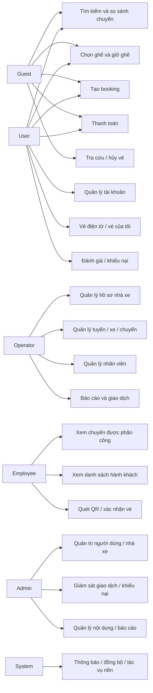

## 3.6. Đặc tả Use Case tổng quan

### 3.6.1. Danh sách Use Case

| ID    | Use Case                             | Actor chính         | Mục tiêu                                                                    | Ưu tiên    |
| ----- | ------------------------------------ | ------------------- | --------------------------------------------------------------------------- | ---------- |
| UC-01 | Quản lý tài khoản khách hàng         | User                | Cho phép đăng ký, đăng nhập, cập nhật hồ sơ và quản lý thông tin cá nhân.   | Cao        |
| UC-02 | Tìm kiếm và so sánh chuyến           | Guest, User         | Trả về danh sách chuyến phù hợp tiêu chí tìm kiếm.                          | Cao        |
| UC-03 | Xem chi tiết chuyến và nhà xe        | Guest, User         | Cung cấp thông tin đủ để quyết định đặt vé.                                 | Cao        |
| UC-04 | Chọn ghế và giữ ghế                  | Guest, User         | Tạm giữ ghế khả dụng để tiếp tục tạo booking.                               | Cao        |
| UC-05 | Tạo booking                          | Guest, User         | Ghi nhận thông tin hành khách, ghế, điểm đón/trả và số tiền cần thanh toán. | Cao        |
| UC-06 | Thanh toán booking                   | Guest, User, System | Xử lý thanh toán và cập nhật trạng thái booking.                            | Cao        |
| UC-07 | Nhận và xem vé điện tử               | Guest, User         | Hiển thị vé điện tử sau khi booking hợp lệ.                                 | Cao        |
| UC-08 | Tra cứu, hủy vé và hoàn tiền         | Guest, User         | Cho phép tra cứu/hủy vé theo xác minh và chính sách.                        | Cao        |
| UC-09 | Đánh giá, hỗ trợ và khiếu nại        | User, Guest         | Ghi nhận phản hồi, đánh giá và yêu cầu hỗ trợ.                              | Trung bình |
| UC-10 | Quản lý hồ sơ nhà xe                 | Operator            | Cập nhật thông tin doanh nghiệp, liên hệ và trạng thái vận hành.            | Cao        |
| UC-11 | Quản lý tuyến, xe và chuyến          | Operator            | Tạo và vận hành dữ liệu cung ứng vé.                                        | Cao        |
| UC-12 | Quản lý nhân viên                    | Operator            | Tạo tài khoản Employee và phân công cho chuyến.                             | Cao        |
| UC-13 | Báo cáo nhà xe                       | Operator            | Theo dõi doanh thu, giao dịch, chuyến và hiệu quả vận hành.                 | Trung bình |
| UC-14 | Xem chuyến được phân công            | Employee            | Cho Employee biết lịch trình và nhiệm vụ cần thực hiện.                     | Cao        |
| UC-15 | Xem danh sách hành khách             | Employee            | Cung cấp manifest hành khách theo chuyến.                                   | Cao        |
| UC-16 | Quét QR / xác nhận vé                | Employee            | Kiểm tra vé và ghi nhận hành khách lên xe.                                  | Cao        |
| UC-17 | Quản trị người dùng và nhà xe        | Admin               | Kiểm soát người dùng, nhà xe và trạng thái tham gia nền tảng.               | Cao        |
| UC-18 | Giám sát giao dịch và khiếu nại      | Admin               | Theo dõi giao dịch, xử lý khiếu nại và ngoại lệ vận hành.                   | Cao        |
| UC-19 | Quản lý nội dung, voucher và báo cáo | Admin               | Quản trị nội dung công khai, voucher, đánh giá và báo cáo toàn hệ thống.    | Trung bình |
| UC-20 | Thông báo và tác vụ nền              | System              | Gửi thông báo, đồng bộ trạng thái và xử lý các công việc tự động.           | Cao        |

### 3.6.2. Luồng tương tác tổng quát

1. Guest hoặc User nhập tiêu chí tìm kiếm chuyến.
2. Hệ thống trả về danh sách chuyến đang mở bán, còn ghế và phù hợp điều kiện.
3. Guest hoặc User mở chi tiết chuyến, chọn ghế, điểm đón/trả và tiếp tục đặt vé.
4. Hệ thống kiểm tra ghế khả dụng, giữ ghế tạm thời và yêu cầu nhập thông tin hành khách.
5. Guest hoặc User xác nhận booking và chọn phương thức thanh toán.
6. Hệ thống xử lý thanh toán; nếu thành công hoặc được xác nhận hợp lệ, booking chuyển sang trạng thái được xác nhận.
7. Hệ thống phát hành vé điện tử và gửi thông tin vé cho hành khách.
8. Operator theo dõi booking, giao dịch, chuyến và nhân viên thuộc phạm vi nhà xe.
9. Employee dùng cổng trip-manager để xem chuyến, danh sách hành khách và quét QR/mã vé khi hành khách lên xe.
10. Admin giám sát người dùng, nhà xe, giao dịch, nội dung, đánh giá và khiếu nại để bảo đảm hoạt động nền tảng.

### 3.6.3. Đặc tả Use Case chi tiết

Mỗi use case dưới đây trình bày actor, mục tiêu, điều kiện thực hiện, kết quả sau xử lý, luồng chính và các ngoại lệ cần kiểm soát.

#### UC-01. Quản lý tài khoản khách hàng

| Thuộc tính     | Nội dung                                                                                     |
| -------------- | -------------------------------------------------------------------------------------------- |
| Actor chính    | User                                                                                         |
| Mục tiêu       | Cho phép khách hàng tạo tài khoản, đăng nhập và quản lý hồ sơ cá nhân.                       |
| Tiền điều kiện | User có thông tin đăng ký hợp lệ hoặc đã có tài khoản còn hoạt động.                         |
| Kích hoạt      | User chọn đăng ký, đăng nhập, cập nhật hồ sơ hoặc đổi thông tin bảo mật.                     |
| Hậu điều kiện  | Tài khoản hoặc hồ sơ được cập nhật hợp lệ; phiên truy cập được tạo nếu đăng nhập thành công. |

Luồng chính:

1. User mở chức năng đăng ký hoặc đăng nhập.
2. Hệ thống hiển thị biểu mẫu phù hợp với hành động được chọn.
3. User nhập thông tin nhận diện và thông tin xác thực cần thiết.
4. Hệ thống kiểm tra dữ liệu, trạng thái tài khoản và thông tin xác thực.
5. Nếu hợp lệ, hệ thống tạo tài khoản mới hoặc tạo phiên đăng nhập cho User.
6. User truy cập hồ sơ cá nhân và cập nhật các trường được phép.
7. Hệ thống lưu thay đổi, phản hồi kết quả và cho phép User tiếp tục sử dụng các chức năng cá nhân.

Ngoại lệ chính:

- A1: Thông tin đăng ký trùng hoặc không hợp lệ, hệ thống từ chối và yêu cầu nhập lại.
- A2: Tài khoản bị khóa hoặc thông tin đăng nhập sai, hệ thống không cấp phiên truy cập.
- A3: User cố cập nhật trường không thuộc phạm vi cho phép, hệ thống bỏ qua hoặc từ chối thao tác.

#### UC-02. Tìm kiếm và so sánh chuyến

| Thuộc tính     | Nội dung                                                                                 |
| -------------- | ---------------------------------------------------------------------------------------- |
| Actor chính    | Guest, User                                                                              |
| Mục tiêu       | Trả về các chuyến phù hợp nhu cầu đi lại để hành khách lựa chọn.                         |
| Tiền điều kiện | Có dữ liệu chuyến đang mở bán trên hệ thống.                                             |
| Kích hoạt      | Guest hoặc User nhập tiêu chí tìm chuyến.                                                |
| Hậu điều kiện  | Danh sách chuyến phù hợp được hiển thị hoặc hệ thống trả về trạng thái không có kết quả. |

Luồng chính:

1. Guest hoặc User nhập điểm đi, điểm đến, ngày đi và số lượng hành khách.
2. Hệ thống kiểm tra tiêu chí tìm kiếm hợp lệ.
3. Hệ thống lọc các chuyến đang đủ điều kiện hiển thị và còn ghế phù hợp.
4. Hệ thống trả về danh sách chuyến kèm thông tin cơ bản như giờ đi, giờ đến, nhà xe, loại xe, giá và ghế còn lại.
5. Guest hoặc User áp dụng bộ lọc hoặc sắp xếp để so sánh các lựa chọn.
6. Actor chọn một chuyến để xem chi tiết.

Ngoại lệ chính:

- A1: Ngày đi hoặc tiêu chí tìm kiếm không hợp lệ, hệ thống yêu cầu chỉnh sửa.
- A2: Không có chuyến phù hợp, hệ thống hiển thị trạng thái rỗng và cho phép tìm lại.
- A3: Trạng thái ghế thay đổi trong lúc xem kết quả, hệ thống phải kiểm tra lại ở bước đặt vé tiếp theo.

#### UC-03. Xem chi tiết chuyến và nhà xe

| Thuộc tính     | Nội dung                                                                                   |
| -------------- | ------------------------------------------------------------------------------------------ |
| Actor chính    | Guest, User                                                                                |
| Mục tiêu       | Cung cấp đủ thông tin để hành khách quyết định đặt vé.                                     |
| Tiền điều kiện | Actor đã chọn một chuyến hợp lệ từ danh sách tìm kiếm hoặc liên kết chi tiết.              |
| Kích hoạt      | Actor mở trang chi tiết chuyến hoặc trang thông tin nhà xe.                                |
| Hậu điều kiện  | Chi tiết chuyến được hiển thị; actor có thể tiếp tục chọn ghế nếu chuyến còn đủ điều kiện. |

Luồng chính:

1. Guest hoặc User mở chi tiết chuyến.
2. Hệ thống tải trạng thái mới nhất của chuyến, nhà xe và sơ đồ ghế.
3. Hệ thống hiển thị tuyến, thời gian, giá vé, tiện ích, điểm đón/trả, loại xe và số ghế khả dụng.
4. Hệ thống hiển thị thông tin công khai của nhà xe và các thông tin hỗ trợ quyết định đặt vé.
5. Actor xem điều kiện giao dịch và chọn tiếp tục.
6. Hệ thống chuyển actor sang bước chọn ghế.

Ngoại lệ chính:

- A1: Chuyến đã bị hủy, hết ghế hoặc không còn mở bán, hệ thống chặn đặt vé mới.
- A2: Dữ liệu chuyến vừa thay đổi, hệ thống hiển thị thông tin mới nhất trước khi tiếp tục.
- A3: Actor mở mã chuyến không tồn tại, hệ thống trả về thông báo không tìm thấy.

#### UC-04. Chọn ghế và giữ ghế

| Thuộc tính     | Nội dung                                                                                   |
| -------------- | ------------------------------------------------------------------------------------------ |
| Actor chính    | Guest, User                                                                                |
| Mục tiêu       | Cho phép hành khách chọn ghế khả dụng và giữ tạm thời để hoàn tất đặt vé.                  |
| Tiền điều kiện | Chuyến còn mở bán và có ghế khả dụng.                                                      |
| Kích hoạt      | Actor chọn ghế trên sơ đồ chuyến.                                                          |
| Hậu điều kiện  | Ghế được giữ tạm thời cho phiên đặt vé hoặc yêu cầu bị từ chối nếu ghế không còn khả dụng. |

Luồng chính:

1. Hệ thống hiển thị sơ đồ ghế theo chuyến.
2. Guest hoặc User chọn một hoặc nhiều ghế còn trống.
3. Hệ thống kiểm tra lại trạng thái từng ghế trước khi giữ.
4. Nếu hợp lệ, hệ thống tạo phiên giữ ghế có thời hạn.
5. Hệ thống hiển thị ghế đã chọn, số tiền tạm tính và thời gian còn lại để hoàn tất đặt vé.
6. Actor tiếp tục sang bước nhập thông tin hành khách.

Ngoại lệ chính:

- A1: Ghế vừa bị giữ hoặc đã bán, hệ thống yêu cầu chọn ghế khác.
- A2: Thời hạn giữ ghế hết trước khi actor hoàn tất booking, hệ thống giải phóng ghế.
- A3: Actor chọn ghế không thuộc sơ đồ chuyến hoặc vượt giới hạn cho phép, hệ thống từ chối.

#### UC-05. Tạo booking

| Thuộc tính     | Nội dung                                                                            |
| -------------- | ----------------------------------------------------------------------------------- |
| Actor chính    | Guest, User                                                                         |
| Mục tiêu       | Ghi nhận đơn đặt vé từ ghế đang giữ và thông tin hành khách.                        |
| Tiền điều kiện | Ghế đang được giữ hợp lệ cho phiên đặt vé hiện tại.                                 |
| Kích hoạt      | Actor xác nhận thông tin hành khách và thông tin liên hệ.                           |
| Hậu điều kiện  | Booking được tạo với trạng thái ban đầu để tiếp tục thanh toán hoặc xử lý xác nhận. |

Luồng chính:

1. Guest hoặc User nhập thông tin liên hệ và thông tin hành khách.
2. Actor chọn điểm đón, điểm trả và nhập voucher nếu có.
3. Hệ thống kiểm tra dữ liệu liên hệ, điểm đón/trả, ghế đang giữ và điều kiện voucher.
4. Hệ thống tính tổng tiền, giảm giá và số tiền cuối cùng.
5. Hệ thống tạo booking gắn với chuyến, ghế, hành khách và snapshot thông tin giao dịch cần thiết.
6. Hệ thống hiển thị tóm tắt booking và chuyển actor đến bước thanh toán.

Ngoại lệ chính:

- A1: Ghế giữ đã hết hạn hoặc không khớp phiên đặt vé, hệ thống không tạo booking.
- A2: Thông tin hành khách hoặc liên hệ thiếu dữ liệu bắt buộc, hệ thống yêu cầu bổ sung.
- A3: Voucher không hợp lệ hoặc hết lượt dùng, hệ thống loại voucher và cho phép tiếp tục nếu actor đồng ý.

#### UC-06. Thanh toán booking

| Thuộc tính     | Nội dung                                                                                    |
| -------------- | ------------------------------------------------------------------------------------------- |
| Actor chính    | Guest, User, System                                                                         |
| Mục tiêu       | Xử lý thanh toán và cập nhật trạng thái booking theo kết quả giao dịch.                     |
| Tiền điều kiện | Booking còn hiệu lực và chưa thanh toán thành công.                                         |
| Kích hoạt      | Actor chọn phương thức thanh toán hoặc hệ thống nhận kết quả thanh toán.                    |
| Hậu điều kiện  | Payment được cập nhật; booking được xác nhận hoặc giữ trạng thái phù hợp với kết quả xử lý. |

Luồng chính:

1. Guest hoặc User chọn phương thức thanh toán được hỗ trợ.
2. Hệ thống kiểm tra booking còn hiệu lực và số tiền thanh toán khớp booking.
3. Hệ thống tạo giao dịch thanh toán và chuyển actor đến luồng thanh toán tương ứng.
4. Actor hoàn tất thao tác thanh toán.
5. Hệ thống nhận kết quả thanh toán từ cổng thanh toán hoặc phương thức đã chọn.
6. Hệ thống xác thực kết quả và chống xử lý trùng.
7. Nếu thanh toán hợp lệ, hệ thống cập nhật booking, payment và kích hoạt phát hành vé.

Ngoại lệ chính:

- A1: Booking đã hủy, hết hạn hoặc đã thanh toán, hệ thống không tạo giao dịch mới.
- A2: Thanh toán thất bại hoặc actor bỏ dở, hệ thống hiển thị trạng thái phù hợp để xử lý tiếp.
- A3: Kết quả thanh toán lệch số tiền hoặc bị gửi trùng, hệ thống không phát hành vé sai.

#### UC-07. Nhận và xem vé điện tử

| Thuộc tính     | Nội dung                                                                           |
| -------------- | ---------------------------------------------------------------------------------- |
| Actor chính    | Guest, User, System                                                                |
| Mục tiêu       | Phát hành và hiển thị vé điện tử sau khi booking đủ điều kiện.                     |
| Tiền điều kiện | Booking đã được xác nhận hợp lệ.                                                   |
| Kích hoạt      | Hệ thống phát hành vé hoặc actor mở thông tin vé.                                  |
| Hậu điều kiện  | Vé điện tử có mã vé, QR và thông tin chuyến được hiển thị hoặc gửi cho hành khách. |

Luồng chính:

1. Hệ thống nhận booking đủ điều kiện phát hành vé.
2. Hệ thống tạo vé điện tử cho ghế/hành khách tương ứng.
3. Hệ thống gắn mã vé, QR và thông tin chuyến cần thiết.
4. Hệ thống gửi hoặc ghi nhận thông báo vé cho hành khách.
5. User xem vé trong khu vực vé của tôi; Guest xem vé qua kết quả đặt vé hoặc luồng tra cứu hợp lệ.
6. Vé sẵn sàng để Employee xác thực khi soát vé.

Ngoại lệ chính:

- A1: Thông báo gửi thất bại, vé vẫn phải tra cứu được trong hệ thống.
- A2: Booking không đủ điều kiện phát hành, hệ thống không tạo vé.
- A3: Yêu cầu phát hành bị lặp lại, hệ thống không tạo vé trùng.

#### UC-08. Tra cứu, hủy vé và hoàn tiền

| Thuộc tính     | Nội dung                                                                        |
| -------------- | ------------------------------------------------------------------------------- |
| Actor chính    | Guest, User                                                                     |
| Mục tiêu       | Cho phép hành khách xem lại vé và thực hiện hủy vé theo điều kiện áp dụng.      |
| Tiền điều kiện | Booking hoặc ticket tồn tại; actor có quyền hoặc đã xác minh thông tin tra cứu. |
| Kích hoạt      | Actor mở vé của tôi, tra cứu vé hoặc chọn hủy vé.                               |
| Hậu điều kiện  | Thông tin vé được hiển thị; yêu cầu hủy/hoàn tiền được ghi nhận nếu hợp lệ.     |

Luồng chính:

1. User mở vé thuộc tài khoản hoặc Guest nhập mã vé/booking kèm thông tin xác minh.
2. Hệ thống xác nhận quyền xem vé.
3. Hệ thống hiển thị thông tin booking, vé, chuyến và trạng thái hiện tại.
4. Actor chọn hủy vé nếu trạng thái cho phép.
5. Hệ thống kiểm tra thời điểm hủy, trạng thái vé và chính sách áp dụng.
6. Hệ thống hiển thị kết quả dự kiến gồm hủy vé, hoàn tiền hoặc lý do không đủ điều kiện.
7. Actor xác nhận; hệ thống cập nhật trạng thái liên quan và gửi thông báo.

Ngoại lệ chính:

- A1: Guest xác minh sai thông tin, hệ thống không hiển thị dữ liệu vé.
- A2: Vé đã dùng, đã hủy hoặc quá hạn hủy, hệ thống từ chối luồng hủy thông thường.
- A3: Giao dịch hoàn tiền cần xử lý thủ công, hệ thống ghi nhận trạng thái chờ xử lý.

#### UC-09. Đánh giá, hỗ trợ và khiếu nại

| Thuộc tính     | Nội dung                                                                                 |
| -------------- | ---------------------------------------------------------------------------------------- |
| Actor chính    | User, Guest                                                                              |
| Mục tiêu       | Ghi nhận phản hồi sau chuyến và yêu cầu hỗ trợ khi phát sinh vấn đề.                     |
| Tiền điều kiện | Actor có dữ liệu booking/vé liên quan; review yêu cầu User có chuyến hợp lệ để đánh giá. |
| Kích hoạt      | Actor mở chức năng đánh giá, hỗ trợ hoặc khiếu nại.                                      |
| Hậu điều kiện  | Review, yêu cầu hỗ trợ hoặc khiếu nại được tạo và có trạng thái theo dõi.                |

Luồng chính:

1. Actor chọn booking hoặc vé liên quan đến phản hồi.
2. User gửi đánh giá nếu chuyến đủ điều kiện đánh giá.
3. User hoặc Guest chọn loại vấn đề cần hỗ trợ hoặc khiếu nại.
4. Actor nhập mô tả, thông tin cần thiết và tệp minh chứng nếu có.
5. Hệ thống kiểm tra dữ liệu và tạo bản ghi phản hồi.
6. Hệ thống chuyển nội dung đến Operator hoặc Admin theo phạm vi xử lý.
7. Actor theo dõi trạng thái phản hồi hoặc khiếu nại.

Ngoại lệ chính:

- A1: Review không gắn với chuyến hợp lệ, hệ thống từ chối.
- A2: Khiếu nại thiếu thông tin tối thiểu, hệ thống yêu cầu bổ sung.
- A3: Nội dung có dấu hiệu vi phạm hoặc spam, hệ thống chuyển kiểm duyệt.

#### UC-10. Quản lý hồ sơ nhà xe

| Thuộc tính     | Nội dung                                                                                 |
| -------------- | ---------------------------------------------------------------------------------------- |
| Actor chính    | Operator                                                                                 |
| Mục tiêu       | Cho phép nhà xe quản lý thông tin doanh nghiệp và thông tin công khai trên nền tảng.     |
| Tiền điều kiện | Operator đã có tài khoản hợp lệ.                                                         |
| Kích hoạt      | Operator mở mục hồ sơ nhà xe.                                                            |
| Hậu điều kiện  | Hồ sơ được cập nhật trong phạm vi cho phép và sẵn sàng dùng cho các nghiệp vụ liên quan. |

Luồng chính:

1. Operator đăng nhập vào khu vực nhà xe.
2. Hệ thống hiển thị hồ sơ doanh nghiệp, thông tin liên hệ và trạng thái hoạt động.
3. Operator cập nhật các trường được phép như mô tả, hotline, logo hoặc địa chỉ liên hệ.
4. Hệ thống kiểm tra dữ liệu đầu vào và quyền cập nhật.
5. Hệ thống lưu thay đổi và hiển thị kết quả.
6. Các thông tin công khai hợp lệ được dùng trong màn hình chuyến và trang nhà xe.

Ngoại lệ chính:

- A1: Dữ liệu hồ sơ thiếu hoặc sai định dạng, hệ thống từ chối cập nhật.
- A2: Operator bị khóa hoặc không đủ quyền, hệ thống giới hạn thao tác.
- A3: Thay đổi thuộc nhóm cần kiểm duyệt, hệ thống ghi nhận trạng thái chờ xử lý nếu áp dụng.

#### UC-11. Quản lý tuyến, xe và chuyến

| Thuộc tính     | Nội dung                                                                        |
| -------------- | ------------------------------------------------------------------------------- |
| Actor chính    | Operator                                                                        |
| Mục tiêu       | Tạo dữ liệu cung ứng vé gồm tuyến đường, điểm dừng, xe, sơ đồ ghế và chuyến xe. |
| Tiền điều kiện | Operator có quyền quản lý tài nguyên nhà xe.                                    |
| Kích hoạt      | Operator tạo hoặc cập nhật tuyến, xe, sơ đồ ghế hay chuyến.                     |
| Hậu điều kiện  | Tài nguyên vận hành được lưu hợp lệ và có thể dùng cho luồng mở bán chuyến.     |

Luồng chính:

1. Operator tạo hoặc cập nhật tuyến đường và các điểm dừng liên quan.
2. Operator khai báo xe, loại xe, tiện ích và sơ đồ ghế.
3. Hệ thống kiểm tra dữ liệu tuyến, xe và ghế thuộc đúng phạm vi nhà xe.
4. Operator tạo chuyến từ tuyến và xe đã có.
5. Operator cấu hình thời gian chạy, giá vé, nhân viên vận hành và trạng thái chuyến.
6. Hệ thống kiểm tra trùng lịch tài nguyên và dữ liệu tối thiểu để chuyến sẵn sàng bán.
7. Operator theo dõi và cập nhật chuyến trong phạm vi được phép.
8. Nếu phát sinh nhu cầu vận hành, Operator có thể hủy chuyến đã bán vé; hệ thống phải thông báo cho hành khách và lưu lịch sử xử lý.

Ngoại lệ chính:

- A1: Xe, tuyến hoặc nhân viên không thuộc nhà xe, hệ thống từ chối gán vào chuyến.
- A2: Sơ đồ ghế không hợp lệ hoặc xe bị trùng lịch, hệ thống không cho mở bán chuyến.
- A3: Chuyến đã có vé bán mà thay đổi thông tin quan trọng, hệ thống phải ghi nhận lý do và thông báo liên quan.

#### UC-12. Quản lý nhân viên

| Thuộc tính     | Nội dung                                                                        |
| -------------- | ------------------------------------------------------------------------------- |
| Actor chính    | Operator                                                                        |
| Mục tiêu       | Quản lý tài khoản Employee và phân công nhân sự cho chuyến.                     |
| Tiền điều kiện | Operator có quyền quản lý nhân viên thuộc nhà xe.                               |
| Kích hoạt      | Operator mở chức năng tạo, sửa, khóa/mở khóa hoặc phân công Employee.           |
| Hậu điều kiện  | Employee được cập nhật hợp lệ và phân công được phản ánh trong vận hành chuyến. |

Luồng chính:

1. Operator mở danh sách nhân viên.
2. Operator tạo mới Employee với thông tin nhận diện, liên hệ, vai trò và mật khẩu ban đầu.
3. Hệ thống kiểm tra mã nhân viên, vai trò và thông tin bắt buộc.
4. Operator cập nhật trạng thái nhân viên hoặc thông tin chuyên môn được phép.
5. Operator chọn Employee phù hợp khi tạo hoặc cập nhật chuyến.
6. Hệ thống kiểm tra Employee còn hoạt động và thuộc đúng Operator.
7. Hệ thống lưu phân công để Employee nhìn thấy chuyến trong cổng trip-manager.

Ngoại lệ chính:

- A1: Mã nhân viên hoặc thông tin liên hệ bị trùng trong phạm vi nhà xe, hệ thống từ chối.
- A2: Employee bị tạm ngưng hoặc đã nghỉ, hệ thống không cho gán chuyến mới.
- A3: Vai trò nhân viên không phù hợp dữ liệu yêu cầu, hệ thống yêu cầu bổ sung hoặc đổi lựa chọn.

#### UC-13. Báo cáo nhà xe

| Thuộc tính     | Nội dung                                                      |
| -------------- | ------------------------------------------------------------- |
| Actor chính    | Operator                                                      |
| Mục tiêu       | Cung cấp số liệu vận hành và giao dịch trong phạm vi nhà xe.  |
| Tiền điều kiện | Nhà xe đã có dữ liệu chuyến, booking hoặc payment liên quan.  |
| Kích hoạt      | Operator mở dashboard, giao dịch hoặc báo cáo.                |
| Hậu điều kiện  | Báo cáo và số liệu phù hợp bộ lọc được hiển thị cho Operator. |

Luồng chính:

1. Operator chọn khoảng thời gian hoặc phạm vi cần xem.
2. Hệ thống tổng hợp dữ liệu chuyến, vé, giao dịch và hiệu quả vận hành thuộc nhà xe.
3. Hệ thống hiển thị các chỉ số tổng quan, bảng giao dịch hoặc biểu đồ báo cáo.
4. Operator lọc theo tuyến, chuyến, trạng thái hoặc thời gian.
5. Operator xem chi tiết các dữ liệu liên quan để phục vụ vận hành và đối soát.

Ngoại lệ chính:

- A1: Không có dữ liệu phù hợp, hệ thống hiển thị trạng thái rỗng.
- A2: Operator yêu cầu dữ liệu ngoài phạm vi nhà xe, hệ thống từ chối.
- A3: Chỉ số tài chính nâng cao chưa đủ dữ liệu, báo cáo phải thể hiện đúng mức sẵn có.

#### UC-14. Xem chuyến được phân công

| Thuộc tính     | Nội dung                                                        |
| -------------- | --------------------------------------------------------------- |
| Actor chính    | Employee                                                        |
| Mục tiêu       | Cho Employee xem chuyến và nhiệm vụ vận hành đã được phân công. |
| Tiền điều kiện | Employee có tài khoản hoạt động và được phân công chuyến.       |
| Kích hoạt      | Employee đăng nhập và mở dashboard hoặc chuyến đang hoạt động.  |
| Hậu điều kiện  | Danh sách chuyến phù hợp quyền Employee được hiển thị.          |

Luồng chính:

1. Employee đăng nhập vào cổng trip-manager.
2. Hệ thống xác thực vai trò và phạm vi nhà xe của Employee.
3. Hệ thống tải các chuyến được phân công.
4. Employee xem tuyến, xe, thời gian, trạng thái và ghi chú vận hành của chuyến.
5. Employee chọn một chuyến để xem danh sách hành khách hoặc thao tác soát vé.

Ngoại lệ chính:

- A1: Employee chưa được phân công chuyến, hệ thống hiển thị trạng thái chưa có dữ liệu.
- A2: Employee cố mở chuyến ngoài phạm vi phân công, hệ thống từ chối.
- A3: Chuyến đã bị hủy hoặc hoàn tất, hệ thống hiển thị trạng thái hiện tại và giới hạn thao tác.

#### UC-15. Xem danh sách hành khách

| Thuộc tính     | Nội dung                                                                        |
| -------------- | ------------------------------------------------------------------------------- |
| Actor chính    | Employee                                                                        |
| Mục tiêu       | Cung cấp manifest hành khách phục vụ đón khách và soát vé.                      |
| Tiền điều kiện | Employee được phân công cho chuyến và có quyền vận hành chuyến đó.              |
| Kích hoạt      | Employee mở danh sách hành khách của chuyến.                                    |
| Hậu điều kiện  | Danh sách khách và trạng thái check-in được hiển thị cho chuyến được phân công. |

Luồng chính:

1. Employee mở chi tiết chuyến được phân công.
2. Hệ thống kiểm tra quyền xem manifest.
3. Hệ thống hiển thị đầy đủ thông tin khách cần thiết cho soát vé trong chuyến phụ trách, gồm tên, ghế, điểm đón/trả, thông tin liên hệ và trạng thái vé.
4. Employee tìm kiếm hoặc lọc khách theo tên, số ghế, mã vé hoặc trạng thái check-in.
5. Employee chọn hành khách để tiếp tục đối chiếu vé hoặc thực hiện check-in.

Ngoại lệ chính:

- A1: Employee không thuộc chuyến, hệ thống không hiển thị danh sách khách.
- A2: Dữ liệu hành khách thay đổi sau tải trang, hệ thống cho phép tải lại trạng thái mới nhất.
- A3: Vé đã hủy hoặc không còn hợp lệ, hệ thống phải thể hiện trạng thái rõ trong manifest.

#### UC-16. Quét QR / xác nhận vé

| Thuộc tính     | Nội dung                                                                      |
| -------------- | ----------------------------------------------------------------------------- |
| Actor chính    | Employee                                                                      |
| Mục tiêu       | Xác thực vé và ghi nhận hành khách lên xe.                                    |
| Tiền điều kiện | Employee được phân công chuyến và hành khách xuất trình mã vé hoặc QR.        |
| Kích hoạt      | Employee quét QR, nhập mã vé hoặc chọn xác nhận từ manifest.                  |
| Hậu điều kiện  | Vé hợp lệ được đánh dấu đã sử dụng; kết quả soát vé được cập nhật vào chuyến. |

Luồng chính:

1. Employee mở công cụ quét vé trong chuyến phụ trách.
2. Employee quét QR hoặc nhập mã vé.
3. Hệ thống kiểm tra mã vé, trạng thái vé, chuyến liên quan và quyền của Employee.
4. Hệ thống hiển thị thông tin khách để Employee đối chiếu.
5. Employee xác nhận check-in nếu thông tin hợp lệ.
6. Hệ thống cập nhật trạng thái vé và danh sách hành khách.

Ngoại lệ chính:

- A1: Vé không tồn tại, thuộc chuyến khác hoặc đã hết hiệu lực, hệ thống từ chối check-in.
- A2: Vé đã được sử dụng, hệ thống cảnh báo soát vé trùng.
- A3: Không đọc được QR, Employee có thể nhập mã vé thủ công nếu dữ liệu cho phép.

#### UC-17. Quản trị người dùng và nhà xe

| Thuộc tính     | Nội dung                                                                     |
| -------------- | ---------------------------------------------------------------------------- |
| Actor chính    | Admin                                                                        |
| Mục tiêu       | Quản lý tài khoản người dùng và trạng thái tham gia của nhà xe.              |
| Tiền điều kiện | Admin đã đăng nhập và có quyền quản trị phù hợp.                             |
| Kích hoạt      | Admin mở danh sách user hoặc nhà xe.                                         |
| Hậu điều kiện  | Trạng thái user hoặc Operator được cập nhật theo quyết định quản trị hợp lệ. |

Luồng chính:

1. Admin mở danh sách người dùng hoặc nhà xe.
2. Hệ thống hiển thị dữ liệu tổng quan, trạng thái và bộ lọc quản trị.
3. Admin mở chi tiết tài khoản cần xử lý.
4. Admin thực hiện thao tác phù hợp như xem hồ sơ, khóa/mở khóa user, duyệt, từ chối, khóa hoặc mở khóa nhà xe.
5. Hệ thống yêu cầu lý do khi thao tác ảnh hưởng quyền truy cập hoặc quyền mở bán.
6. Hệ thống cập nhật trạng thái và lưu lịch sử thao tác.

Ngoại lệ chính:

- A1: Admin không đủ quyền, hệ thống từ chối thao tác.
- A2: Trạng thái chuyển đổi không hợp lệ, hệ thống giữ nguyên dữ liệu hiện tại.
- A3: Hồ sơ nhà xe thiếu căn cứ xử lý, Admin cần bổ sung lý do hoặc thông tin trước khi quyết định.

#### UC-18. Giám sát giao dịch và khiếu nại

| Thuộc tính     | Nội dung                                                                               |
| -------------- | -------------------------------------------------------------------------------------- |
| Actor chính    | Admin                                                                                  |
| Mục tiêu       | Theo dõi giao dịch, đổi trạng thái giao dịch khi được phép và xử lý khiếu nại.         |
| Tiền điều kiện | Có giao dịch hoặc khiếu nại phát sinh; Admin có quyền xử lý.                           |
| Kích hoạt      | Admin mở màn hình giao dịch hoặc khiếu nại.                                            |
| Hậu điều kiện  | Giao dịch hoặc khiếu nại được cập nhật trạng thái xử lý hợp lệ và có lịch sử thao tác. |

Luồng chính:

1. Admin lọc giao dịch hoặc khiếu nại theo mã, thời gian, trạng thái hoặc đối tượng liên quan.
2. Hệ thống hiển thị dữ liệu cần giám sát.
3. Admin mở chi tiết giao dịch hoặc khiếu nại.
4. Với giao dịch, Admin kiểm tra booking, số tiền, trạng thái và chọn đổi trạng thái khi có căn cứ quản trị.
5. Với khiếu nại, Admin phân loại, cập nhật mức ưu tiên, ghi phản hồi hoặc kết luận xử lý.
6. Hệ thống lưu trạng thái mới, lý do và lịch sử thao tác.
7. Hệ thống gửi hoặc ghi nhận thông báo khi kết quả ảnh hưởng đến hành khách hoặc Operator.

Ngoại lệ chính:

- A1: Trạng thái giao dịch không được phép chuyển theo luồng hiện tại, hệ thống từ chối cập nhật.
- A2: Khiếu nại thiếu dữ liệu, Admin chuyển yêu cầu bổ sung thay vì kết luận.
- A3: Thao tác nhạy cảm thiếu lý do, hệ thống không lưu thay đổi.

#### UC-19. Quản lý nội dung, voucher và báo cáo

| Thuộc tính     | Nội dung                                                                      |
| -------------- | ----------------------------------------------------------------------------- |
| Actor chính    | Admin                                                                         |
| Mục tiêu       | Quản trị nội dung công khai, voucher nền tảng, đánh giá và báo cáo tổng quan. |
| Tiền điều kiện | Admin có quyền truy cập khu vực quản trị liên quan.                           |
| Kích hoạt      | Admin mở màn hình content, voucher, review hoặc report.                       |
| Hậu điều kiện  | Nội dung hoặc cấu hình quản trị được cập nhật hợp lệ; báo cáo được hiển thị.  |

Luồng chính:

1. Admin chọn nhóm dữ liệu cần quản lý.
2. Hệ thống hiển thị danh sách banner, bài viết, FAQ, voucher, review hoặc báo cáo tương ứng.
3. Admin tạo, cập nhật, ẩn/hiện hoặc kiểm duyệt dữ liệu trong phạm vi quyền.
4. Hệ thống kiểm tra điều kiện dữ liệu và lưu thay đổi.
5. Khi xem báo cáo, Admin chọn bộ lọc và phạm vi thời gian.
6. Hệ thống tổng hợp chỉ số toàn hệ thống và hiển thị kết quả.

Ngoại lệ chính:

- A1: Nội dung hoặc voucher thiếu trường bắt buộc, hệ thống từ chối lưu.
- A2: Review cần kiểm duyệt hoặc có dấu hiệu vi phạm, hệ thống giữ trạng thái xử lý phù hợp.
- A3: Không có dữ liệu báo cáo theo bộ lọc, hệ thống hiển thị trạng thái rỗng.

#### UC-20. Thông báo và tác vụ nền

| Thuộc tính     | Nội dung                                                                              |
| -------------- | ------------------------------------------------------------------------------------- |
| Actor chính    | System                                                                                |
| Mục tiêu       | Tự động xử lý các sự kiện nền quan trọng cho booking, payment, vé và thông báo.       |
| Tiền điều kiện | Có sự kiện nghiệp vụ hoặc tác vụ định kỳ cần xử lý.                                   |
| Kích hoạt      | Booking/payment thay đổi trạng thái, giữ ghế hết hạn hoặc lịch tác vụ được kích hoạt. |
| Hậu điều kiện  | Trạng thái cần đồng bộ được cập nhật; thông báo hoặc log xử lý được ghi nhận.         |

Luồng chính:

1. System nhận sự kiện nghiệp vụ hoặc kích hoạt tác vụ định kỳ.
2. System xác định đối tượng cần xử lý như ghế giữ tạm, payment, ticket hoặc notification.
3. System kiểm tra điều kiện và trạng thái hiện tại để tránh xử lý trùng.
4. System cập nhật trạng thái hoặc phát thông báo theo rule cấu hình.
5. System ghi nhận kết quả xử lý để phục vụ tra cứu và vận hành.
6. Nếu có lỗi tạm thời, System áp dụng cơ chế thử lại hoặc chuyển sang xử lý cần theo dõi.

Ngoại lệ chính:

- A1: Tác vụ chạy trùng cùng phạm vi, System phải tránh cập nhật lặp.
- A2: Kênh thông báo lỗi, trạng thái gửi phải được ghi nhận để xử lý tiếp.
- A3: Dữ liệu không đủ để tự động kết luận, System giữ trạng thái an toàn và chờ xử lý phù hợp.

# CHƯƠNG 4. QUY TẮC NGHIỆP VỤ VÀ VẬN HÀNH HỆ THỐNG

Chương này xác định các quy tắc nghiệp vụ, phân quyền, trạng thái dữ liệu, thông báo, tiêu chí nghiệm thu và rủi ro vận hành. Các quy tắc được đánh mã để thuận tiện cho kiểm thử và đối chiếu khi thiết kế chi tiết.

## 4.1. Nguyên tắc nghiệp vụ nền tảng

| ID        | Nguyên tắc                      | Nội dung áp dụng                                                                                                                                                                           |
| --------- | ------------------------------- | ------------------------------------------------------------------------------------------------------------------------------------------------------------------------------------------ |
| BR-GEN-01 | Marketplace nhiều nhà xe        | Platform kết nối hành khách với nhiều Operator; Platform không trực tiếp sở hữu xe hoặc vận hành chuyến.                                                                                   |
| BR-GEN-02 | Tenant boundary                 | Dữ liệu vận hành của mỗi Operator phải được tách biệt; Operator và Employee chỉ thao tác trên dữ liệu thuộc phạm vi được cấp.                                                              |
| BR-GEN-03 | Ghế là tài nguyên giao dịch     | Một ghế trên một chuyến chỉ được bán cho một booking hợp lệ tại một thời điểm.                                                                                                             |
| BR-GEN-04 | Booking là nguồn giao dịch      | Mọi thanh toán, vé, hủy vé, hoàn tiền và khiếu nại phải truy vết được về booking liên quan.                                                                                                |
| BR-GEN-05 | Vé là quyền lên xe              | Vé điện tử chỉ được phát hành khi booking đủ điều kiện xác nhận và phải kiểm tra được bằng mã vé hoặc QR.                                                                                  |
| BR-GEN-06 | Trạng thái phải rõ ràng         | Booking, payment, ticket, trip và complaint phải có trạng thái riêng, không dùng lẫn trạng thái giữa các thực thể.                                                                         |
| BR-GEN-07 | Thao tác nhạy cảm phải truy vết | Duyệt nhà xe, khóa/mở khóa nhà xe, khóa tài khoản, đổi trạng thái giao dịch, thanh toán, hoàn tiền, hủy chuyến, hủy vé và xử lý khiếu nại cần ghi nhận người thao tác, thời điểm và lý do. |
| BR-GEN-08 | Dữ liệu cá nhân theo vai trò    | Hệ thống hiển thị thông tin khách theo phạm vi quyền; Employee thực hiện soát vé được xem đầy đủ thông tin khách thuộc chuyến được phân công.                                              |

## 4.2. Quy tắc vòng đời đặt vé

| ID           | Nhóm quy tắc              | Quy tắc nghiệp vụ                                                                                                                                                                         |
| ------------ | ------------------------- | ----------------------------------------------------------------------------------------------------------------------------------------------------------------------------------------- |
| BR-SEARCH-01 | Tìm kiếm chuyến           | Hệ thống chỉ hiển thị chuyến phù hợp điểm đi, điểm đến, ngày đi, số lượng hành khách và còn đủ ghế khả dụng.                                                                              |
| BR-SEARCH-02 | Điều kiện mở bán          | Chuyến bị hủy, đã hoàn thành, hết thời gian bán online hoặc thuộc nhà xe không đủ điều kiện mở bán không được hiển thị cho đặt vé mới.                                                    |
| BR-SEAT-01   | Chọn ghế                  | Hành khách chỉ được chọn ghế thuộc sơ đồ ghế của chuyến và đang ở trạng thái khả dụng.                                                                                                    |
| BR-SEAT-02   | Giữ ghế                   | Ghế được giữ tạm thời trong thời hạn cấu hình; khi hết hạn mà booking/thanh toán chưa hợp lệ thì ghế phải được giải phóng.                                                                |
| BR-SEAT-03   | Chống bán trùng           | Trước khi tạo booking, tạo payment và phát hành vé, hệ thống phải kiểm tra lại trạng thái ghế.                                                                                            |
| BR-BOOK-01   | Tạo booking               | Booking phải có chuyến, danh sách ghế, thông tin hành khách, thông tin liên hệ, điểm đón/trả và tổng tiền.                                                                                |
| BR-BOOK-02   | Guest booking             | Booking của Guest phải lưu thông tin liên hệ đủ để nhận vé và xác minh khi tra cứu hoặc hủy vé.                                                                                           |
| BR-BOOK-03   | Voucher                   | Voucher chỉ được áp dụng khi còn hiệu lực, đúng phạm vi, đúng điều kiện và chưa vượt giới hạn sử dụng.                                                                                    |
| BR-BOOK-04   | Snapshot giao dịch        | Booking cần lưu các thông tin quan trọng tại thời điểm đặt vé như chuyến, giá, ghế, điểm đón/trả và chính sách áp dụng.                                                                   |
| BR-PAY-01    | Điều kiện thanh toán      | Chỉ booking còn hiệu lực, chưa hủy và chưa thanh toán thành công mới được tạo giao dịch thanh toán mới.                                                                                   |
| BR-PAY-02    | Đối chiếu số tiền         | Số tiền thanh toán phải khớp với số tiền cuối cùng của booking tại thời điểm tạo giao dịch.                                                                                               |
| BR-PAY-03    | Xử lý callback            | Kết quả thanh toán từ cổng thanh toán phải được xác thực trước khi cập nhật booking hoặc phát hành vé.                                                                                    |
| BR-PAY-04    | Chống xử lý trùng         | Callback hoặc kết quả thanh toán trùng không được làm phát sinh thanh toán, vé hoặc trạng thái trùng lặp.                                                                                 |
| BR-TICKET-01 | Phát hành vé              | Vé điện tử chỉ được phát hành sau khi booking đủ điều kiện xác nhận.                                                                                                                      |
| BR-TICKET-02 | Xác thực vé               | Khi soát vé, hệ thống phải kiểm tra vé tồn tại, còn hiệu lực, đúng chuyến và chưa dùng.                                                                                                   |
| BR-CANCEL-01 | Hủy vé                    | Booking/vé chỉ được hủy khi trạng thái và thời điểm hủy còn phù hợp với chính sách áp dụng.                                                                                               |
| BR-CANCEL-02 | Hoàn tiền                 | Nếu booking đã thanh toán, yêu cầu hủy hợp lệ phải tạo hoặc cập nhật thông tin hoàn tiền theo số tiền được phép hoàn.                                                                     |
| BR-TRIP-01   | Quản lý chuyến            | Operator chỉ được tạo và cập nhật chuyến từ tuyến, xe và nhân viên thuộc phạm vi nhà xe.                                                                                                  |
| BR-TRIP-02   | Thay đổi chuyến đã bán vé | Operator được hủy chuyến đã bán vé hoặc thay đổi thông tin quan trọng như giờ chạy, xe, điểm đón/trả khi cần xử lý vận hành; hệ thống phải thông báo cho hành khách và lưu lịch sử xử lý. |

[CẦN LÀM RÕ: chính sách hoàn tiền chi tiết và cơ chế escrow/payout đầy đủ cần được chốt trước khi vận hành tiền thật.]

## 4.3. Quy tắc phân quyền chức năng

| Actor    | Dữ liệu được phép truy cập                                                                | Thao tác chính                                                                                             | Giới hạn quyền                                                                           |
| -------- | ----------------------------------------------------------------------------------------- | ---------------------------------------------------------------------------------------------------------- | ---------------------------------------------------------------------------------------- |
| Guest    | Dữ liệu công khai và booking/vé đã xác minh                                               | Tìm chuyến, đặt vé, thanh toán, tra cứu vé, hủy vé theo điều kiện                                          | Không có hồ sơ dài hạn, không xem dữ liệu chưa xác minh, không truy cập dữ liệu vận hành |
| User     | Hồ sơ cá nhân, booking, ticket, voucher, loyalty, đánh giá và khiếu nại của chính mình    | Quản lý tài khoản, đặt vé, thanh toán, vé của tôi, đánh giá, khiếu nại                                     | Không truy cập dữ liệu của User khác hoặc dữ liệu nhà xe                                 |
| Operator | Dữ liệu tuyến, xe, chuyến, nhân viên, booking, giao dịch, voucher và báo cáo thuộc nhà xe | Quản lý vận hành nhà xe, hủy chuyến đã bán vé khi cần xử lý vận hành và theo dõi doanh thu/giao dịch       | Không xem dữ liệu của Operator khác, không cấu hình chính sách Platform                  |
| Employee | Chuyến, danh sách hành khách, đầy đủ thông tin khách và vé trong phạm vi được phân công   | Xem chuyến, xem manifest, soát vé, quét QR/mã vé, cập nhật trạng thái vận hành được phép                   | Không quản lý giá, hồ sơ nhà xe, payout, refund hoặc dữ liệu ngoài phân công             |
| Admin    | Dữ liệu toàn hệ thống theo quyền quản trị                                                 | Quản lý user, khóa/mở khóa nhà xe, đổi trạng thái giao dịch, quản lý nội dung, khiếu nại, voucher, báo cáo | Thao tác nhạy cảm phải có quyền, lý do và audit                                          |
| System   | Dữ liệu cần thiết cho tác vụ tự động                                                      | Hết hạn giữ ghế, gửi thông báo, cập nhật trạng thái, đồng bộ realtime                                      | Không xử lý ngoài rule cấu hình; mọi xử lý nhạy cảm phải truy vết                        |

## 4.4. Trạng thái dữ liệu quan trọng

### 4.4.1. Trạng thái booking

| Trạng thái  | Ý nghĩa                                           | Ghi chú xử lý                                             |
| ----------- | ------------------------------------------------- | --------------------------------------------------------- |
| `pending`   | Booking mới tạo hoặc đang chờ xác nhận/thanh toán | Chưa được xem là giao dịch hoàn tất.                      |
| `confirmed` | Booking đã được xác nhận hợp lệ                   | Có thể phát hành vé hoặc đã phát hành vé tùy luồng xử lý. |
| `cancelled` | Booking đã bị hủy                                 | Ghế cần được giải phóng nếu còn phù hợp.                  |
| `completed` | Chuyến/booking đã hoàn tất                        | Chủ yếu phục vụ lịch sử và báo cáo.                       |
| `refunded`  | Booking đã hoàn tiền                              | Cần truy vết giao dịch hoàn tiền liên quan.               |

### 4.4.2. Trạng thái vé

| Trạng thái  | Ý nghĩa                                | Ghi chú xử lý                            |
| ----------- | -------------------------------------- | ---------------------------------------- |
| `valid`     | Vé còn hiệu lực để sử dụng             | Có thể hiển thị QR và dùng khi check-in. |
| `used`      | Vé đã được xác nhận lên xe             | Không được check-in lần nữa.             |
| `cancelled` | Vé bị hủy theo booking hoặc chính sách | Không được sử dụng để lên xe.            |
| `expired`   | Vé hết hiệu lực theo thời gian/chuyến  | Chỉ còn giá trị tra cứu lịch sử.         |

### 4.4.3. Trạng thái thanh toán

| Trạng thái       | Ý nghĩa                                 | Ghi chú xử lý                                            |
| ---------------- | --------------------------------------- | -------------------------------------------------------- |
| `pending`        | Giao dịch mới tạo, chưa có kết quả cuối | Có thể tiếp tục chờ callback hoặc người dùng thanh toán. |
| `processing`     | Giao dịch đang được xử lý               | Chưa phát hành vé nếu chưa đủ căn cứ xác nhận.           |
| `completed`      | Thanh toán thành công                   | Booking có thể chuyển sang xác nhận và phát hành vé.     |
| `failed`         | Thanh toán thất bại                     | Người dùng có thể thử lại nếu booking còn hiệu lực.      |
| `cancelled`      | Giao dịch bị hủy                        | Không dùng để xác nhận booking.                          |
| `refunded`       | Đã hoàn tiền toàn bộ                    | Cần liên kết với booking/vé tương ứng.                   |
| `partial_refund` | Đã hoàn tiền một phần                   | Cần thể hiện rõ số tiền còn lại và lý do.                |

### 4.4.4. Trạng thái chuyến xe

| Trạng thái  | Ý nghĩa                                              | Ghi chú xử lý                                         |
| ----------- | ---------------------------------------------------- | ----------------------------------------------------- |
| `scheduled` | Chuyến đã lên lịch và có thể mở bán nếu đủ điều kiện | Trạng thái chính cho tìm kiếm/đặt vé.                 |
| `ongoing`   | Chuyến đang vận hành                                 | Không nên cho đặt mới theo luồng online thông thường. |
| `completed` | Chuyến đã hoàn tất                                   | Dùng cho báo cáo, lịch sử và hậu mãi.                 |
| `cancelled` | Chuyến bị hủy                                        | Phải dừng bán và xử lý thông báo/hủy vé/hoàn tiền.    |

### 4.4.5. Trạng thái khiếu nại

| Trạng thái    | Ý nghĩa                | Ghi chú xử lý                                              |
| ------------- | ---------------------- | ---------------------------------------------------------- |
| `open`        | Khiếu nại mới được tạo | Cần phân loại và tiếp nhận.                                |
| `in_progress` | Đang xử lý             | Có thể gán người phụ trách hoặc yêu cầu bổ sung thông tin. |
| `resolved`    | Đã xử lý xong          | Cần lưu kết quả xử lý và phản hồi.                         |
| `closed`      | Đã đóng hồ sơ          | Chỉ mở lại theo quyền phù hợp.                             |
| `rejected`    | Bị từ chối             | Cần có lý do từ chối rõ ràng.                              |

## 4.5. Quy tắc thông báo hệ thống

| ID    | Sự kiện                            | Người nhận                                    | Mức bắt buộc | Nội dung tối thiểu                                              |
| ----- | ---------------------------------- | --------------------------------------------- | ------------ | --------------------------------------------------------------- |
| NT-01 | Tạo booking                        | Guest/User                                    | Bắt buộc     | Mã booking, chuyến, ghế, số tiền và thời hạn thanh toán nếu có. |
| NT-02 | Thanh toán thành công/thất bại     | Guest/User                                    | Bắt buộc     | Kết quả thanh toán, mã giao dịch, hướng dẫn tiếp theo.          |
| NT-03 | Phát hành vé                       | Guest/User                                    | Bắt buộc     | Mã vé, QR, chuyến, ghế, điểm đón/trả và giờ khởi hành.          |
| NT-04 | Hủy vé/hoàn tiền                   | Guest/User, Operator                          | Bắt buộc     | Trạng thái hủy, số tiền hoàn dự kiến/thực tế và lý do.          |
| NT-05 | Thay đổi hoặc hủy chuyến           | Guest/User, Operator, Employee                | Bắt buộc     | Nội dung thay đổi, phương án xử lý và kênh hỗ trợ.              |
| NT-06 | Phân công chuyến                   | Employee                                      | Khuyến nghị  | Chuyến, giờ chạy, xe, tuyến, nhiệm vụ được giao.                |
| NT-07 | Khiếu nại cập nhật trạng thái      | Người tạo khiếu nại, Admin/Operator liên quan | Khuyến nghị  | Trạng thái mới, phản hồi và yêu cầu bổ sung nếu có.             |
| NT-08 | Khóa/mở khóa tài khoản hoặc nhà xe | Actor liên quan                               | Bắt buộc     | Trạng thái mới, lý do và kênh liên hệ hỗ trợ.                   |

[CẦN LÀM RÕ: catalog thông báo production, kênh gửi chính thức và quyền tắt/bật từng loại thông báo cần được mô tả chi tiết hơn.]

## 4.6. Tiêu chí nghiệm thu hệ thống

| ID    | Tiêu chí nghiệm thu                                                                         | Cách xác nhận                                            |
| ----- | ------------------------------------------------------------------------------------------- | -------------------------------------------------------- |
| AC-01 | Guest/User tìm kiếm được chuyến theo điểm đi, điểm đến và ngày đi.                          | Test UI/API tìm kiếm với dữ liệu seed hợp lệ.            |
| AC-02 | Hệ thống không cho chọn hoặc thanh toán ghế đã được bán/giữ bởi phiên khác.                 | Test concurrency chọn ghế và tạo booking.                |
| AC-03 | Booking lưu đủ thông tin hành khách, ghế, điểm đón/trả, tổng tiền và trạng thái thanh toán. | Kiểm tra booking sau khi tạo.                            |
| AC-04 | Thanh toán thành công cập nhật đúng booking và phát hành vé điện tử.                        | Test luồng thanh toán thành công.                        |
| AC-05 | Callback thanh toán trùng không tạo vé hoặc trạng thái trùng.                               | Test callback lặp lại cùng mã giao dịch.                 |
| AC-06 | Guest tra cứu vé chỉ khi cung cấp đúng mã và thông tin xác minh.                            | Test tra cứu đúng/sai thông tin.                         |
| AC-07 | Hủy vé cập nhật booking/ticket, giải phóng ghế nếu phù hợp và ghi nhận hoàn tiền khi cần.   | Test hủy vé theo nhiều trạng thái.                       |
| AC-08 | Operator chỉ nhìn thấy dữ liệu nhà xe của mình.                                             | Test tenant boundary giữa hai Operator.                  |
| AC-09 | Employee chỉ xem và quét vé trong chuyến được phân công.                                    | Test quyền trip-manager/driver với chuyến ngoài phạm vi. |
| AC-10 | Admin quản lý được người dùng, nhà xe, nội dung, đánh giá, giao dịch và khiếu nại.          | Test các màn hình quản trị chính.                        |
| AC-11 | Vé QR hợp lệ được check-in một lần, vé sai/hủy/đã dùng bị từ chối.                          | Test quét QR theo trạng thái vé.                         |
| AC-12 | Các thao tác nhạy cảm có cơ chế ghi nhận phục vụ truy vết.                                  | Kiểm tra log/audit hoặc dữ liệu lịch sử tương ứng.       |

## 4.7. Rủi ro và biện pháp giảm thiểu

| ID    | Rủi ro                                   | Tác động                                                      | Biện pháp giảm thiểu                                                                                               |
| ----- | ---------------------------------------- | ------------------------------------------------------------- | ------------------------------------------------------------------------------------------------------------------ |
| RK-01 | Bán trùng ghế                            | Sai booking, phải đổi chỗ hoặc hoàn tiền cho khách.           | Dùng kiểm tra trạng thái ghế nhiều bước, cơ chế giữ ghế có thời hạn và test concurrency.                           |
| RK-02 | Thanh toán callback trễ hoặc trùng       | Sai trạng thái booking/payment, phát hành vé không đúng.      | Áp dụng idempotency, đối chiếu số tiền và trạng thái trước khi cập nhật.                                           |
| RK-03 | Lộ dữ liệu giữa các nhà xe               | Vi phạm tenant boundary và rủi ro dữ liệu cá nhân.            | Bắt buộc lọc theo phạm vi nhà xe, test phân quyền và chỉ mở đầy đủ thông tin khách cho vai trò có nhiệm vụ hợp lệ. |
| RK-04 | Role Employee chưa đủ chi tiết           | Nhân viên có thể có quyền rộng hoặc hẹp hơn nhu cầu vận hành. | Chuẩn hóa ma trận quyền Employee theo vai trò và nhiệm vụ thực tế.                                                 |
| RK-05 | Chính sách hủy/hoàn tiền chưa rõ         | Tăng tranh chấp sau giao dịch.                                | Hiển thị chính sách trước thanh toán và lưu snapshot chính sách theo booking.                                      |
| RK-06 | Escrow/payout chưa hoàn chỉnh            | Marketplace thiếu minh bạch tài chính khi vận hành thật.      | Thiết kế ledger, commission, payout và đối soát trước khi xử lý tiền thật quy mô lớn.                              |
| RK-07 | Thông báo thất bại                       | Hành khách không nhận vé hoặc không biết thay đổi chuyến.     | Lưu trạng thái gửi, hỗ trợ gửi lại và cho phép tra cứu vé trong hệ thống.                                          |
| RK-08 | Giao diện thay đổi làm hỏng luồng đặt vé | Người dùng không hoàn tất booking.                            | Smoke test các route và luồng booking sau mỗi thay đổi lớn.                                                        |

# CHƯƠNG 5. THIẾT KẾ HỆ THỐNG

Chương này mô tả thiết kế hệ thống dựa trên mã nguồn hiện tại. Nội dung tập trung vào kiến trúc tổng thể, phân tầng xử lý, module chức năng, triển khai runtime, các luồng nghiệp vụ có rủi ro cao và nhóm API chính.

## 5.1. Kiến trúc tổng thể hệ thống

Hệ thống được thiết kế theo kiến trúc web client - API backend - database. Frontend React hiện gom bốn vùng giao diện trong cùng một ứng dụng: customer, operator, trip-manager và admin. Backend Express tiếp nhận request, áp dụng middleware bảo mật, phân quyền actor, điều phối controller/service và làm việc với MongoDB, Redis, Socket.IO, scheduler, VNPay, email/SMS và Cloudinary.

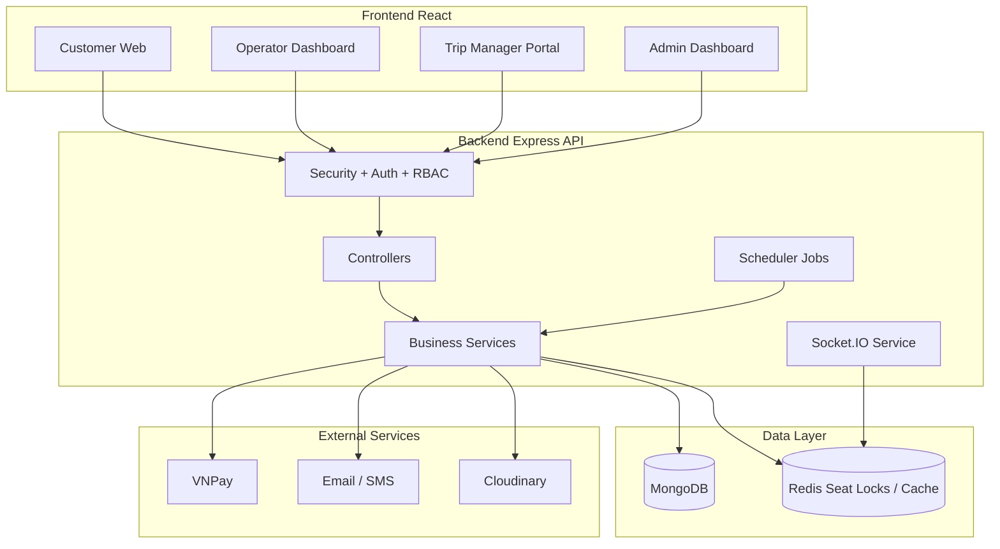

Kiến trúc này phù hợp với giai đoạn hiện tại vì các vùng giao diện có thể chia sẻ hệ thống route, service API, theme và store phía client. Khi cần triển khai độc lập theo tên miền hoặc scaling riêng từng nhóm actor, frontend có thể được tách thành nhiều build nhưng vẫn giữ chung backend API.

## 5.2. Mô hình phân tầng của hệ thống

Mô hình phân tầng tách trách nhiệm giữa giao diện, bảo vệ API, điều phối nghiệp vụ, lưu trữ dữ liệu và tích hợp ngoài. Thiết kế này giúp giảm phụ thuộc trực tiếp giữa UI và database, đồng thời giữ các luồng quan trọng như đặt vé, thanh toán và soát vé trong service chuyên trách.

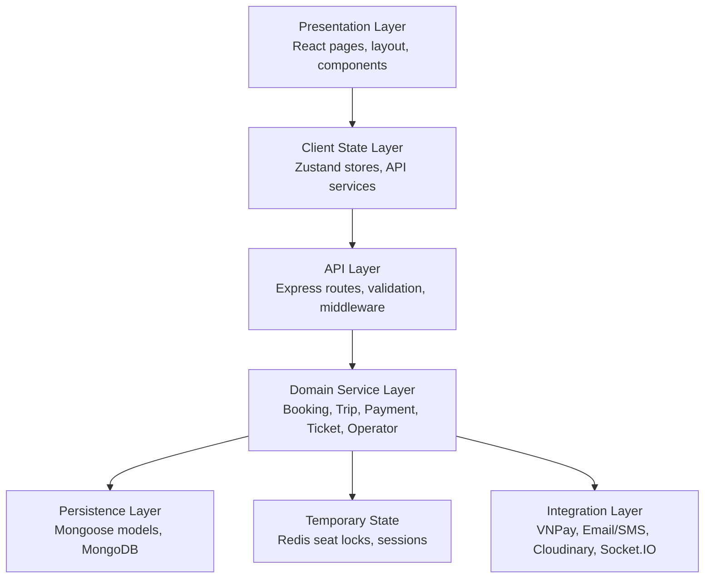

### 5.2.1. Tầng giao diện người dùng

Tầng giao diện dùng React, React Router, Zustand, Ant Design và Tailwind CSS. Tầng này hiển thị dữ liệu, thu thập input, giữ trạng thái tạm thời của luồng đặt vé, gọi API qua các service Axios và điều hướng theo vai trò.

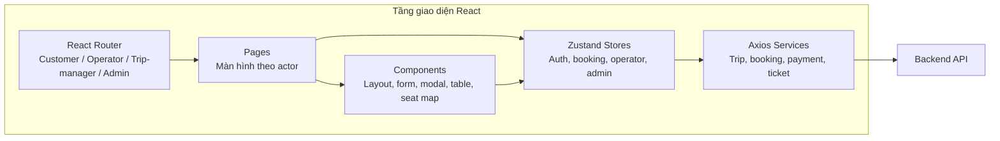

### 5.2.2. Tầng xử lý nghiệp vụ

Tầng nghiệp vụ nằm trong controllers và services của backend. Controllers đóng vai trò tiếp nhận request/response; services xử lý logic xác thực, đặt vé, giữ ghế, thanh toán, vé điện tử, tuyến, xe, chuyến, nhà xe, nhân viên, đánh giá, khiếu nại, voucher, dashboard và báo cáo.

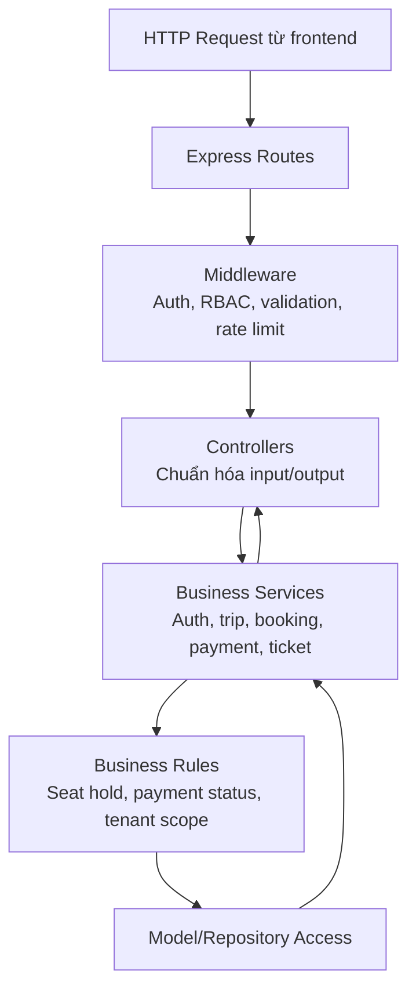

### 5.2.3. Tầng dữ liệu

Tầng dữ liệu dùng MongoDB và Mongoose. Các collection chính được tổ chức theo actor và miền nghiệp vụ, trong đó `operatorId`, `tripId`, `bookingId`, `customerId` và các trường trạng thái là khóa truy vết quan trọng. Redis được dùng cho trạng thái tạm thời như khóa ghế theo TTL.

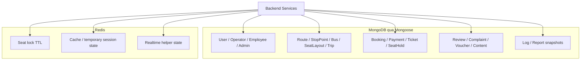

### 5.2.4. Tầng tích hợp dịch vụ ngoài

Tầng tích hợp gồm VNPay, email/SMS, Cloudinary, Socket.IO và scheduler jobs. Các thành phần này được gọi từ service thay vì từ UI trực tiếp, giúp hệ thống kiểm soát lỗi tích hợp, xử lý retry và thay đổi provider thuận lợi hơn.

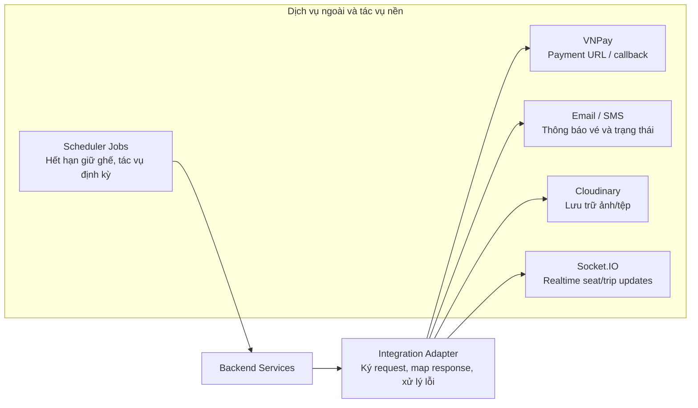

## 5.3. Thiết kế module chức năng

Thiết kế module phản ánh cấu trúc mã nguồn hiện tại. Frontend chia theo vùng trang và service API; backend chia theo route, controller, service và model. Mỗi module nghiệp vụ đều có dữ liệu sở hữu rõ ràng để hỗ trợ phân quyền theo actor.

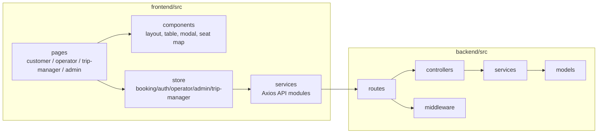

| Nhóm module  | Thành phần chính                                                                                     | Vai trò                                                        |
| ------------ | ---------------------------------------------------------------------------------------------------- | -------------------------------------------------------------- |
| Customer     | Trang tìm chuyến, chi tiết chuyến, chọn ghế, nhập hành khách, thanh toán, vé của tôi, tra cứu/hủy vé | Thực hiện luồng marketplace từ tìm chuyến đến hậu mãi.         |
| Operator     | Dashboard, tuyến, điểm dừng, xe, chuyến, nhân viên, voucher, giao dịch, báo cáo                      | Quản lý tài nguyên vận tải và vận hành bán vé của từng nhà xe. |
| Trip-manager | Dashboard, chuyến được phân công, danh sách khách, quét QR                                           | Hỗ trợ nhân viên vận hành chuyến và xác nhận hành khách.       |
| Admin        | Người dùng, nhà xe, tuyến/chuyến giám sát, giao dịch, voucher, khiếu nại, review, nội dung, báo cáo  | Quản trị và giám sát toàn nền tảng.                            |
| Backend core | Auth, booking, trip, payment, ticket, operator, employee, content, review, complaint                 | Cung cấp API và xử lý nghiệp vụ trung tâm.                     |

## 5.4. Thiết kế triển khai runtime

Trong môi trường phát triển, frontend chạy bằng Vite, backend chạy Node.js/Express, MongoDB lưu dữ liệu chính và Redis phục vụ khóa ghế hoặc trạng thái tạm. Trong môi trường triển khai, frontend có thể build thành static assets và được phục vụ qua Nginx; backend giữ vai trò API service.

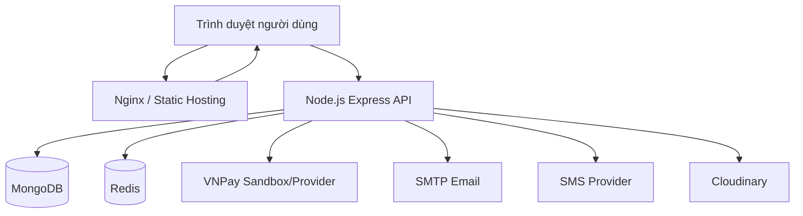

Thiết kế triển khai cần đảm bảo các biến môi trường nhạy cảm như JWT secret, MongoDB URI, Redis URL, cấu hình VNPay, Cloudinary và SMTP không được đưa vào mã nguồn. Các route thay đổi trạng thái được bảo vệ bởi CORS, security middleware, rate limit, kiểm tra origin và xác thực token.

## 5.5. Thiết kế luồng nghiệp vụ chính

Các luồng dưới đây là xương sống của hệ thống, bắt đầu từ xác thực, tìm kiếm, giữ ghế đến thanh toán, phát hành vé và hậu mãi.

### 5.5.1. Luồng đăng ký và đăng nhập

User, Operator, Employee và Admin có luồng đăng nhập riêng. Sau khi xác thực thành công, frontend lưu token theo store tương ứng và các request cần quyền sẽ gắn token vào header. Backend kiểm tra actor, trạng thái tài khoản và phạm vi quyền trước khi cho phép truy cập dữ liệu.

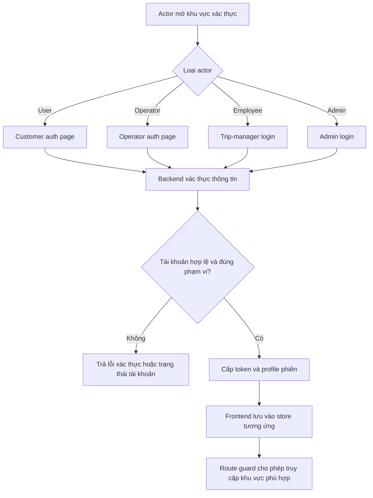

### 5.5.2. Luồng tìm kiếm chuyến xe

Customer nhập điểm đi, điểm đến, khoảng ngày và số hành khách. Frontend gọi API search trip. Backend lọc trip còn lịch, còn ghế, phù hợp ngày/giá/loại xe/operator, populate route, bus, operator rồi trả về danh sách để frontend hiển thị.

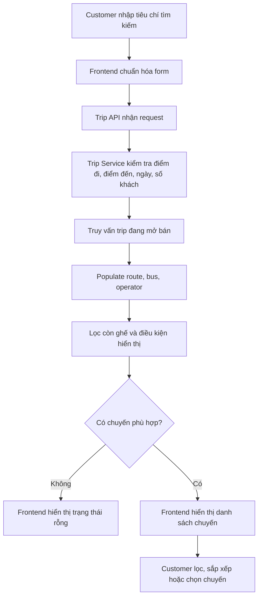

### 5.5.3. Luồng chọn ghế và giữ ghế

Frontend lấy sơ đồ ghế và trạng thái ghế của chuyến. Khi khách chọn ghế và tiếp tục, backend kiểm tra ghế đã bán trong `Trip`, sau đó khóa ghế tạm bằng Redis với thời hạn 15 phút và tạo booking ở trạng thái chờ. Nếu khách không thanh toán hoặc chủ động giải phóng giữ chỗ, khóa ghế được xóa hoặc tự hết hạn.

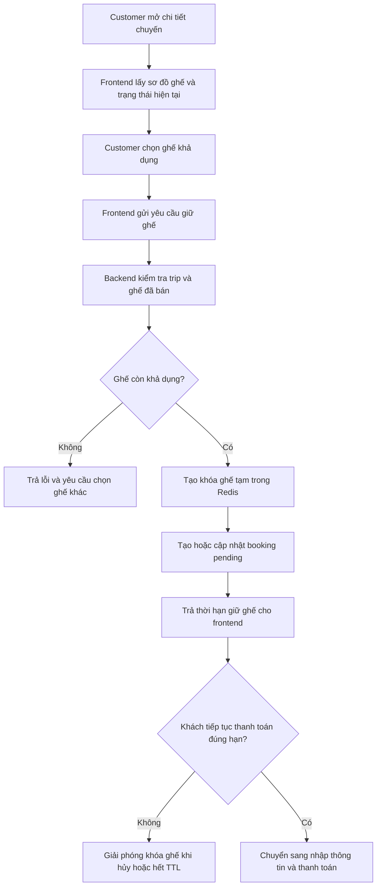

### 5.5.4. Luồng đặt vé và thanh toán

Khách nhập thông tin liên hệ, hành khách, điểm đón/trả và voucher. Backend kiểm tra booking, tính tiền, tạo payment. Với VNPay, hệ thống trả URL thanh toán; callback thành công cập nhật payment completed, booking paid/confirmed, ghế booked và phát hành ticket. Với cash, backend xác nhận booking và giữ trạng thái payment pending cho xác nhận tiền mặt.

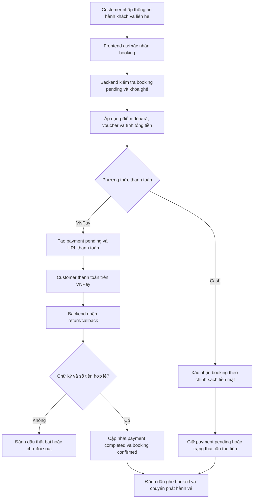

### 5.5.5. Luồng phát hành vé điện tử

Sau payment/booking hợp lệ, hệ thống tạo ticket code, QR code, snapshot thông tin chuyến/hành khách và gửi thông báo. Vé được dùng cho tra cứu, hiển thị trong "Vé của tôi" và quét QR khi lên xe.

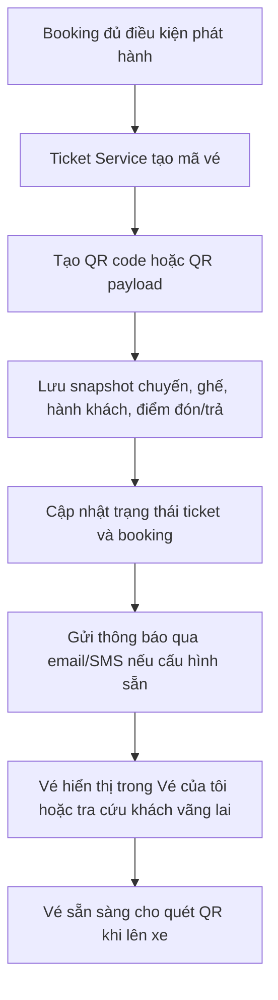

### 5.5.6. Luồng quét QR và xác nhận hành khách

Employee mở giao diện quét QR, hệ thống đọc ticket code/QR data, kiểm tra ticket còn hợp lệ, đúng chuyến, chưa dùng và chưa hết hạn. Nếu hợp lệ, ticket được đánh dấu used, lưu thời điểm và người xác thực.

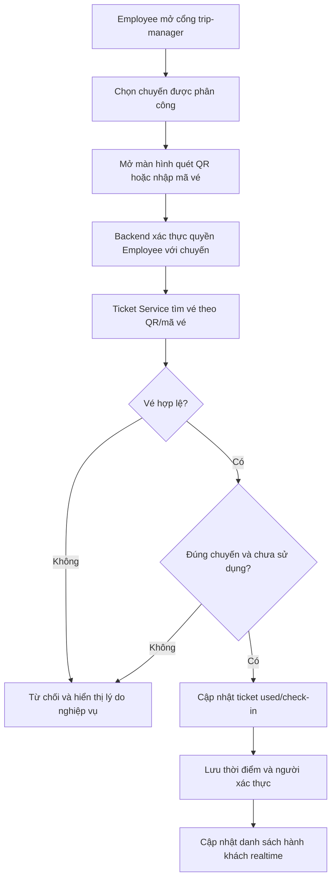

### 5.5.7. Luồng hủy vé và hoàn tiền

Customer hoặc Guest gửi yêu cầu hủy kèm booking code/thông tin xác minh. Backend kiểm tra quyền sở hữu, trạng thái booking, cập nhật booking/ticket, giải phóng ghế nếu còn phù hợp và xử lý refund nếu payment đã paid. Admin/operator có thể tham gia khi cần xử lý complaint/refund thủ công.

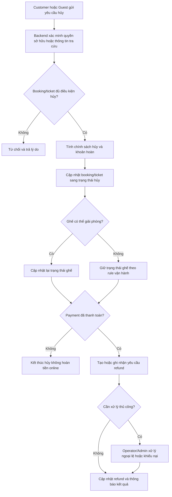

## 5.6. Sơ đồ xác thực theo khu vực sử dụng

Luồng xác thực được tách theo từng khu vực sử dụng để backend kiểm tra đúng loại tài khoản, trạng thái tài khoản và phạm vi dữ liệu sau đăng nhập. Trong hiện trạng triển khai, User và Operator có điểm vào đăng ký riêng; Employee được Operator tạo trước khi đăng nhập vào cổng trip-manager; Admin đăng nhập qua khu vực quản trị.

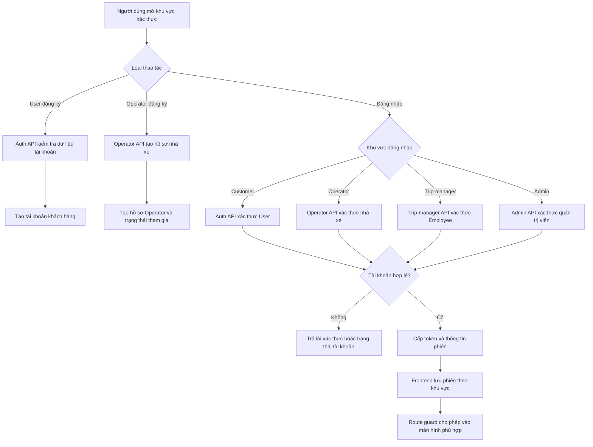

## 5.7. Sơ đồ trình tự tìm kiếm và xem chuyến

Luồng tìm kiếm bắt đầu từ tiêu chí công khai của hành khách. Backend chỉ trả về chuyến có trạng thái mở bán phù hợp, đủ ghế theo số hành khách và dữ liệu route, bus, operator cần cho việc so sánh trên giao diện.

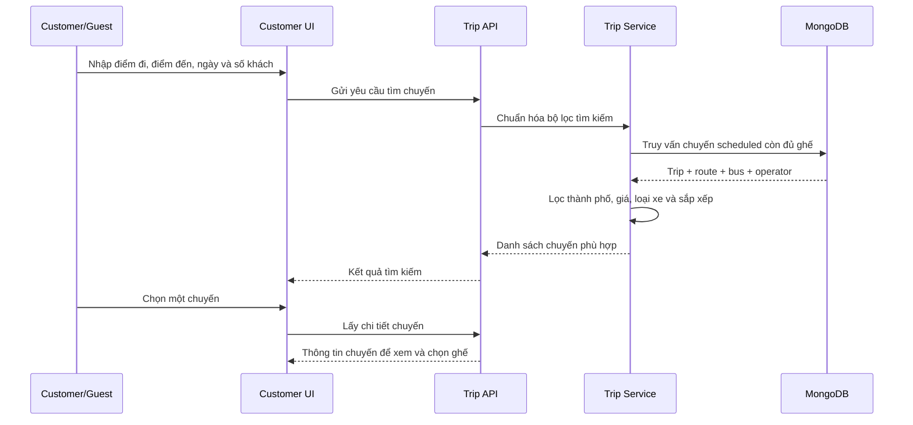

## 5.8. Sơ đồ trình tự quy trình đặt vé và thanh toán

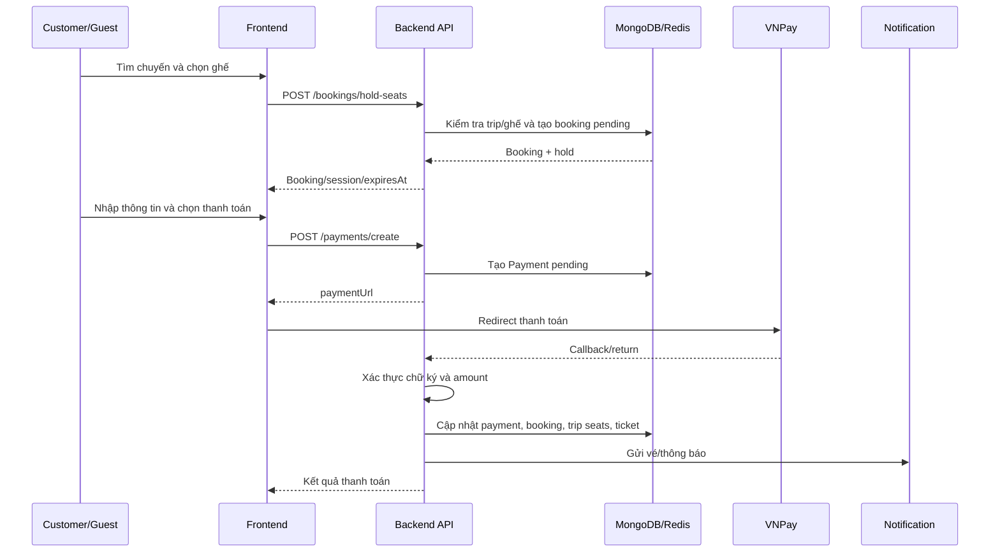

## 5.9. Sơ đồ hoạt động quy trình đặt vé

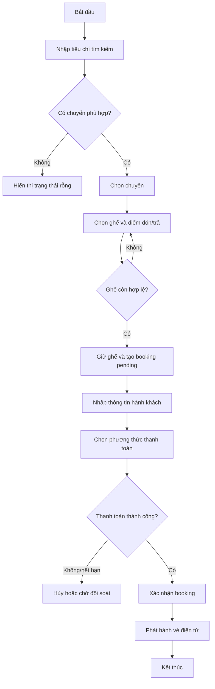

## 5.10. Sơ đồ trình tự giữ ghế realtime

Giữ ghế là điểm dễ phát sinh xung đột vì nhiều người có thể chọn cùng một ghế. Hệ thống giải quyết bằng cách kiểm tra trạng thái ghế đã bán trong MongoDB, sau đó đặt khóa tạm trong Redis cho từng ghế.

```mermaid
sequenceDiagram
    participant FE as Frontend Seat Map
    participant API as Booking API
    participant Trip as Trip Data
    participant Redis as Redis SeatLock

    FE->>API: Yêu cầu giữ ghế
    API->>Trip: Kiểm tra ghế đã bán
    Trip-->>API: Danh sách ghế đã bán
    API->>Redis: Tạo khóa ghế với TTL 15 phút
    alt Khóa thành công
        Redis-->>API: locked + expiresAt
        API-->>FE: Booking pending + thời hạn giữ
    else Ghế đã bị khóa
        Redis-->>API: failed seats
        API-->>FE: Yêu cầu chọn ghế khác
    end
```

Socket.IO service có thể cung cấp trạng thái ghế cho client theo room của chuyến, nhưng luồng giữ ghế cốt lõi vẫn dựa trên kiểm tra MongoDB và Redis lock có thời hạn.

## 5.11. Sơ đồ trình tự phát hành vé điện tử

Vé điện tử không được tạo độc lập khỏi booking. Payment service chỉ kích hoạt phát hành khi booking đã đủ điều kiện xác nhận; ticket service kiểm tra vé đã tồn tại để tránh tạo trùng khi callback hoặc thao tác gửi lại bị lặp.

```mermaid
sequenceDiagram
    participant P as Payment/Booking Flow
    participant TS as Ticket Service
    participant DB as MongoDB
    participant QR as QR Service
    participant N as Email/SMS Notification
    participant C as Customer/Guest

    P->>TS: Yêu cầu phát hành vé cho booking hợp lệ
    TS->>DB: Kiểm tra ticket đã tồn tại theo booking
    alt Vé đã tồn tại
        DB-->>TS: Ticket hiện có
    else Chưa có vé
        TS->>DB: Đọc booking đã xác nhận và thông tin chuyến
        DB-->>TS: Booking, trip, route, bus, hành khách
        TS->>QR: Tạo dữ liệu QR cho mã vé và ghế
        QR-->>TS: QR code + QR payload
        TS->>DB: Lưu ticket và snapshot chuyến
    end
    TS->>N: Gửi vé qua kênh thông báo
    N-->>C: Vé điện tử và thông tin hành trình
    TS-->>P: Kết quả phát hành/gửi vé
```

## 5.12. Sơ đồ trình tự tra cứu vé của khách vãng lai

Khách vãng lai không dựa vào một phiên tài khoản dài hạn. Sơ đồ dưới đây mô tả luồng tra cứu có xác minh OTP theo số điện thoại hoặc email trước khi trả danh sách vé gắn với các booking có thông tin liên hệ khớp.

```mermaid
sequenceDiagram
    participant G as Guest
    participant FE as Ticket Lookup UI
    participant API as Ticket API
    participant Redis as Redis OTP
    participant M as Email/SMS
    participant DB as MongoDB

    G->>FE: Nhập số điện thoại hoặc email
    FE->>API: Yêu cầu OTP tra cứu vé
    API->>DB: Kiểm tra có booking theo liên hệ
    DB-->>API: Booking liên quan
    API->>Redis: Lưu OTP có thời hạn
    API->>M: Gửi OTP
    M-->>G: Mã xác minh
    G->>FE: Nhập OTP
    FE->>API: Gửi liên hệ và OTP
    API->>Redis: Kiểm tra OTP
    alt OTP hợp lệ
        API->>DB: Lấy ticket theo booking đã xác minh
        DB-->>API: Danh sách vé và QR
        API-->>FE: Trả kết quả tra cứu
    else OTP sai hoặc hết hạn
        API-->>FE: Từ chối tra cứu
    end
```

## 5.13. Sơ đồ trình tự soát vé QR

Luồng soát vé thuộc cổng trip-manager. Employee chỉ được xem chuyến được phân công, xem đầy đủ thông tin khách của chuyến đó và xác nhận vé nếu mã vé hợp lệ.

```mermaid
sequenceDiagram
    participant E as Employee
    participant FE as Trip Manager UI
    participant API as Trip Manager API
    participant Ticket as Ticket Service
    participant DB as MongoDB

    E->>FE: Quét QR hoặc nhập mã vé
    FE->>API: Gửi dữ liệu vé theo chuyến
    API->>API: Kiểm tra quyền Employee với chuyến
    API->>Ticket: Xác thực mã vé
    Ticket->>DB: Đọc Ticket, Booking, Trip
    DB-->>Ticket: Trạng thái vé và thông tin khách
    alt Vé hợp lệ
        Ticket->>DB: Đánh dấu vé đã sử dụng
        API-->>FE: Kết quả hợp lệ + thông tin khách
    else Vé không hợp lệ
        API-->>FE: Lý do từ chối
    end
```

## 5.14. Sơ đồ hoạt động hủy vé và hoàn tiền

Luồng hủy vé phải xử lý đồng thời trạng thái ticket, booking, ghế đã giữ hoặc đã bán, voucher và payment. Với Guest, bước xác minh thông tin booking được thực hiện trước khi đi vào nhánh hủy; với User, hệ thống dùng phiên đăng nhập và dữ liệu sở hữu tương ứng.

```mermaid
flowchart TD
    A[User hoặc Guest chọn hủy vé] --> B{Đã xác minh quyền thao tác?}
    B -- Không --> C[Từ chối yêu cầu hủy]
    B -- Có --> D[Đọc ticket và booking liên quan]
    D --> E{Vé và thời điểm hủy còn hợp lệ?}
    E -- Không --> F[Trả lý do không đủ điều kiện]
    E -- Có --> G[Tính chính sách và số tiền hoàn dự kiến]
    G --> H[Đánh dấu ticket cancelled]
    H --> I[Hủy booking]
    I --> J[Giải phóng ghế và hoàn usage voucher nếu có]
    J --> K{Booking đã thanh toán?}
    K -- Không --> L[Ghi nhận kết quả hủy]
    K -- Có --> M[Khởi tạo xử lý refund theo payment]
    M --> L
    L --> N[Gửi thông báo hủy và kết quả hoàn tiền]
```

## 5.15. Sơ đồ hoạt động tạo chuyến của nhà xe

Chuyến xe là tài nguyên được mở bán từ dữ liệu vận hành của từng Operator. Khi tạo chuyến, backend kiểm tra route, bus, tài xế và trip-manager đều thuộc cùng nhà xe, đang đủ điều kiện sử dụng và không bị xung đột lịch trước khi ghi chuyến mới.

```mermaid
flowchart TD
    A[Operator nhập dữ liệu chuyến] --> B[Kiểm tra route thuộc nhà xe và đang hoạt động]
    B --> C{Route hợp lệ?}
    C -- Không --> X[Từ chối tạo chuyến]
    C -- Có --> D[Kiểm tra bus và sơ đồ ghế]
    D --> E{Bus hoạt động?}
    E -- Không --> X
    E -- Có --> F[Kiểm tra tài xế và trip-manager]
    F --> G{Nhân sự hợp lệ?}
    G -- Không --> X
    G -- Có --> H[Kiểm tra thời gian đi/đến và trùng lịch tài nguyên]
    H --> I{Lịch hợp lệ?}
    I -- Không --> X
    I -- Có --> J[Tính giá và số ghế khả dụng ban đầu]
    J --> K[Lưu trip scheduled]
    K --> L[Chuyến có thể xuất hiện trong luồng tìm kiếm]
```

## 5.16. Sơ đồ hoạt động kiểm duyệt nhà xe của Admin

Admin xử lý trạng thái tham gia nền tảng của Operator qua các thao tác duyệt, từ chối, tạm ngưng và khôi phục. Luồng này tách khỏi dữ liệu vận hành nội bộ của từng nhà xe nhưng ảnh hưởng trực tiếp đến quyền tham gia marketplace.

```mermaid
flowchart TD
    A[Admin mở danh sách nhà xe] --> B[Chọn hồ sơ Operator]
    B --> C[Kiểm tra trạng thái xác minh và trạng thái tạm ngưng]
    C --> D{Quyết định quản trị}
    D -- Duyệt --> E[Cập nhật trạng thái approved]
    D -- Từ chối --> F[Nhập lý do từ chối]
    F --> G[Cập nhật trạng thái rejected]
    D -- Tạm ngưng --> H[Nhập lý do tạm ngưng]
    H --> I[Đánh dấu Operator suspended]
    D -- Khôi phục --> J[Bỏ trạng thái suspended]
    E --> K[Trả kết quả cho giao diện Admin]
    G --> K
    I --> K
    J --> K
```

## 5.17. Sơ đồ trạng thái dữ liệu trọng yếu

Các trạng thái chính được tách theo từng thực thể để tránh dùng một trạng thái cho nhiều nghiệp vụ khác nhau.

```mermaid
stateDiagram-v2
    [*] --> BookingPending
    BookingPending --> BookingConfirmed: thanh toán hợp lệ / cash được giữ chỗ
    BookingPending --> BookingCancelled: hết hạn hoặc hủy
    BookingConfirmed --> BookingCompleted: chuyến hoàn tất
    BookingConfirmed --> BookingCancelled: hủy vé/chuyến
    BookingCancelled --> BookingRefunded: hoàn tiền

    [*] --> PaymentPending
    PaymentPending --> PaymentProcessing
    PaymentProcessing --> PaymentCompleted
    PaymentProcessing --> PaymentFailed
    PaymentCompleted --> PaymentRefunded
    PaymentCompleted --> PaymentPartialRefund

    [*] --> TicketValid
    TicketValid --> TicketUsed: check-in
    TicketValid --> TicketCancelled: hủy vé/chuyến
    TicketValid --> TicketExpired: quá hiệu lực
```

## 5.18. Thiết kế API/Route chính

| Nhóm API           | Route chính                                                                          | Mục đích                                                                                                                |
| ------------------ | ------------------------------------------------------------------------------------ | ----------------------------------------------------------------------------------------------------------------------- |
| Auth/User          | `/api/v1/auth/*`, `/api/v1/users/*`, `/api/v1/guest/*`                               | Xác thực khách hàng, quản lý hồ sơ, OTP khách vãng lai, loyalty và vé của tôi.                                          |
| Public marketplace | `/api/v1/trips/*`, `/api/v1/routes/search`, `/api/v1/content/*`, `/api/v1/reviews/*` | Tìm chuyến, xem chi tiết chuyến, đọc nội dung công khai và đánh giá.                                                    |
| Booking            | `/api/v1/bookings/*`                                                                 | Giữ ghế, gia hạn/giải phóng giữ ghế, xác nhận booking, tra cứu booking và hủy booking guest.                            |
| Payment            | `/api/v1/payments/*`                                                                 | Tạo payment, nhận kết quả VNPay, tra cứu trạng thái giao dịch và xử lý payment hết hạn.                                 |
| Ticket             | `/api/v1/tickets/*`                                                                  | Phát hành vé, tra cứu vé, gửi lại vé, tải vé, hủy/đổi vé và xác thực vé theo chuyến.                                    |
| Operator           | `/api/v1/operators/*`                                                                | Đăng ký/đăng nhập nhà xe, quản lý hồ sơ, tuyến, điểm dừng, xe, nhân viên, chuyến, booking, payment, voucher và báo cáo. |
| Trip-manager       | `/api/v1/trip-manager/*`                                                             | Đăng nhập nhân viên, xem chuyến được phân công, danh sách khách, xác thực vé và cập nhật hành trình.                    |
| Admin              | `/api/v1/admin/*`                                                                    | Quản lý người dùng, nhà xe, tuyến/chuyến giám sát, payment, voucher, complaint, review, content và báo cáo.             |
| Support            | `/api/v1/complaints/*`, `/api/v1/vouchers/*`                                         | Khiếu nại người dùng, ghi chú xử lý, đánh giá mức hài lòng và voucher public/wallet.                                    |

# CHƯƠNG 6. THIẾT KẾ CƠ SỞ DỮ LIỆU

Chương này mô tả cách dữ liệu được tổ chức ở mức MongoDB/Mongoose, quan hệ giữa các collection và các ràng buộc toàn vẹn quan trọng.

## 6.1. Tổng quan cơ sở dữ liệu

Hệ thống sử dụng MongoDB làm cơ sở dữ liệu chính, thao tác qua Mongoose model. Cấu trúc dữ liệu ưu tiên document có reference giữa các thực thể quan trọng như User, BusOperator, Route, Bus, Employee, Trip, Booking, Ticket và Payment. Các collection vận hành phải có khả năng truy vết theo `operatorId`, `tripId`, `bookingId`, `customerId` và trạng thái.

## 6.2. Mô hình dữ liệu mức cao

Mô hình dữ liệu mức cao được dùng để nối yêu cầu nghiệp vụ với các collection hiện có trong code backend.

### 6.2.1. Nguyên tắc thiết kế dữ liệu

Dữ liệu phải bảo đảm bốn nguyên tắc: tenant boundary theo Operator, nhất quán giao dịch ghế/booking/payment, snapshot dữ liệu quan trọng tại thời điểm mua và bảo vệ dữ liệu cá nhân theo quyền truy cập tối thiểu.

### 6.2.2. Các nhóm thực thể dữ liệu chính

| Nhóm              | Collection/code hiện có               |
| ----------------- | ------------------------------------- |
| Identity          | `User`, `BusOperator`, `Employee`     |
| Transport         | `Route`, `StopPoint`, `Bus`, `Trip`   |
| Booking/Ticket    | `Booking`, `Ticket`                   |
| Payment/Promotion | `Payment`, `Voucher`, `VoucherWallet` |
| Trust/Support     | `Review`, `Complaint`                 |
| Content           | `Banner`, `Blog`, `FAQ`               |

### 6.2.3. Quan hệ dữ liệu chính

Một Operator có nhiều Route, StopPoint, Bus, Employee, Trip, Booking, Ticket, Payment, Voucher và Review. Một Trip tham chiếu Route, Bus, Operator, driver và trip manager. Một Booking tham chiếu Trip, Customer nếu có, Operator, ghế và thông tin liên hệ. Một Payment tham chiếu Booking, Customer và Operator. Một Ticket tham chiếu Booking, Trip, Operator và Customer nếu có.

### 6.2.4. Dữ liệu snapshot quan trọng

Booking và Ticket cần snapshot thông tin chuyến, tuyến, điểm đón/trả, hành khách, giá vé và chính sách liên quan để tránh thay đổi dữ liệu gốc làm sai giao dịch đã hoàn tất. Ticket hiện đã lưu snapshot `tripInfo`, passenger list và total price. Khi triển khai tài chính đầy đủ, hệ thống cần bổ sung snapshot refund policy, commission/policy và escrow/payout.

## 6.3. Mô hình quan hệ dữ liệu khái niệm

```mermaid
erDiagram
    BusOperator ||--o{ Route : owns
    BusOperator ||--o{ Bus : owns
    BusOperator ||--o{ Employee : manages
    BusOperator ||--o{ Trip : publishes
    Route ||--o{ Trip : schedules
    Bus ||--o{ Trip : serves
    Trip ||--o{ Booking : receives
    Booking ||--o| Payment : paid_by
    Booking ||--o| Ticket : issues
    User ||--o{ Booking : creates
    User ||--o{ Review : writes
    User ||--o{ Complaint : submits
    Trip ||--o{ Ticket : contains
```

## 6.4. Mô tả các collection chính

Các collection dưới đây là phần hiện thực chính đang có trong thư mục `backend/src/models`. Bảng mô tả dùng thống nhất ba cột: thuộc tính, kiểu dữ liệu và mô tả. Các collection đều sử dụng timestamp `createdAt`, `updatedAt` khi model bật `timestamps`.

### 6.4.1. Collection User

| Thuộc tính                                            | Kiểu dữ liệu                       | Mô tả                                                             |
| ----------------------------------------------------- | ---------------------------------- | ----------------------------------------------------------------- |
| `email`                                               | String, unique                     | Email đăng nhập và nhận thông báo của người dùng.                 |
| `phone`                                               | String, unique                     | Số điện thoại dùng cho liên hệ và xác minh.                       |
| `password`                                            | String, select false               | Mật khẩu đã băm; không trả về trong truy vấn mặc định.            |
| `fullName`                                            | String                             | Họ tên người dùng.                                                |
| `dateOfBirth`, `gender`, `avatar`                     | Date, String enum, String          | Thông tin hồ sơ cá nhân.                                          |
| `role`                                                | String enum(`customer`, `admin`)   | Phân loại tài khoản khách hàng hoặc quản trị viên nội bộ.         |
| `googleId`, `facebookId`                              | String, unique sparse              | Định danh OAuth nếu người dùng đăng nhập mạng xã hội.             |
| `isEmailVerified`, `isPhoneVerified`                  | Boolean                            | Trạng thái xác minh email và số điện thoại.                       |
| `savedPassengers[]`                                   | Array<Object>                      | Danh sách hành khách thường đi gồm họ tên, điện thoại và giấy tờ. |
| `loyaltyTier`, `totalPoints`, `pointsHistory[]`       | String enum, Number, Array<Object> | Hạng thành viên, điểm tích lũy và lịch sử cộng/trừ/hết hạn điểm.  |
| `isActive`, `isBlocked`, `blockedReason`, `blockedAt` | Boolean, Boolean, String, Date     | Trạng thái hoạt động và thông tin khóa tài khoản.                 |

### 6.4.2. Collection BusOperator

| Thuộc tính                                                    | Kiểu dữ liệu                                   | Mô tả                                                            |
| ------------------------------------------------------------- | ---------------------------------------------- | ---------------------------------------------------------------- |
| `companyName`                                                 | String, unique                                 | Tên pháp lý hoặc tên công ty của nhà xe.                         |
| `operatorName`                                                | String                                         | Tên hiển thị hoặc tên đại diện nhà xe.                           |
| `email`, `phone`, `password`                                  | String, String, String                         | Thông tin đăng nhập và liên hệ của Operator.                     |
| `businessLicense`, `taxCode`                                  | String                                         | Thông tin hồ sơ pháp lý phục vụ duyệt nhà xe.                    |
| `logo`, `description`, `website`                              | String                                         | Thông tin hiển thị công khai của nhà xe.                         |
| `address`                                                     | Object                                         | Địa chỉ gồm đường, phường/xã, quận/huyện, thành phố và quốc gia. |
| `bankInfo`                                                    | Object                                         | Thông tin ngân hàng phục vụ đối soát hoặc payout về sau.         |
| `verificationStatus`                                          | String enum(`pending`, `approved`, `rejected`) | Trạng thái duyệt hồ sơ nhà xe.                                   |
| `verifiedAt`, `verifiedBy`, `rejectionReason`                 | Date, ObjectId(User), String                   | Dữ liệu xử lý duyệt/từ chối bởi Admin.                           |
| `averageRating`, `totalReviews`, `totalTrips`, `totalRevenue` | Number                                         | Thống kê vận hành và chất lượng dịch vụ.                         |
| `commissionRate`                                              | Number                                         | Tỷ lệ hoa hồng cấu hình cho nhà xe.                              |
| `isActive`, `isSuspended`, `suspensionReason`, `suspendedAt`  | Boolean, Boolean, String, Date                 | Trạng thái hoạt động hoặc tạm ngưng nhà xe.                      |

### 6.4.3. Collection Route

| Thuộc tính                          | Kiểu dữ liệu          | Mô tả                                                                         |
| ----------------------------------- | --------------------- | ----------------------------------------------------------------------------- |
| `operatorId`                        | ObjectId(BusOperator) | Nhà xe sở hữu tuyến.                                                          |
| `routeName`                         | String                | Tên tuyến đường.                                                              |
| `routeCode`                         | String, unique        | Mã tuyến dùng để định danh tuyến.                                             |
| `origin`, `destination`             | Object                | Điểm đi và điểm đến gồm thành phố, tỉnh, bến, địa chỉ, tọa độ.                |
| `pickupPoints[]`, `dropoffPoints[]` | Array<Object>         | Danh sách điểm đón và điểm trả có thể tham chiếu StopPoint.                   |
| `stops[]`                           | Array<Object>         | Các điểm dừng dọc tuyến, gồm thứ tự, thời gian đến dự kiến và thời gian dừng. |
| `distance`                          | Number                | Khoảng cách tuyến tính bằng km.                                               |
| `estimatedDuration`                 | Number                | Thời gian di chuyển dự kiến tính bằng phút.                                   |
| `basePrice`                         | Number                | Giá vé mặc định của tuyến, dùng khi tạo chuyến nếu phù hợp.                   |
| `isActive`                          | Boolean               | Trạng thái khai thác tuyến.                                                   |

### 6.4.4. Collection StopPoint

| Thuộc tính                    | Kiểu dữ liệu                      | Mô tả                                                         |
| ----------------------------- | --------------------------------- | ------------------------------------------------------------- |
| `operatorId`                  | ObjectId(BusOperator)             | Nhà xe sở hữu điểm dừng.                                      |
| `stopCode`                    | String                            | Mã điểm dừng trong phạm vi nhà xe.                            |
| `name`                        | String                            | Tên điểm dừng/điểm đón/điểm trả.                              |
| `type`                        | String enum                       | Loại điểm: bến xe, trạm nghỉ, văn phòng, ven đường hoặc khác. |
| `address`, `city`, `province` | String                            | Địa chỉ hành chính của điểm dừng.                             |
| `coordinates`                 | Object                            | Tọa độ gồm `lat` và `lng`.                                    |
| `status`                      | String enum(`active`, `inactive`) | Trạng thái sử dụng điểm dừng.                                 |
| `notes`                       | String                            | Ghi chú vận hành.                                             |

### 6.4.5. Collection Bus

| Thuộc tính                              | Kiểu dữ liệu                                                   | Mô tả                                              |
| --------------------------------------- | -------------------------------------------------------------- | -------------------------------------------------- |
| `operatorId`                            | ObjectId(BusOperator)                                          | Nhà xe sở hữu phương tiện.                         |
| `busNumber`                             | String, unique                                                 | Biển số hoặc mã xe.                                |
| `busType`                               | String enum(`limousine`, `sleeper`, `seater`, `double_decker`) | Loại xe phục vụ hiển thị và kiểm tra layout.       |
| `seatLayout.floors`                     | Number enum(1, 2)                                              | Số tầng của sơ đồ ghế.                             |
| `seatLayout.rows`, `seatLayout.columns` | Number                                                         | Số hàng và cột của sơ đồ ghế.                      |
| `seatLayout.layout`                     | Array                                                          | Ma trận ghế theo layout cấu hình.                  |
| `seatLayout.totalSeats`                 | Number                                                         | Tổng số ghế thực tế dùng để mở bán.                |
| `amenities[]`                           | Array<String>                                                  | Tiện ích xe như wifi, điều hòa, toilet, nước, sạc. |
| `status`                                | String enum(`active`, `maintenance`, `retired`)                | Trạng thái khai thác xe.                           |

### 6.4.6. Collection Employee

| Thuộc tính                                       | Kiểu dữ liệu                                                 | Mô tả                                                    |
| ------------------------------------------------ | ------------------------------------------------------------ | -------------------------------------------------------- |
| `operatorId`                                     | ObjectId(BusOperator)                                        | Nhà xe quản lý nhân viên.                                |
| `employeeCode`                                   | String                                                       | Mã nhân viên, unique theo từng Operator.                 |
| `fullName`, `phone`, `email`, `idCard`           | String                                                       | Thông tin nhận diện và liên hệ nhân viên.                |
| `address`, `dateOfBirth`                         | String, Date                                                 | Thông tin hồ sơ nhân sự.                                 |
| `password`                                       | String                                                       | Mật khẩu đã băm của tài khoản nhân viên.                 |
| `role`                                           | String enum(`driver`, `trip_manager`)                        | Vai trò hiện tại của nhân viên trong hệ thống.           |
| `licenseNumber`, `licenseClass`, `licenseExpiry` | String, String enum, Date                                    | Thông tin giấy phép lái xe, bắt buộc với vai trò tài xế. |
| `status`                                         | String enum(`active`, `on_leave`, `suspended`, `terminated`) | Trạng thái làm việc.                                     |
| `hireDate`, `terminationDate`                    | Date                                                         | Ngày vào làm và ngày kết thúc nếu có.                    |

### 6.4.7. Collection Trip

| Thuộc tính                                   | Kiểu dữ liệu                                                  | Mô tả                                                                                      |
| -------------------------------------------- | ------------------------------------------------------------- | ------------------------------------------------------------------------------------------ |
| `routeId`, `busId`, `operatorId`             | ObjectId                                                      | Tuyến, xe và nhà xe của chuyến.                                                            |
| `driverId`, `tripManagerId`                  | ObjectId(Employee)                                            | Nhân viên được phân công làm tài xế và quản lý chuyến.                                     |
| `departureTime`, `arrivalTime`               | Date                                                          | Thời gian khởi hành và đến dự kiến.                                                        |
| `basePrice`, `discount`, `finalPrice`        | Number                                                        | Giá gốc, giảm giá và giá cuối cùng của chuyến.                                             |
| `dynamicPricing`                             | Object                                                        | Cấu hình giá động theo nhu cầu, đặt sớm, giờ cao điểm và cuối tuần.                        |
| `totalSeats`, `availableSeats`               | Number                                                        | Tổng ghế và số ghế còn có thể bán.                                                         |
| `bookedSeats[]`                              | Array<Object>                                                 | Danh sách ghế đã bán, liên kết booking và tên hành khách.                                  |
| `status`                                     | String enum(`scheduled`, `ongoing`, `completed`, `cancelled`) | Trạng thái vòng đời chuyến.                                                                |
| `cancelledAt`, `cancelReason`, `cancelledBy` | Date, String, ObjectId(BusOperator)                           | Thông tin hủy chuyến.                                                                      |
| `isRecurring`, `recurringGroupId`            | Boolean, String                                               | Dữ liệu hỗ trợ chuyến lặp.                                                                 |
| `journey`                                    | Object                                                        | Trạng thái hành trình thực tế, điểm dừng hiện tại, lịch sử trạng thái và giờ chạy thực tế. |

### 6.4.8. Collection Booking

| Thuộc tính                                                                 | Kiểu dữ liệu                                                              | Mô tả                                                       |
| -------------------------------------------------------------------------- | ------------------------------------------------------------------------- | ----------------------------------------------------------- |
| `bookingCode`                                                              | String, unique                                                            | Mã đặt vé dùng để tra cứu.                                  |
| `tripId`, `customerId`, `operatorId`                                       | ObjectId                                                                  | Chuyến, khách hàng nếu có tài khoản và nhà xe liên quan.    |
| `status`                                                                   | String enum(`pending`, `confirmed`, `cancelled`, `completed`, `refunded`) | Trạng thái nghiệp vụ của booking.                           |
| `seats[]`                                                                  | Array<Object>                                                             | Ghế đã chọn, giá ghế và thông tin hành khách theo từng ghế. |
| `contactInfo`                                                              | Object                                                                    | Người liên hệ nhận vé gồm tên, điện thoại và email.         |
| `pickupPoint`, `dropoffPoint`                                              | Object                                                                    | Điểm đón và điểm trả đã chọn.                               |
| `totalPrice`, `discount`, `voucherDiscount`, `finalPrice`                  | Number                                                                    | Số tiền gốc, giảm giá và số tiền cuối cùng.                 |
| `voucherCode`, `voucherId`                                                 | String, ObjectId(Voucher)                                                 | Voucher áp dụng nếu có.                                     |
| `paymentMethod`, `paymentStatus`, `paymentId`, `paidAt`                    | String enum, String enum, ObjectId, Date                                  | Thông tin thanh toán của booking.                           |
| `cancelledAt`, `cancelReason`, `cancelledBy`, `refundAmount`, `refundedAt` | Date, String, String enum, Number, Date                                   | Dữ liệu hủy vé và hoàn tiền.                                |
| `isGuestBooking`                                                           | Boolean                                                                   | Đánh dấu booking của khách vãng lai.                        |
| `isHeld`, `heldUntil`                                                      | Boolean, Date                                                             | Trạng thái giữ ghế tạm thời và thời hạn giữ.                |

### 6.4.9. Collection Ticket

| Thuộc tính                                         | Kiểu dữ liệu                                         | Mô tả                                                                 |
| -------------------------------------------------- | ---------------------------------------------------- | --------------------------------------------------------------------- |
| `ticketCode`                                       | String, unique                                       | Mã vé điện tử.                                                        |
| `bookingId`                                        | ObjectId(Booking), unique                            | Booking phát hành vé.                                                 |
| `customerId`, `tripId`, `operatorId`               | ObjectId                                             | Khách hàng nếu có, chuyến và nhà xe liên quan.                        |
| `qrCode`, `qrCodeData`                             | String, Object                                       | Mã QR và dữ liệu dùng để xác thực vé.                                 |
| `pdfUrl`, `pdfFileName`                            | String                                               | Thông tin file PDF vé nếu đã tạo.                                     |
| `passengers[]`                                     | Array<Object>                                        | Danh sách hành khách trên vé, gồm ghế và thông tin cá nhân cần thiết. |
| `tripInfo`                                         | Object                                               | Snapshot thông tin chuyến, điểm đi/đến, điểm đón/trả và giờ chạy.     |
| `totalPrice`                                       | Number                                               | Tổng tiền của vé/booking.                                             |
| `isUsed`, `usedAt`, `verifiedBy`                   | Boolean, Date, ObjectId(Employee)                    | Trạng thái đã sử dụng và người xác thực vé.                           |
| `status`                                           | String enum(`valid`, `cancelled`, `expired`, `used`) | Trạng thái sử dụng vé.                                                |
| `emailSent`, `emailSentAt`, `smsSent`, `smsSentAt` | Boolean, Date, Boolean, Date                         | Trạng thái gửi thông báo vé.                                          |
| `generatedAt`, `cancelledAt`, `cancelReason`       | Date, Date, String                                   | Metadata phát hành và hủy vé.                                         |

### 6.4.10. Collection Payment

| Thuộc tính                                                           | Kiểu dữ liệu                                  | Mô tả                                                                                            |
| -------------------------------------------------------------------- | --------------------------------------------- | ------------------------------------------------------------------------------------------------ |
| `paymentCode`                                                        | String, unique                                | Mã giao dịch thanh toán nội bộ.                                                                  |
| `bookingId`, `customerId`, `operatorId`                              | ObjectId                                      | Booking, khách hàng nếu có và nhà xe liên quan.                                                  |
| `paymentMethod`                                                      | String enum                                   | Phương thức thanh toán: VNPay, thẻ, ví hoặc tiền mặt.                                            |
| `paymentGateway`                                                     | String enum(`vnpay`, `momo`, `zalopay`, null) | Cổng thanh toán nếu phương thức cần provider ngoài.                                              |
| `amount`, `currency`                                                 | Number, String                                | Số tiền và loại tiền.                                                                            |
| `status`                                                             | String enum                                   | Trạng thái payment: pending, processing, completed, failed, cancelled, refunded, partial_refund. |
| `transactionId`, `gatewayResponse`                                   | String, Mixed                                 | Mã giao dịch provider và dữ liệu phản hồi từ cổng thanh toán.                                    |
| `paymentUrl`, `qrCode`                                               | String                                        | URL/QR thanh toán nếu provider trả về.                                                           |
| `initiatedAt`, `processedAt`, `completedAt`, `failedAt`, `expiresAt` | Date                                          | Các mốc thời gian xử lý giao dịch.                                                               |
| `failureReason`, `failureCode`                                       | String                                        | Lý do và mã lỗi khi thanh toán thất bại.                                                         |
| `refundAmount`, `refundedAt`, `refundReason`, `refundTransactionId`  | Number, Date, String, String                  | Dữ liệu hoàn tiền.                                                                               |
| `ipAddress`, `userAgent`, `callbackReceived`, `callbackReceivedAt`   | String, String, Boolean, Date                 | Thông tin truy vết request và callback.                                                          |
| `metadata`, `notes`                                                  | Mixed, String                                 | Dữ liệu mở rộng và ghi chú vận hành.                                                             |

### 6.4.11. Collection Voucher

| Thuộc tính                                                                | Kiểu dữ liệu                                  | Mô tả                                                        |
| ------------------------------------------------------------------------- | --------------------------------------------- | ------------------------------------------------------------ |
| `code`                                                                    | String, unique                                | Mã voucher người dùng nhập hoặc lưu.                         |
| `name`, `description`                                                     | String                                        | Tên và mô tả chương trình khuyến mãi.                        |
| `operatorId`                                                              | ObjectId(BusOperator)                         | Nhà xe sở hữu voucher nếu là voucher cấp Operator.           |
| `discountType`                                                            | String enum(`percentage`, `fixed`)            | Loại giảm giá theo phần trăm hoặc số tiền cố định.           |
| `discountValue`, `maxDiscountAmount`, `minBookingAmount`                  | Number                                        | Giá trị giảm, trần giảm và điều kiện đơn tối thiểu.          |
| `maxUsageTotal`, `maxUsagePerCustomer`, `currentUsageCount`               | Number                                        | Giới hạn sử dụng toàn hệ thống và theo từng khách.           |
| `validFrom`, `validUntil`                                                 | Date                                          | Thời gian hiệu lực.                                          |
| `isActive`                                                                | Boolean                                       | Trạng thái bật/tắt voucher.                                  |
| `applicableRoutes[]`, `applicableCustomers[]`, `applicableLoyaltyTiers[]` | Array                                         | Phạm vi áp dụng theo tuyến, khách hàng hoặc hạng thành viên. |
| `createdBy`, `createdByModel`                                             | ObjectId, String enum(`Admin`, `BusOperator`) | Chủ thể tạo voucher.                                         |

### 6.4.12. Collection VoucherWallet

| Thuộc tính                       | Kiểu dữ liệu                                       | Mô tả                                            |
| -------------------------------- | -------------------------------------------------- | ------------------------------------------------ |
| `customerId`                     | ObjectId(User)                                     | Khách hàng sở hữu voucher đã lưu.                |
| `voucherId`                      | ObjectId(Voucher)                                  | Voucher được lưu vào ví.                         |
| `status`                         | String enum(`saved`, `used`, `expired`, `removed`) | Trạng thái voucher trong ví khách hàng.          |
| `savedAt`, `usedAt`, `removedAt` | Date                                               | Các mốc thời gian lưu, sử dụng hoặc xóa voucher. |

### 6.4.13. Collection Review

| Thuộc tính                                                            | Kiểu dữ liệu              | Mô tả                                                         |
| --------------------------------------------------------------------- | ------------------------- | ------------------------------------------------------------- |
| `userId`                                                              | ObjectId(User)            | Người dùng tạo đánh giá.                                      |
| `bookingId`                                                           | ObjectId(Booking), unique | Booking được đánh giá, giới hạn một đánh giá cho mỗi booking. |
| `tripId`, `operatorId`                                                | ObjectId                  | Chuyến và nhà xe được đánh giá.                               |
| `overallRating`                                                       | Number                    | Điểm tổng thể từ 1 đến 5.                                     |
| `vehicleRating`, `driverRating`, `punctualityRating`, `serviceRating` | Number                    | Điểm thành phần về xe, tài xế, đúng giờ và dịch vụ.           |
| `comment`                                                             | String                    | Nội dung nhận xét của khách hàng.                             |
| `images[]`                                                            | Array<String>             | Ảnh đính kèm, giới hạn theo schema.                           |
| `operatorResponse`, `respondedAt`                                     | String, Date              | Phản hồi của nhà xe và thời điểm phản hồi.                    |
| `isPublished`, `isReported`, `reportReason`                           | Boolean, Boolean, String  | Trạng thái hiển thị, bị báo cáo và lý do báo cáo.             |

### 6.4.14. Collection Complaint

| Thuộc tính                                           | Kiểu dữ liệu                                                         | Mô tả                                                           |
| ---------------------------------------------------- | -------------------------------------------------------------------- | --------------------------------------------------------------- |
| `ticketNumber`                                       | String, unique                                                       | Mã khiếu nại/hỗ trợ.                                            |
| `subject`, `description`                             | String                                                               | Tiêu đề và nội dung khiếu nại.                                  |
| `category`                                           | String enum                                                          | Nhóm vấn đề như booking, payment, service, technical hoặc khác. |
| `priority`                                           | String enum(`low`, `medium`, `high`, `urgent`)                       | Mức ưu tiên xử lý.                                              |
| `status`                                             | String enum(`open`, `in_progress`, `resolved`, `closed`, `rejected`) | Trạng thái xử lý khiếu nại.                                     |
| `userId`, `userEmail`, `userPhone`                   | ObjectId(User), String, String                                       | Người tạo khiếu nại và thông tin liên hệ.                       |
| `bookingId`, `operatorId`, `tripId`                  | ObjectId                                                             | Booking, nhà xe và chuyến liên quan nếu có.                     |
| `assignedTo`, `assignedAt`                           | ObjectId(User), Date                                                 | Admin được phân công xử lý và thời điểm phân công.              |
| `attachments[]`                                      | Array<Object>                                                        | Tệp minh chứng kèm thời điểm tải lên.                           |
| `notes[]`                                            | Array<Object>                                                        | Ghi chú xử lý, vai trò người thêm và cờ ghi chú nội bộ.         |
| `resolution`, `resolvedBy`, `resolvedAt`, `closedAt` | String, ObjectId(User), Date, Date                                   | Kết quả và thông tin đóng/xử lý hồ sơ.                          |
| `satisfactionRating`, `satisfactionFeedback`         | Number, String                                                       | Đánh giá hài lòng sau xử lý.                                    |

### 6.4.15. Collection Banner

| Thuộc tính                   | Kiểu dữ liệu                                           | Mô tả                        |
| ---------------------------- | ------------------------------------------------------ | ---------------------------- |
| `title`, `description`       | String                                                 | Tiêu đề và mô tả banner.     |
| `imageUrl`, `mobileImageUrl` | String                                                 | Ảnh desktop và mobile.       |
| `linkUrl`, `linkText`        | String                                                 | Liên kết và nhãn CTA nếu có. |
| `position`                   | String enum(`homepage`, `booking`, `routes`, `footer`) | Vị trí hiển thị banner.      |
| `order`                      | Number                                                 | Thứ tự hiển thị.             |
| `isActive`                   | Boolean                                                | Trạng thái bật/tắt.          |
| `startDate`, `endDate`       | Date                                                   | Khoảng thời gian hiển thị.   |
| `clickCount`, `viewCount`    | Number                                                 | Thống kê tương tác banner.   |

### 6.4.16. Collection Blog

| Thuộc tính                               | Kiểu dữ liệu                                  | Mô tả                                                                   |
| ---------------------------------------- | --------------------------------------------- | ----------------------------------------------------------------------- |
| `title`                                  | String                                        | Tiêu đề bài viết.                                                       |
| `slug`                                   | String, unique                                | Đường dẫn định danh bài viết.                                           |
| `excerpt`, `content`                     | String                                        | Tóm tắt và nội dung bài viết.                                           |
| `featuredImage`                          | String                                        | Ảnh đại diện.                                                           |
| `category`                               | String enum                                   | Nhóm nội dung như tin tức, hướng dẫn, khuyến mãi, du lịch hoặc công ty. |
| `author`                                 | ObjectId(User)                                | Người tạo bài viết.                                                     |
| `status`                                 | String enum(`draft`, `published`, `archived`) | Trạng thái xuất bản.                                                    |
| `publishedAt`                            | Date                                          | Thời điểm xuất bản.                                                     |
| `viewCount`, `likeCount`                 | Number                                        | Thống kê lượt xem và lượt thích.                                        |
| `metaTitle`, `metaDescription`, `tags[]` | String, String, Array<String>                 | Dữ liệu hỗ trợ SEO và phân loại.                                        |

### 6.4.17. Collection FAQ

| Thuộc tính                        | Kiểu dữ liệu  | Mô tả                                        |
| --------------------------------- | ------------- | -------------------------------------------- |
| `question`                        | String        | Câu hỏi thường gặp.                          |
| `answer`                          | String        | Câu trả lời.                                 |
| `category`                        | String enum   | Nhóm FAQ theo chủ đề hỗ trợ.                 |
| `order`                           | Number        | Thứ tự hiển thị trong nhóm.                  |
| `isActive`                        | Boolean       | Trạng thái hiển thị công khai.               |
| `viewCount`                       | Number        | Số lượt xem.                                 |
| `helpfulCount`, `notHelpfulCount` | Number        | Số lượt đánh giá hữu ích hoặc không hữu ích. |
| `tags[]`                          | Array<String> | Nhãn tìm kiếm nội dung.                      |

## 6.5. Quan hệ giữa các collection

Quan hệ dữ liệu trọng tâm là chuỗi `Operator -> Trip -> Booking -> Payment/Ticket`. `operatorId` xuất hiện trong các collection vận hành để phục vụ tenant boundary và báo cáo. `bookingId` là cầu nối giữa thông tin đặt vé, payment và ticket. `tripId` kết nối route, bus, ghế và check-in. `customerId` có thể rỗng với guest booking, nên các luồng guest cần dùng contact info và mã booking/vé để xác minh.

```mermaid
flowchart LR
    Operator["BusOperator"] --> Route["Route"]
    Operator --> Stop["StopPoint"]
    Operator --> Bus["Bus"]
    Operator --> Employee["Employee"]
    Operator --> Trip["Trip"]
    Route --> Trip
    Bus --> Trip
    Employee --> Trip
    Trip --> Booking["Booking"]
    Booking --> Payment["Payment"]
    Booking --> Ticket["Ticket"]
    User["User"] --> Booking
    User --> VoucherWallet["VoucherWallet"]
    Voucher["Voucher"] --> VoucherWallet
    User --> Review["Review"]
    Booking --> Review
    User --> Complaint["Complaint"]
    Booking --> Complaint
    Operator --> Complaint
```

## 6.6. Ràng buộc toàn vẹn dữ liệu

Các ràng buộc quan trọng gồm unique bookingCode/paymentCode/ticketCode, unique operator email/company, unique employee code/phone trong phạm vi operator, unique routeCode, kiểm tra route/bus/employee thuộc operator khi tạo trip, kiểm tra ghế còn trống trước khi booking, kiểm tra amount payment khớp booking.finalPrice và không cho cập nhật/xóa tài nguyên đã có booking nếu gây sai dữ liệu lịch sử.

| Nhóm ràng buộc        | Nội dung áp dụng                                                                                                                  |
| --------------------- | --------------------------------------------------------------------------------------------------------------------------------- |
| Định danh duy nhất    | User email/phone, Operator company/email, bookingCode, paymentCode, ticketCode, routeCode và blog slug phải duy nhất theo schema. |
| Tenant boundary       | Dữ liệu tuyến, điểm dừng, xe, nhân viên, chuyến, booking, payment, voucher và báo cáo phải truy vết được theo `operatorId`.       |
| Nhân viên theo nhà xe | `employeeCode`, phone và email của Employee được kiểm soát unique trong phạm vi Operator.                                         |
| Ghế và booking        | Ghế đã bán nằm trong `Trip.bookedSeats`; ghế đang giữ nằm trong Redis lock; booking chỉ được xác nhận khi ghế còn hợp lệ.         |
| Payment               | Số tiền payment phải khớp booking, callback không được tạo trạng thái/vé trùng, payment hết hạn phải chuyển trạng thái phù hợp.   |
| Vé điện tử            | Mỗi booking chỉ phát hành một ticket chính; ticket đã used/cancelled/expired không được check-in lại.                             |
| Nội dung và hỗ trợ    | Review gắn duy nhất với booking; complaint phải lưu trạng thái, người xử lý và lịch sử ghi chú để phục vụ truy vết.               |

# CHƯƠNG 7. THIẾT KẾ GIAO DIỆN

Chương này mô tả giao diện theo từng nhóm actor, ưu tiên customer web cho luồng đặt vé và vẫn bao phủ operator, trip-manager, admin.

## 7.1. Giao diện dành cho khách hàng

Giao diện khách hàng phải mở thẳng vào nghiệp vụ tìm và đặt vé, sau đó hỗ trợ quản lý vé, tra cứu, hủy vé, review, loyalty và khiếu nại.

### 7.1.1. Giao diện trang chủ

Trang chủ mở thẳng vào trải nghiệm tìm vé, gồm form điểm đi, điểm đến, ngày đi và số hành khách. Giao diện nên dùng brand Vé Xe Nhanh với màu teal/saffron, ảnh thật và các điểm truy cập nhanh tới tra cứu vé, tin tức, FAQ và vé của tôi.

### 7.1.2. Giao diện tìm kiếm chuyến xe

Giao diện tìm kiếm phải hỗ trợ nhập/swap điểm đi - điểm đến, chọn khoảng ngày, số khách và hiển thị trạng thái loading/error/empty. Dữ liệu search được lưu trong `bookingStore` để chuyển tiếp sang danh sách chuyến.

### 7.1.3. Giao diện danh sách chuyến xe

Danh sách chuyến hiển thị giờ đi/đến, tuyến, nhà xe, rating, loại xe, tiện ích, giá, số ghế còn lại và CTA chọn chuyến. Sidebar/filter hỗ trợ giá, thời gian, loại xe, tiện ích và nhà xe.

### 7.1.4. Giao diện chi tiết chuyến xe

Chi tiết chuyến hiển thị thông tin nhà xe, route, điểm đón/trả, tiện ích, chính sách, sơ đồ ghế và đánh giá. Trang phải xử lý dữ liệu thiếu từ backend bằng fallback dễ hiểu.

### 7.1.5. Giao diện chọn ghế

Seat map cần phân biệt ghế trống, đã đặt, đang chọn và không khả dụng. Khi chọn ghế, summary phải cập nhật số ghế, giá, điểm đón/trả và nút tiếp tục. Không được để sticky summary che CTA trên mobile.

### 7.1.6. Giao diện nhập thông tin hành khách

Trang nhập thông tin hành khách gồm contact info, thông tin từng ghế/hành khách, voucher, tóm tắt giá và bước chọn payment. Form phải có label rõ, validate số điện thoại/email và giữ dữ liệu khi quay lại.

### 7.1.7. Giao diện thanh toán

Giao diện thanh toán cho phép chọn VNPay hoặc cash nếu được hỗ trợ. Sau khi tạo payment, hệ thống điều hướng sang gateway hoặc trang kết quả. Các trạng thái success/failure/error cần hiển thị rõ booking code và hướng dẫn tiếp theo.

### 7.1.8. Giao diện vé của tôi

Trang vé của tôi hiển thị các booking/ticket theo trạng thái sắp đi, đã đi, đã hủy, có QR/mã vé, thông tin chuyến, điểm đón/trả và hành động xem chi tiết/hủy nếu còn quyền.

### 7.1.9. Giao diện tra cứu vé

Giao diện tra cứu vé dành cho Guest nhập booking code/ticket code và thông tin liên hệ để xác minh. Kết quả chỉ hiển thị dữ liệu cần thiết, tránh lộ thông tin hành khách nếu xác minh không khớp.

### 7.1.10. Giao diện hủy vé/khiếu nại

Giao diện hủy vé cần hiển thị booking, điều kiện hủy, số tiền dự kiến hoàn nếu có và lý do hủy. Khiếu nại cần cho phép chọn danh mục, mô tả, đính kèm và theo dõi trạng thái xử lý.

## 7.2. Giao diện dành cho nhà xe

Giao diện nhà xe cần mật độ thông tin cao, phục vụ thao tác thường xuyên trên tuyến, xe, chuyến, nhân viên, giao dịch và báo cáo.

### 7.2.1. Giao diện dashboard nhà xe

Dashboard nhà xe cần hiển thị doanh thu, số vé bán, tỷ lệ lấp đầy, chuyến sắp chạy, trạng thái booking/payment và cảnh báo vận hành. Giao diện phải ưu tiên mật độ thông tin và thao tác nhanh.

### 7.2.2. Giao diện quản lý tuyến đường

Trang route cho phép tạo/sửa/xóa/kích hoạt tuyến, nhập điểm đi/đến, khoảng cách, thời gian dự kiến, giá mặc định, điểm đón/trả và điểm dừng.

### 7.2.3. Giao diện quản lý điểm dừng

Trang điểm dừng cho phép nhà xe quản lý danh sách điểm dừng/đón/trả thuộc tenant, gồm tên, địa chỉ, tọa độ, loại và trạng thái.

### 7.2.4. Giao diện quản lý xe

Trang xe cho phép quản lý biển số, loại xe, sơ đồ ghế, tiện ích và trạng thái active/maintenance/retired. Seat layout builder cần tránh tạo layout không hợp lệ hoặc vượt giới hạn số ghế.

### 7.2.5. Giao diện quản lý chuyến xe

Trang chuyến xe cho phép tạo chuyến, chọn tuyến, xe, tài xế, quản lý chuyến, thời gian đi/đến, giá vé, dynamic pricing, trạng thái và hủy chuyến. Hệ thống phải báo lỗi rõ khi trùng lịch tài nguyên.

### 7.2.6. Giao diện quản lý nhân viên

Trang nhân viên cho phép tạo, cập nhật, khóa/mở khóa nhân viên, reset password và lọc theo role/trạng thái. Giao diện cần thể hiện rõ hai vai trò hiện tại là tài xế và quản lý chuyến để Operator phân công đúng khi tạo chuyến.

### 7.2.7. Giao diện quản lý doanh thu và báo cáo

Trang báo cáo hiển thị doanh thu theo thời gian, tuyến, chuyến, tỷ lệ hủy, tăng trưởng và thống kê payment. [CẦN LÀM RÕ: escrow balance/payout history chưa thấy đủ dữ liệu backing trong code hiện tại.]

## 7.3. Giao diện dành cho nhân viên nhà xe

Giao diện nhân viên tập trung vào thao tác tại thời điểm vận hành chuyến: xem nhiệm vụ, danh sách hành khách và xác nhận vé.

### 7.3.1. Giao diện dashboard nhân viên

Dashboard nhân viên hiển thị chuyến được phân công, giờ khởi hành, tuyến, xe, số khách và các hành động nhanh như xem hành khách hoặc quét QR.

### 7.3.2. Giao diện chuyến được phân công

Giao diện chuyến được phân công hiển thị chi tiết tuyến, điểm dừng, biển số, giờ đi/đến, trạng thái và ghi chú vận hành. Nhân viên chỉ thấy chuyến trong phạm vi quyền.

### 7.3.3. Giao diện danh sách hành khách

Danh sách hành khách hiển thị đầy đủ thông tin khách cần thiết cho Employee soát vé trong chuyến được phân công, gồm tên, ghế, điểm đón/trả, trạng thái check-in và thông tin liên hệ. Cần hỗ trợ tìm kiếm nhanh theo tên, số ghế hoặc mã vé.

### 7.3.4. Giao diện quét mã QR

Giao diện quét QR dùng camera hoặc nhập mã vé, trả kết quả hợp lệ/không hợp lệ, đúng/sai chuyến, đã dùng/chưa dùng. Sau check-in thành công, trạng thái hành khách phải cập nhật ngay.

## 7.4. Giao diện dành cho quản trị viên

Giao diện admin ưu tiên giám sát toàn hệ thống, xử lý ngoại lệ và quản trị dữ liệu nền tảng.

### 7.4.1. Giao diện dashboard quản trị

Dashboard admin hiển thị tổng người dùng, nhà xe, chuyến, booking, payment, khiếu nại và chỉ số vận hành. Giao diện ưu tiên bảng, KPI và bộ lọc.

### 7.4.2. Giao diện quản lý người dùng

Trang user cho phép xem danh sách, thống kê, tạo admin, khóa/mở khóa user và reset password theo quyền. Thao tác nhạy cảm cần xác nhận và ghi log.

### 7.4.3. Giao diện quản lý nhà xe

Trang operator cho phép lọc theo verificationStatus, active/suspended, tìm kiếm, duyệt, từ chối, tạm ngưng và khôi phục nhà xe. Cần hiển thị hồ sơ pháp lý, bankInfo và commissionRate nếu có.

### 7.4.4. Giao diện quản lý chuyến xe

Trang admin trips/routes là view oversight cross-operator, chủ yếu đọc và lọc theo nhà xe, tuyến, trạng thái, ngày. Admin không nên sửa dữ liệu vận hành nếu không có chính sách rõ.

### 7.4.5. Giao diện quản lý giao dịch

Trang giao dịch admin dựa trên dữ liệu Payment thật, hiển thị mã giao dịch, booking, khách hàng, nhà xe, phương thức thanh toán, số tiền, số tiền hoàn, trạng thái và thời điểm xử lý. Các chỉ số hoa hồng hoặc payout chỉ nên hiển thị khi dữ liệu tài chính tương ứng đã được bổ sung.

### 7.4.6. Giao diện quản lý khiếu nại

Trang complaint cho phép xem, lọc, assign, đổi priority/status và resolve complaint. Cần hiển thị lịch sử notes, attachment và thông tin booking/operator liên quan.

### 7.4.7. Giao diện quản lý nội dung

Trang content quản lý banner, blog và FAQ, gồm trạng thái active/published, thứ tự hiển thị, category và thao tác tạo/sửa/xóa.

## 7.5. Danh sách màn hình cần chụp

Danh sách dưới đây dùng để thu thập hình minh họa cho Chương 7. Khi chèn vào báo cáo, mã ảnh có thể được đổi thành thứ tự `Hình 7.x` tương ứng với bố cục trình bày. Ảnh nên được chụp ở trạng thái đã có dữ liệu nghiệp vụ; thông tin cá nhân thật như số điện thoại, email, mã định danh hoặc dữ liệu thanh toán cần được che nếu xuất hiện trong hình.

### 7.5.1. Màn hình khách hàng

| Mã ảnh | Màn hình cần chụp                 | Route hoặc trạng thái giao diện            | Nội dung cần thể hiện                                                                         | Ưu tiên  |
| ------ | --------------------------------- | ------------------------------------------ | --------------------------------------------------------------------------------------------- | -------- |
| UI-C01 | Trang chủ tìm vé                  | `/`                                        | Form điểm đi, điểm đến, ngày đi, số hành khách và điểm vào luồng đặt vé.                      | Bắt buộc |
| UI-C02 | Danh sách chuyến tìm được         | `/search-results` hoặc `/trips`            | Danh sách chuyến, bộ lọc, giá, giờ chạy, nhà xe, loại xe và số ghế còn lại.                   | Bắt buộc |
| UI-C03 | Chi tiết chuyến                   | `/trips/:tripId`                           | Thông tin tuyến, nhà xe, điểm đón/trả, tiện ích, chính sách và khu vực chọn ghế.              | Bắt buộc |
| UI-C04 | Chọn ghế                          | Khu vực seat map của chuyến                | Trạng thái ghế trống/đã chọn/không khả dụng, tóm tắt ghế và CTA tiếp tục.                     | Bắt buộc |
| UI-C05 | Nhập thông tin hành khách         | `/booking/passenger-info`                  | Thông tin liên hệ, thông tin từng hành khách, voucher và tóm tắt giá.                         | Bắt buộc |
| UI-C06 | Chọn phương thức thanh toán       | Bước payment trong trang passenger info    | Các lựa chọn thanh toán được hỗ trợ, trạng thái chọn phương thức và tổng tiền cần thanh toán. | Bắt buộc |
| UI-C07 | Xác nhận booking                  | `/booking/confirmation/:bookingCode`       | Mã booking, thông tin chuyến, ghế, hành khách và kết quả tạo đặt vé.                          | Bắt buộc |
| UI-C08 | Kết quả thanh toán thành công     | `/booking/success` hoặc `/payment/success` | Trạng thái thành công, mã đặt vé/giao dịch và hướng dẫn xem vé tiếp theo.                     | Bắt buộc |
| UI-C09 | Kết quả thanh toán lỗi/thất bại   | `/booking/failure` hoặc `/payment/failure` | Trạng thái lỗi, lý do hoặc hướng dẫn thử lại khi payment không hoàn tất.                      | Bổ sung  |
| UI-C10 | Vé của tôi                        | `/my-tickets`                              | Danh sách vé theo trạng thái, QR/mã vé, tuyến, giờ đi và hành động trên vé.                   | Bắt buộc |
| UI-C11 | Tra cứu vé khách vãng lai         | `/tickets/lookup`                          | Form nhập thông tin tra cứu và bước xác minh liên hệ.                                         | Bắt buộc |
| UI-C12 | Kết quả tra cứu vé khách vãng lai | Trạng thái tra cứu hợp lệ                  | Vé tìm được sau xác minh, thông tin chuyến, ghế và mã vé/QR cần thiết.                        | Bắt buộc |
| UI-C13 | Hủy vé                            | `/tickets/cancel`                          | Thông tin vé/booking cần hủy, lý do hủy và thông tin hoàn tiền nếu có.                        | Bắt buộc |
| UI-C14 | Hồ sơ khách hàng                  | `/profile`                                 | Thông tin tài khoản và các thao tác quản lý hồ sơ cá nhân.                                    | Bổ sung  |
| UI-C15 | Chương trình thành viên           | `/loyalty`                                 | Hạng thành viên, điểm tích lũy và quyền lợi/hành động liên quan.                              | Bổ sung  |
| UI-C16 | Đánh giá của tôi                  | `/my-reviews`                              | Danh sách đánh giá hoặc form tạo đánh giá gắn với chuyến đã sử dụng.                          | Bổ sung  |
| UI-C17 | Khiếu nại của tôi                 | `/complaints`                              | Danh sách khiếu nại, trạng thái xử lý và điểm vào tạo yêu cầu hỗ trợ.                         | Bắt buộc |

### 7.5.2. Màn hình nhà xe

| Mã ảnh | Màn hình cần chụp        | Route hoặc trạng thái giao diện | Nội dung cần thể hiện                                                               | Ưu tiên  |
| ------ | ------------------------ | ------------------------------- | ----------------------------------------------------------------------------------- | -------- |
| UI-O01 | Dashboard nhà xe         | `/operator/dashboard`           | KPI vận hành, chuyến gần nhất, doanh thu hoặc thống kê booking/payment theo nhà xe. | Bắt buộc |
| UI-O02 | Quản lý tuyến đường      | `/operator/routes`              | Bảng tuyến, trạng thái tuyến và thao tác tạo/cập nhật tuyến.                        | Bắt buộc |
| UI-O03 | Quản lý điểm dừng        | `/operator/stops`               | Danh sách điểm dừng/đón/trả, loại điểm, trạng thái và thao tác quản lý.             | Bắt buộc |
| UI-O04 | Quản lý xe               | `/operator/buses`               | Danh sách xe, loại xe, trạng thái và thông tin sơ đồ ghế.                           | Bắt buộc |
| UI-O05 | Cấu hình sơ đồ ghế       | Form tạo/sửa xe có seat layout  | Bộ dựng sơ đồ ghế hoặc trạng thái cấu hình chỗ ngồi của xe.                         | Bổ sung  |
| UI-O06 | Quản lý chuyến xe        | `/operator/trips`               | Bảng chuyến, tuyến, xe, nhân sự được phân công, giờ chạy, giá và trạng thái chuyến. | Bắt buộc |
| UI-O07 | Tạo hoặc cập nhật chuyến | Form tạo/sửa chuyến             | Trường chọn route, bus, tài xế, trip-manager, thời gian và giá.                     | Bắt buộc |
| UI-O08 | Quản lý nhân viên        | `/operator/employees`           | Danh sách Employee, vai trò, trạng thái, reset mật khẩu hoặc thao tác cập nhật.     | Bắt buộc |
| UI-O09 | Giao dịch nhà xe         | `/operator/transactions`        | Booking/payment thuộc nhà xe, trạng thái giao dịch và số tiền liên quan.            | Bắt buộc |
| UI-O10 | Báo cáo nhà xe           | `/operator/reports`             | Doanh thu, xu hướng, báo cáo theo tuyến/chuyến hoặc tỷ lệ hủy.                      | Bắt buộc |
| UI-O11 | Voucher nhà xe           | `/operator/vouchers`            | Danh sách voucher, trạng thái hoạt động và điều kiện áp dụng.                       | Bổ sung  |
| UI-O12 | Đánh giá nhà xe          | `/operator/reviews`             | Danh sách đánh giá và phản hồi của Operator nếu có.                                 | Bổ sung  |

### 7.5.3. Màn hình nhân viên vận hành chuyến

| Mã ảnh | Màn hình cần chụp      | Route hoặc trạng thái giao diện          | Nội dung cần thể hiện                                                                     | Ưu tiên  |
| ------ | ---------------------- | ---------------------------------------- | ----------------------------------------------------------------------------------------- | -------- |
| UI-E01 | Dashboard trip-manager | `/trip-manager/dashboard`                | Chuyến được phân công, tuyến, giờ chạy, xe và hành động nhanh.                            | Bắt buộc |
| UI-E02 | Chuyến đang vận hành   | `/trip-manager/active-trip`              | Trạng thái hành trình, thông tin chuyến và thao tác cập nhật vận hành nếu có.             | Bắt buộc |
| UI-E03 | Danh sách hành khách   | `/trip-manager/trips/:tripId/passengers` | Tên khách, ghế, điểm đón/trả, liên hệ và trạng thái check-in trong chuyến được phân công. | Bắt buộc |
| UI-E04 | Quét mã QR             | `/trip-manager/trips/:tripId/scan`       | Camera hoặc ô nhập mã vé cùng trạng thái sẵn sàng xác thực vé.                            | Bắt buộc |
| UI-E05 | Kết quả xác thực vé    | Trạng thái sau khi quét QR               | Kết quả hợp lệ/không hợp lệ, thông tin hành khách và thay đổi trạng thái soát vé.         | Bắt buộc |

### 7.5.4. Màn hình quản trị nền tảng

| Mã ảnh | Màn hình cần chụp        | Route hoặc trạng thái giao diện | Nội dung cần thể hiện                                                             | Ưu tiên  |
| ------ | ------------------------ | ------------------------------- | --------------------------------------------------------------------------------- | -------- |
| UI-A01 | Dashboard quản trị       | `/admin/dashboard`              | KPI toàn hệ thống về user, nhà xe, chuyến, booking, payment hoặc khiếu nại.       | Bắt buộc |
| UI-A02 | Quản lý người dùng       | `/admin/users`                  | Danh sách user/admin, bộ lọc và thao tác khóa/mở khóa hoặc reset mật khẩu.        | Bắt buộc |
| UI-A03 | Quản lý nhà xe           | `/admin/operators`              | Trạng thái xác minh, duyệt/từ chối, tạm ngưng/khôi phục và thông tin nhà xe.      | Bắt buộc |
| UI-A04 | Giám sát tuyến           | `/admin/routes`                 | Danh sách tuyến trên nhiều nhà xe và bộ lọc giám sát.                             | Bổ sung  |
| UI-A05 | Giám sát chuyến          | `/admin/trips`                  | Danh sách chuyến cross-operator, trạng thái và thông tin tuyến/chuyến.            | Bắt buộc |
| UI-A06 | Quản lý giao dịch        | `/admin/transactions`           | Payment, booking, khách hàng, nhà xe, số tiền, hoàn tiền và trạng thái giao dịch. | Bắt buộc |
| UI-A07 | Quản lý khiếu nại        | `/admin/complaints`             | Danh sách complaint, priority, trạng thái, người xử lý và thông tin liên quan.    | Bắt buộc |
| UI-A08 | Quản lý nội dung         | `/admin/content`                | Khu vực banner, blog hoặc FAQ cùng thao tác tạo/sửa/xóa.                          | Bắt buộc |
| UI-A09 | Quản lý voucher nền tảng | `/admin/vouchers`               | Voucher toàn hệ thống, trạng thái và phạm vi áp dụng.                             | Bổ sung  |
| UI-A10 | Kiểm duyệt đánh giá      | `/admin/reviews`                | Đánh giá bị báo cáo hoặc thao tác publish/unpublish/clear report.                 | Bổ sung  |
| UI-A11 | Báo cáo quản trị         | `/admin/reports`                | Báo cáo tổng quan phục vụ giám sát hệ thống.                                      | Bổ sung  |

Nếu số lượng hình trong báo cáo cần rút gọn, bộ ảnh tối thiểu nên giữ toàn bộ ảnh `Bắt buộc` của luồng khách hàng từ tìm chuyến đến vé điện tử, cùng các màn hình dashboard và quản lý nghiệp vụ chính của Operator, Employee và Admin.

# CHƯƠNG 8. KIỂM THỬ HỆ THỐNG

Chương này trình bày mục tiêu, phạm vi, phương pháp và bộ test case nền cho các luồng quan trọng của hệ thống.

## 8.1. Mục tiêu kiểm thử

Mục tiêu kiểm thử là xác nhận các luồng nghiệp vụ chính hoạt động đúng, không phá vỡ phân quyền, không bán trùng ghế, không sai trạng thái booking/payment/ticket và không gây lỗi runtime trên giao diện customer/operator/admin/trip-manager.

## 8.2. Phạm vi kiểm thử

Phạm vi kiểm thử gồm backend API, frontend route, store booking, seat map, payment callback, ticket QR, guest lookup/cancel, operator resource/trip/employee, admin operator/payment/complaint/content và e2e customer booking. Các luồng escrow/payout/dispute ledger cần test riêng khi được triển khai đầy đủ.

## 8.3. Phương pháp kiểm thử

Hệ thống dùng unit/integration test backend bằng Jest/Supertest, test frontend bằng Vitest/Testing Library và e2e bằng CodeceptJS + Playwright. E2E config chạy web ở `http://localhost:3000` và REST endpoint `http://localhost:5500/api/v1`.

## 8.4. Bảng test case

Bảng test case được tổng hợp từ các luồng e2e hiện có và các luồng rủi ro cao cần được kiểm chứng bổ sung.

### 8.4.1. Test case đăng nhập

| Mã          | Mục tiêu                         | Kết quả mong đợi                    |
| ----------- | -------------------------------- | ----------------------------------- |
| TC_AUTH_001 | Mở trang đăng nhập               | Form đăng nhập hiển thị             |
| TC_AUTH_002 | Đăng nhập đúng thông tin         | Người dùng vào được hệ thống        |
| TC_AUTH_003 | Đăng nhập sai mật khẩu           | Hệ thống báo lỗi, không cấp quyền   |
| TC_AUTH_004 | Submit form rỗng                 | Hệ thống hiển thị validate          |
| TC_AUTH_005 | Đăng nhập thông tin không hợp lệ | Không điều hướng vào khu vực bảo vệ |

### 8.4.2. Test case tìm kiếm chuyến xe

| Mã            | Mục tiêu                         | Kết quả mong đợi                  |
| ------------- | -------------------------------- | --------------------------------- |
| TC_SEARCH_001 | Tìm chuyến theo điểm đi/đến/ngày | Danh sách chuyến phù hợp hiển thị |
| TC_SEARCH_002 | Lọc theo giá/giờ/loại xe         | Danh sách cập nhật đúng filter    |
| TC_SEARCH_003 | Không có chuyến                  | Hiển thị empty state rõ ràng      |

### 8.4.3. Test case chọn ghế

| Mã          | Mục tiêu           | Kết quả mong đợi                          |
| ----------- | ------------------ | ----------------------------------------- |
| TC_SEAT_001 | Chọn ghế trống     | Ghế chuyển trạng thái selected            |
| TC_SEAT_002 | Chọn ghế đã đặt    | Hệ thống không cho chọn                   |
| TC_SEAT_003 | Giữ ghế thành công | Booking pending và thời hạn hold được tạo |

### 8.4.4. Test case đặt vé

| Mã             | Mục tiêu                                                         | Kết quả mong đợi                                         |
| -------------- | ---------------------------------------------------------------- | -------------------------------------------------------- |
| TC_BOOKING_001 | Đăng nhập, tìm chuyến, chọn ghế, nhập thông tin, thanh toán cash | Điều hướng tới `/booking/success` và hiển thị thành công |
| TC_BOOKING_002 | Thiếu thông tin liên hệ                                          | Form báo lỗi                                             |
| TC_BOOKING_003 | Booking hết hạn hold                                             | Không cho tiếp tục thanh toán                            |

### 8.4.5. Test case thanh toán

| Mã             | Mục tiêu                      | Kết quả mong đợi                          |
| -------------- | ----------------------------- | ----------------------------------------- |
| TC_PAYMENT_001 | Tạo payment VNPay đúng amount | Trả về paymentUrl                         |
| TC_PAYMENT_002 | Callback VNPay hợp lệ         | Payment completed, booking paid/confirmed |
| TC_PAYMENT_003 | Callback sai amount/chữ ký    | Payment failed hoặc từ chối xử lý         |

### 8.4.6. Test case tra cứu vé

| Mã            | Mục tiêu                                            | Kết quả mong đợi                |
| ------------- | --------------------------------------------------- | ------------------------------- |
| TC_LOOKUP_001 | Guest tra cứu bằng booking code và phone/email đúng | Hiển thị thông tin vé           |
| TC_LOOKUP_002 | Sai thông tin xác minh                              | Không hiển thị dữ liệu nhạy cảm |

### 8.4.7. Test case hủy vé

| Mã            | Mục tiêu                      | Kết quả mong đợi                       |
| ------------- | ----------------------------- | -------------------------------------- |
| TC_CANCEL_001 | Hủy booking hợp lệ            | Booking cancelled, ghế được giải phóng |
| TC_CANCEL_002 | Hủy booking không thuộc quyền | Từ chối thao tác                       |
| TC_CANCEL_003 | Hủy booking đã paid           | Tạo/cập nhật thông tin refund phù hợp  |

### 8.4.8. Test case quản lý chuyến xe

| Mã          | Mục tiêu                                      | Kết quả mong đợi        |
| ----------- | --------------------------------------------- | ----------------------- |
| TC_TRIP_001 | Operator tạo chuyến hợp lệ                    | Trip scheduled được tạo |
| TC_TRIP_002 | Tạo chuyến với route/bus không thuộc operator | Từ chối                 |
| TC_TRIP_003 | Tạo chuyến trùng lịch xe/tài xế               | Báo lỗi xung đột        |

### 8.4.9. Test case quét mã QR

| Mã        | Mục tiêu                   | Kết quả mong đợi     |
| --------- | -------------------------- | -------------------- |
| TC_QR_001 | Quét vé hợp lệ             | Ticket chuyển used   |
| TC_QR_002 | Quét vé đã dùng            | Hệ thống báo đã dùng |
| TC_QR_003 | Quét vé sai chuyến/hết hạn | Từ chối check-in     |

## 8.5. Kết quả kiểm thử

[CẦN LÀM RÕ: hiện có cấu hình và kịch bản e2e, nhưng không có log chạy test mới nhất hoặc report Allure trong workspace được cung cấp. Vì vậy báo cáo chưa thể khẳng định tỷ lệ pass/fail thực tế.]

## 8.6. Đánh giá kết quả kiểm thử

Ở mức thiết kế kiểm thử, các test hiện có đã bao phủ một phần luồng xác thực customer và luồng đặt vé cash. Cần bổ sung test cho VNPay callback, guest lookup/cancel, phân quyền operator/admin/trip-manager, concurrency giữ ghế, trạng thái ticket QR, complaint và các luồng lỗi. Trước khi nghiệm thu, cần chạy `npm test` trong `backend/`, `npm run build` trong `frontend/` và e2e smoke với dữ liệu seed ổn định.

# CHƯƠNG 9. ĐÁNH GIÁ KẾT QUẢ VÀ HƯỚNG PHÁT TRIỂN

Chương cuối tổng hợp kết quả đạt được, ưu điểm, hạn chế và hướng phát triển tiếp theo dựa trên hiện trạng triển khai.

## 9.1. Kết quả đạt được

Hệ thống đã hình thành một nền tảng đặt vé xe khách theo hướng marketplace MVP: có customer booking flow, operator quản lý inventory, trip-manager vận hành QR/passenger và admin quản trị nền tảng. Backend có các model và route chính cho auth, trip, booking, payment, ticket, voucher, review, complaint và content. Frontend có route và page cho customer, operator, trip-manager, admin. E2E đã có kịch bản đăng nhập và đặt vé cash.

## 9.2. Ưu điểm của hệ thống

Ưu điểm chính là cấu trúc module rõ theo actor, dữ liệu vận hành gắn `operatorId`, booking/payment/ticket có khả năng truy vết, frontend tách vùng role, backend có middleware bảo mật và route API khá đầy đủ. Hệ thống cũng đã dùng các công nghệ phổ biến, dễ triển khai như React, Vite, Express, MongoDB, Redis, Socket.IO và Docker.

## 9.3. Hạn chế của hệ thống

Hạn chế lớn nhất là các phần tài chính nâng cao chưa hoàn chỉnh trong code hiện tại. Escrow ledger, commission accounting, payout T+3, dispute case đầy đủ, policy snapshot và audit log chi tiết chưa thấy đủ backing model/route. Role Employee hiện còn đơn giản, chưa tách sâu theo nghiệp vụ vận hành. Search public cần xác nhận thêm điều kiện ẩn nhà xe chưa duyệt hoặc bị tạm ngưng. Kết quả kiểm thử thực tế chưa có log để kết luận.

## 9.4. Hướng phát triển trong tương lai

Các hướng phát triển nên ưu tiên gồm:

- Đồng bộ role Employee giữa backend, frontend và phân quyền nghiệp vụ.
- Hoàn thiện escrow ledger, commission, payout, reconciliation và refund ledger trước khi vận hành tiền thật.
- Bổ sung dispute case workflow và audit log append-only cho thao tác nhạy cảm.
- Siết public search theo trạng thái KYC/active/suspended của Operator.
- Mở rộng test concurrency giữ ghế, VNPay callback idempotency và tenant boundary.
- Tách hoặc cấu hình deployment rõ cho customer, operator, trip-manager và admin nếu cần vận hành như các web app độc lập.
- Bổ sung mobile app hoặc PWA cho hành khách/Employee theo định hướng sản phẩm.

**Các điểm cần làm rõ / hoàn thiện**

- Role Employee hiện tại trong code là `driver`, `trip_manager`; cần quyết định có tách sâu thêm nhóm soát vé, tài xế và hỗ trợ vận hành hay không.
- Escrow, commission, payout và reconciliation chưa có model/ledger đầy đủ trong backend.
- Frontend hiện gom customer, operator, trip-manager và admin trong một React app; cần quyết định có tách deployment thành nhiều web app độc lập hay không.
- TTL giữ ghế hiện được cấu hình 15 phút trong Redis lock; cần bảo đảm UI, thông báo và tài liệu vận hành luôn dùng cùng giá trị này.
- Public search cần xác nhận đã ẩn hoàn toàn nhà xe chưa duyệt hoặc bị suspend hay chưa.
- Chưa có log/report kiểm thử mới nhất để kết luận pass/fail.
- Chính sách audit log, retention và notification preference production cần được bổ sung chi tiết.
